# 《智愈先锋》总前端系统详细设计文档
| 文档信息 | 内容 |
| --- | --- |
| 文档名称 | 智愈先锋总前端系统详细设计说明书 |
| 项目名称 | 智愈先锋 —— AI 驱动的全链路医疗健康平台 |
| 编写日期 | 2026-07-30 |
| 文档版本 | V1.1 |
| 文档状态 | 整合版 |
| 关联文档 | C 端前端系分、B 端前端系分、Agent 模块系分、C/B 端后端系分 |


## 修订记录
| 版本 | 日期 | 修订内容 |
| --- | --- | --- |
| V1.0 | 2026-07-30 | 整合 C 端 H5 与 B 端医院管理后台前端系分，新增平台共享规范和跨端协作说明 |
| V1.1 | 2026-07-31 | 按《前端系统设计修改清单》修复：后端契约联动（Agent L2 确认接口同步返回业务结果、card 事件新增 session_id、号源 scheduleStatus 可约判断、B 端管理接口 admin 路径、B 端 Token 刷新与 401 自动刷新）及前端文档缺陷（首页假数据、家庭成员上限、问诊与物流状态、物流提示生成、错误码映射同步） |


## 阅读说明
本文档由平台共享设计、C 端患者 H5 前端系统、B 端医院管理后台前端系统和跨端协作说明组成。B/C 两端为独立部署、独立鉴权、独立路由和独立接口域的前端应用。除嵌入总文档所需的标题层级调整外，端侧原文不改变其技术选型、业务规则、接口契约或模块结构。

## 第一部分：平台前端总览
### 1. 平台前端边界
 C[C 端 H5 患者应用:8000]

```plain
U2[管理员/医生/药师] --> B[B 端医院管理后台:8001]
C --> CA[C 端 Java API /api/c/v1]
B --> BA[B 端 Java API /api/b]
C --> AG[Python Agent :8081]
B --> AG
AG --> MCP[MCP 工具封装层]
MCP --> CA
MCP --> BA -->
```

<!-- 这是一张图片，ocr 内容为： -->


| 对比项 | C 端患者 H5 | B 端医院管理后台 |
| --- | --- | --- |
| 服务对象 | 患者、家属 | 医院管理员、医生、药师等内部人员 |
| 应用形态 | 移动 H5、四 Tab + 全局 AI 助手 | 桌面管理后台、侧边栏菜单 + 工作台 |
| UI 组件库 | Ant Design Mobile | Ant Design 5 |
| 权限模型 | C 端账号、本人和家庭成员就诊人归属 | 角色、菜单、路由和数据权限隔离 |
| 接口域 | `/api/c/v1` | B 端业务接口域，以 B 端系分为准 |
| 业务重点 | 挂号、问诊、购药、健康管理 | 医院资源、排班、接诊、处方、库存、统计 |
| Agent 入口 | 悬浮球与 `/agent` 会话页 | 接诊台 AI 辅助面板 |


### 2. 共享技术与工程规范
| 共享项 | 统一约定 | 端侧差异 |
| --- | --- | --- |
| 基础技术 | React 18、TypeScript、Umi 4 | 组件库和页面布局按端侧文档执行 |
| 状态管理 | Zustand 管理客户端状态，TanStack Query 管理服务端缓存 | Store 划分与缓存键按端侧业务模型隔离 |
| 请求层 | Umi Request 统一封装鉴权、错误处理和重试 | C/B Token、接口前缀和错误码不可共用 |
| 样式 | Less、CSS Modules | C 端优先移动端适配；B 端优先桌面信息密度 |
| 流式通信 | 按 Agent 契约解析 SSE | C 端使用七类 ReAct 事件；B 端遵循其 AI 面板设计 |
| 工程质量 | 类型约束、接口 DTO、错误反馈、埋点、测试和 UTF-8 编码 | 具体目录、构建脚本和验收场景按端侧文档执行 |


### 3. 前端技术栈
| 类别 | C 端患者 H5 | B 端医院管理后台 |
| --- | --- | --- |
| 核心框架 | React 18+、Umi Max 4 | React 18、Umi 4 |
| 开发语言 | TypeScript 5+ | TypeScript |
| UI 组件库 | Ant Design Mobile 5+ | Ant Design 5（仅基础组件，不使用 Pro 系列） |
| 客户端状态 | Zustand：认证、就诊人、医院和跨 Tab 状态 | Zustand：用户、角色、接诊会话和全局 UI 状态 |
| 服务端状态与请求 | TanStack Query、Umi Request | TanStack Query（React Query）、Umi Request |
| 流式通信 | fetch 响应流解析七类 ReAct SSE 事件 | EventSource / fetch + ReadableStream（按需使用） |
| 样式方案 | Less、CSS Modules，优先移动端适配 | Less、CSS Modules，优先桌面信息密度 |
| 测试 | 认证、挂号、购药和提醒主流程 | 依赖项目现有 Umi 工程脚本执行质量检查 |


### 4. 平台总工程目录结构
```latex
SPHP/                                      # 智愈先锋项目根目录
├── docs/                                  # 项目文档目录
│   └── prototypes/                        # 前端原型与演示资源
│       ├── b-end/                         # B端后台原型资源
│       └── c-end/                         # C端患者应用原型资源
├── frontend/                              # 前端项目目录
│   ├── B/                                 # B端前端目录
│   │   └── b-sphp/                        # B端医院管理后台项目
│   │       ├── .husky/                    # Git 提交钩子配置
│   │       ├── mock/                      # 本地接口模拟数据
│   │       │   └── userAPI.ts             # 用户接口模拟数据
│   │       ├── src/                       # B端前端源代码目录
│   │       │   ├── access.ts              # 路由访问权限控制
│   │       │   ├── app.ts                 # Umi 运行时配置与应用初始化
│   │       │   ├── assets/                # 图片、图标等静态资源
│   │       │   ├── components/            # 通用与业务组件
│   │       │   │   └── Guide/             # 项目引导组件
│   │       │   ├── constants/             # 常量定义
│   │       │   ├── models/                # 状态管理模型
│   │       │   ├── pages/                 # 页面模块
│   │       │   │   ├── Access/            # 权限控制示例页面
│   │       │   │   ├── Home/              # 后台首页
│   │       │   │   └── Table/             # 表格管理示例页面
│   │       │   ├── services/              # 后端接口服务层
│   │       │   │   └── demo/              # 演示接口服务
│   │       │   └── utils/                 # 工具函数
│   │       ├── .umirc.ts                  # Umi 框架配置
│   │       ├── package.json               # 前端依赖与脚本配置
│   │       └── tsconfig.json              # TypeScript 编译配置
│   └── C/                                 # C端前端目录
│       └── user-h5/                       # C端患者 H5 项目
│           ├── config/                    # H5 工程配置目录
│           │   ├── config.ts              # Umi 运行配置
│           │   └── routes.ts              # 页面路由配置
│           ├── mock/                      # 本地接口模拟数据
│           ├── src/                       # C端前端源代码目录
│           │   ├── assets/                # 图片、字体等静态资源
│           │   ├── layouts/               # 全局布局组件
│           │   └── pages/                 # H5 页面模块
│           ├── test/                      # 单元测试与端到端测试
│           ├── .umirc.ts                  # Umi 框架配置
│           ├── package.json               # 前端依赖与脚本配置
│           └── tsconfig.json              # TypeScript 编译配置
├── sphp-agent/                            # Python AI Agent 服务
│   ├── app/                               # Agent 应用源代码
│   │   ├── api/                           # HTTP 接口与请求模型
│   │   ├── engine/                        # 大模型、记忆与检索能力
│   │   ├── infrastructure/                # 配置、缓存、审计与后端调用设施
│   │   └── orchestrator/                  # Agent 工作流编排与节点定义
│   └── data/                              # Agent 本地数据与知识库资源
├── sphp-server/                           # Java 后端服务聚合目录
│   ├── B-backend/                         # B端医院管理后台后端服务
│   ├── C-backend/                         # C端患者应用后端服务
│   ├── sphp-bootstrap/                    # 项目启动与装配模块
│   └── sphp-core/                         # 后端公共核心模块
├── sql/                                   # 数据库建表与初始化脚本
├── docker-compose.yml                     # Docker 容器编排配置

```

### 5. 端侧独立原则
+ C 端和 B 端不共享用户表、角色、JWT 签发密钥、刷新令牌、路由权限或状态 Store。
+ 同名业务资源的展示、操作入口和数据权限均由各端后端接口判定，前端不得跨端调用接口。
+ Agent 为双端可访问的 AI 服务，但前端只处理自身入口、JWT 和 UI 事件；业务执行结果仍以对应端的后端接口为准。
+ 涉及支付、诊断、开方和高风险医疗行为时，端侧均遵循人工确认和安全限制，不由 Agent 代替用户或医生决策。


### 6.ai助手SSE流式输出的前端实现
前端通过 `fetch` 接收服务端的流式响应，再逐段读取、解析并追加到同一条 AI 消息中。

服务端响应一般是 `Content-Type: text/event-stream`，持续发送类似：

```typescript
event: message
data: {"delta":"您好，"}

event: message
data: {"delta":"我来帮您查询。"}

event: done
data: {"session_id":"xxx"}
```

前端核心逻辑：

```typescript
/**
 * 发起 AI 流式对话并逐段更新消息内容
 * @param content 用户输入内容
 * @returns Promise<void>
 */
async function streamChat(content: string): Promise<void> {
  // 先创建一条空的 AI 消息，后续每个增量都追加到这里
  const assistantMessageId = crypto.randomUUID();
  addMessage({
    id: assistantMessageId,
    role: 'assistant',
    content: '',
    status: 'streaming',
  });

  // 建立 HTTP 流式响应连接
  const response = await fetch('/api/chat/stream', {
    method: 'POST',
    headers: {
      Authorization: `Bearer ${accessToken}`,
      'Content-Type': 'application/json',
      Accept: 'text/event-stream',
    },
    body: JSON.stringify({
      content,
      scope: 'c_end',
      session_id: sessionId,
    }),
  });

  // 获取字节流读取器
  const reader = response.body?.getReader();
  const decoder = new TextDecoder('utf-8');
  let buffer = '';

  if (!reader) {
    throw new Error('无法读取 AI 响应流');
  }

  // 持续读取服务端分段返回的数据
  while (true) {
    const { done, value } = await reader.read();

    if (done) {
      break;
    }

    // 将字节数据解码并暂存在缓冲区，防止 SSE 消息被截断
    buffer += decoder.decode(value, { stream: true });

    // 按 SSE 空行分隔事件
    const events = buffer.split('\n\n');
    buffer = events.pop() ?? '';

    for (const eventText of events) {
      const event = parseSseEvent(eventText);

      // 将 AI 文本增量追加至同一条消息
      if (event.type === 'message') {
        appendMessageContent(assistantMessageId, event.data.delta);
      }

      // 流结束后保存会话标识并停止加载
      if (event.type === 'done') {
        setSessionId(event.data.session_id);
        updateMessageStatus(assistantMessageId, 'completed');
      }
    }
  }
}
```

SSE 解析可以保持简单：

```typescript
/**
 * 解析单条 SSE 事件
 * @param source SSE 原始文本
 * @returns 事件类型和 JSON 数据
 */
function parseSseEvent(source: string) {
  // 分别读取事件名与数据行
  const eventName = source.match(/^event:\s*(.+)$/m)?.[1];
  const dataText = source.match(/^data:\s*(.+)$/m)?.[1];

  return {
    type: eventName,
    data: dataText ? JSON.parse(dataText) : {},
  };
}
```

React 侧只要把同一条消息的 `content` 不断更新，页面就会自然呈现“一个字一个字出现”的效果：

```typescript
<div className="assistant-message">
  {message.content}
{message.status === 'streaming' && <span className="cursor">|</span>}
  </div>

```

对于 AI 助手，还可以在同一条流里按事件类型分流渲染：

+ `message`：追加 AI 回复文字
+ `thought`：追加到“思考过程”折叠区
+ `action`：新增工具调用卡片
+ `observation`：更新对应工具卡片结果
+ `card`：展示“确认预约”等交互卡片
+ `error`：展示错误提示
+ `done`：结束本轮 loading、保存 `session_id`

所以不是前端不断轮询 AI 内容，而是服务端保持一次 HTTP 连接，边生成边推送，前端边读取边更新状态。

## 第二部分：C 端患者 H5 前端系统
#### 1. 说明
本文档用于指导智愈先锋 C 端 H5 前端开发、接口联调与演示验收。C 端面向患者和家属，负责页面展示、操作确认、接口调用、状态反馈和脱敏展示。

本文档以后端系分 V1.3 为唯一 REST 接口、字段和状态依据。不包含数据库、事务、Redis、消息消费和 B 端页面实现；Python Agent 通过 MCP Server 调用传统 C 端 API，前端不定义 Agent 专用 REST 接口。

##### 1.1 设计原则
+ 四个底部 Tab 支撑首页、就诊助手、购药和我的；AI 助手为全局入口。
+ 所有患者数据按当前 `patientId` 读取或创建；医院资源请求均显式携带当前 `hospitalId`。
+ 创建、取消和模拟支付操作使用 `X-Idempotency-Key` 防重；支付始终由患者在普通支付页手动完成。
+ 手机号、身份证号仅展示后端返回的脱敏值；不得保存密码、Token 明文或完整证件号。
+ C 端接口基础路径为 `/api/c/v1`；时间使用 ISO-8601 东八区格式，金额使用分的整数 `amountCent`。

#### 2. 项目前端总览
##### 2.1 用户与模块
| 序号 | 模块 | 主页面/入口 | 主要能力 | 对应后端域 |
| --- | --- | --- | --- | --- |
| 1 | 首页 home | `/home` | 医院与就诊人选择、资源查询、导诊、健康待办 | auth、registration、health |
| 2 | 就诊助手 assistant | `/assistant` | 挂号、候补、支付、预问诊、问诊记录 | registration、consultation |
| 3 | 购药 pharmacy | `/pharmacy` | 处方、院内药房、购药订单、物流、支付 | order、health |
| 4 | 我的 mine | `/mine` | 资料、家庭成员、档案、报告、提醒、通知和设置 | auth、health、notification |
| 5 | AI 助手 agent | 全局悬浮球、`/agent` | AI 会话 UI 与传统业务跳转 | MCP Server / Python Agent |


##### 2.2 导航
 B[就诊助手]

```plain
B --> C[购药]
C --> D[我的]
A -. 悬浮球 .-> E[AI 助手]
B -. 悬浮球 .-> E
C -. 悬浮球 .-> E
D -. 悬浮球 .-> E -->
```

<!-- 这是一张图片，ocr 内容为： -->


#### 3. 前端分层、路由与状态管理
##### 3.1 前端分层
 B[Pages 页面层]

```plain
B --> C[Components 组件层]
B --> D[Zustand 状态层]
B --> E[Services 接口层]
E --> F[Request 请求封装]
F --> G[C端后端 /api/c/v1]
B --> H[AI 助手 UI]
H --> I[Python Agent :8081 HTTP/SSE]
I --> J[Agent MCP Client]
J --> K[内嵌 MCP Server]
K --> L[C端后端 /api/c/v1] -->
```

<!-- 这是一张图片，ocr 内容为： -->


##### 3.2 路由设计
```latex
/login、/register                         # 登录、注册
/home                                     # 首页 Tab
/assistant、/assistant/appointment/:id   # 就诊助手、挂号详情
/assistant/consultation/:id               # 问诊详情
/pharmacy、/pharmacy/prescription/:id     # 购药、处方与药房
/pharmacy/order/:id、/payments/:paymentId # 订单、普通支付
/mine、/mine/profile、/mine/family-members # 我的、资料、家庭成员
/mine/health-record、/mine/report/:id     # 健康档案、报告
/mine/medication-plans、/mine/follow-ups、/mine/notifications
/agent                                    # AI 助手会话 UI
```

##### 3.3 状态管理设计
| Store | 核心状态 | 更新时机 |
| --- | --- | --- |
| `authStore` | 登录用户、访问令牌、刷新令牌、登录态 | 登录、刷新令牌、退出 |
| `patientStore` | 当前 `patientId`、本人、家庭成员、脱敏资料 | 初始化、资料更新、切换就诊人 |
| `hospitalStore` | 当前 `hospitalId`、医院列表 | 进入挂号、切换医院；不持久化 |
| `assistantStore` | 挂号订单、支付单、问诊状态 | 进入就诊助手、订单状态变化 |
| `pharmacyStore` | 处方、院内药房、购药订单 | 选择处方、下单、支付完成 |
| `agentStore` | 悬浮球、抽屉、`sessionId`、文本和思考片段、工具调用卡片、连接状态、待确认卡片 | 打开会话、按工具配对结果、确认或取消 L2 操作 |


#### 4. 请求与认证规范
##### 4.1 请求与认证接口
Java 业务接口基础路径为 `/api/c/v1`；除本节验证码、注册、登录和刷新接口外，均携带 `Authorization: Bearer {accessToken}`。响应统一为 `{ code, message, data, traceId }`；成功码为 `00000`。刷新令牌返回 `A0301` 时清除登录态并跳转登录。

Agent 服务地址由运行配置注入，开发环境默认端口为 `8081`。AI 对话使用 `POST /api/chat/stream` 的 Fetch 响应流读取七类 SSE 事件：`message`、`thought`、`action`、`observation`、`card`、`error`、`done`；确认卡片使用 `POST /api/chat/confirm`。两类请求携带同一 C 端 Bearer Token，且对话请求固定传 `scope=c_end`。


`**GET /auth/captcha**`** - 获取图形验证码**

**入参：** 无。

**返回：**

| 字段 | 类型 | 说明 |
| --- | --- | --- |
| `challengeId` | string | 一次性验证码挑战标识 |
| `imageBase64` | string | 图形验证码图片数据 |
| `expireSeconds` | number | 验证码有效秒数 |


`**POST /auth/register**`** - 注册 C 端账号**

**入参：**

| 字段 | 类型 | 说明 |
| --- | --- | --- |
| `account` | string | 4 至 32 位唯一登录账号 |
| `password` | string | 8 至 64 位登录密码 |
| `challengeId` | string | 获取验证码返回的标识 |
| `captchaCode` | string | 用户输入的图形验证码 |


**返回：**

| 字段 | 类型 | 说明 |
| --- | --- | --- |
| `userId` | number | C 端用户 ID |
| `account` | string | 注册成功的登录账号 |


`**POST /auth/login**`** - 账号密码登录**

**入参：**

| 字段 | 类型 | 说明 |
| --- | --- | --- |
| `account` | string | C 端登录账号 |
| `password` | string | 登录密码 |


**返回：**

| 字段 | 类型 | 说明 |
| --- | --- | --- |
| `accessToken` | string | C 端访问令牌 |
| `refreshToken` | string | 刷新令牌 |
| `expiresIn` | number | 访问令牌有效秒数 |
| `user.id` | number | 当前用户 ID |
| `user.account` | string | 当前登录账号 |


`**POST /auth/token/refresh**`** - 刷新访问令牌**

**入参：**

| 字段 | 类型 | 说明 |
| --- | --- | --- |
| `refreshToken` | string | 当前刷新令牌 |


**返回：**

| 字段 | 类型 | 说明 |
| --- | --- | --- |
| `accessToken` | string | 新访问令牌 |
| `refreshToken` | string | 新刷新令牌 |
| `expiresIn` | number | 访问令牌有效秒数 |


`**POST /auth/logout**`** - 退出登录**

**入参：**

| 字段 | 类型 | 说明 |
| --- | --- | --- |
| `Authorization` | string | 当前 C 端 Bearer Token |
| `refreshToken` | string | 待撤销的刷新令牌 |


**返回：**

| 字段 | 类型 | 说明 |
| --- | --- | --- |
| `loggedOut` | boolean | 是否成功退出 |


#### 5. 模块 M1：首页
##### 5.1 用例图与流程图
 U1

患者 --> U2  
患者 --> U3  
患者 --> U4  
患者 --> U5  
@enduml -->  

<!-- 这是一张图片，ocr 内容为： -->


 B["加载本人、家庭成员与医院"]

```plain
B --> C["选择就诊人和医院"]
C --> D{"选择操作"}
D -->|资源查询| E["查询科室、医生和号源"]
D -->|症状导诊| F["提交症状并获取推荐科室"]
D -->|健康待办| G["查看挂号、通知和用药提醒"]
E --> H["展示查询结果"]
F --> H
G --> H
H --> I["完成首页操作"] -->
```

<!-- 这是一张图片，ocr 内容为： -->


##### 5.2 页面范围与界面形态
首页采用“医院品牌区 + 就诊人卡片 + 医院选择 + 搜索/快捷入口 + 健康待办”的纵向信息流。搜索医生、科室和症状分别进入资源查询或手动导诊；当前就诊人切换后刷新待办数据。

##### 5.3 首页加载时序
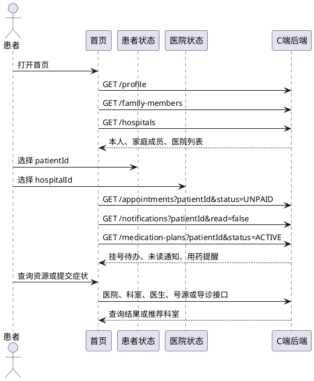

##### 5.4 页面状态设计
| 场景 | 展示规则 | 用户动作 |
| --- | --- | --- |
| 未登录 | 不请求患者业务数据 | 跳转登录页 |
| 无待办 | 展示健康服务引导 | 前往挂号或导诊 |
| 存在 `UNPAID` 挂号 | 顶部展示到期倒计时 | 进入就诊助手支付或取消 |
| 无可约时段 | 展示时段已满状态 | 进入候补登记 |
| 导诊完成 | 展示推荐科室和免责声明 | 进入对应医院科室的医生列表 |
| 网络失败 | 保留已加载内容并展示重试 | 重新加载 |


##### 5.5 原型图与接口参数
<!-- 这是一张图片，ocr 内容为： -->


###### 原型界面元素与字段映射
| 页面元素 | 对应字段 | 说明 |
| --- | --- | --- |
| 医院品牌名称 | `hospitals[].name` | 当前选择医院名称；来源于 `GET /hospitals`，品牌图和宣传语使用前端静态配置 |
| 搜索框 | `keyword`、`symptom` | 医生/科室关键词用于资源查询；症状作为 `POST /triage/assessments.symptom` 入参 |
| 当前就诊人姓名 | `profile.name` | 本人来源于 `GET /profile`；切换后使用选中家庭成员 `data[].patientId` 作为当前 `patientId` |
| 本人资料摘要 | `profile.id`、`profile.phone`、`profile.emergencyContact` | 来源于 `GET /profile`；仅展示后端已返回的脱敏联系方式，不展示未定义的登记号、就诊卡号或证件号 |
| 就诊人切换入口 | `data[].patientId`、`data[].name`、`data[].relation` | 来源于 `GET /family-members`；切换后刷新患者相关查询 |
| 六项快捷服务 | `—` | 前端静态路由配置，分别跳转挂号、导诊、问诊、购药、报告和提醒页面 |
| 健康待办挂号卡 | `records.startTime`、`records.departmentName`、`records.doctorName`、`records.status` | 来源于 `GET /appointments?status=UNPAID`；仅 `UNPAID` 显示支付倒计时 |
| 用药提醒行 | `drugName`、`nextReminderAt`、`status` | 来源于 `GET /medication-plans?status=ACTIVE` |
| 待处理数量 | `notifications.total`、`appointments.total` | 来源于未读通知和待支付挂号查询结果；前端按优先级汇总展示 |
| 底部导航 | `—` | 前端静态 Tab 配置，当前激活项由路由状态决定 |
| AI 悬浮球 | `agentStore.isOpen` | 前端 UI 状态；点击后打开 AI 会话抽屉或全屏页 |


###### 接口参数
`**GET /profile**`** - 查询本人资料**

**入参：**

| 字段 | 类型 | 说明 |
| --- | --- | --- |
| `Authorization` | string | 当前 C 端 Bearer Token |
| **返回：** |  |  |
| 字段 | 类型 | 说明 |
| --- | --- | --- |
| `id` | number | 本人就诊人 ID |
| `name` | string | 姓名 |
| `gender` | string | 性别编码 |
| `birthday` | string | 出生日期 |
| `phone` | string | 脱敏手机号 |
| `emergencyContact` | string | 脱敏紧急联系人信息 |


`**GET /family-members**`** - 查询家庭成员**

**入参：**

| 字段 | 类型 | 说明 |
| --- | --- | --- |
| `Authorization` | string | 当前 C 端 Bearer Token |
| **返回：** |  |  |
| 字段 | 类型 | 说明 |
| --- | --- | --- |
| `data` | array | 有效家庭成员列表，响应 `data` 直接为数组 |
| `data[].patientId` | number | 家庭成员就诊人 ID |
| `data[].name` | string | 姓名 |
| `data[].relation` | string | 家庭关系 |
| `data[].phone` | string | 脱敏手机号 |


`**GET /hospitals**`** - 查询可用医院**

**入参：**

| 字段 | 类型 | 说明 |
| --- | --- | --- |
| `Authorization` | string | 当前 C 端 Bearer Token |
| **返回：** |  |  |
| 字段 | 类型 | 说明 |
| --- | --- | --- |
| `hospitalId` | number | 医院 ID |
| `name` | string | 医院名称 |
| `level` | string | 医院等级 |
| `address` | string | 医院地址 |
| `contact` | string | 联系方式 |


`**GET /departments**`** - 查询科室**

**入参：**

| 字段 | 类型 | 说明 |
| --- | --- | --- |
| `hospitalId` | number | Query，当前选择医院 ID |
| `keyword` | string | Query，可选科室名称关键词 |
| **返回：** |  |  |
| 字段 | 类型 | 说明 |
| --- | --- | --- |
| `id` | number | 科室 ID |
| `name` | string | 科室名称 |
| `description` | string | 科室说明 |


`**GET /doctors**`** - 查询医生**

**入参：**

| 字段 | 类型 | 说明 |
| --- | --- | --- |
| `hospitalId` | number | Query，当前选择医院 ID |
| `departmentId` | number | Query，科室 ID |
| `date` | string | Query，可选出诊日期 |
| `pageNo` | number | Query，页码 |
| `pageSize` | number | Query，每页条数 |
| **返回：** |  |  |
| 字段 | 类型 | 说明 |
| --- | --- | --- |
| `pageNo` | number | 当前页码 |
| `pageSize` | number | 每页条数 |
| `total` | number | 总数 |
| `records.id` | number | 医生 ID |
| `records.name` | string | 医生姓名 |
| `records.title` | string | 医生职称 |
| `records.specialty` | string | 专长 |
| `records.registrationFeeCent` | number | 挂号费，单位分 |
| `records.availableCount` | number | 可约号源数 |


`**GET /doctors/{doctorId}/slots**`** - 查询可预约时段**

**入参：**

| 字段 | 类型 | 说明 |
| --- | --- | --- |
| `doctorId` | number | Path，医生 ID |
| `hospitalId` | number | Query，当前选择医院 ID |
| `date` | string | Query，预约日期 |
| **返回：** |  |  |
| 字段 | 类型 | 说明 |
| --- | --- | --- |
| `slotId` | number | 时段 ID |
| `startTime` | string | 开始时间 |
| `endTime` | string | 结束时间 |
| `feeCent` | number | 挂号费，单位分 |
| `availableCount` | number | 实时可约数量 |
| `scheduleStatus` | string | 排班发布状态，取值 `PUBLISHED/CANCELLED/DRAFT`；可约判断条件为 `scheduleStatus === 'PUBLISHED' && availableCount > 0` |


`**POST /triage/assessments**`** - 提交症状导诊**

**入参：**

| 字段 | 类型 | 说明 |
| --- | --- | --- |
| `X-Idempotency-Key` | string | Header，防重键 |
| `patientId` | number | Body，可选就诊人 ID |
| `hospitalId` | number | Body，当前选择医院 ID |
| `symptom` | string | Body，症状描述 |
| `duration` | string | Body，可选持续时间 |
| `temperature` | number | Body，可选体温，摄氏度 |
| `medicalHistory` | string | Body，可选相关既往史 |
| **返回：** |  |  |
| 字段 | 类型 | 说明 |
| --- | --- | --- |
| `assessmentId` | number | 导诊评估 ID |
| `urgency` | string | 紧急程度 |
| `recommendedDepartments` | array | 推荐科室列表 |
| `recommendedDepartments.id` | number | 科室 ID |
| `recommendedDepartments.name` | string | 科室名称 |
| `recommendedDepartments.reason` | string | 推荐原因 |
| `disclaimer` | string | 医疗免责声明 |


`**GET /appointments**`** - 查询首页挂号待办**

**入参：**

| 字段 | 类型 | 说明 |
| --- | --- | --- |
| `patientId` | number | Query，可选就诊人 ID |
| `status` | string | Query，首页查询 `UNPAID` |
| `pageNo` | number | Query，页码 |
| `pageSize` | number | Query，每页条数 |
| **返回：** |  |  |
| 字段 | 类型 | 说明 |
| --- | --- | --- |
| `pageNo` | number | 当前页码 |
| `pageSize` | number | 每页条数 |
| `total` | number | 总数 |
| `records.id` | number | 挂号订单 ID |
| `records.doctorName` | string | 医生姓名 |
| `records.departmentName` | string | 科室名称 |
| `records.startTime` | string | 就诊时段 |
| `records.status` | string | `UNPAID/PAID/COMPLETED/CANCELLED` |
| `records.amountCent` | number | 挂号金额，单位分 |
| `records.expireAt` | string | 待支付到期时间 |


`**GET /notifications**`** - 查询未读通知**

**入参：**

| 字段 | 类型 | 说明 |
| --- | --- | --- |
| `patientId` | number | Query，可选就诊人 ID |
| `read` | boolean | Query，首页传 `false` |
| `pageNo` | number | Query，页码 |
| `pageSize` | number | Query，每页条数 |
| **返回：** |  |  |
| 字段 | 类型 | 说明 |
| --- | --- | --- |
| `total` | number | 未读通知总数 |
| `records.id` | number | 通知 ID |
| `records.type` | string | 通知类型 |
| `records.title` | string | 标题 |
| `records.content` | string | 内容 |
| `records.read` | boolean | 是否已读 |
| `records.createdAt` | string | 创建时间 |


`**GET /medication-plans**`** - 查询用药提醒**

**入参：**

| 字段 | 类型 | 说明 |
| --- | --- | --- |
| `patientId` | number | Query，可选就诊人 ID |
| `status` | string | Query，首页传 `ACTIVE` |
| **返回：** |  |  |
| 字段 | 类型 | 说明 |
| --- | --- | --- |
| `id` | number | 用药计划 ID |
| `drugName` | string | 药品名称 |
| `dosage` | string | 单次用量 |
| `frequency` | string | 用药频次 |
| `nextReminderAt` | string | 下次提醒时间 |
| `status` | string | `ACTIVE/PAUSED/COMPLETED` |


#### 6. 模块 M2：就诊助手
##### 6.1 用例图与流程图
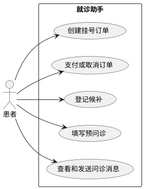

 B["选择医院、科室、医生和时段"]

```plain
B --> C["创建挂号锁定订单"]
C --> D{"号源是否锁定成功"}
D -->|是| E["支付或取消挂号订单"]
E --> F{"支付是否成功"}
F -->|是| G["填写预问诊并进入文字问诊"]
F -->|否| H["保留未支付订单或取消订单"]
D -->|否| I["确认候补登记"]
G --> J["完成就诊流程"]
H --> J
I --> J -->
```

<!-- 这是一张图片，ocr 内容为： -->


##### 6.2 页面范围与界面形态
就诊助手顶部显示当前就诊人，中部展示“选择医院科室医生时段、锁号支付、预问诊、文字问诊”的当前阶段，底部展示挂号记录和问诊记录。阶段完全依据服务端订单与问诊状态计算。

##### 6.3 当前就诊流程时序
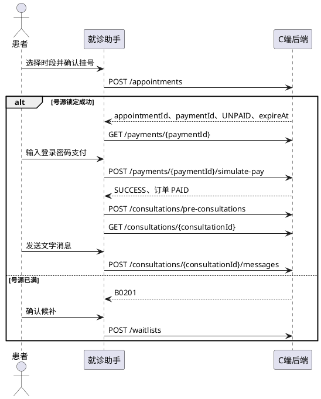

##### 6.4 页面状态设计
| 场景 | 展示规则 | 用户动作 |
| --- | --- | --- |
| 无有效挂号 | 展示挂号入口 | 选择医院、科室、医生和时段 |
| `UNPAID` | 展示 15 分钟倒计时 | 支付或取消 |
| 号源已满 | 展示库存不足提示 | 候补登记或选择其他时段 |
| `PAID` 且无问诊 | 展示预问诊入口 | 填写预问诊 |
| `PRE_CONSULTATION` | 展示已保存预问诊草稿 | 继续编辑或提交预问诊 |
| `PENDING/IN_PROGRESS` | 显示文字问诊进行中 | 进入详情、发送消息 |
| `CANCELLED` | 仅展示历史记录 | 重新挂号 |


##### 6.5 原型图与接口参数
<!-- 这是一张图片，ocr 内容为： -->


###### 原型界面元素与字段映射
| 页面元素 | 对应字段 | 说明 |
| --- | --- | --- |
| 当前就诊人姓名 | `profile.name`、`data[].name` | 本人来源于 `GET /profile`，家庭成员来源于 `GET /family-members` 的直接数组响应 |
| 挂号订单号 | `records.id` | 来源于 `GET /appointments`，使用后端返回的挂号订单 ID，不展示后端未定义的登记号 |
| 切换就诊人 | `data[].patientId`、`data[].relation` | 选择后作为挂号、问诊等查询的 `patientId` |
| 当前就诊标题 | `records.startTime`、`records.departmentName`、`records.doctorName` | 来源于当前有效 `GET /appointments` 订单记录 |
| 当前订单状态标签 | `records.status`、`payment.status` | 挂号订单使用 `UNPAID/PAID/COMPLETED/CANCELLED`，支付单使用 `PENDING/SUCCESS/FAILED/CLOSED` |
| 就诊流程节点 | `records.status`、`consultation.status` | 前端按服务端挂号和问诊状态计算流程高亮，不自行写入状态 |
| 挂号记录卡 | `records.id`、`records.startTime`、`records.doctorName`、`records.departmentName`、`records.status` | 来源于 `GET /appointments`；详情入口传递 `appointmentId` |
| 在线问诊卡 | `consultations.records.id`、`doctorName`、`status`、`updatedAt` | 来源于 `GET /consultations`；详情入口传递 `consultationId` |
| 退号记录 | `records.status=CANCELLED` | 从挂号订单列表筛选已取消订单；不提供退款入口 |
| 发起问诊入口 | `appointmentId`、`consultationId` | 已支付挂号使用预问诊和问诊接口创建或进入会话 |
| AI 免责声明 | `disclaimer` | 导诊、处方或报告解读返回的免责声明；无返回时展示固定安全文案 |
| AI 悬浮球 | `agentStore.isOpen` | 前端 UI 状态，打开后可携带当前 `appointmentId` 或 `consultationId` 作为 Agent 上下文 |


###### 接口参数
`**POST /appointments**`** - 创建挂号锁定订单**

**入参：**

| 字段 | 类型 | 说明 |
| --- | --- | --- |
| `X-Idempotency-Key` | string | Header，防重键 |
| `patientId` | number | Body，可选就诊人 ID |
| `hospitalId` | number | Body，当前医院 ID |
| `slotId` | number | Body，预约时段 ID |
| **返回：** |  |  |
| 字段 | 类型 | 说明 |
| --- | --- | --- |
| `appointmentId` | number | 挂号订单 ID |
| `status` | string | 固定为 `UNPAID` |
| `amountCent` | number | 挂号金额，单位分 |
| `expireAt` | string | 支付到期时间 |
| `paymentId` | number | 支付单 ID |


`**GET /appointments**`** - 查询挂号订单**

**入参：**

| 字段 | 类型 | 说明 |
| --- | --- | --- |
| `patientId` | number | Query，可选就诊人 ID |
| `status` | string | Query，可选订单状态 |
| `pageNo` | number | Query，页码 |
| `pageSize` | number | Query，每页条数 |
| **返回：** |  |  |
| 字段 | 类型 | 说明 |
| --- | --- | --- |
| `total` | number | 订单总数 |
| `records.id` | number | 挂号订单 ID |
| `records.doctorName` | string | 医生姓名 |
| `records.departmentName` | string | 科室名称 |
| `records.startTime` | string | 就诊时段 |
| `records.status` | string | 订单状态 |
| `records.amountCent` | number | 金额，单位分 |
| `records.expireAt` | string | 待支付到期时间 |


`**GET /appointments/{appointmentId}**`** - 查询挂号详情**

**入参：**

| 字段 | 类型 | 说明 |
| --- | --- | --- |
| `appointmentId` | number | Path，挂号订单 ID |
| **返回：** |  |  |
| 字段 | 类型 | 说明 |
| --- | --- | --- |
| `id` | number | 挂号订单 ID |
| `status` | string | 挂号订单状态 |
| `doctor` | object | 医生和科室信息 |
| `slot` | object | 预约时段信息 |
| `amountCent` | number | 挂号金额，单位分 |
| `expireAt` | string | 支付到期时间 |
| `payment.id` | number | 支付单 ID |
| `payment.status` | string | 支付单状态 |


`**POST /appointments/{appointmentId}/cancel**`** - 取消未支付挂号**

**入参：**

| 字段 | 类型 | 说明 |
| --- | --- | --- |
| `X-Idempotency-Key` | string | Header，防重键 |
| `appointmentId` | number | Path，仅可取消 `UNPAID` 订单 |
| **返回：** |  |  |
| 字段 | 类型 | 说明 |
| --- | --- | --- |
| `appointmentId` | number | 挂号订单 ID |
| `status` | string | 固定为 `CANCELLED` |


`**POST /waitlists**`** - 创建候补登记**

**入参：**

| 字段 | 类型 | 说明 |
| --- | --- | --- |
| `X-Idempotency-Key` | string | Header，防重键 |
| `patientId` | number | Body，可选就诊人 ID |
| `slotId` | number | Body，已满时段 ID |
| **返回：** |  |  |
| 字段 | 类型 | 说明 |
| --- | --- | --- |
| `waitlistId` | number | 候补登记 ID |
| `slotId` | number | 候补时段 ID |
| `status` | string | 固定为 `WAITING` |
| `queueNo` | number | 候补排队序号 |


`**GET /payments/{paymentId}**`** - 查询支付状态**

**入参：**

| 字段 | 类型 | 说明 |
| --- | --- | --- |
| `paymentId` | number | Path，支付单 ID |
| **返回：** |  |  |
| 字段 | 类型 | 说明 |
| --- | --- | --- |
| `id` | number | 支付单 ID |
| `appointmentOrderId` | number | 关联挂号订单 ID |
| `drugOrderId` | number | 关联购药订单 ID |
| `amountCent` | number | 支付金额，单位分 |
| `status` | string | `PENDING/SUCCESS/FAILED/CLOSED` |
| `paidAt` | string | 支付完成时间 |
| `expireAt` | string | 支付到期时间 |


`**POST /payments/{paymentId}/simulate-pay**`** - 模拟支付挂号**

**入参：**

| 字段 | 类型 | 说明 |
| --- | --- | --- |
| `X-Idempotency-Key` | string | Header，防重键 |
| `paymentId` | number | Path，挂号支付单 ID |
| `loginPassword` | string | Body，当前登录密码 |
| **返回：** |  |  |
| 字段 | 类型 | 说明 |
| --- | --- | --- |
| `paymentId` | number | 支付单 ID |
| `status` | string | 固定为 `SUCCESS` |
| `paidAt` | string | 支付完成时间 |


`**POST /consultations/pre-consultations**`** - 创建或保存预问诊**

**入参：**

| 字段 | 类型 | 说明 |
| --- | --- | --- |
| `X-Idempotency-Key` | string | Header，防重键 |
| `patientId` | number | Body，可选就诊人 ID |
| `appointmentId` | number | Body，已支付挂号订单 ID |
| `chiefComplaint` | string | Body，主诉 |
| `historyOfPresentIllness` | string | Body，可选现病史 |
| `attachments` | array | Body，可选附件列表 |
| **返回：** |  |  |
| 字段 | 类型 | 说明 |
| --- | --- | --- |
| `consultationId` | number | 问诊记录 ID |
| `status` | string | 问诊状态 |
| `savedAt` | string | 保存时间 |


`**GET /consultations**`** - 查询问诊记录**

**入参：**

| 字段 | 类型 | 说明 |
| --- | --- | --- |
| `patientId` | number | Query，可选就诊人 ID |
| `status` | string | Query，可选问诊状态 |
| `pageNo` | number | Query，页码 |
| `pageSize` | number | Query，每页条数 |
| **返回：** |  |  |
| 字段 | 类型 | 说明 |
| --- | --- | --- |
| `total` | number | 问诊总数 |
| `records.id` | number | 问诊 ID |
| `records.appointmentId` | number | 关联挂号订单 ID |
| `records.doctorName` | string | 医生姓名 |
| `records.status` | string | `PENDING/IN_PROGRESS/COMPLETED/NO_SHOW` |
| `records.updatedAt` | string | 最近更新时间 |


`**GET /consultations/{consultationId}**`** - 查询问诊详情与消息**

**入参：**

| 字段 | 类型 | 说明 |
| --- | --- | --- |
| `consultationId` | number | Path，问诊 ID |
| **返回：** |  |  |
| 字段 | 类型 | 说明 |
| --- | --- | --- |
| `id` | number | 问诊 ID |
| `status` | string | 问诊状态 |
| `doctor` | object | 医生信息 |
| `preConsultation` | object | 预问诊内容 |
| `messages` | array | 文字消息列表 |
| `messages.id` | number | 消息 ID |
| `messages.senderType` | string | 发送方类型 |
| `messages.content` | string | 消息内容 |
| `messages.createdAt` | string | 发送时间 |


`**POST /consultations/{consultationId}/messages**`** - 发送文字问诊消息**

**入参：**

| 字段 | 类型 | 说明 |
| --- | --- | --- |
| `X-Idempotency-Key` | string | Header，防重键 |
| `consultationId` | number | Path，问诊 ID |
| `content` | string | Body，文字消息内容 |
| **返回：** |  |  |
| 字段 | 类型 | 说明 |
| --- | --- | --- |
| `messageId` | number | 消息 ID |
| `consultationId` | number | 问诊 ID |
| `senderType` | string | 固定为患者发送方 |
| `content` | string | 已发送内容 |
| `createdAt` | string | 发送时间 |


#### 7. 模块 M3：购药
##### 7.1 用例图与流程图
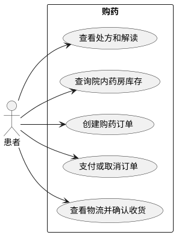

 B["选择已批准处方"]

```plain
B --> C["查询院内药房库存"]
C --> D{"是否存在可用库存"}
D -->|是| E["选择药房并填写配送地址"]
E --> F["创建购药订单"]
F --> G{"支付是否成功"}
G -->|是| H["查看物流状态"]
H --> I["确认收货"]
G -->|否| J["取消或保留待支付订单"]
D -->|否| K["展示缺货提示"]
I --> L["完成购药流程"]
J --> L
K --> L -->
```

<!-- 这是一张图片，ocr 内容为： -->


##### 7.2 页面范围与界面形态
购药 Tab 首屏展示当前就诊人的已批准处方和购药订单。选中处方后只展示处方所属医院内启用且库存满足处方的药房，默认药房置顶；配送方式固定为 `COURIER`，不展示距离、经纬度或配送时效。

##### 7.3 购药与快递配送时序
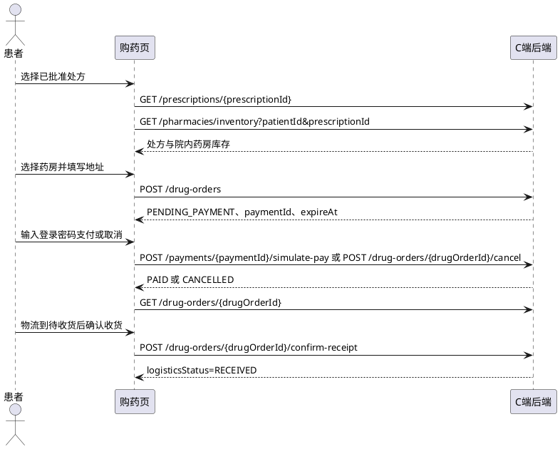

##### 7.4 页面状态设计
| 场景 | 展示规则 | 用户动作 |
| --- | --- | --- |
| 无 `APPROVED` 处方 | 展示空态 | 前往就诊助手 |
| 院内药房库存不足 | 显示库存不足提示 | 选择其他院内药房 |
| 未填写地址 | 下单按钮禁用 | 填写收货地址 |
| `PENDING_PAYMENT` | 显示 15 分钟倒计时 | 支付或取消订单 |
| 支付超时 | 刷新订单状态 | 返回处方重新下单 |
| `PENDING_SHIPMENT` | 展示待发货状态 | 查看订单详情和物流轨迹 |
| `SHIPPED` | 展示已发货状态 | 查看订单详情和物流轨迹 |
| `IN_TRANSIT` | 展示运输中状态及最新物流轨迹 | 查看订单详情和物流轨迹 |
| `TO_RECEIVE` | 显示确认收货操作 | 确认收货 |
| `RECEIVED` | 展示已收货状态 | 查看用药提醒 |


##### 7.5 原型图与接口参数
<!-- 这是一张图片，ocr 内容为： -->


###### 原型界面元素与字段映射
| 页面元素 | 对应字段 | 说明 |
| --- | --- | --- |
| 当前就诊人 | `profile.name`、`data[].name` | 本人或当前选择的家庭成员；下单时传递对应 `patientId` |
| 处方标题和状态 | `records.id`、`records.doctorName`、`records.status`、`records.issuedAt` | 来源于 `GET /prescriptions`；仅展示 `APPROVED` 处方 |
| 药品摘要 | `items.drugName`、`items.specification`、`items.dosage`、`items.frequency` | 来源于 `GET /prescriptions/{prescriptionId}` 的药品明细 |
| 查看药店按钮 | `prescriptionId` | 使用处方 ID 调用 `GET /pharmacies/inventory` |
| 院内药房名称 | `pharmacyId`、`name`、`hospitalId`、`isDefault` | 来源于 `GET /pharmacies/inventory`；默认药房优先展示 |
| 药品有货标签 | `items.availableCount` | 当前处方药品可售库存；库存不足时不允许创建订单 |
| 药品单价和订单金额 | `items.unitPriceCent`、`amountCent` | 单价来源于药房库存，订单总价来源于购药订单；前端格式化为元展示 |
| 配送方式 | `deliveryMethod`、`delivery.method` | 固定为 `COURIER`，来源于药房库存或订单详情 |
| 物流分类 Tab | `logisticsStatus` | `GET /drug-orders` 支持 `PENDING_SHIPMENT/SHIPPED/IN_TRANSIT/TO_RECEIVE/RECEIVED` 筛选 |
| 物流状态卡 | `records.logisticsStatus`、`records.latestLogisticsNode` | 来源于购药订单列表；详情页使用 `delivery.traces` 展示轨迹 |
| 订单配送提示 | `delivery.logisticsStatus`、`delivery.traces` | 来源于 `GET /drug-orders/{drugOrderId}`；前端从 `delivery.traces[0]`（最新一条轨迹）生成提示，不依赖 `delivery.latestNode`；轨迹为空时展示“暂无物流更新” |
| 确认收货按钮 | `drugOrderId`、`logisticsStatus` | 仅 `TO_RECEIVE` 时可调用确认收货接口，成功后状态为 `RECEIVED` |
| AI 悬浮球 | `agentStore.isOpen` | 前端 UI 状态，可携带 `prescriptionId` 作为 Agent 会话上下文 |


###### 接口参数
`**GET /prescriptions**`** - 查询处方列表**

**入参：**

| 字段 | 类型 | 说明 |
| --- | --- | --- |
| `patientId` | number | Query，可选就诊人 ID |
| `pageNo` | number | Query，页码 |
| `pageSize` | number | Query，每页条数 |
| **返回：** |  |  |
| 字段 | 类型 | 说明 |
| --- | --- | --- |
| `total` | number | 处方总数 |
| `records.id` | number | 处方 ID |
| `records.consultationId` | number | 关联问诊 ID |
| `records.doctorName` | string | 开方医生 |
| `records.status` | string | 处方状态，仅展示 `APPROVED` |
| `records.issuedAt` | string | 开具时间 |


`**GET /prescriptions/{prescriptionId}**`** - 查询处方详情**

**入参：**

| 字段 | 类型 | 说明 |
| --- | --- | --- |
| `prescriptionId` | number | Path，处方 ID |
| **返回：** |  |  |
| 字段 | 类型 | 说明 |
| --- | --- | --- |
| `id` | number | 处方 ID |
| `status` | string | 处方状态 |
| `doctorName` | string | 开方医生 |
| `items` | array | 药品明细 |
| `items.drugId` | number | 药品 ID |
| `items.drugName` | string | 药品名称 |
| `items.specification` | string | 药品规格 |
| `items.dosage` | string | 单次用量 |
| `items.frequency` | string | 用药频次 |
| `items.usage` | string | 用药方式 |
| `items.durationDays` | number | 用药天数 |


`**GET /prescriptions/{prescriptionId}/interpretation**`** - 查询处方解读**

**入参：**

| 字段 | 类型 | 说明 |
| --- | --- | --- |
| `prescriptionId` | number | Path，处方 ID |
| **返回：** |  |  |
| 字段 | 类型 | 说明 |
| --- | --- | --- |
| `prescriptionId` | number | 处方 ID |
| `content` | string | 处方说明内容 |
| `disclaimer` | string | 医疗免责声明 |
| `generatedAt` | string | 生成时间 |


`**GET /pharmacies/inventory**`** - 查询院内药房库存**

**入参：**

| 字段 | 类型 | 说明 |
| --- | --- | --- |
| `patientId` | number | Query，可选就诊人 ID |
| `prescriptionId` | number | Query，已批准处方 ID |
| **返回：** |  |  |
| 字段 | 类型 | 说明 |
| --- | --- | --- |
| `pharmacyId` | number | 药房 ID |
| `name` | string | 药房名称 |
| `hospitalId` | number | 所属医院 ID |
| `isDefault` | boolean | 是否默认药房 |
| `deliveryMethod` | string | 固定为 `COURIER` |
| `items.drugId` | number | 药品 ID |
| `items.availableCount` | number | 可售库存 |
| `items.unitPriceCent` | number | 单价，单位分 |


`**POST /drug-orders**`** - 创建购药订单草稿**

**入参：**

| 字段 | 类型 | 说明 |
| --- | --- | --- |
| `X-Idempotency-Key` | string | Header，防重键 |
| `patientId` | number | Body，可选就诊人 ID |
| `prescriptionId` | number | Body，已批准处方 ID |
| `pharmacyId` | number | Body，选定院内药房 ID |
| `deliveryAddress` | string | Body，快递收货地址 |
| **返回：** |  |  |
| 字段 | 类型 | 说明 |
| --- | --- | --- |
| `drugOrderId` | number | 购药订单 ID |
| `status` | string | 固定为 `PENDING_PAYMENT` |
| `deliveryMethod` | string | 固定为 `COURIER` |
| `amountCent` | number | 订单金额，单位分 |
| `expireAt` | string | 支付到期时间 |
| `paymentId` | number | 支付单 ID |
| `items` | array | 药品与购买数量 |


`**GET /drug-orders**`** - 查询购药订单列表**

**入参：**

| 字段 | 类型 | 说明 |
| --- | --- | --- |
| `patientId` | number | Query，可选就诊人 ID |
| `status` | string | Query，可选订单状态 |
| `logisticsStatus` | string | Query，可选 `PENDING_SHIPMENT/SHIPPED/IN_TRANSIT/TO_RECEIVE/RECEIVED` |
| `pageNo` | number | Query，页码 |
| `pageSize` | number | Query，每页条数 |
| **返回：** |  |  |
| 字段 | 类型 | 说明 |
| --- | --- | --- |
| `total` | number | 订单总数 |
| `records.id` | number | 购药订单 ID |
| `records.pharmacyName` | string | 药房名称 |
| `records.status` | string | 购药订单状态 |
| `records.logisticsStatus` | string | 物流状态 |
| `records.latestLogisticsNode` | string | 最新物流节点 |
| `records.amountCent` | number | 订单金额，单位分 |
| `records.expireAt` | string | 支付到期时间 |


`**GET /drug-orders/{drugOrderId}**`** - 查询购药订单详情**

**入参：**

| 字段 | 类型 | 说明 |
| --- | --- | --- |
| `drugOrderId` | number | Path，购药订单 ID |
| **返回：** |  |  |
| 字段 | 类型 | 说明 |
| --- | --- | --- |
| `id` | number | 购药订单 ID |
| `status` | string | 订单状态 |
| `pharmacy` | object | 药房信息 |
| `delivery.method` | string | 配送方式 |
| `delivery.address` | string | 收货地址 |
| `delivery.company` | string | 快递公司 |
| `delivery.trackingNo` | string | 快递单号 |
| `delivery.logisticsStatus` | string | 物流状态 |
| `delivery.traces` | array | 物流轨迹 |
| `items` | array | 药品明细 |
| `amountCent` | number | 订单金额，单位分 |
| `payment` | object | 支付信息 |


`**POST /drug-orders/{drugOrderId}/cancel**`** - 取消购药订单**

**入参：**

| 字段 | 类型 | 说明 |
| --- | --- | --- |
| `X-Idempotency-Key` | string | Header，防重键 |
| `drugOrderId` | number | Path，待取消订单 ID |
| **返回：** |  |  |
| 字段 | 类型 | 说明 |
| --- | --- | --- |
| `drugOrderId` | number | 购药订单 ID |
| `status` | string | 固定为 `CANCELLED` |
| `cancelledAt` | string | 取消时间 |


`**POST /drug-orders/{drugOrderId}/confirm-receipt**`** - 确认收货**

**入参：**

| 字段 | 类型 | 说明 |
| --- | --- | --- |
| `X-Idempotency-Key` | string | Header，防重键 |
| `drugOrderId` | number | Path，待收货订单 ID |
| **返回：** |  |  |
| 字段 | 类型 | 说明 |
| --- | --- | --- |
| `drugOrderId` | number | 购药订单 ID |
| `logisticsStatus` | string | 固定为 `RECEIVED` |
| `receivedAt` | string | 确认收货时间 |


`**POST /payments/{paymentId}/simulate-pay**`** - 模拟支付购药订单**

**入参：**

| 字段 | 类型 | 说明 |
| --- | --- | --- |
| `X-Idempotency-Key` | string | Header，防重键 |
| `paymentId` | number | Path，购药支付单 ID |
| `loginPassword` | string | Body，当前登录密码 |
| **返回：** |  |  |
| 字段 | 类型 | 说明 |
| --- | --- | --- |
| `paymentId` | number | 支付单 ID |
| `status` | string | 固定为 `SUCCESS` |


#### 8. 模块 M4：我的
##### 8.1 用例图与流程图
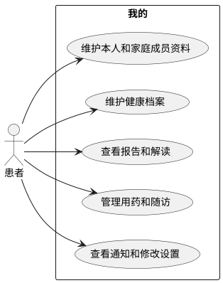

 B["选择本人或家庭成员"]

```plain
B --> C["加载资料、档案、报告、提醒与通知"]
C --> D{"选择管理事项"}
D -->|资料或成员| E["维护本人或家庭成员资料"]
D -->|健康档案| F["维护过敏史、既往史或检查报告"]
D -->|提醒随访| G["更新用药计划或确认随访"]
D -->|通知设置| H["标记已读或修改账户设置"]
E --> I["刷新个人健康数据"]
F --> I
G --> I
H --> I
I --> J["完成我的页面操作"] -->
```

<!-- 这是一张图片，ocr 内容为： -->


##### 8.2 页面范围与界面形态
我的 Tab 顶部展示本人或当前家庭成员的脱敏资料，中部为健康档案、报告、提醒、随访和通知入口，底部为家庭成员管理、修改密码和退出登录。本人资料与家庭成员资料使用不同接口；本人不可解绑。

##### 8.3 我的页面初始化时序
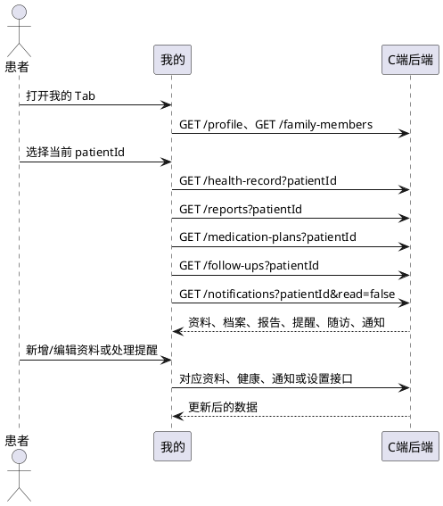

##### 8.4 页面状态
| 场景 | 展示规则 | 用户动作 |
| --- | --- | --- |
| 无家庭成员 | 展示添加家庭成员入口 | 新增家庭成员 |
| 已有 5 名非 `SELF` 家庭成员 | 展示“最多添加 5 名家庭成员”提示并禁用新增按钮 | 仅可编辑或解绑现有成员 |
| 新增家庭成员接口返回 `A0506` | 保留首次结果并提示成员重复或已达上限 | 刷新家庭成员列表核对 |
| 健康档案为空 | 展示过敏史和既往史录入引导 | 新增档案记录 |
| 解读未生成 | 显示处理中与免责声明 | 稍后重试 |
| 存在未读通知 | 显示未读角标 | 打开并标记已读 |
| 用药计划 `ACTIVE` | 显示下次提醒时间 | 暂停、恢复或完成 |
| 待确认随访 | 显示确认操作 | 选择提醒时间并确认 |
| 退出登录 | 二次确认 | 撤销刷新令牌并回到登录页 |


##### 8.5 原型图与接口参数
<!-- 这是一张图片，ocr 内容为： -->


###### 原型界面元素与字段映射
| 页面元素 | 对应字段 | 说明 |
| --- | --- | --- |
| 本人姓名和默认就诊人标签 | `profile.name` | 来源于 `GET /profile`；本人作为默认就诊人 |
| 脱敏手机号 | `profile.phone` | 来源于 `GET /profile`，仅展示后端返回的脱敏值 |
| 查看资料入口 | `profile.id` | 跳转资料页；本人资料通过 `GET/PUT /profile` 查询和维护 |
| 管理就诊人 | `data[].patientId`、`data[].name`、`data[].relation` | 来源于 `GET /family-members` 的直接数组响应；新增、更新和解绑使用家庭成员接口 |
| 健康档案入口 | `profile`、`allergies`、`medicalHistories`、`summary` | 来源于 `GET /health-record?patientId` |
| 我的处方入口 | `records.id`、`records.status` | 来源于 `GET /prescriptions`，跳转购药模块 |
| 就诊记录入口 | `records.id`、`records.status`、`records.startTime` | 来源于 `GET /appointments` 或 `GET /consultations` |
| 报告查询入口 | `records.id`、`records.reportName`、`records.reportDate` | 来源于 `GET /reports` |
| 用药提醒入口 | `id`、`drugName`、`nextReminderAt`、`status` | 来源于 `GET /medication-plans` |
| 随访计划入口 | `id`、`type`、`dueAt`、`status` | 来源于 `GET /follow-ups` |
| 通知消息红点 | `total`、`records.read` | 来源于 `GET /notifications?read=false` |
| 近期复诊提醒 | `dueAt`、`content`、`status` | 来源于随访计划；原型中复诊日期按后端 `dueAt` 渲染 |
| 近期用药提醒 | `drugName`、`nextReminderAt`、`status` | 来源于用药计划；仅 `ACTIVE` 显示进行中 |
| 账号与安全 | `passwordChanged` | 修改密码成功后的返回字段；密码本身不保存或展示 |
| 退出登录 | `loggedOut` | 来源于 `POST /auth/logout` 返回；成功后清理登录态 |
| AI 悬浮球 | `agentStore.isOpen` | 前端 UI 状态，打开后可携带当前 `patientId` 作为会话上下文 |


###### 接口参数
`**GET /profile**`** - 查询本人资料**

**入参：**

| 字段 | 类型 | 说明 |
| --- | --- | --- |
| `Authorization` | string | 当前 C 端 Bearer Token |
| **返回：** |  |  |
| 字段 | 类型 | 说明 |
| --- | --- | --- |
| `id` | number | 本人就诊人 ID |
| `name` | string | 姓名 |
| `gender` | string | 性别编码 |
| `birthday` | string | 出生日期 |
| `phone` | string | 脱敏手机号 |
| `emergencyContact` | string | 脱敏紧急联系人信息 |


`**GET /family-members**`** - 查询家庭成员**

**入参：**

| 字段 | 类型 | 说明 |
| --- | --- | --- |
| `Authorization` | string | 当前 C 端 Bearer Token |
| **返回：** |  |  |
| 字段 | 类型 | 说明 |
| --- | --- | --- |
| `data` | array | 有效家庭成员列表，响应 `data` 直接为数组 |
| `data[].patientId` | number | 家庭成员就诊人 ID |
| `data[].name` | string | 姓名 |
| `data[].relation` | string | 家庭关系 |
| `data[].phone` | string | 脱敏手机号 |


`**PUT /profile**`** - 更新本人资料**

**入参：**

| 字段 | 类型 | 说明 |
| --- | --- | --- |
| `name` | string | Body，本人姓名 |
| `gender` | string | Body，可选性别 |
| `birthday` | string | Body，可选出生日期 |
| `phone` | string | Body，可选联系电话 |
| `emergencyContact` | string | Body，可选紧急联系人 |
| **返回：** |  |  |
| 字段 | 类型 | 说明 |
| --- | --- | --- |
| `id` | number | 本人就诊人 ID |
| `name` | string | 更新后姓名 |
| `phone` | string | 脱敏手机号 |
| `updatedAt` | string | 更新时间 |


`**POST /family-members**`** - 新增家庭成员**

**入参：**

| 字段 | 类型 | 说明 |
| --- | --- | --- |
| `X-Idempotency-Key` | string | Header，防重键 |
| `name` | string | Body，成员姓名 |
| `relation` | string | Body，家庭关系，非 `SELF` |
| `gender` | string | Body，可选性别 |
| `birthday` | string | Body，可选出生日期 |
| `phone` | string | Body，可选联系电话 |
| `idCardNo` | string | Body，可选身份证号，不回显 |
| `emergencyContact` | string | Body，可选紧急联系人 |
| **返回：** |  |  |
| 字段 | 类型 | 说明 |
| --- | --- | --- |
| `patientId` | number | 新家庭成员就诊人 ID |
| `name` | string | 成员姓名 |
| `relation` | string | 家庭关系 |
| `phone` | string | 脱敏手机号 |


`**PUT /family-members/{patientId}**`** - 更新家庭成员**

**入参：**

| 字段 | 类型 | 说明 |
| --- | --- | --- |
| `patientId` | number | Path，家庭成员就诊人 ID |
| `name` | string | Body，成员姓名 |
| `relation` | string | Body，家庭关系 |
| `gender` | string | Body，可选性别 |
| `birthday` | string | Body，可选出生日期 |
| `phone` | string | Body，可选联系电话 |
| `idCardNo` | string | Body，可选身份证号，不回显 |
| `emergencyContact` | string | Body，可选紧急联系人 |
| **返回：** |  |  |
| 字段 | 类型 | 说明 |
| --- | --- | --- |
| `patientId` | number | 家庭成员就诊人 ID |
| `name` | string | 更新后姓名 |
| `relation` | string | 更新后关系 |
| `phone` | string | 脱敏手机号 |
| `updatedAt` | string | 更新时间 |


`**DELETE /family-members/{patientId}**`** - 解绑家庭成员**

**入参：**

| 字段 | 类型 | 说明 |
| --- | --- | --- |
| `patientId` | number | Path，待解绑家庭成员 ID |
| **返回：** |  |  |
| 字段 | 类型 | 说明 |
| --- | --- | --- |
| `patientId` | number | 家庭成员就诊人 ID |
| `unbound` | boolean | 是否已解绑 |
| `unboundAt` | string | 解绑时间 |


`**PUT /auth/password**`** - 修改登录密码**

**入参：**

| 字段 | 类型 | 说明 |
| --- | --- | --- |
| `oldPassword` | string | Body，当前密码 |
| `newPassword` | string | Body，新密码 |
| **返回：** |  |  |
| 字段 | 类型 | 说明 |
| --- | --- | --- |
| `passwordChanged` | boolean | 是否修改成功 |


`**GET /health-record**`** - 查询健康档案**

**入参：**

| 字段 | 类型 | 说明 |
| --- | --- | --- |
| `patientId` | number | Query，可选就诊人 ID |
| **返回：** |  |  |
| 字段 | 类型 | 说明 |
| --- | --- | --- |
| `profile` | object | 就诊人基本资料 |
| `allergies` | array | 过敏史列表 |
| `allergies.id` | number | 过敏史 ID |
| `allergies.allergen` | string | 过敏原 |
| `allergies.reaction` | string | 过敏反应 |
| `medicalHistories` | array | 既往史列表 |
| `medicalHistories.id` | number | 既往史 ID |
| `medicalHistories.content` | string | 既往史内容 |
| `summary` | string | 健康档案摘要 |


`**POST /health-record/allergies**`** - 新增过敏史**

**入参：**

| 字段 | 类型 | 说明 |
| --- | --- | --- |
| `X-Idempotency-Key` | string | Header，防重键 |
| `patientId` | number | Body，可选就诊人 ID |
| `allergen` | string | Body，过敏原名称 |
| `reaction` | string | Body，可选过敏反应 |
| **返回：** |  |  |
| 字段 | 类型 | 说明 |
| --- | --- | --- |
| `id` | number | 过敏史 ID |
| `allergen` | string | 过敏原 |
| `reaction` | string | 过敏反应 |


`**PUT /health-record/allergies/{allergyId}**`** - 更新过敏史**

**入参：**

| 字段 | 类型 | 说明 |
| --- | --- | --- |
| `allergyId` | number | Path，过敏史 ID |
| `allergen` | string | Body，过敏原名称 |
| `reaction` | string | Body，可选过敏反应 |
| **返回：** |  |  |
| 字段 | 类型 | 说明 |
| --- | --- | --- |
| `id` | number | 过敏史 ID |
| `allergen` | string | 过敏原 |
| `reaction` | string | 过敏反应 |
| `updatedAt` | string | 更新时间 |


`**POST /health-record/histories**`** - 新增既往史**

**入参：**

| 字段 | 类型 | 说明 |
| --- | --- | --- |
| `X-Idempotency-Key` | string | Header，防重键 |
| `patientId` | number | Body，可选就诊人 ID |
| `content` | string | Body，既往史内容 |
| `occurredAt` | string | Body，可选发生日期 |
| **返回：** |  |  |
| 字段 | 类型 | 说明 |
| --- | --- | --- |
| `id` | number | 既往史 ID |
| `content` | string | 既往史内容 |
| `occurredAt` | string | 发生日期 |


`**PUT /health-record/histories/{historyId}**`** - 更新既往史**

**入参：**

| 字段 | 类型 | 说明 |
| --- | --- | --- |
| `historyId` | number | Path，既往史 ID |
| `content` | string | Body，既往史内容 |
| `occurredAt` | string | Body，可选发生日期 |
| **返回：** |  |  |
| 字段 | 类型 | 说明 |
| --- | --- | --- |
| `id` | number | 既往史 ID |
| `content` | string | 既往史内容 |
| `occurredAt` | string | 发生日期 |
| `updatedAt` | string | 更新时间 |


`**POST /reports**`** - 录入检查报告**

**入参：**

| 字段 | 类型 | 说明 |
| --- | --- | --- |
| `X-Idempotency-Key` | string | Header，防重键 |
| `patientId` | number | Body，可选就诊人 ID |
| `reportName` | string | Body，报告名称 |
| `reportDate` | string | Body，报告日期 |
| `indicators` | array | Body，指标列表 |
| `indicators.name` | string | 指标名称 |
| `indicators.value` | string | 指标数值 |
| `indicators.unit` | string | 指标单位 |
| `indicators.referenceRange` | string | 参考区间 |
| **返回：** |  |  |
| 字段 | 类型 | 说明 |
| --- | --- | --- |
| `reportId` | number | 报告 ID |
| `status` | string | 固定为 `RECORDED` |


`**GET /reports**`** - 查询检查报告**

**入参：**

| 字段 | 类型 | 说明 |
| --- | --- | --- |
| `patientId` | number | Query，可选就诊人 ID |
| `pageNo` | number | Query，页码 |
| `pageSize` | number | Query，每页条数 |
| **返回：** |  |  |
| 字段 | 类型 | 说明 |
| --- | --- | --- |
| `total` | number | 报告总数 |
| `records.id` | number | 报告 ID |
| `records.reportName` | string | 报告名称 |
| `records.reportDate` | string | 报告日期 |
| `records.indicatorCount` | number | 指标数量 |


`**GET /reports/{reportId}**`** - 查询报告详情**

**入参：**

| 字段 | 类型 | 说明 |
| --- | --- | --- |
| `reportId` | number | Path，报告 ID |
| **返回：** |  |  |
| 字段 | 类型 | 说明 |
| --- | --- | --- |
| `id` | number | 报告 ID |
| `reportName` | string | 报告名称 |
| `reportDate` | string | 报告日期 |
| `indicators` | array | 报告指标 |
| `indicators.name` | string | 指标名称 |
| `indicators.value` | string | 指标数值 |
| `indicators.unit` | string | 指标单位 |
| `indicators.referenceRange` | string | 参考区间 |


`**GET /reports/{reportId}/interpretation**`** - 查询报告解读**

**入参：**

| 字段 | 类型 | 说明 |
| --- | --- | --- |
| `reportId` | number | Path，报告 ID |
| **返回：** |  |  |
| 字段 | 类型 | 说明 |
| --- | --- | --- |
| `reportId` | number | 报告 ID |
| `indicatorExplanations` | array | 指标说明列表 |
| `suggestedDepartmentId` | number | 推荐科室 ID |
| `disclaimer` | string | 医疗免责声明 |


`**GET /medication-plans**`** - 查询用药计划**

**入参：**

| 字段 | 类型 | 说明 |
| --- | --- | --- |
| `patientId` | number | Query，可选就诊人 ID |
| `status` | string | Query，可选状态 |
| **返回：** |  |  |
| 字段 | 类型 | 说明 |
| --- | --- | --- |
| `id` | number | 用药计划 ID |
| `drugName` | string | 药品名称 |
| `dosage` | string | 单次用量 |
| `frequency` | string | 用药频次 |
| `nextReminderAt` | string | 下次提醒时间 |
| `status` | string | 计划状态 |


`**PATCH /medication-plans/{planId}**`** - 更新用药计划**

**入参：**

| 字段 | 类型 | 说明 |
| --- | --- | --- |
| `planId` | number | Path，用药计划 ID |
| `action` | string | Body，暂停、恢复或完成动作 |
| **返回：** |  |  |
| 字段 | 类型 | 说明 |
| --- | --- | --- |
| `id` | number | 用药计划 ID |
| `status` | string | 更新后状态 |
| `nextReminderAt` | string | 更新后下次提醒时间 |


`**GET /follow-ups**`** - 查询随访计划**

**入参：**

| 字段 | 类型 | 说明 |
| --- | --- | --- |
| `patientId` | number | Query，可选就诊人 ID |
| `status` | string | Query，可选状态 |
| **返回：** |  |  |
| 字段 | 类型 | 说明 |
| --- | --- | --- |
| `id` | number | 随访计划 ID |
| `type` | string | 随访类型 |
| `dueAt` | string | 建议完成时间 |
| `content` | string | 随访内容 |
| `status` | string | `PENDING_CONFIRM/CONFIRMED/COMPLETED/CANCELLED` |


`**POST /follow-ups/{followUpId}/confirm**`** - 确认随访计划**

**入参：**

| 字段 | 类型 | 说明 |
| --- | --- | --- |
| `followUpId` | number | Path，随访计划 ID |
| `remindAt` | string | Body，确认后的提醒时间 |
| **返回：** |  |  |
| 字段 | 类型 | 说明 |
| --- | --- | --- |
| `id` | number | 随访计划 ID |
| `status` | string | 固定为 `CONFIRMED` |
| `remindAt` | string | 已确认提醒时间 |


`**GET /notifications**`** - 查询通知列表**

**入参：**

| 字段 | 类型 | 说明 |
| --- | --- | --- |
| `patientId` | number | Query，可选就诊人 ID |
| `read` | boolean | Query，可选已读状态 |
| `pageNo` | number | Query，页码 |
| `pageSize` | number | Query，每页条数 |
| **返回：** |  |  |
| 字段 | 类型 | 说明 |
| --- | --- | --- |
| `total` | number | 通知总数 |
| `records.id` | number | 通知 ID |
| `records.type` | string | 通知类型 |
| `records.patientId` | number | 关联就诊人 ID |
| `records.patientName` | string | 就诊人姓名 |
| `records.title` | string | 标题 |
| `records.content` | string | 内容 |
| `records.read` | boolean | 是否已读 |
| `records.createdAt` | string | 创建时间 |


`**POST /notifications/{notificationId}/read**`** - 标记通知已读**

**入参：**

| 字段 | 类型 | 说明 |
| --- | --- | --- |
| `notificationId` | number | Path，通知 ID |
| **返回：** |  |  |
| 字段 | 类型 | 说明 |
| --- | --- | --- |
| `id` | number | 通知 ID |
| `read` | boolean | 固定为 `true` |
| `readAt` | string | 已读时间 |


#### 9. 模块 M5：AI助手
##### 9.1 用例图与流程图
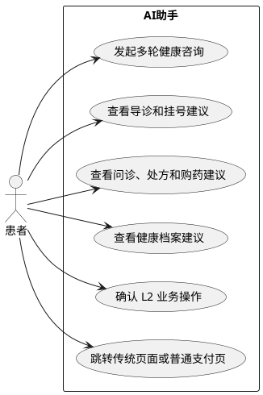

 B["输入健康咨询或业务需求"]

```plain
B --> C["建立 SSE 流式会话"]
C --> D{"请求类型"}
D -->|L1 查询| E["展示导诊、报告或处方解读结果"]
D -->|L2 操作| F["展示业务确认卡片"]
F --> G{"患者是否确认"}
G -->|确认| H["调用 Agent 执行受限业务操作"]
G -->|取消| I["保留会话并取消操作"]
E --> J["跳转传统业务页面或继续咨询"]
H --> J
I --> J -->
```

<!-- 这是一张图片，ocr 内容为： -->


##### 9.2 页面范围与界面形态
AI 悬浮球固定在四个 Tab 的右下角，点击后打开会话抽屉；窄屏转为 `/agent` 全屏会话页。页面由会话消息流、输入框、连接状态、L2 确认卡片和传统业务跳转入口组成。

Agent 可通过多轮对话协助智能导诊、挂号、在线问诊、处方解读、购药和健康档案查询。L1 查询结果直接以流式文本展示；L2 创建或修改操作必须先展示确认卡片，患者确认后才由 Agent 经 MCP 调用后端。购药建议和跳转仍以后端 V1.3 的院内药房、固定 `COURIER` 配送规则为准。

> **工具能力来源：** C 端 30 个工具与 B 端 9 个工具以《SPHP_新后端系分》“附录：Agent 工具清单”为准。本前端文档仅定义事件通用渲染和 `card_type` 组件映射，不复制工具 Schema，避免多处维护发生漂移。
>

AI 助手不得代付、修改处方、开具处方或输出诊断结论；涉及支付时只跳转普通支付页，导诊、报告和处方解读始终展示医疗免责声明。

##### 9.3 AI 助手协作时序
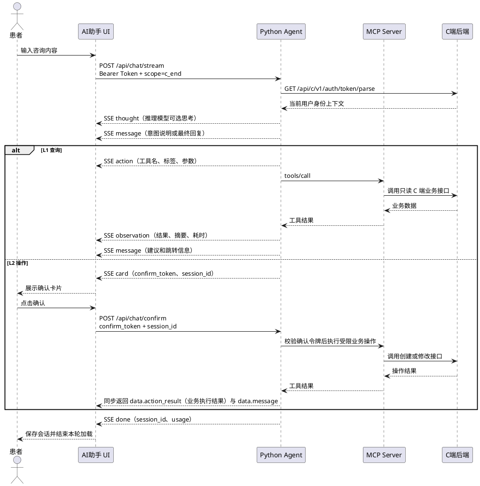

##### 9.4 页面状态设计
| 场景 | 展示规则 | 用户动作 |
| --- | --- | --- |
| 初始 | 展示欢迎语、常用咨询入口和历史消息 | 输入咨询内容 |
| 连接中 | 输入框保留内容，显示发送中 | 禁止重复发送 |
| 流式文本 | 按 `message.delta` 追加同一条 AI 消息；工具调用前为意图说明，最后一个工具结果后为最终回复 | 可阅读已输出文本 |
| 推理过程 | 按 `thought.delta` 追加到“思考过程”折叠面板；非推理模型不产生该事件 | 按需展开查看 |
| 工具调用开始 | 收到 `action` 后创建工具卡片，展示 `label`、参数摘要和 loading | 按需展开参数 |
| 工具调用结果 | 按 `tool` 匹配对应 `action`，收到 `observation` 后更新同一张卡片为成功或失败 | 查看摘要、耗时和完整结果 |
| 等待确认 | 固定展示 `card` 确认卡片和令牌到期时间 | 确认、取消或跳转详情 |
| 确认处理中 | 确认按钮加载并禁用重复点击 | 等待后续 SSE 消息 |
| 确认已过期或已消费 | 卡片置灰，不再调用确认接口 | 重新发起操作 |
| Agent 错误 | 展示 `error.message` 和重试入口 | 重试或使用传统页面 |
| Token 无效 | 清理登录态并关闭会话 | 跳转登录页 |
| 本轮结束 | 收到 `done` 后保存 `session_id` 和可选 `usage`，停止 loading 并关闭流读取；异常流同样必须以 `done` 收尾 | 继续下一轮对话 |
| 涉及支付、处方或诊断 | 不显示代付、改方或诊断操作 | 跳转普通支付页或查看医生处方 |


##### 9.5 原型图与接口参数
<!-- 这是一张图片，ocr 内容为： -->


###### 原型界面元素与字段映射
| 页面元素 | 对应字段 | 说明 |
| --- | --- | --- |
| 顶部标题和返回按钮 | `—` | 前端静态页面结构；返回按钮关闭会话页或回到上一页 |
| AI 医疗免责声明 | `disclaimer` | 导诊、报告或处方解读结果返回的免责声明；无结果时展示固定安全文案 |
| 当前医院名称 | `hospitalStore.currentHospital.name` | 前端已选择医院状态，初始数据来源于 `GET /hospitals` |
| 切换医院入口 | `hospitalStore.currentHospital.hospitalId` | 前端切换医院后，后续导诊和资源查询显式传递新的 `hospitalId` |
| AI 助手品牌和引导标题 | `—` | 前端静态配置，不依赖 Agent 返回字段 |
| 初始欢迎语和对话消息 | `message.delta` | 来源于 `POST /api/chat/stream` 的 `message` SSE 事件，按增量追加 |
| 快捷问题 | `content` | 前端静态问题配置；点击后作为对话接口 `content` 入参发送 |
| 症状输入框 | `content` | 用户输入文本，长度 1 至 2000 字 |
| 发送按钮 | `scope`、`session_id`、`context` | 调用对话接口时固定 `scope=c_end`，复用 `session_id` 并附带当前页面上下文 |
| 思考过程面板 | `thought.delta` | 推理模型可选 SSE 事件；默认折叠展示 |
| 工具调用卡片 | `action.tool`、`action.label`、`action.arguments` | 收到 `action` 时创建 loading 卡片；参数默认折叠 |
| 工具结果卡片 | `observation.tool`、`observation.status`、`observation.summary`、`observation.result`、`observation.duration_ms` | 按 `tool` 更新同一张工具卡片；完整结果默认折叠 |
| L2 确认卡片 | `card.card_type`、`card.confirm_token`、`card.title`、`card.summary`、`card.details`、`card.expires_at` | 到期后禁用确认；确认时调用 `POST /api/chat/confirm` |
| 对话错误提示 | `error.code`、`error.message`、`error.trace_id` | 来源于 Agent `error` SSE 事件；按错误码展示重试或登录入口 |
| 本轮完成状态 | `done.session_id`、`done.usage`、`done.trace_id` | 保存会话 ID 用于后续对话，停止 loading 并关闭流读取 |


Agent 服务通过运行配置提供，开发环境地址为 `http://{agentHost}:8081`。前端使用 Fetch 读取 `POST` 响应流，不使用浏览器原生 `EventSource`。


**<font style="color:rgb(51, 51, 51);">用户操作确认卡片界面元素与字段映射</font>**

<font style="color:rgb(51, 51, 51);">当 Agent 识别到挂号、取消、提交或维护等 L2 操作时，只下发 </font>`<font style="color:rgb(51, 51, 51);background-color:rgb(243, 244, 244);">card</font>`<font style="color:rgb(51, 51, 51);"> 事件并展示本卡片；用户点击“确认预约”后，前端才携带 </font>`<font style="color:rgb(51, 51, 51);background-color:rgb(243, 244, 244);">confirm_token</font>`<font style="color:rgb(51, 51, 51);"> 与 </font>`<font style="color:rgb(51, 51, 51);background-color:rgb(243, 244, 244);">session_id</font>`<font style="color:rgb(51, 51, 51);"> 调用 </font>`<font style="color:rgb(51, 51, 51);background-color:rgb(243, 244, 244);">POST /api/chat/confirm</font>`<font style="color:rgb(51, 51, 51);">。</font>

> **待后端/Agent 联调确认：** 新后端 `card` 事件已定义 `card_type`、`confirm_token`、`title`、`session_id` 与 `expires_at`，确认接口 `POST /api/chat/confirm` 已定义同步返回业务执行结果；确认卡片的部分 `details` 字段仍待后端按 `card_type` 补充 Schema。下列卡片展示规则为前端保留设计；未定义字段必须隐藏，不得使用假数据补齐。
>

<font style="color:rgb(51, 51, 51);">本图以 </font>`<font style="color:rgb(51, 51, 51);background-color:rgb(243, 244, 244);">confirm_appointment</font>`<font style="color:rgb(51, 51, 51);"> 为例。</font>


<!-- 这是一张图片，ocr 内容为： -->


| **界面区域/元素** | **数据字段/前端状态** | **数据来源与展示规则** |
| :--- | :--- | :--- |
| <font style="color:rgb(51, 51, 51);">顶部标题、返回按钮、更多按钮</font> | `<font style="color:rgb(51, 51, 51);background-color:rgb(243, 244, 244);">—</font>` | <font style="color:rgb(51, 51, 51);">前端静态页面结构；返回时保留已接收的会话消息，更多按钮由宿主容器提供。</font> |
| <font style="color:rgb(51, 51, 51);">安全提示条</font> | `<font style="color:rgb(51, 51, 51);background-color:rgb(243, 244, 244);">—</font>` | <font style="color:rgb(51, 51, 51);">前端固定文案“AI 回答仅供参考，重要操作需由您确认”，确认类卡片展示该版本提示。</font> |
| <font style="color:rgb(51, 51, 51);">当前医院名称</font> | `<font style="color:rgb(51, 51, 51);background-color:rgb(243, 244, 244);">hospitalStore.currentHospital.name</font>` | <font style="color:rgb(51, 51, 51);">来源于 </font>`<font style="color:rgb(51, 51, 51);background-color:rgb(243, 244, 244);">GET /hospitals</font>`   <font style="color:rgb(51, 51, 51);"> 的当前选择项；用于让用户核验本次操作所属医院。</font> |
| <font style="color:rgb(51, 51, 51);">切换医院入口</font> | `<font style="color:rgb(51, 51, 51);background-color:rgb(243, 244, 244);">hospitalStore.currentHospital.hospitalId</font>` | <font style="color:rgb(51, 51, 51);">前端医院状态；切换后仅影响下一轮查询，不应修改当前待确认卡片的内容。</font> |
| <font style="color:rgb(51, 51, 51);">用户提问气泡</font> | `<font style="color:rgb(51, 51, 51);background-color:rgb(243, 244, 244);">content</font>` | <font style="color:rgb(51, 51, 51);">当前轮 </font>`<font style="color:rgb(51, 51, 51);background-color:rgb(243, 244, 244);">POST /api/chat/stream</font>`   <font style="color:rgb(51, 51, 51);"> 的用户输入文本。</font> |
| <font style="color:rgb(51, 51, 51);">AI 说明气泡</font> | `<font style="color:rgb(51, 51, 51);background-color:rgb(243, 244, 244);">message.delta</font>` | `<font style="color:rgb(51, 51, 51);background-color:rgb(243, 244, 244);">message</font>`   <font style="color:rgb(51, 51, 51);"> SSE 事件增量拼接的文本；说明已查询到的资源及需确认原因。</font> |
| <font style="color:rgb(51, 51, 51);">前置查询结果行</font> | `<font style="color:rgb(51, 51, 51);background-color:rgb(243, 244, 244);">action.label</font>`   <font style="color:rgb(51, 51, 51);">、</font>`<font style="color:rgb(51, 51, 51);background-color:rgb(243, 244, 244);">observation.status</font>`   <font style="color:rgb(51, 51, 51);">、</font>`<font style="color:rgb(51, 51, 51);background-color:rgb(243, 244, 244);">observation.summary</font>` | <font style="color:rgb(51, 51, 51);">查询工具完成后显示；成功时展示完成图标和“查看结果”，点击可展开对应工具调用详情。</font> |
| <font style="color:rgb(51, 51, 51);">前置查询结果展开入口</font> | `<font style="color:rgb(51, 51, 51);background-color:rgb(243, 244, 244);">agentStore.toolCards[tool].expanded</font>` | <font style="color:rgb(51, 51, 51);">前端 UI 状态；切换后展示该工具的 </font>`<font style="color:rgb(51, 51, 51);background-color:rgb(243, 244, 244);">action.arguments</font>`   <font style="color:rgb(51, 51, 51);"> 与 </font>`<font style="color:rgb(51, 51, 51);background-color:rgb(243, 244, 244);">observation.result</font>`   <font style="color:rgb(51, 51, 51);">，不重复请求。</font> |
| <font style="color:rgb(51, 51, 51);">确认卡片警示标题</font> | `<font style="color:rgb(51, 51, 51);background-color:rgb(243, 244, 244);">card.title</font>`   <font style="color:rgb(51, 51, 51);">、</font>`<font style="color:rgb(51, 51, 51);background-color:rgb(243, 244, 244);">card.card_type</font>` | <font style="color:rgb(51, 51, 51);">来源于 </font>`<font style="color:rgb(51, 51, 51);background-color:rgb(243, 244, 244);">card</font>`   <font style="color:rgb(51, 51, 51);"> SSE 事件；</font>`<font style="color:rgb(51, 51, 51);background-color:rgb(243, 244, 244);">confirm_appointment</font>`   <font style="color:rgb(51, 51, 51);"> 可展示“需要您确认后才能提交预约”。</font> |
| <font style="color:rgb(51, 51, 51);">预约确认标题</font> | `<font style="color:rgb(51, 51, 51);background-color:rgb(243, 244, 244);">card.title</font>` | <font style="color:rgb(51, 51, 51);">卡片主标题；若 </font>`<font style="color:rgb(51, 51, 51);background-color:rgb(243, 244, 244);">title</font>`   <font style="color:rgb(51, 51, 51);"> 未包含具体操作名称，前端按 </font>`<font style="color:rgb(51, 51, 51);background-color:rgb(243, 244, 244);">card_type</font>`   <font style="color:rgb(51, 51, 51);"> 映射为“门诊挂号确认”。</font> |
| <font style="color:rgb(51, 51, 51);">剩余号源标签</font> | `<font style="color:rgb(51, 51, 51);background-color:rgb(243, 244, 244);">card.details.remaining_slots</font>` | <font style="color:rgb(51, 51, 51);">预约余量；当前通用 </font>`<font style="color:rgb(51, 51, 51);background-color:rgb(243, 244, 244);">card.details</font>`   <font style="color:rgb(51, 51, 51);"> 契约未定义该字段，Agent 需在 </font>`<font style="color:rgb(51, 51, 51);background-color:rgb(243, 244, 244);">confirm_appointment</font>`   <font style="color:rgb(51, 51, 51);"> 的详情中补充正整数。字段缺失时隐藏标签，不以静态值代替。</font> |
| <font style="color:rgb(51, 51, 51);">就诊医院</font> | `<font style="color:rgb(51, 51, 51);background-color:rgb(243, 244, 244);">card.details.hospital_name</font>` | <font style="color:rgb(51, 51, 51);">本次预约锁定的医院名称；当前契约需补充该字段，不能直接取当前医院状态，以免用户切换医院后发生误导。</font> |
| <font style="color:rgb(51, 51, 51);">科室</font> | `<font style="color:rgb(51, 51, 51);background-color:rgb(243, 244, 244);">card.details.department_name</font>` | `<font style="color:rgb(51, 51, 51);background-color:rgb(243, 244, 244);">confirm_appointment</font>`   <font style="color:rgb(51, 51, 51);"> 已定义字段。</font> |
| <font style="color:rgb(51, 51, 51);">医生</font> | `<font style="color:rgb(51, 51, 51);background-color:rgb(243, 244, 244);">card.details.doctor_name</font>` | `<font style="color:rgb(51, 51, 51);background-color:rgb(243, 244, 244);">confirm_appointment</font>`   <font style="color:rgb(51, 51, 51);"> 已定义字段；可与职称合并为同一行展示。</font> |
| <font style="color:rgb(51, 51, 51);">医生职称</font> | `<font style="color:rgb(51, 51, 51);background-color:rgb(243, 244, 244);">card.details.doctor_title</font>` | <font style="color:rgb(51, 51, 51);">医生职称；当前契约需补充该字段，缺失时仅展示医生姓名。</font> |
| <font style="color:rgb(51, 51, 51);">就诊时间</font> | `<font style="color:rgb(51, 51, 51);background-color:rgb(243, 244, 244);">card.details.schedule_time</font>` | `<font style="color:rgb(51, 51, 51);background-color:rgb(243, 244, 244);">confirm_appointment</font>`   <font style="color:rgb(51, 51, 51);"> 已定义字段；前端按本地东八区格式化为日期和时段。</font> |
| <font style="color:rgb(51, 51, 51);">挂号费用</font> | `<font style="color:rgb(51, 51, 51);background-color:rgb(243, 244, 244);">card.details.fee_cent</font>` | `<font style="color:rgb(51, 51, 51);background-color:rgb(243, 244, 244);">confirm_appointment</font>`   <font style="color:rgb(51, 51, 51);"> 已定义字段，单位为分；前端格式化为人民币金额。</font> |
| <font style="color:rgb(51, 51, 51);">就诊地点</font> | `<font style="color:rgb(51, 51, 51);background-color:rgb(243, 244, 244);">card.details.location</font>` | <font style="color:rgb(51, 51, 51);">门诊楼层和诊室；当前契约需补充该字段，缺失时隐藏整项。</font> |
| <font style="color:rgb(51, 51, 51);">锁号与支付说明</font> | `<font style="color:rgb(51, 51, 51);background-color:rgb(243, 244, 244);">card.details.lock_expire_seconds</font>`   <font style="color:rgb(51, 51, 51);">、</font>`<font style="color:rgb(51, 51, 51);background-color:rgb(243, 244, 244);">card.details.payment_notice</font>` | <font style="color:rgb(51, 51, 51);">锁号有效时长和支付说明；当前契约需补充，推荐由服务端生成支付限制文案，前端仅负责展示。</font> |
| <font style="color:rgb(51, 51, 51);">确认令牌过期时间</font> | `<font style="color:rgb(51, 51, 51);background-color:rgb(243, 244, 244);">card.expires_at</font>` | `<font style="color:rgb(51, 51, 51);background-color:rgb(243, 244, 244);">card</font>`   <font style="color:rgb(51, 51, 51);"> SSE 事件字段；前端计算倒计时，到期后将整个卡片置灰并禁用操作。</font> |
| <font style="color:rgb(51, 51, 51);">取消按钮</font> | `<font style="color:rgb(51, 51, 51);background-color:rgb(243, 244, 244);">agentStore.pendingCard</font>` | <font style="color:rgb(51, 51, 51);">前端清除当前待确认展示，不调用确认接口；保留会话记录并追加“已取消本次操作”的本地消息。</font> |
| <font style="color:rgb(51, 51, 51);">确认预约按钮</font> | `<font style="color:rgb(51, 51, 51);background-color:rgb(243, 244, 244);">card.confirm_token</font>`   <font style="color:rgb(51, 51, 51);">、</font>`<font style="color:rgb(51, 51, 51);background-color:rgb(243, 244, 244);">card.session_id</font>`   <font style="color:rgb(51, 51, 51);">、</font>`<font style="color:rgb(51, 51, 51);background-color:rgb(243, 244, 244);">agentStore.confirming</font>` | <font style="color:rgb(51, 51, 51);">点击后携带 </font>`<font style="color:rgb(51, 51, 51);background-color:rgb(243, 244, 244);">card.session_id</font>`   <font style="color:rgb(51, 51, 51);"> 与 </font>`<font style="color:rgb(51, 51, 51);background-color:rgb(243, 244, 244);">confirm_token</font>`   <font style="color:rgb(51, 51, 51);"> 调用 </font>`<font style="color:rgb(51, 51, 51);background-color:rgb(243, 244, 244);">POST /api/chat/confirm</font>`   <font style="color:rgb(51, 51, 51);">；请求期间按钮 loading 且禁用，成功后按同步返回的 </font>`<font style="color:rgb(51, 51, 51);background-color:rgb(243, 244, 244);">data.action_result</font>`   <font style="color:rgb(51, 51, 51);"> 与 </font>`<font style="color:rgb(51, 51, 51);background-color:rgb(243, 244, 244);">data.message</font>`   <font style="color:rgb(51, 51, 51);"> 更新卡片为已完成。</font> |


###### 流式事件驱动 UI + 前端状态机 + 确认回调  。
1. 用户发送消息后，前端用 `fetch` 建立 SSE 响应流，例如 `POST /api/chat/stream`。
2. AI 在流中不断下发事件：
    - `message`：普通回复文本
    - `action`：准备或正在调用工具
    - `observation`：工具执行结果
    - `card`：需要用户授权的操作卡片
3. 前端收到 `card` 后，不是把它当普通文字渲染，而是根据 `card_type` 渲染对应 React 组件，例如挂号确认卡、取消订单确认卡、提交问诊确认卡。
4. 卡片内“确认预约”按钮携带服务端给出的 `confirm_token` 和 `card` 事件返回的 `session_id` 调用 `POST /api/chat/confirm`。
5. Agent 校验确认令牌后执行受限业务操作，并通过确认接口同步返回业务执行结果（`data.action_result` 与 `data.message`）。前端据此把卡片改为“处理中/已完成/失败”。

前端状态如下：

```typescript
type PendingCard = {
  cardType: string;
  confirmToken: string;
  sessionId: string;   // card 事件携带的会话 ID，确认时一并提交
  title: string;
  details: Record<string, unknown>;
  expiresAt: string;
  status: 'waiting' | 'confirming' | 'cancelled' | 'expired' | 'done';
};

const agentState = {
  sessionId: '',
  messages: [],
  toolCards: {},
  pendingCard: null as PendingCard | null,
};
```

核心渲染逻辑：

```typescript
{pendingCard?.cardType === 'confirm_appointment' && (
  <AppointmentConfirmCard
    data={pendingCard}
    loading={pendingCard.status === 'confirming'}
onConfirm={confirmOperation}
onCancel={cancelOperation}
  />
  )}
```

确认动作：

```typescript
async function confirmOperation() {
  // 防止重复提交
  setPendingCard((card) => card && { ...card, status: 'confirming' });

  // 携带确认令牌与 card 事件返回的会话 ID 提交确认，同步返回业务执行结果
  const result = await request.post('/api/chat/confirm', {
    confirm_token: pendingCard.confirmToken,
    session_id: pendingCard.sessionId,
  });

  // 成功后按 data.action_result / data.message 更新卡片为已完成
  setPendingCard((card) => card && { ...card, status: 'done', result });
}
```

关键点是：AI 不直接执行高风险写操作，而是先发送结构化 `card` 事件；前端根据事件渲染可交互组件；用户确认后再用一次独立接口把授权令牌回传。这样 AI、前端与用户三方的权限边界会很清楚。

###### 接口参数
`**POST /api/chat/stream**`** - 发起流式对话**

**入参：**

| 字段 | 类型 | 说明 |
| --- | --- | --- |
| `Authorization` | string | Header，当前 C 端 Bearer Token |
| `Accept` | string | Header，固定为 `text/event-stream` |
| `content` | string | Body，用户输入文本，1 至 2000 字 |
| `scope` | string | Body，固定为 `c_end` |
| `session_id` | string | Body，可选；为空时 Agent 创建新会话 |
| `context` | object | Body，可选，当前页面业务上下文 |
| `context.page` | string | 当前页面：`triage`、`appointment`、`consultation`、`pharmacy` 或 `health` |
| `context.doctor_id` | number | 可选，当前选中的医生 ID |
| `context.patient_id` | number | 可选，当前就诊人 ID |
| `context.appointment_id` | number | 可选，当前挂号订单 ID |
| `context.consultation_id` | number | 可选，当前问诊记录 ID |


**返回：**

| 字段 | 类型 | 说明 |
| --- | --- | --- |
| `Content-Type` | string | 响应头，成功时为 `text/event-stream` |
| `message` | SSE 事件 | 流式文本增量，字段见下表 |
| `thought` | SSE 事件 | 推理模型的思考增量，字段见下表 |
| `action` | SSE 事件 | 工具调用开始，字段见下表 |
| `observation` | SSE 事件 | 工具调用结果，字段见下表 |
| `card` | SSE 事件 | L2 操作确认卡片，字段见下表 |
| `error` | SSE 事件 | 对话或工具执行错误，字段见下表 |
| `done` | SSE 事件 | 本轮结束事件，字段见下表 |


`**message**`** - SSE 文本增量事件**

**返回：**

| 字段 | 类型 | 说明 |
| --- | --- | --- |
| `delta` | string | 本次增量文本片段，前端累加拼接 |


`**thought**`** - SSE 推理过程事件**

**返回：**

| 字段 | 类型 | 说明 |
| --- | --- | --- |
| `delta` | string | 推理增量文本片段，仅推理模型触发；默认折叠展示 |


`**action**`** - SSE 工具调用开始事件**

**返回：**

| 字段 | 类型 | 说明 |
| --- | --- | --- |
| `tool` | string | 工具英文标识符，用于与结果事件配对 |
| `label` | string | 工具中文标签 |
| `arguments` | object | 传入工具的完整参数；默认折叠，支持按需展开 |


`**observation**`** - SSE 工具调用结果事件**

**返回：**

| 字段 | 类型 | 说明 |
| --- | --- | --- |
| `tool` | string | 工具英文标识符，与对应 `action` 配对 |
| `status` | string | 执行状态：`success` 或 `error` |
| `result` | object | 工具完整返回数据；默认折叠，支持按需展开 |
| `summary` | string | 结果一行摘要 |
| `duration_ms` | number | 工具执行耗时，单位毫秒 |


`**card**`** - SSE L2 确认卡片事件**

**返回：**

| 字段 | 类型 | 说明 |
| --- | --- | --- |
| `card_type` | string | 卡片类型，决定渲染样式和详情字段 |
| `confirm_token` | string | 确认令牌，确认时原样传回 |
| `session_id` | string | 当前会话 ID；确认请求需与 `confirm_token` 一并携带 |
| `title` | string | 卡片标题 |
| `summary` | string | 单行摘要 |
| `details` | object | 结构化详情，字段随卡片类型变化 |
| `expires_at` | string | 令牌过期时间；到期后禁用确认 |


| `card_type` | 触发能力 | `details` 关键字段 |
| --- | --- | --- |
| `confirm_appointment` | 创建挂号 | `department_name`、`doctor_name`、`schedule_time`、`fee_cent` |
| `confirm_cancel_appointment` | 取消挂号 | `appointment_id`、`department_name`、`doctor_name`、`schedule_time` |
| `confirm_pre_consultation` | 提交预问诊 | `chief_complaint`、`history_summary` |
| `confirm_send_message` | 发送问诊消息 | `message_preview` |
| `confirm_drug_order` | 创建购药订单 | `pharmacy_name`、`drug_list`、`total_cent` |
| `confirm_cancel_drug_order` | 取消购药订单 | `drug_order_id`、`total_cent` |
| `confirm_allergy` | 维护过敏史 | `allergy_name`、`action` |
| `confirm_medical_history` | 维护既往史 | `condition_name`、`action` |
| `confirm_report` | 录入检查报告 | `report_type`、`report_date` |
| `confirm_medication_plan` | 更新用药计划 | `plan_name`、`action` |
| `confirm_follow_up` | 确认随访 | `follow_up_type`、`scheduled_time` |


`**error**`** - SSE 错误事件**

**返回：**

| 字段 | 类型 | 说明 |
| --- | --- | --- |
| `code` | string | Agent、MCP 或下游业务错误码 |
| `message` | string | 面向患者的错误说明 |
| `trace_id` | string | 全链路追踪 ID |


`**done**`** - SSE 本轮结束事件**

返回：

| 字段 | 类型 | 说明 |
| --- | --- | --- |
| `session_id` | string | 当前会话 ID，前端用于后续请求 |
| `usage` | object | 可选，本轮 Token 用量统计，仅用于展示或埋点 |
| `trace_id` | string | 可选，全链路追踪 ID |


`**POST /api/chat/confirm**`** - L2 确认回调**

**入参：**

| 字段 | 类型 | 说明 |
| --- | --- | --- |
| `Authorization` | string | Header，当前 C 端 Bearer Token |
| `confirm_token` | string | Body，`card` 事件下发的确认令牌 |
| `session_id` | string | Body，当前会话 ID，来源于 `card` 事件或 `done` 事件 |


**返回：**

| 字段 | 类型 | 说明 |
| --- | --- | --- |
| `code` | string | 结果码；`00000` 为成功，失败时为 `CONFIRM_INVALID`、`CONFIRM_CONSUMED`、`CONFIRM_EXPIRED` 或 `SESSION_MISMATCH` |
| `message` | string | 处理结果说明 |
| `data.action_result` | object | 业务执行结果，随 L2 操作类型变化（如挂号返回 `appointment_id`、`status`）；成功时同步返回 |
| `data.message` | string | 面向患者的业务结果提示（如“挂号成功，请15分钟内完成支付”） |
| `trace_id` | string | 全链路追踪 ID |


`POST /api/chat/confirm` 为独立同步请求，成功后直接返回业务执行结果（`data.action_result` 与 `data.message`），前端无需依赖原 SSE 流续推。

> **说明：** 前端收到 `code=00000` 后按 `data.action_result` 更新卡片为“已完成”，并按 `data.message` 展示结果提示；失败时按 `code` 展示对应反馈：`CONFIRM_INVALID`/`SESSION_MISMATCH` 关闭卡片并提示重新发起、`CONFIRM_CONSUMED` 提示无需重复确认、`CONFIRM_EXPIRED` 提示确认已超时并重新发起操作。
>

#### 10. 接口依赖与字段映射
| 页面能力 | 关键接口 | 前端处理 |
| --- | --- | --- |
| 认证 | `/auth/*` | 保存令牌、自动刷新、失效后回到登录 |
| 当前就诊人 | `/profile`、`/family-members` | 切换后使患者相关查询失效并重新请求 |
| 手动挂号 | `/hospitals`、`/departments`、`/doctors`、`/appointments`、`/waitlists` | 显式传 `hospitalId`，按 `UNPAID` 展示倒计时 |
| 问诊 | `/consultations/*` | 按服务端状态展示消息和进度 |
| 购药 | `/prescriptions`、`/pharmacies/inventory`、`/drug-orders` | 仅展示院内药房和固定快递配送 |
| 健康管理 | `/health-record`、`/reports`、`/medication-plans`、`/follow-ups` | 按 `patientId` 查询和维护 |
| 通知 | `/notifications` | 未读角标与打开后已读更新 |
| AI 助手 | `POST /api/chat/stream`、`POST /api/chat/confirm` | H5 直连 Agent，解析文本、思考、工具调用、工具结果、确认、错误和结束事件 |


#### 11. 前端错误处理与页面反馈
| 业务码 | 页面反馈 | 前端动作 |
| --- | --- | --- |
| `A0111` | 登录账号已存在 | 标记账号字段并保留其他注册内容 |
| `A0120` | 登录密码或模拟支付密码错误 | 标记密码字段并允许重试 |
| `A0240` | 图形验证码无效或过期 | 刷新验证码并清空验证码输入 |
| `A0301` | 登录失效或无权访问 | 401 时清理登录态并跳转登录；非登录态资源访问时提示无权限并保持当前登录态 |
| `A0400` | 请求参数不合法 | 标记表单字段 |
| `A0402` | 资源不存在 | 刷新列表或详情并返回上一级页面 |
| `A0443` | 当前状态不可操作 | 刷新详情并禁用操作 |
| `A0501` | 请求过于频繁 | 提示稍后重试并保留输入内容 |
| `A0506` | 请勿重复提交 | 保留首次结果 |
| `B0001` | 系统内部异常 | 展示通用异常提示并提供重试入口 |
| `B0201` | 号源已满 | 展示其他时段和候补入口 |
| `B0202` | 解读生成中 | 显示处理中并支持重试 |
| `B0300` | 药品库存不足 | 更换院内药房 |
| `AUTH_MISSING` | 未携带登录凭证 | 跳转登录页 |
| `AUTH_EXPIRED/AUTH_INVALID` | Agent 鉴权失败 | 清理登录态并跳转登录 |
| `RATE_LIMITED` | 对话请求过于频繁 | 提示稍后重试，保留输入内容 |
| `INVALID_REQUEST` | 对话请求参数无效 | 标记输入内容并允许修改后重试 |
| `SESSION_NOT_FOUND` | 会话不存在或已过期 | 清除本地 `sessionId`，创建新会话 |
| `TOOL_DENIED` | Agent 禁止该操作 | 展示安全提示，不发起业务请求 |
| `CONFIRM_INVALID/SESSION_MISMATCH` | 确认参数无效 | 关闭卡片并提示重新发起 |
| `CONFIRM_CONSUMED` | 操作已处理 | 禁用卡片，提示无需重复确认 |
| `CONFIRM_EXPIRED` | 确认已超时 | 禁用卡片，提示重新发起 |
| `TOOL_FAILED/SERVER_ERROR` | Agent 或下游服务异常 | 展示错误消息和传统页面入口 |


## 第三部分：B 端医院管理后台前端系统
#### 1. 概述
##### 1.1 说明
本文档为《智愈先锋》项目 **B端（医院管理后台）前端系统** 的详细设计说明书，面向 B端前端开发团队，作为编码实现的技术蓝本。文档覆盖：

+ 前端技术架构分层与数据流设计
+ 路由与权限体系（三角色隔离）
+ 各业务模块的页面结构与关键交互
+ **接口总览与详细设计**（请求参数、响应结构、错误码）
+ AI 辅助面板的交互流程
+ 状态管理与 API 接入层规范
+ 异常与边界处理策略

> **注：** 本文档的接口设计（§5）与后端系分《SPHP_B端后端系分.md》中的 §5.2 接口总览保持一致。前后端联调时以后端接口实际实现为准，本章参数定义可作为联调基线。
>

##### 1.2 术语表
| 术语 | 定义 |
| --- | --- |
| SSE | Server-Sent Events，用于后端与前端之间的流式通信 |
| 接诊台 | 医生核心工作页面，包括患者队列、问诊、AI辅助面板 |
| 接诊三栏布局 | 接诊台的左（患者列表）/ 中（患者详情+处方）/ 右（AI面板）布局 |
| Slot | 号源时段，后端 `slot` 表对应的前端展示单位 |
| L1-L4 | 安全验证分级，前端需对应 L3（支付需手动）/ L4（禁止操作不可展示） |


---

#### 2. 系统架构设计
##### 2.1 技术架构分层
 STATE_LAYER

```plain
STATE_LAYER --> API_LAYER
API_LAYER --> SERVER -->
```

<!-- 这是一张图片，ocr 内容为： -->


**分层职责：**

| 层次 | 职责 |
| --- | --- |
| **UI 层** | 页面组装、布局、AntD 组件渲染。不直接调用接口 |
| **数据流层** | Zustand 管理客户端状态（登录用户、当前接诊会话、UI状态）；TanStack Query 管理服务端状态（列表缓存、自动刷新） |
| **API 接入层** | 封装所有 HTTP 请求，返回 Promise。UI 层不直接调用 `fetch` |


##### 2.2 数据流方向
|"1. query/mutate"| TQ["TanStack Query"]

```plain
    PG -->|"2. read/write"| ZD["Zustand Store"]
    TQ -->|"3. GET/POST"| API["services/"]
    ZD -->|"4. 数据驱动视图"| PG
end

subgraph BE["后端"]
    API -->|"HTTP REST"| CTRL["Controller"]
end -->
```

<!-- 这是一张图片，ocr 内容为： -->


**数据流规则：**

| 数据类型 | 存储位置 | 更新方式 |
| --- | --- | --- |
| 列表/详情数据（排班、患者、处方） | TanStack Query 缓存 | 用户操作后 `invalidateQueries` 自动刷新 |
| 登录信息、角色、Token | Zustand `userStore` | 登录/登出时写入 |
| 当前接诊会话、选中的患者 | Zustand `consultStore` | 医生切换患者时更新 |
| 全局 UI 状态 | Zustand `appStore` | 用户交互触发 |


---

#### 3. 路由与权限设计
##### 3.1 角色与菜单对照
| 角色 | 可见菜单 | 说明 |
| --- | --- | --- |
| **普通医生** (DOCTOR) | 排班管理, 接诊台, 处方管理 | 仅操作本人数据，数据过滤由后端拦截 |
| **科室主任** (DEPT_HEAD) | 排班管理, 接诊台, 处方管理(含审核) | 可操作本科室数据，可审核处方 |
| **管理员** (ADMIN) | 全部（医院管理, 科室管理, 医生管理, 排班管理, 接诊台, 处方管理, 药品库存, **患者管理, 统计报表**） | 本院范围 |


##### 3.2 路由表
```typescript
// 路由配置（Umi 4 routes.ts）
const routes = [
  {
    path: '/login',
    component: 'login',
    layout: false,   // 不使用主布局
  },
  {
    path: '/',
    component: 'layouts/MainLayout',  // 主布局（Sider + Header + Content）
    access: 'isAuthenticated',        // 所有已登录用户可访问
    routes: [
      {
        path: '/admin',
        access: 'isAdmin',           // 仅管理员
        routes: [
          { path: '/admin/hospital', component: 'admin/HospitalInfo' },
          { path: '/admin/departments', component: 'admin/DepartmentList' },
          { path: '/admin/doctors', component: 'admin/DoctorList' },
        ],
      },
      {
        path: '/schedule',
        routes: [
          { path: '/schedule/list', component: 'schedule/ScheduleList' },
          { path: '/schedule/detail/:id', component: 'schedule/ScheduleDetail' },
          { path: '/schedule/locked', component: 'schedule/LockedSlotsBoard' },
        ],
      },
      {
        path: '/consult',
        routes: [
          { path: '/consult/queue', component: 'consult/ConsultQueue' },
          { path: '/consult/detail/:id', component: 'consult/ConsultDetail' },
        ],
      },
      {
        path: '/prescription',
        routes: [
          { path: '/prescription/list', component: 'prescription/PrescriptionList' },
          {
            path: '/prescription/pending-audit',
            component: 'prescription/PendingAudit',
            access: 'canAudit',   // 管理员 + 科室主任
          },
          { path: '/prescription/templates', component: 'prescription/PrescriptionTemplates' },
        ],
      },
      {
        path: '/drug',
        access: 'isAdmin',
        routes: [
          { path: '/drug/catalog', component: 'drug/DrugCatalog' },
          { path: '/drug/inventory', component: 'drug/InventoryList' },
          { path: '/drug/alerts', component: 'drug/StockAlerts' },
        ],
      },
      {
        path: '/patient',
        routes: [
          { path: '/patient/list', component: 'patient/PatientList' },
          { path: '/patient/detail/:id', component: 'patient/PatientDetail' },
        ],
      },
      {
        path: '/statistics',
        access: 'isAdmin',
        routes: [
          { path: '/statistics/overview', component: 'statistics/Overview' },
          { path: '/statistics/department', component: 'statistics/DepartmentStats' },
        ],
      },
      { path: '/', redirect: '/consult/queue' },  // 默认跳转接诊台
    ],
  },
];
```

##### 3.3 权限守卫实现
采用 Umi 4 的 `Access` 方案，分两级：

**第一级：菜单/路由级**（用户在导航中看不到无权限的菜单项）

```typescript
// src/access.ts
export default function access(initialState: { currentUser?: API.User }) {
  const { currentUser } = initialState;
  const role = currentUser?.role;

  return {
    isAuthenticated: !!currentUser,
    isAdmin: role === 'ADMIN',
    isDeptHead: role === 'DEPT_HEAD',
    canAudit: role === 'ADMIN' || role === 'DEPT_HEAD',
  };
}
```

**第二级：按钮/操作级**（页面内的操作按钮根据角色显隐）

```tsx
// 按钮级权限示例
import { useAccess } from 'umi';

function PrescriptionDetail() {
  const access = useAccess();

  return (
    <>
      {access.canAudit && (
        <Button onClick={handleAudit}>审核</Button>

      )}
    </>
  );
}
```

##### 3.4 侧边栏菜单渲染
```typescript
// 菜单配置 - 根据角色动态过滤
const menuItems = [
  ...(role === 'ADMIN' ? [{
    key: '/admin',
    label: '医院管理',
    children: [
      { key: '/admin/hospital', label: '医院信息' },
      { key: '/admin/departments', label: '科室管理' },
      { key: '/admin/doctors', label: '医生管理' },
    ],
  }] : []),
  { key: '/schedule', label: '排班管理' },
  { key: '/consult', label: '接诊台' },
  {
    key: '/prescription',
    label: '处方管理',
    children: [
      { key: '/prescription/list', label: '处方列表' },
      ...(canAudit ? [{ key: '/prescription/pending-audit', label: '待审核' }] : []),
      { key: '/prescription/templates', label: '处方模板' },
    ],
  },
  ...(role === 'ADMIN' ? [{
    key: '/drug',
    label: '药品库存',
  }] : []),
  { key: '/patient', label: '患者管理' },
  ...(role === 'ADMIN' ? [{
    key: '/statistics',
    label: '统计报表',
  }] : []),
];
```

---

#### 4. 模块详细设计与原型图
##### 4.1 登录模块
**功能概述：** 所有用户统一通过登录页输入账号密码完成认证。后端返回 JWT Token 和角色信息。

**页面结构：**

```latex
LoginPage
├── LoginForm
│   ├── 用户名输入
│   └── 密码输入
└── 登录按钮
```

**交互逻辑：**

| 步骤 | 操作 | 前端处理 |
| --- | --- | --- |
| 1 | 用户输入凭据 | 表单校验 |
| 2 | 点击登录 | 调用 `POST /api/b/auth/login` |
| 3 | 登录成功 | 写入 `userStore`（Token、refreshToken、role、userId、name、deptId） → 跳转接诊台 |
| 4 | 登录失败 | 展示错误提示（账号不存在/密码错误/已停用） |
| 5 | Token 过期 | 401 拦截 → 自动刷新令牌并重放原请求；刷新失败 → 清除 `userStore` → 跳转登录页 |


<!-- 这是一张图片，ocr 内容为： -->
  

<!-- 这是一张图片，ocr 内容为： -->


| 页面元素 | 对应字段 | 说明 |
| --- | --- | --- |
| 平台品牌与宣传语 | `—` | 前端静态配置 |
| 账号输入框 | `username` | 登录接口用户名入参 |
| 密码输入框 | `password` | 登录接口密码入参，不写入日志 |
| 记住账号 | `rememberAccount` | 前端本地表单偏好状态 |
| 登录按钮 | `username`、`password` | 调用 `POST /api/b/auth/login` |
| JWT Token | `token` | 登录成功后写入 `userStore.token` |
| 用户姓名与角色 | `userInfo.name`、`userInfo.role` | 决定顶部用户信息和菜单权限 |
| 所属科室与医院 | `userInfo.deptId`、`userInfo.hospitalId` | 作为后台数据范围上下文 |
| 登录错误提示 | `error.code`、`error.message` | 账号密码错误、账号停用等反馈 |


**接口对应：** 详见 §5.3 认证接口。

**边界处理：**

| 场景 | 处理方式 |
| --- | --- |
| Token 过期 | Umi Request 拦截器检测 401 时先自动刷新令牌，成功后重放原请求；刷新失败才清除 store 并跳转登录 |
| 角色无可用菜单 | 登录后根据 role 渲染对应菜单，无菜单项时展示空白页提示 |
| 多点登录 | 后端策略决定，前端不做限制 |


---

##### 4.2 医院与科室管理模块（仅管理员）
**功能概述：** 管理员维护医院信息、科室列表和医生信息。所有科室平级，无上级科室。CRUD 操作，结构简单。

**页面结构：**

```latex
/hospital          - 医院信息页
├── 医院信息展示（只读）
│   ├── 基本信息：名称、等级、简介
│   └── 联系信息：地址、联系方式
└── 编辑按钮 → 弹窗编辑表单

/departments       - 科室管理页
├── 科室列表（AntD Table）
│   ├── 科室名称 | 所属医院 | 科室负责人 | 状态
│   └── 操作列（编辑 | 启用/停用）
└── 新增科室按钮 → 弹窗表单

/doctors           - 医生管理页
├── AntD Table
│   ├── 姓名 | 职称 | 科室 | 擅长领域 | 联系电话 | 执业状态
│   └── 操作列（编辑 | 启用/停用）
└── 新增按钮 → 弹窗新建表单
```

<!-- 这是一张图片，ocr 内容为： -->
  

<!-- 这是一张图片，ocr 内容为： -->


| 页面元素 | 对应字段 | 说明 |
| --- | --- | --- |
| 医院名称与等级 | `hospital.name`、`hospital.level` | 当前医院基本信息 |
| 医院地址与电话 | `hospital.address`、`hospital.contact` | 医院联系信息 |
| 编辑医院信息 | `hospital.id` | 进入医院资料编辑表单 |
| 医院/科室/医生 Tab | `activeTab` | 前端静态页面状态 |
| 科室名称检索 | `keyword` | 科室名称查询条件 |
| 科室状态筛选 | `status` | `ENABLED/DISABLED` |
| 科室列表 | `departmentList[]` | 当前医院下的科室数据 |
| 科室负责人 | `headDoctorName`、`headDoctorId` | 科室主任信息 |
| 医生数量 | `doctorCount` | 前端聚合展示字段 |
| 科室状态 | `status` | 显示启用或停用标签 |
| 编辑科室 | `id` | 进入科室编辑表单 |
| 启用/停用操作 | `id`、`status` | 调用科室状态更新接口 |
| 分页器 | `page`、`pageSize`、`total` | 科室列表分页状态 |


**接口对应：** 详见 §5.4 医院/科室管理接口。

**边界处理：**

| 场景 | 处理 |
| --- | --- |
| 停用科室 | 确认弹窗"停用后该科室下医生将不在 C 端展示" |
| 删除科室 | 不允许删除（仅可停用），后端约束 |
| 医生执业状态停用 | Table 中用 Tag 标识状态，悬浮提示"停用后不在 C 端排班列表展示" |


---

##### 4.3 排班与号源管理模块
**功能概述：** 管理员/科室主任/医生创建排班、配置号源时段、发布排班、监控锁定号源。这是号源库存管理的核心页面。

**页面结构：**

```latex
/schedule/list         - 排班列表页
├── 搜索筛选区
│   ├── 日期选择器（默认今天）
│   ├── 医生选择器（管理员/主任可筛选，普通医生仅本人）
│   └── 状态筛选（全部/DRAFT/PUBLISHED/CANCELLED）
├── 排班 AntD Table
│   ├── 日期 | 班次（MORNING/AFTERNOON） | 医生 | 号源总数 | 已约/剩余 | 状态（DRAFT/PUBLISHED/CANCELLED）
│   └── 操作列（编辑时段 | 发布 | 取消发布）
└── 新增排班按钮 → 弹窗表单（医生+日期+班次+号源总数）

/schedule/detail/:id   - 排班详情页
├── 基本信息区
│   ├── 医生、日期、班次（MORNING/AFTERNOON）、总号源数
│   └── 排班状态 Tag（DRAFT/PUBLISHED/CANCELLED）
├── 号源时段配置区
│   ├── 时段 AntD Table（起始时间 | 结束时间 | 号源数 | 剩余数）
│   ├── 添加时段行（动态表单）
│   └── 保存配置按钮
└── 操作栏（发布 | 取消发布）

/schedule/locked       - 锁定号源看板
├── 日期 + 科室筛选
└── 锁定号源 AntD Table
    ├── 医生 | 患者（脱敏）| 锁定时间 | 剩余秒数（倒计时）| 状态
    └── 操作列（手动释放 → 确认弹窗）
```

<!-- 这是一张图片，ocr 内容为： -->
  

<!-- 这是一张图片，ocr 内容为： -->


| 页面元素 | 对应字段 | 说明 |
| --- | --- | --- |
| 日期、科室、医生筛选 | `date`、`deptId`、`doctorId`、`status` | 排班列表查询参数 |
| 新增排班按钮 | `doctorId`、`scheduleDate`、`shift`、`totalSlots` | 创建排班表单入参 |
| 排班列表 | `scheduleList.records[]` | 当前筛选条件下的排班记录 |
| 日期与班次 | `records[].scheduleDate`、`shift` | 上午或下午班次 |
| 医生与科室 | `records[].doctorName`、`deptName` | 排班所属人员和科室 |
| 号源总数 | `records[].totalSlots` | 当前排班总号源数 |
| 号源利用情况 | `bookedCount`、`remainCount`、`lockedCount` | 前端计算进度条和占用情况 |
| 排班状态 | `records[].status` | `DRAFT/PUBLISHED/CANCELLED` |
| 发布、取消发布 | `scheduleId`、`status` | 根据状态显示对应操作 |
| 实时锁定号源 | `lockedSlots[]` | 显示医生、患者、锁定时间和状态 |
| 锁定倒计时 | `lockedAt` | 前端按 `lockedAt + 15 分钟` 计算 |
| 手动释放号源 | `slotId` | 管理员调用强制释放接口 |


**接口对应：** 详见 §5.5 排班/号源接口。

**关键交互说明：**

| 交互 | 说明 |
| --- | --- |
| 新增排班 | 弹窗选择医生、日期、班次（MORNING/AFTERNOON）、总号源数。管理员可选全院医生；普通医生仅本人 |
| 时段配置 | 进入详情页后，以行编辑方式配置每个时段的起止时间和号源数。所有时段号源之和必须等于总号源数，保存时前端做和校验 |
| 发布排班 | 发布后不可直接修改时段（后端约束），列表页状态更新。提供确认弹窗 |
| 锁定号源看板 | 剩余秒数每秒更新（`setInterval` 前端倒计时），不轮询后端。释放按钮权限仅管理员可见 |


**状态处理表：**

| 排班状态 | 前端样式 | 可操作 |
| --- | --- | --- |
| DRAFT | 灰色 Tag "待配置" | 编辑时段 / 发布 / 删除 |
| PUBLISHED | 蓝色 Tag "已发布" | 取消发布 / 查看 |
| CANCELLED | 红色 Tag "已取消" | 不可操作（只读） |


---

##### 4.4 接诊台模块（核心）
**功能概述：** 医生最核心的工作页面，包括待接诊患者列表、患者详情/问诊、AI 辅助面板三大区域。这是整个前端最复杂的页面。

**页面结构（三栏布局）：**

```latex
/consult/queue         - 待接诊列表
└── AntD 卡片列表（非表格）
    ├── 按状态 Tab 分组（全部 | PENDING | IN_PROGRESS | COMPLETED | NO_SHOW）
    ├── 搜索（姓名/病历号）
    └── 患者卡片
        ├── 左：患者姓名、年龄、性别
        ├── 中：主诉摘要、候诊时长
        ├── 右：风险Tag（过敏/危重置顶）
        └── 操作按钮（接诊 → 跳转详情页 | 转诊）

/consult/detail/:id    - 接诊详情页（三栏布局）
├── 左栏：患者信息 + 问诊记录
│   ├── 患者基本信息卡片（姓名 | 性别 | 年龄 | 病历号 | 过敏史）
│   ├── AI 预问诊摘要（折叠展示，可展开原始问答记录，预问诊在 C端完成，数据存入数据库供 B端查询）
│   ├── 历史病历列表（AntD Timeline）
│   └── 历次处方列表（只读）
│
├── 中栏：当前问诊 + 处方开具
│   ├── 问诊状态 Tag（IN_PROGRESS/COMPLETED）
│   ├── 问诊记录区（医患对话展示）
│   │   └── 医生文字输入框 + 发送
│   ├── 病历记录编辑区
│   │   └── 表单（主诉 | 现病史 | 检查 | 诊断 | 处理意见）
│   │       └── "生成草稿" 按钮 → 调用 AI 辅助生成
│   ├── 处方开具区
│   │   ├── 处方明细 AntD Table（药品 | 用法 | 频次 | 天数 | 数量 | 操作）
│   │   ├── 添加药品按钮 → 弹窗选择药品
│   │   └── 处方模板选择 → 选择模板1、模板2（点击后填充药品清单）
│   └── 操作栏
│       ├── 结束问诊按钮
│       ├── 保存病历按钮
│       └── 提交处方并签名按钮 → 风险检测 → 提交/提示
│
└── 右栏：AI 辅助面板（详见 §6 AI 辅助面板交互设计）
    ├── AI 对话消息列表
    ├── 输入框 + 发送
    └── AI 回复流式渲染区
```

<!-- 这是一张图片，ocr 内容为： -->
  

<!-- 这是一张图片，ocr 内容为： -->


| 页面元素 | 对应字段 | 说明 |
| --- | --- | --- |
| 当前接诊状态 | `consultStore.consultStatus` | 显示问诊中、已结束等状态 |
| 当前患者姓名与病历号 | `patientDetail.patientName`、`patientId` | 当前接诊患者基本标识 |
| 风险标签 | `riskTags[]`、`allergyList[]` | 显示青霉素过敏、高血压等提示 |
| AI 预问诊摘要 | `aiSummary` | 展示主诉、现病史、过敏史和用药情况摘要 |
| 历史就诊时间线 | `historyRecords[]` | 显示日期、科室、诊断和状态 |
| 当前问诊消息 | `consultMessages[]` | 医患问诊内容列表 |
| 医生发送内容 | `messageContent` | 医生输入的文字问诊消息 |
| 主诉、现病史 | `noteForm.chiefComplaint`、`presentIllness` | 病历编辑表单字段 |
| 检查、诊断 | `noteForm.examination`、`diagnosis` | 病历编辑表单字段 |
| 处理意见 | `noteForm.treatmentPlan` | 病历保存字段 |
| 生成草稿按钮 | `aiDraft.content` | AI 返回草稿后回填，医生确认后保存 |
| 处方明细 | `prescriptionForm.items[]` | 显示药品、用法、频次、天数和数量 |
| 引用模板 | `selectedTemplateId` | 将处方模板填入当前处方 |
| 提交处方并签名 | `consultId`、`items[]` | 提交后处理 `riskWarnings[]` |
| AI 辅助面板 | `aiMessages[]`、`aiStatus` | 展示流式建议、用药风险和检查建议 |
| 结束问诊 | `consultId` | 调用结束问诊接口并清理接诊状态 |


**接口对应：** 详见 §5.6 接诊台接口。

**关键交互逻辑：**

| 交互 | 说明 |
| --- | --- |
| 接诊开始 | 在待接诊列表点击"接诊" → 调 `POST /api/b/doctor/consult/{id}/start` → 跳转 `/consult/detail/:id` |
| 切换患者 | 左栏浏览不同患者 → `consultStore` 更新 → 中栏/右栏状态同步刷新 |
| 提交处方 | 填写完毕 → 点击"提交并签名" → 前端药品格式校验 → 调 `POST /api/b/prescriptions` → **后端检测风险，处方已提交成功** → 返回风险告警列表 → 前端展示 Alert 提示：**提示级风险（WARNING）**：医生确认后处方生效；**审核级风险（ERROR）**：处方进入待审核队列，由管理员/科室主任审核 |
| 结束问诊 | 点击"结束问诊" → 确认弹窗"是否已记录病历并开方？" → 调 `POST /api/b/doctor/consult/{id}/end` → 回到接诊列表 |
| 生成病历草稿 | 点击"生成草稿" → 调用后端 REST 接口获取 AI 辅助数据 → AI 返回草稿文本 → 填充到病历编辑区（医生确认后才可保存） |


**边界处理：**

| 场景 | 处理 |
| --- | --- |
| 待接诊列表为空 | 展示空状态提示 + "暂无待接诊患者" |
| 患者信息加载失败 | 左栏展示错误提示，可重试 |
| 处方提交后返回风险提示 | Alert 组件展示风险详情，医生可选择"忽略风险继续提交"或"修改" |
| 同时打开多个接诊 | 不支持（每次接诊一个，结束才可接下一个） |
| 接诊中页面刷新 | `consultStore` 从 TanStack Query 重新加载当前接诊记录 |


---

##### 4.5 处方管理模块
**功能概述：** 医生查看/管理处方，管理员/科室主任审核命中风险规则的处方。

**页面结构：**

```latex
/prescription/list          - 处方列表页
├── 筛选区（日期范围 | 患者 | 状态 | 医生）
├── AntD Table
│   ├── 处方号 | 患者 | 医生 | 药品数 | 状态 | 创建时间
│   └── 操作列（查看详情）
└── 查看详情 → 弹窗展示

/prescription/pending-audit - 待审核列表页（管理员+主任）
├── AntD Table
│   ├── 处方号 | 患者 | 医生 | 药品 | 风险原因 | 提交时间
│   └── 操作列（审核）
├── 审核弹窗
│   ├── 处方详情展示（只读）
│   ├── 命中的风险规则列表
│   ├── 审核结果 Radio（通过 / 驳回）
│   └── 驳回原因输入框

/prescription/templates     - 处方模板页
├── AntD Table
│   ├── 模板名称 | 药品数 | 创建人
│   └── 操作列（引用 | 编辑 | 删除）
└── 新增模板按钮 → 弹窗表单
```

<!-- 这是一张图片，ocr 内容为： -->
  

<!-- 这是一张图片，ocr 内容为： -->


| 页面元素 | 对应字段 | 说明 |
| --- | --- | --- |
| 筛选条件 | `keyword`、`deptId`、`status`、`dateRange` | 按处方号、患者、科室、状态和日期筛选 |
| 待审核数量 | `pendingAuditTotal` | 前端聚合展示字段 |
| 待审核处方列表 | `pendingPrescriptions.records[]` | 命中审核规则的处方列表 |
| 处方号 | `records[].id` | 处方唯一标识 |
| 患者、医生与科室 | `patientName`、`doctorName`、`deptName` | 处方关联的人员和科室信息 |
| 药品数量 | `records[].itemCount` | 前端聚合展示字段 |
| 风险原因标签 | `records[].riskWarnings[]` | 显示相互作用、过敏风险、重复用药等 |
| 处方审核详情 | `prescriptionAuditDetail` | 当前选中处方的只读详情 |
| 风险说明 | `riskWarnings[].level`、`rule`、`message` | 显示审核风险与处理建议 |
| 审核结果 | `action`、`rejectReason` | `APPROVED` 或 `REJECTED`，驳回时填写原因 |
| 确认审核按钮 | `prescriptionId`、`action` | 调用处方审核接口 |
| 处方模板入口 | `templateList[]` | 跳转或切换至处方模板管理页 |


**接口对应：** 详见 §5.7 处方管理接口。

---

##### 4.6 药品库存管理模块（仅管理员）
**功能概述：** 管理员维护药品目录、管理库存、查看低库存预警。

**页面结构：**

```latex
/drug/catalog       - 药品目录页
├── AntD Table（名称 | 规格 | **适应症/主要功效** | 厂家 | 批准文号 | 状态）
├── 新增药品 → 弹窗表单（含名称、规格、**适应症/主要功效**、厂家、批准文号）
└── 编辑/停用操作列

/drug/inventory     - 库存管理页（基于 pharmacy_drug_stock 表）
├── 药品搜索 + 药房选择
├── AntD Table（药品 | 规格 | 可售库存 | 锁定库存 | 单价 | 安全库存 | 状态）
└── 编辑库存 → 弹窗修改数量（可售库存/锁定库存/单价/安全库存）

/drug/alerts        - 低库存预警页
├── AntD Table（药品 | 当前库存 | 安全库存 | 缺货量）
└── 标记已处理
```

<!-- 这是一张图片，ocr 内容为： -->
  

<!-- 这是一张图片，ocr 内容为： -->


| 页面元素 | 对应字段 | 说明 |
| --- | --- | --- |
| 在库药品数量 | `inventorySummary.totalDrugCount` | 前端聚合展示字段 |
| 低库存预警数量 | `inventorySummary.lowStockCount` | 显示库存低于安全阈值的药品数 |
| 缺货药品数量 | `inventorySummary.outOfStockCount` | 显示可售库存为零的药品数 |
| 药品目录按钮 | `—` | 前端静态跳转至药品目录页 |
| 低库存预警按钮 | `alertList.total` | 跳转低库存预警列表 |
| 新增药品按钮 | `drugForm` | 打开新增药品表单 |
| 搜索与药房筛选 | `keyword`、`pharmacyId`、`status` | 库存列表查询条件 |
| 库存列表 | `inventoryList.records[]` | 药房药品库存数据 |
| 药品名称与规格 | `drugName`、`specification` | 药品基础信息 |
| 适应症/主要功效 | `indication` | 药品目录说明字段 |
| 可售与锁定库存 | `availableCount`、`lockedCount` | 当前可售库存和待支付锁定库存 |
| 单价 | `unitPriceCent` | 前端转换为元展示 |
| 安全库存 | `safetyStock` | 低库存预警阈值 |
| 库存状态 | `status` | `NORMAL/LOW/ALERT`，显示进度条和颜色标签 |
| 编辑库存 | `inventoryId`、`availableCount`、`lockedCount`、`safetyStock`、`unitPriceCent` | 调用库存更新接口 |
| 分页器 | `page`、`pageSize`、`total` | 库存列表分页状态 |


**接口对应：** 详见 §5.8 药品库存接口。

---

##### 4.7 患者管理模块
**功能概述：** 医生和管理员查看在本院就诊过的患者信息、就诊记录、健康档案和用药随访计划。医生仅能查看本人接诊患者，管理员可查看本院全部患者。

**页面结构：**

```latex
/patient/list           - 患者列表页
├── 搜索筛选区
│   ├── 搜索输入框（姓名/病历号/手机号）
│   └── 高级筛选（就诊日期范围/科室）
├── AntD Table
│   ├── 患者姓名 | 性别 | 年龄 | 手机号（脱敏） | 最近就诊时间 | 接诊医生
│   └── 操作列（查看详情）
└── 空状态（暂无就诊患者记录）

/patient/detail/:id     - 患者详情页
├── 患者信息卡片
│   ├── 基本信息（姓名 | 性别 | 年龄 | 病历号 | 紧急联系人）
│   ├── 过敏史（从 patient_allergy 表查询，Tag 展示过敏原+严重程度，无过敏显示"无"）
│   └── 既往史（从 patient_medical_history 表查询，Timeline 展示内容+发生时间）
├── Tab 切换区
│   ├── Tab1 - 就诊记录
│   │   └── AntD Timeline（挂号日期 | 科室 | 医生 | 诊断 | 状态）
│   ├── Tab2 - 处方历史
│   │   └── AntD Table（处方号 | 开方日期 | 药品 | 状态）
│   └── Tab3 - 用药与随访
│       ├── 当前用药计划（药品 | 用法 | 剩余天数）
│       └── 随访安排（计划日期 | 类型 | 状态）
└── 返回按钮
```

<!-- 这是一张图片，ocr 内容为： -->
  

<!-- 这是一张图片，ocr 内容为： -->


| 页面元素 | 对应字段 | 说明 |
| --- | --- | --- |
| 顶部检索条件 | `keyword`、`dateRange`、`deptId` | 按姓名、病历号、手机号、日期和科室查询 |
| 患者列表 | `patientList.records[]` | 当前医院可访问患者列表 |
| 列表姓名与基础资料 | `records[].name`、`gender`、`age`、`phoneNo` | 手机号脱敏展示 |
| 病历号 | `records[].medicalRecordNo` | 演示用病历标识 |
| 过敏/随访标签 | `records[].allergyTags`、`followUpStatus` | 前端聚合展示字段 |
| 当前患者信息 | `patientDetail.name`、`gender`、`age`、`medicalRecordNo` | 右侧患者详情头部信息 |
| 最近就诊信息 | `patientDetail.lastVisitDate`、`lastDoctorName`、`visitCount` | 前端聚合展示字段 |
| 过敏史与既往史 | `allergyList[]`、`medicalHistoryList[]` | 展示过敏原、严重程度和病史内容 |
| 就诊记录 Tab | `visitRecords[]` | 显示日期、科室、医生、诊断和状态 |
| 处方历史 Tab | `historyPrescriptions[]` | 显示历次处方和状态 |
| 用药与随访 Tab | `medicationPlans[]`、`followUpPlans[]` | 显示当前用药和随访安排 |
| 导出患者列表 | `exportParams` | 使用当前筛选条件导出演示数据 |


**接口对应：** 详见 §5.2.7 患者管理接口。

**边界处理：**

| 场景 | 处理 |
| --- | --- |
| 搜索无结果 | 展示空状态 "未找到匹配患者" |
| 患者信息加载失败 | Alert 提示 + 重试按钮 |
| 医生越权查看非本人患者 | 后端 403 → 前端展示"无权限查看该患者" |


---

##### 4.8 统计报表模块（仅管理员）
**功能概述：** 管理员查看本院运营数据，辅助管理决策。

**页面结构：**

```latex
/statistics/overview        - 运营总览页
├── 日期范围选择器（默认本月）
├── 核心指标卡片行
│   ├── 挂号量（今日/本月/同比）
│   ├── 接诊量
│   ├── 处方量
│   └── 号源利用率（百分比 + 趋势指示）
└── 趋势图表区（AntV 折线图/柱状图）
    ├── 每日挂号趋势
    └── 科室挂号分布

/statistics/department      - 科室统计页
├── 日期范围 + 科室筛选
└── AntD Table（科室 | 挂号量 | 接诊量 | 处方量 | 号源利用率）
    └── 排序（默认按挂号量降序）

/statistics/daily           - 日运营报表页
├── 日期选择器（默认今日）
└── AntD Table（日期 | 挂号量 | 接诊量 | 处方量 | 号源利用率 | 同比/环比）
    └── 支持导出 CSV

```


<!-- 这是一张图片，ocr 内容为： -->
  

<!-- 这是一张图片，ocr 内容为： -->


| 页面元素 | 对应字段 | 说明 |
| --- | --- | --- |
| 日期范围选择 | `dateRange` | 默认本月，用于统计查询参数 |
| 导出报表按钮 | `exportParams` | 按当前日期范围和筛选条件导出 |
| 本月挂号量 | `overview.registrationCount` | 核心指标卡片 |
| 本月接诊量 | `overview.consultationCount` | 核心指标卡片 |
| 本月处方量 | `overview.prescriptionCount` | 核心指标卡片 |
| 号源利用率 | `overview.slotUtilizationRate` | 百分比指标与同比变化 |
| 指标同比 | `overview.registrationYoY` 等 | 前端格式化上涨或下降趋势 |
| 每日趋势图 | `dailyTrend[]` | 包含 `date`、`registrationCount`、`consultationCount` |
| 科室挂号分布 | `departmentStats[]` | 包含 `deptName`、`registrationCount` |
| 科室运营明细 | `departmentStats[]` | 展示挂号量、接诊量、处方量、利用率、平均候诊时长和环比 |
| 查看完整报表 | `—` | 前端静态跳转至统计详情页 |


**接口对应：** 详见 §5.2.8 统计报表接口。

**边界处理：**

| 场景 | 处理 |
| --- | --- |
| 统计数据为空 | 展示 "暂无统计数据" 空状态 |
| 非管理员访问 | 路由守卫拦截，展示"无权限" |


##### 5.1 通用规范
###### 5.1.1 请求基础
| 项目 | 说明 |
| --- | --- |
| Base URL | `http://<host>:8080`（后端 B端 Spring Boot 8080 端口） |
| 字符编码 | UTF-8 |
| Content-Type | `application/json`（POST / PUT 请求） |
| 认证方式 | Bearer JWT，前端每次请求在 Header 中携带 `Authorization` |


###### 5.1.2 通用请求 Header
| Header | 必填 | 说明 |
| --- | --- | --- |
| Authorization | ✅ | `Bearer <jwt_token>`，登录后存入 `userStore.token` |
| Content-Type | ✅（POST/PUT） | `application/json` |
| X-Request-Id | ❌ | 前端可选传入，用于链路追踪 |


###### 5.1.3 通用响应结构
```json
{
  "code": "00000",     // 00000=成功，其他值为业务错误
  "message": "success",
  "data": { ... },     // 业务数据
  "traceId": "xxx"     // 链路追踪ID
}
```

前端 TypeScript 类型定义：

```typescript
interface ApiResponse<T> {
  code: number;
  message: string;
  data: T;
  traceId?: string;
}

interface PageResponse<T> {
  records: T[];
  total: number;
  page: number;
  pageSize: number;
}
```

###### 5.1.4 通用错误码
| 错误码 | 说明 | 前端处理 |
| --- | --- | --- |
| 0 | 成功 | 正常渲染 |
| 400 | 参数校验失败 | 展示字段级错误 |
| 401 | 未授权/Token过期 | 自动刷新令牌并重试原请求；刷新失败 → 清除 store → 跳转登录页 |
| 403 | 无权限（角色越权/数据越权） | 展示"无权限访问" |
| 404 | 资源不存在 | 展示"记录不存在" |
| 500 | 系统内部错误 | 展示"系统繁忙，请稍后重试" |


###### 5.1.5 前端请求/响应处理流程
```latex
页面组件
  ↓ useQuery / useMutation
services/ 层（umi-request）
  ↓ 自动注入 Authorization Header
  ↓ 拦截器处理 401 → 跳转登录
HTTP 请求
  ↓
后端 Controller
  ↓
返回 ApiResponse<T>
  ↓
services/ 层返回 Promise<ApiResponse<T>>
  ↓
TanStack Query 缓存 / 组件消费 data
```

---

##### 5.2 接口总览表
###### 5.2.1 认证接口
| 方法 | 路径 | 说明 | 角色 |
| --- | --- | --- | --- |
| POST | `/api/b/auth/login` | 登录认证 | 所有 |
| POST | `/api/b/auth/token/refresh` | 刷新访问令牌 | 所有 |
| POST | `/api/b/auth/logout` | 退出登录 | 所有 |


> **注：** 认证接口由基础认证模块提供，非 B端业务模块，联调时确认接口地址。
>

###### 5.2.2 医院/科室管理接口
| 方法 | 路径 | 说明 | 角色 |
| --- | --- | --- | --- |
| GET | `/api/b/admin/hospitals` | 查询医院信息 | ADMIN |
| PUT | `/api/b/admin/hospitals/{id}` | 编辑医院信息 | ADMIN |
| GET | `/api/b/admin/departments` | 查询科室列表 | ADMIN |
| POST | `/api/b/admin/departments` | 新增科室 | ADMIN |
| PUT | `/api/b/admin/departments/{id}` | 编辑科室 | ADMIN |
| PUT | `/api/b/admin/departments/{id}/status` | 启用/停用科室 | ADMIN |
| GET | `/api/b/admin/doctors` | 查询医生列表 | ADMIN |
| POST | `/api/b/admin/doctors` | 新增医生 | ADMIN |
| PUT | `/api/b/admin/doctors/{id}` | 编辑医生 | ADMIN |
| PUT | `/api/b/admin/doctors/{id}/status` | 启用/停用医生 | ADMIN |


###### 5.2.3 排班/号源接口
| 方法 | 路径 | 说明 | 角色 |
| --- | --- | --- | --- |
| GET | `/api/b/admin/schedules` | 查询排班列表 | ALL |
| POST | `/api/b/admin/schedules` | 创建排班 | ALL |
| GET | `/api/b/admin/schedules/{id}/slots` | 查询号源时段配置 | ALL |
| PUT | `/api/b/admin/schedules/{id}/slots` | 配置号源时段 | ALL |
| PUT | `/api/b/admin/schedules/{id}/publish` | 发布排班 | ADMIN/DEPT_HEAD |
| PUT | `/api/b/admin/schedules/{id}/unpublish` | 取消发布排班 | ADMIN/DEPT_HEAD |
| GET | `/api/b/admin/slots/locked` | 锁定号源看板 | ADMIN/DEPT_HEAD |
| POST | `/api/b/admin/slots/{id}/force-release` | 手动释放锁定号源 | ADMIN |


###### 5.2.4 接诊台接口
| 方法 | 路径 | 说明 | 角色 |
| --- | --- | --- | --- |
| GET | `/api/b/doctor/queue` | 待接诊列表 | ALL |
| GET | `/api/b/doctor/queue/{id}` | 患者详情 | ALL |
| POST | `/api/b/doctor/consult/{id}/start` | 开始接诊 | ALL |
| POST | `/api/b/doctor/consult/{id}/end` | 结束问诊 | ALL |
| PUT | `/api/b/doctor/consult/{id}/note` | 保存病历记录 | ALL |


###### 5.2.5 处方管理接口
| 方法 | 路径 | 说明 | 角色 |
| --- | --- | --- | --- |
| GET | `/api/b/prescriptions` | 查询处方列表 | ALL |
| GET | `/api/b/prescriptions/{id}` | 处方详情 | ALL |
| POST | `/api/b/prescriptions` | 提交处方 | ALL |
| GET | `/api/b/prescriptions/pending-audit` | 待审核处方列表 | ADMIN/DEPT_HEAD |
| PUT | `/api/b/prescriptions/{id}/audit` | 审核处方 | ADMIN/DEPT_HEAD |
| GET | `/api/b/prescription-templates` | 处方模板列表 | ALL |
| POST | `/api/b/prescription-templates` | 保存处方模板 | ALL |


###### 5.2.6 药品库存接口
| 方法 | 路径 | 说明 | 角色 |
| --- | --- | --- | --- |
| GET | `/api/b/admin/drugs` | 药品目录 | ADMIN |
| POST | `/api/b/admin/drugs` | 新增药品 | ADMIN |
| GET | `/api/b/admin/inventory` | 库存列表 | ADMIN |
| PUT | `/api/b/admin/inventory/{id}` | 更新库存 | ADMIN |
| GET | `/api/b/admin/inventory/alerts` | 低库存预警列表 | ADMIN |


###### 5.2.7 患者管理接口
| 方法 | 路径 | 说明 | 角色 |
| --- | --- | --- | --- |
| GET | `/api/b/admin/patients` | 患者列表（支持姓名/病历号/手机号检索） | ALL |
| GET | `/api/b/admin/patients/{id}` | 患者详情（基本信息+过敏史+既往史） | ALL |
| GET | `/api/b/admin/patients/{id}/visits` | 患者就诊记录 | ALL |
| GET | `/api/b/admin/patients/{id}/prescriptions` | 患者历史处方 | ALL |
| GET | `/api/b/admin/patients/{id}/medications` | 患者当前用药与随访计划 | ALL |


###### 5.2.8 统计报表接口
| 方法 | 路径 | 说明 | 角色 |
| --- | --- | --- | --- |
| GET | `/api/b/admin/statistics/overview` | 运营总览（挂号量/接诊量/处方量/号源利用率） | ADMIN |
| GET | `/api/b/admin/statistics/department` | 按科室聚合统计 | ADMIN |
| GET | `/api/b/admin/statistics/daily` | 按日期聚合统计 | ADMIN |


---

##### 5.3 认证接口详细设计
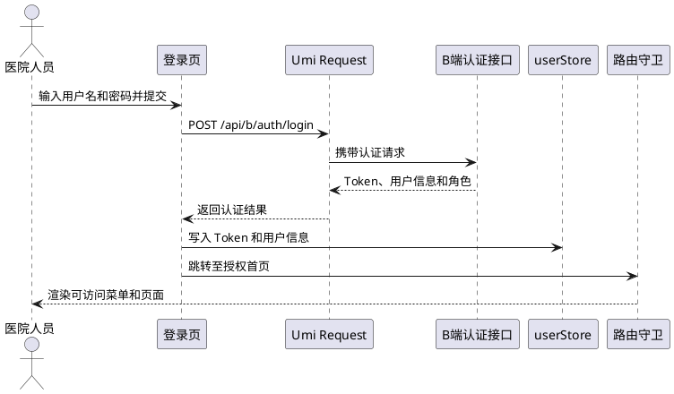

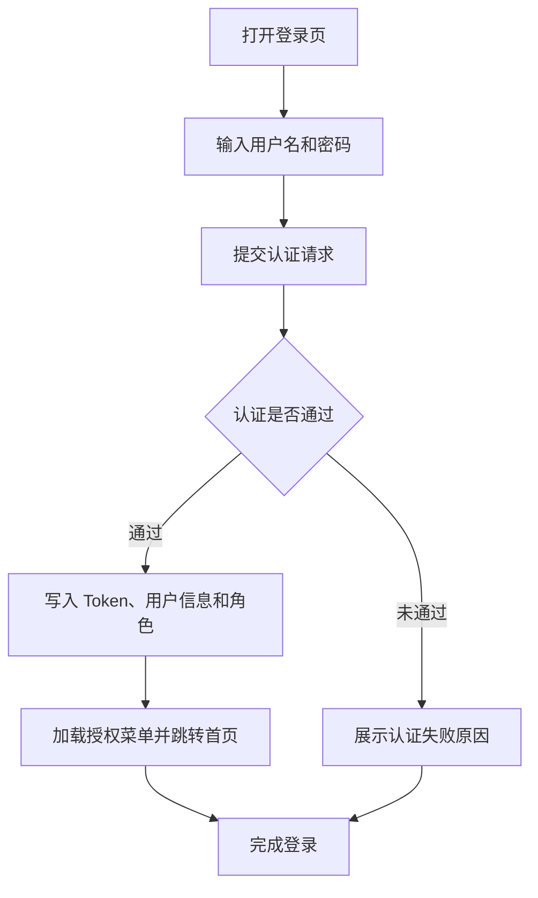

###### 5.3.1 登录
**接口概述：** 用户输入用户名密码进行认证，成功后返回 JWT Token 和用户角色信息。前端将 Token 存入 `userStore`，后续请求自动携带。

**请求：**

```http
POST /api/b/auth/login
Content-Type: application/json

{
  "username": "zhangsan",
  "password": "abc123"
}
```

**请求参数：**

| 参数名 | 类型 | 必填 | 说明 |
| --- | --- | --- | --- |
| username | String | ✅ | 登录用户名 |
| password | String | ✅ | 登录密码 |


**响应参数：**

| 参数名 | 类型 | 说明 |
| --- | --- | --- |
| token | String | JWT Token，后续请求携带 `Authorization: Bearer {token}` |
| userInfo | Object | 用户信息 |
| id | Long | 用户ID |
| name | String | 用户姓名 |
| role | String | 角色：DOCTOR / DEPT_HEAD / ADMIN |
| deptId | Long | 所属科室ID |
| hospitalId | Long | 所属医院ID |


**响应示例：**

```json
{
  "code": "00000",
  "message": "success",
  "data": {
    "token": "eyJhbGciOiJIUzI1NiIs...",
    "userInfo": {
      "id": 1001,
      "name": "张医生",
      "role": "DOCTOR",
      "deptId": 10,
      "hospitalId": 1
    }
  }
}
```

**错误码：**

| 错误码 | 说明 |
| --- | --- |
| 400 | 用户名或密码为空 |
| 401 | 用户名或密码错误 |
| 403 | 账号已被停用 |


###### 5.3.2 刷新令牌
**接口概述：** 访问令牌过期后，前端通过刷新令牌换取新的访问令牌。Umi Request 响应拦截器检测到 401 时自动调用本接口并用新令牌重放原请求；刷新失败或刷新令牌失效时清除登录态并跳转登录页。

```http
POST /api/b/auth/token/refresh
Content-Type: application/json

{
  "refreshToken": "rt_xxx"
}
```

**请求参数：**

| 参数名 | 类型 | 必填 | 说明 |
| --- | --- | --- | --- |
| refreshToken | String | ✅ | 登录或上次刷新后保存的刷新令牌 |


**响应参数：**

| 参数名 | 类型 | 说明 |
| --- | --- | --- |
| accessToken | String | 新访问令牌，后续请求携带 `Authorization: Bearer {accessToken}` |
| refreshToken | String | 新刷新令牌，需覆盖本地保存值 |
| expiresIn | Integer | 新访问令牌有效秒数 |


**services 封装示例：**

```typescript
// services/auth.ts
/** 刷新 B 端访问令牌 */
export function refreshBToken(refreshToken: string) {
  return request<ApiResponse<{ accessToken: string; refreshToken: string; expiresIn: number }>>(
    '/api/b/auth/token/refresh',
    { method: 'POST', data: { refreshToken } },
  );
}
```

**401 自动刷新流程：**

| 步骤 | 处理 |
| --- | --- |
| 1 | 响应拦截器收到 `401` |
| 2 | `userStore` 无 `refreshToken` 时，直接清除登录态并跳转登录页 |
| 3 | 存在 `refreshToken` 时调用 `/api/b/auth/token/refresh`；并发 401 共享同一次刷新 |
| 4 | 刷新成功：更新 `userStore.token` 与 `refreshToken`，用新令牌重放当前及排队请求 |
| 5 | 刷新失败（如刷新令牌失效）：清除 `userStore` 并跳转登录页 |


---

##### 5.4 医院/科室管理接口详细设计
 Service: 返回资源列表

Service --> Query: 返回查询数据  
Query --> Page: 渲染医院、科室和医生信息  
Admin -> Page: 新增、编辑或切换科室状态  
Page -> Service: POST/PUT 管理请求  
Service -> AdminApi: 写入资源变更  
AdminApi --> Service: 返回处理结果  
Service --> Page: 操作成功  
Page -> Query: 失效并刷新相关列表缓存  
@enduml -->  

<!-- 这是一张图片，ocr 内容为： -->


 B["查询医院、科室和医生列表"]

```plain
B --> C["展示管理数据"]
C --> D{"选择管理操作"}
D -->|新增或编辑| E["提交医院、科室或医生信息"]
D -->|状态变更| F["启用或停用科室"]
D -->|仅查询| G["筛选或分页浏览"]
E --> H["刷新相关列表缓存"]
F --> H
G --> I["完成查询"]
H --> I -->
```

<!-- 这是一张图片，ocr 内容为： -->


###### 5.4.1 查询医院信息
**接口概述：** 获取当前医院的详细信息。当前版本仅支持单医院，返回一条记录。

```http
GET /api/b/admin/hospitals
Authorization: Bearer {jwt_token}
```

**响应参数：**

| 参数名 | 类型 | 说明 |
| --- | --- | --- |
| id | Long | 医院ID |
| name | String | 医院名称 |
| level | String | 等级：三甲/二甲/... |
| description | String | 简介 |
| address | String | 地址 |
| contact | String | 联系方式 |
| status | String | 状态：ENABLED/DISABLED |


**响应示例：**

```json
{
  "code": "00000",
  "message": "success",
  "data": {
    "id": 1,
    "name": "北京市人民医院",
    "level": "三甲",
    "address": "北京市海淀区...",
    "status": "ENABLED"
  }
}
```

> **注：** 原 `status` 字段类型从 `Integer`（1/0）改为 `String`（ENABLED/DISABLED），前端条件判断和展示需同步更新。
>

###### 5.4.2 查询科室列表
**接口概述：** 返回医院下的所有科室列表，平级无树形结构。前端用 AntD Table 组件渲染。

```http
GET /api/b/admin/departments
Authorization: Bearer {jwt_token}
```

**响应参数：**

| 参数名 | 类型 | 说明 |
| --- | --- | --- |
| id | Long | 科室ID |
| name | String | 科室名称 |
| hospitalId | Long | 所属医院ID |
| headDoctorId | Long | 科室负责人医生ID |
| headDoctorName | String | 科室负责人姓名 |
| status | String | 状态：ENABLED/DISABLED |


**响应示例：**

```json
{
  "code": "00000",
  "message": "success",
  "data": [
    {
      "id": 10,
      "name": "呼吸内科",
      "hospitalId": 1,
      "headDoctorId": 1002,
      "headDoctorName": "李主任",
      "status": "ENABLED"
    },
    {
      "id": 11,
      "name": "心血管内科",
      "hospitalId": 1,
      "headDoctorId": 1003,
      "headDoctorName": "王主任",
      "status": "ENABLED"
    }
  ]
}
```

###### 5.4.3 新增/编辑科室
**接口概述：** 新增科室时 POST，编辑科室时 PUT。科室名称不可重复。

**请求参数（POST /api/b/admin/departments）：**

| 参数名 | 类型 | 必填 | 说明 |
| --- | --- | --- | --- |
| name | String | ✅ | 科室名称 |
| hospitalId | Long | ✅ | 所属医院ID |
| headDoctorId | Long | ❌ | 科室负责人医生ID |


**请求参数（PUT /api/b/admin/departments/{id}）：**

| 参数名 | 类型 | 必填 | 说明 |
| --- | --- | --- | --- |
| name | String | ✅ | 科室名称 |
| headDoctorId | Long | ❌ | 科室负责人医生ID |


###### 5.4.4 启用/停用科室
**接口概述：** 停用科室后，该科室医生不在 C 端展示。仅可停用不可删除。

```http
PUT /api/b/admin/departments/{id}/status
Authorization: Bearer {jwt_token}
Content-Type: application/json

{
  "status": "ENABLED"   // ENABLED=启用, DISABLED=停用
}
```

###### 5.4.5 查询医生列表
**接口概述：** 分页查询医生列表，按科室筛选。

```http
GET /api/b/admin/doctors?deptId=10&keyword=张&page=1&pageSize=20
Authorization: Bearer {jwt_token}
```

**请求参数（Query）：**

| 参数名 | 类型 | 必填 | 说明 |
| --- | --- | --- | --- |
| deptId | Long | ❌ | 科室ID，为空返回全院 |
| keyword | String | ❌ | 搜索关键字（姓名/执业证号） |
| page | Integer | ❌ | 页码，默认1 |
| pageSize | Integer | ❌ | 每页条数，默认20 |


**响应参数：**

| 参数名 | 类型 | 说明 |
| --- | --- | --- |
| records | Array | 医生列表 |
| id | Long | 医生ID |
| name | String | 姓名 |
| title | String | 职称 |
| deptName | String | 所属科室名称 |
| specialty | String | 擅长领域 |
| licenseNo | String | 执业证号 |
| phone | String | 联系电话 |
| registrationFeeCent | Integer | 挂号费（单位分） |
| status | String | 执业状态：ENABLED/DISABLED/SUSPENDED |
| total | Integer | 总数 |
| page | Integer | 当前页码 |
| pageSize | Integer | 每页条数 |


###### 5.4.6 新增医生
**接口概述：** 新增医生记录。

**请求参数：**

| 参数名 | 类型 | 必填 | 说明 |
| --- | --- | --- | --- |
| name | String | ✅ | 姓名 |
| deptId | Long | ✅ | 所属科室ID |
| title | String | ✅ | 职称（主任医师/副主任医师/主治医师/住院医师） |
| specialty | String | ❌ | 擅长领域 |
| licenseNo | String | ✅ | 执业证号 |
| phone | String | ❌ | 联系电话 |
| registrationFeeCent | Integer | ❌ | 挂号费（单位分），默认0 |
| status | String | ❌ | 默认 ENABLED |


---

##### 5.5 排班/号源接口详细设计
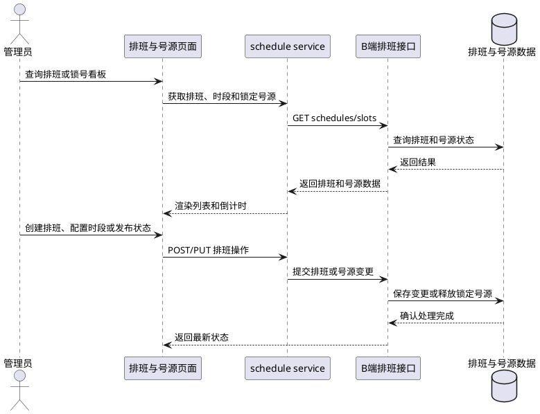

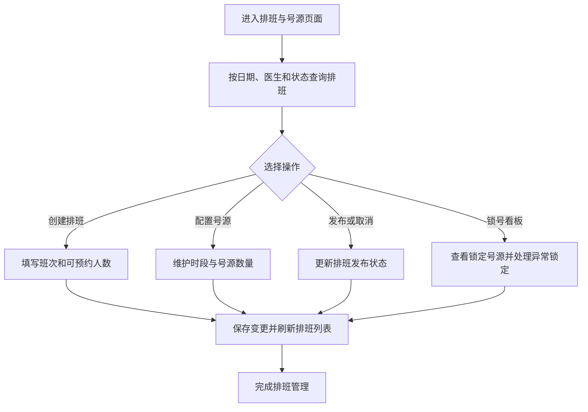

###### 5.5.1 查询排班列表
**接口概述：** 按日期、医生、状态筛选排班列表。

```http
GET /api/b/admin/schedules?date=2026-08-15&doctorId=1001&status=PUBLISHED&page=1&pageSize=20
Authorization: Bearer {jwt_token}
```

**请求参数（Query）：**

| 参数名 | 类型 | 必填 | 说明 |
| --- | --- | --- | --- |
| date | String(date) | ❌ | 筛选日期，格式 yyyy-MM-dd，默认当天 |
| doctorId | Long | ❌ | 医生ID，普通医生仅本人 |
| status | String | ❌ | 排班状态：DRAFT/PUBLISHED/CANCELLED |
| shift | String | ❌ | 班次：MORNING/AFTERNOON |
| page | Integer | ❌ | 页码 |
| pageSize | Integer | ❌ | 每页条数 |


**响应参数：**

| 参数名 | 类型 | 说明 |
| --- | --- | --- |
| records | Array | 排班列表 |
| id | Long | 排班ID |
| doctorId | Long | 医生ID |
| doctorName | String | 医生姓名 |
| deptName | String | 科室名称 |
| scheduleDate | String | 出诊日期 |
| shift | String | 班次：MORNING/AFTERNOON |
| totalSlots | Integer | 号源总数 |
| bookedCount | Integer | 已预约数 |
| remainCount | Integer | 剩余号源数 |
| lockedCount | Integer | 预扣中（未支付）数 |
| status | String | 状态：DRAFT/PUBLISHED/CANCELLED |


**响应示例：**

```json
{
  "code": "00000",
  "message": "success",
  "data": {
    "records": [
      {
        "id": 2001,
        "doctorId": 1001,
        "doctorName": "张主任",
        "deptName": "呼吸内科",
        "scheduleDate": "2026-08-15",
        "shift": "MORNING",
        "totalSlots": 30,
        "bookedCount": 12,
        "remainCount": 16,
        "lockedCount": 2,
        "status": "PUBLISHED"
      }
    ],
    "total": 1,
    "page": 1,
    "pageSize": 20
  }
}
```

###### 5.5.2 创建排班
**接口概述：** 为指定医生创建排班记录。创建后状态为 DRAFT，需配置号源并发布才生效。

**请求参数：**

| 参数名 | 类型 | 必填 | 说明 |
| --- | --- | --- | --- |
| doctorId | Long | ✅ | 出诊医生ID |
| scheduleDate | String(date) | ✅ | 出诊日期，格式 yyyy-MM-dd |
| shift | String | ✅ | 班次：MORNING/AFTERNOON |
| totalSlots | Integer | ✅ | 号源总数（范围 1~99） |


**请求示例：**

```http
POST /api/b/admin/schedules
Authorization: Bearer {jwt_token}
Content-Type: application/json

{
  "doctorId": 1001,
  "scheduleDate": "2026-08-15",
  "shift": "MORNING",
  "totalSlots": 30
}
```

**响应参数：**

| 参数名 | 类型 | 说明 |
| --- | --- | --- |
| id | Long | 排班ID |
| status | String | 排班状态：DRAFT |


**响应示例：**

```json
{
  "code": "00000",
  "message": "success",
  "data": {
    "id": 2001,
    "status": "DRAFT"
  }
}
```

**错误码：**

| 错误码 | 说明 |
| --- | --- |
| 1001 | 医生不存在或已停用 |
| 1002 | 该医生当天该班次已有排班 |
| 1003 | 排班日期不可早于当天 |


###### 5.5.3 查询排班号源时段
**接口概述：** 查询指定排班的号源时段配置详情。

```http
GET /api/b/admin/schedules/2001/slots
Authorization: Bearer {jwt_token}
```

**响应参数：**

| 参数名 | 类型 | 说明 |
| --- | --- | --- |
| scheduleId | Long | 排班ID |
| doctorName | String | 医生姓名 |
| scheduleDate | String | 出诊日期 |
| shift | String | 班次：MORNING/AFTERNOON |
| totalSlots | Integer | 总号源数 |
| status | String | 排班状态：DRAFT/PUBLISHED/CANCELLED |
| slots | Array | 时段列表 |
| id | Long | 时段ID |
| startTime | String | 时段开始 HH:mm |
| endTime | String | 时段结束 HH:mm |
| totalCount | Integer | 该时段号源总数 |
| remainCount | Integer | 该时段剩余号源数 |


###### 5.5.4 配置号源时段
**接口概述：** 配置排班的号源时段。所有时段号源数之和必须等于排班总号源数。

**请求参数（Body）：**

| 参数名 | 类型 | 必填 | 说明 |
| --- | --- | --- | --- |
| slotConfigs | Array | ✅ | 时段配置列表，至少1个 |
| startTime | String(time) | ✅ | 时段开始，格式 HH:mm |
| endTime | String(time) | ✅ | 时段结束，格式 HH:mm |
| count | Integer | ✅ | 该时段号源数 |


**请求示例：**

```http
PUT /api/b/admin/schedules/2001/slots
Authorization: Bearer {jwt_token}
Content-Type: application/json

{
  "slotConfigs": [
    {"startTime": "09:00", "endTime": "09:30", "count": 5},
    {"startTime": "09:30", "endTime": "10:00", "count": 5},
    {"startTime": "10:00", "endTime": "10:30", "count": 5},
    {"startTime": "10:30", "endTime": "11:00", "count": 5},
    {"startTime": "11:00", "endTime": "11:30", "count": 5},
    {"startTime": "11:30", "endTime": "12:00", "count": 5}
  ]
}
```

**错误码：**

| 错误码 | 说明 |
| --- | --- |
| 2001 | 排班不存在或已发布（已发布不可修改） |
| 2002 | 时段号源总数与排班号源总数不一致 |


###### 5.5.5 发布/取消发布排班
**接口概述：** 发布后排班对 C 端可见；取消发布后需通知已预约患者。

```http
PUT /api/b/admin/schedules/2001/publish
Authorization: Bearer {jwt_token}
```

```http
PUT /api/b/admin/schedules/2001/unpublish
Authorization: Bearer {jwt_token}
```

###### 5.5.6 锁定号源看板
**接口概述：** 查询指定日期下所有被预扣锁定（未支付）的号源。前端根据 `lockedAt` 字段，使用 `useCountdown` Hook 自行计算倒计时（`lockedAt + 15分钟`）。

```http
GET /api/b/admin/slots/locked?date=2026-08-15&deptId=10
Authorization: Bearer {jwt_token}
```

**请求参数（Query）：**

| 参数名 | 类型 | 必填 | 说明 |
| --- | --- | --- | --- |
| date | String(date) | ✅ | 查询日期，格式 yyyy-MM-dd |
| deptId | Long | ❌ | 科室ID，为空则查询全院 |


**响应参数：**

| 参数名 | 类型 | 说明 |
| --- | --- | --- |
| slotId | Long | 号源快照ID |
| scheduleId | Long | 排班ID |
| doctorName | String | 医生姓名 |
| patientName | String | 患者姓名（脱敏） |
| lockedAt | String(datetime) | 锁定时间 |
| status | String | LOCKED=已锁定 |


**响应示例：**

```json
{
  "code": "00000",
  "message": "success",
  "data": [
    {
      "slotId": 3001,
      "scheduleId": 2001,
      "doctorName": "张主任",
      "patientName": "张**",
      "lockedAt": "2026-08-15T09:05:00",
      "status": "LOCKED"
    }
  ]
}
```

###### 5.5.7 手动释放锁定号源
**接口概述：** 管理员手动强制释放异常锁定的号源。

```http
POST /api/b/admin/slots/3001/force-release
Authorization: Bearer {jwt_token}

// 无请求 Body
```

---

##### 5.6 接诊台接口详细设计
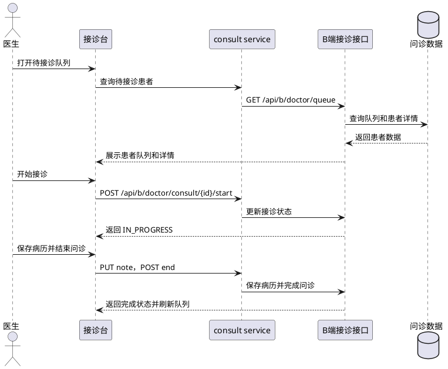

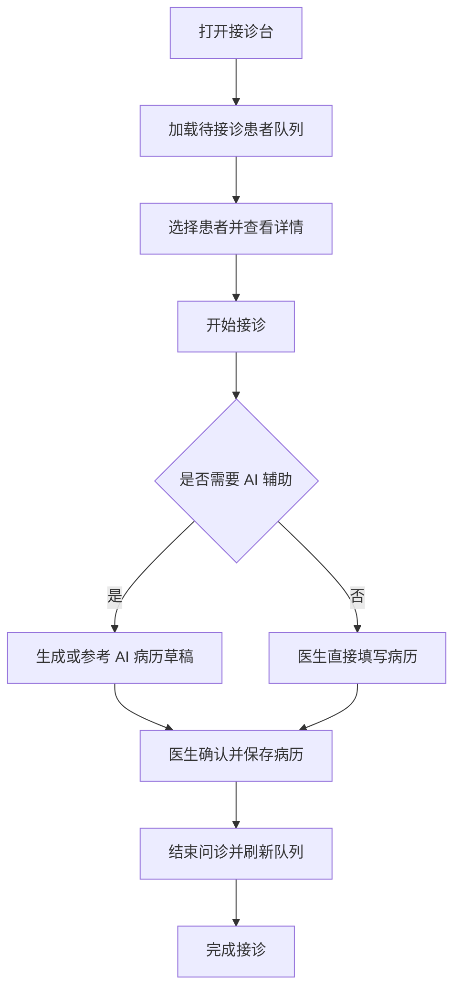

###### 5.6.1 待接诊列表
**接口概述：** 查询当前医生（或科室）的待接诊患者列表。结果按风险等级置顶排序。

```http
GET /api/b/doctor/queue?deptId=10&status=pending&keyword=张
Authorization: Bearer {jwt_token}
```

**请求参数（Query）：**

| 参数名 | 类型 | 必填 | 说明 |
| --- | --- | --- | --- |
| deptId | Long | ❌ | 科室ID，主任/管理员可筛选科室 |
| status | String | ❌ | 筛选状态：PENDING/IN_PROGRESS/COMPLETED/NO_SHOW |
| keyword | String | ❌ | 搜索姓名/病历号 |


**响应参数：**

| 参数名 | 类型 | 说明 |
| --- | --- | --- |
| id | Long | 问诊记录ID |
| patientId | String | 患者ID |
| patientName | String | 患者姓名 |
| gender | String | 性别 |
| age | Integer | 年龄 |
| chiefComplaint | String | 主诉摘要 |
| riskTags | Array | 风险标签列表（如["过敏","危重"]） |
| waitMinutes | Integer | 已等待分钟数 |
| aiSummary | jsonb | AI预问诊摘要（结构化JSON，折叠展示） |
| status | String | PENDING/IN_PROGRESS/COMPLETED/NO_SHOW |


**响应示例：**

```json
{
  "code": "00000",
  "message": "success",
  "data": [
    {
      "id": 5001,
      "patientId": "P001",
      "patientName": "王大锤",
      "gender": "男",
      "age": 28,
      "chiefComplaint": "腹痛伴恶心呕吐1小时",
      "riskTags": ["危重"],
      "waitMinutes": 8,
      "status": "PENDING"
    },
    {
      "id": 5002,
      "patientId": "P002",
      "patientName": "李秀珍",
      "gender": "女",
      "age": 45,
      "chiefComplaint": "咳嗽、发热3天",
      "riskTags": ["过敏"],
      "waitMinutes": 15,
      "status": "PENDING"
    }
  ]
}
```

###### 5.6.2 患者详情
**接口概述：** 查询患者完整信息，包括基本资料、AI预问诊摘要、历史病历、历次处方。

```http
GET /api/b/doctor/queue/5001
Authorization: Bearer {jwt_token}
```

**响应参数：**

| 参数名 | 类型 | 说明 |
| --- | --- | --- |
| patientId | String | 患者ID |
| patientName | String | 患者姓名 |
| gender | String | 性别：MALE/FEMALE/UNKNOWN |
| age | Integer | 年龄 |
| idCardNo | String | 身份证号（后端脱敏后返回，如 110***********1234） |
| phoneNo | String | 联系电话（后端脱敏后返回，如 138****1234） |
| emergencyContact | String | 紧急联系人 |
| allergyList | Array | 过敏史列表（从 patient_allergy 表查询，含过敏原+严重程度） |
| medicalHistoryList | Array | 既往史列表（从 patient_medical_history 表查询，含内容+发生时间） |
| aiSummary | jsonb | AI预问诊摘要（结构化JSON） |
| chiefComplaint | String | 主诉 |
| presentIllness | String | 现病史 |
| pastHistory | String | 既往史 |
| allergyHistory | String | 过敏史 |
| medicationHistory | String | 用药情况 |
| historyRecords | Array | 历史就诊记录 |
| date | String | 就诊日期 |
| type | String | 类型：病历/检查/影像 |
| summary | String | 摘要内容 |
| historyPrescriptions | Array | 历次处方记录 |


###### 5.6.3 开始接诊
**接口概述：** 医生点击"接诊"后调用，将接诊状态从 PENDING 变为 IN_PROGRESS。后端会校验该医生当前无其他 IN_PROGRESS 的接诊记录，若有则拒绝接诊并返回错误码。

```http
POST /api/b/doctor/consult/5001/start
Authorization: Bearer {jwt_token}
```

**响应示例：**

```json
{
  "code": "00000",
  "message": "success",
  "data": {
    "status": "IN_PROGRESS"
  }
}
```

###### 5.6.4 结束问诊
**接口概述：** 医生点击"结束问诊"后调用，将接诊状态变为"已完成"。前端应先确认医生是否已保存病历和处方。

```http
POST /api/b/doctor/consult/5001/end
Authorization: Bearer {jwt_token}
```

###### 5.6.5 保存病历记录
**接口概述：** 医生确认病历内容后保存。病历内容由医生填写或 AI 生成草稿后修改确认。

```http
PUT /api/b/doctor/consult/5001/note
Authorization: Bearer {jwt_token}
Content-Type: application/json

{
  "chiefComplaint": "腹痛伴恶心呕吐1小时",
  "presentIllness": "患者于1小时前...",
  "examination": "腹部压痛...",
  "diagnosis": "急性胃肠炎",
  "treatmentPlan": "建议口服补液..."
}
```

---

##### 5.7 处方管理接口详细设计
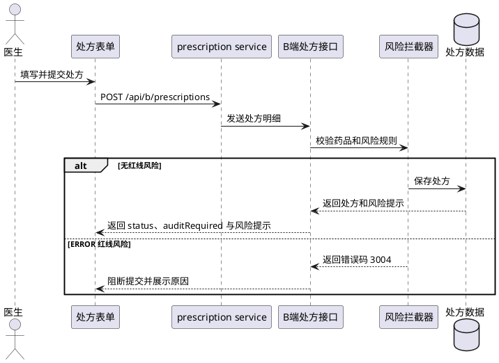

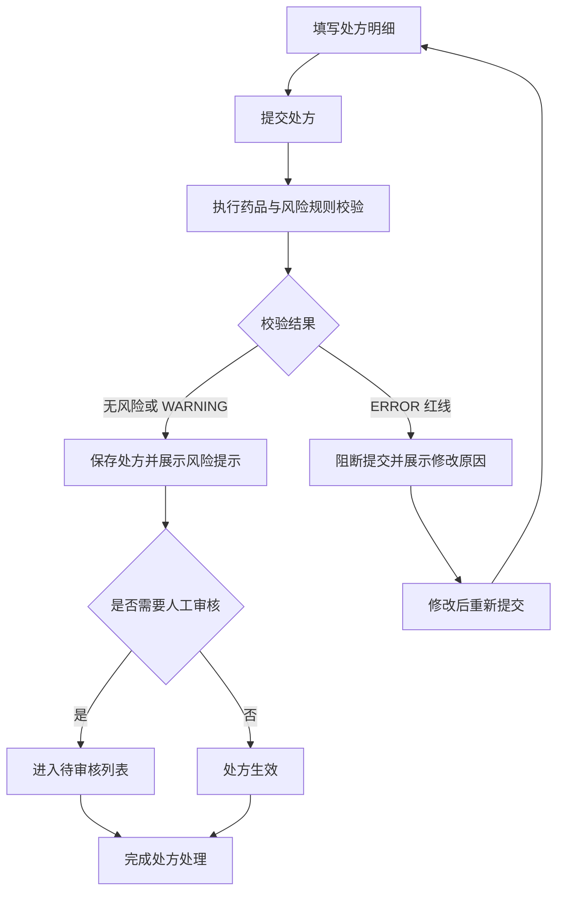

###### 5.7.1 提交处方
**接口概述：** 医生填写完毕并确认签名后提交处方。提交时会经过后端风险拦截器检测，规则如下：

+ **无红线风险**：处方入库后，前端必须以响应中的 `status` 与 `auditRequired` 决定展示。`auditRequired=true` 时展示“待审核（SUBMITTED）”并进入待审核列表；`auditRequired=false` 时按后端返回状态展示，同时可弹出 `riskWarnings` 提示。
+ **ERROR（红线）**：处方不入库，直接返回错误码 3004，医生需修改处方后重新提交

**请求参数：**

| 参数名 | 类型 | 必填 | 说明 |
| --- | --- | --- | --- |
| consultId | Long | ✅ | 问诊记录ID |
| items | Array | ✅ | 处方明细，至少1项 |
| drugId | Long | ✅ | 药品ID |
| dosage | String | ✅ | 用法：QD(每天1次) BID(每天2次) TID(每天3次) |
| frequency | String | ✅ | 频次描述，如"每天一次" |
| usageMethod | String | ✅ | 用药途径：口服/外用/注射 |
| days | Integer | ✅ | 用药天数 |
| quantity | Integer | ✅ | 数量（盒/瓶） |


**请求示例：**

```http
POST /api/b/prescriptions
Authorization: Bearer {jwt_token}
Content-Type: application/json

{
  "consultId": 5001,
  "items": [
    {
      "drugId": 7001,
      "dosage": "QD",
      "frequency": "每天一次",
      "usageMethod": "口服",
      "days": 30,
      "quantity": 1
    }
  ]
}
```

**响应参数：**

| 参数名 | 类型 | 说明 |
| --- | --- | --- |
| id | Long | 处方ID |
| status | String | SUBMITTED=已提交（待审核） APPROVED=已通过 REJECTED=已驳回 |
| auditRequired | Boolean | 是否需要审核 |
| riskWarnings | Array | 风险告警列表 |
| level | String | 级别：WARNING(提示级)/ERROR(审核级) |
| rule | String | 命中规则名称 |
| message | String | 风险提示文案 |


**响应示例（命中 WARNING 级风险 — 处方正常生效，弹窗提示可关闭）：**

```json
{
  "code": "00000",
  "message": "success",
  "data": {
    "id": 6001,
    "status": "APPROVED",
    "auditRequired": false,
    "riskWarnings": [
      {
        "level": "WARNING",
        "rule": "重复用药检测",
        "message": "阿司匹林肠溶片与硫酸氢氯吡格雷片同属抗血小板药物，请确认是否需联合使用"
      }
    ]
  }
}
```

**响应示例（命中 ERROR 级红线 — 处方不入库，返回错误码）：**

```json
{
  "code": 3004,
  "message": "红线规则拦截：患者对青霉素类药品有过敏史，处方中含阿莫西林，禁止提交",
  "data": null
}
```

**错误码：**

| 错误码 | 说明 | 前端处理 |
| --- | --- | --- |
| 3001 | 患者不存在 | 提示错误 |
| 3002 | 问诊记录不存在或不可开方 | 提示错误 |
| 3003 | 药品不存在或已停用 | 提示药品名称 |
| 3004 | 红线规则拦截（禁止提交） | Alert 展示禁止原因 |
| 400 | 参数校验失败 | 字段级提示 |


###### 5.7.2 待审核处方列表
**接口概述：** 管理员/科室主任查看命中审核级风险规则的处方列表。

```http
GET /api/b/prescriptions/pending-audit?page=1&pageSize=20
Authorization: Bearer {jwt_token}
```

###### 5.7.3 审核处方
**接口概述：** 对命中审核级规则的处方进行人工审核（通过/驳回）。

**请求参数：**

| 参数名 | 类型 | 必填 | 说明 |
| --- | --- | --- | --- |
| action | String | ✅ | APPROVED=通过, REJECTED=驳回 |
| rejectReason | String | ❌ | 驳回原因（驳回时必须填写） |


```http
PUT /api/b/prescriptions/6001/audit
Authorization: Bearer {jwt_token}
Content-Type: application/json

{
  "action": "APPROVED"
}
```

###### 5.7.4 处方模板
**接口概述：** 医生保存/引用常用处方模板。模板包含药品清单，开方时选择模板1或模板2，点击后自动填充药品清单到处方明细中，医生确认后再提交。

**保存模板：**

```http
POST /api/b/prescription-templates
Authorization: Bearer {jwt_token}
Content-Type: application/json

{
  "name": "高血压常规用药",
  "items": [
    { "drugId": 7001, "dosage": "QD", "usageMethod": "口服", "days": 30, "quantity": 1 }
  ]
}
```

---

##### 5.8 药品库存接口详细设计
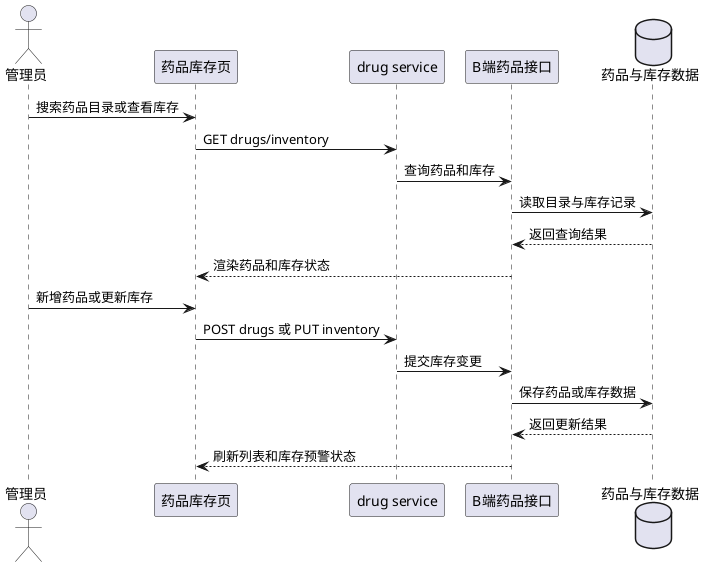

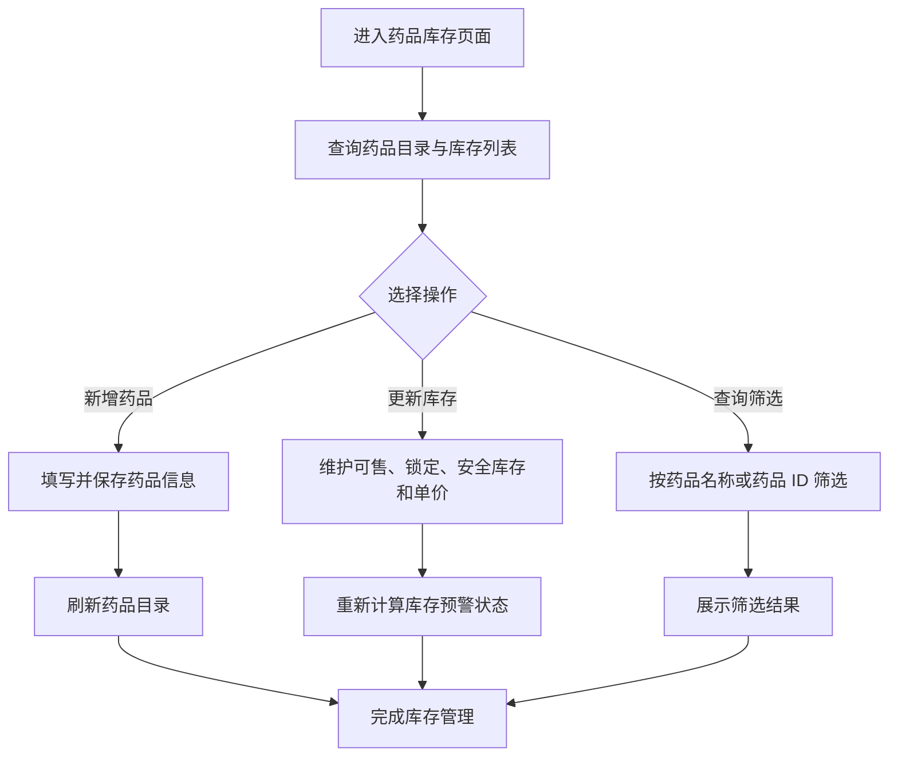

###### 5.8.1 药品目录
**接口概述：** 分页查询药品目录，支持名称搜索。

```http
GET /api/b/admin/drugs?keyword=阿司匹林&page=1&pageSize=20
Authorization: Bearer {jwt_token}
```

**响应参数：**

| 参数名 | 类型 | 说明 |
| --- | --- | --- |
| id | Long | 药品ID |
| name | String | 药品名称 |
| specification | String | 规格 |
| unit | String | 最小销售单位 |
| indication | String | 适应症/主要功效 |
| manufacturer | String | 生产厂家 |
| approvalNumber | String | 批准文号 |
| status | String | 状态：ENABLED/DISABLED |


###### 5.8.2 新增药品
**接口概述：** 管理员新增药品到本院药品目录。

**请求参数：**

| 参数名 | 类型 | 必填 | 说明 |
| --- | --- | --- | --- |
| name | String | ✅ | 药品名称 |
| specification | String | ✅ | 规格（如 100MG） |
| unit | String | ❌ | 最小销售单位，默认"盒" |
| indication | String | ❌ | 适应症/主要功效 |
| manufacturer | String | ❌ | 生产厂家 |
| approvalNumber | String | ❌ | 批准文号 |
| status | String | ❌ | 默认 ENABLED |


**请求示例：**

```http
POST /api/b/admin/drugs
Authorization: Bearer {jwt_token}
Content-Type: application/json

{
  "name": "阿莫西林胶囊",
  "specification": "0.5g*24粒",
  "unit": "盒",
  "indication": "用于敏感菌引起的呼吸道感染、泌尿道感染等",
  "manufacturer": "某制药厂",
  "approvalNumber": "国药准字H12345678"
}
```

###### 5.8.3 库存列表
**接口概述：** 查询各药品在当前药店的库存量。

```http
GET /api/b/admin/inventory?drugId=7001&page=1&pageSize=20
Authorization: Bearer {jwt_token}
```

**响应参数：**

| 参数名 | 类型 | 说明 |
| --- | --- | --- |
| drugId | Long | 药品ID |
| drugName | String | 药品名称 |
| specification | String | 规格 |
| availableCount | Integer | 可售库存数量 |
| lockedCount | Integer | 待支付锁定库存 |
| safetyStock | Integer | 安全库存阈值 |
| unitPriceCent | Integer | 单价（单位分） |
| status | String | NORMAL=正常 LOW=低库存 ALERT=预警 |


> **注：** status 计算规则：`availableCount >= 10` → NORMAL；`availableCount BETWEEN 4 AND 9` → LOW；`availableCount <= 3` → ALERT。
>

###### 5.8.4 更新库存
**请求参数：**

| 参数名 | 类型 | 必填 | 说明 |
| --- | --- | --- | --- |
| availableCount | Integer | ❌ | 可售库存数量 |
| lockedCount | Integer | ❌ | 待支付锁定库存 |
| safetyStock | Integer | ❌ | 安全库存阈值 |
| unitPriceCent | Integer | ❌ | 单价（单位分） |


```http
PUT /api/b/admin/inventory/{id}
Authorization: Bearer {jwt_token}
Content-Type: application/json

{
  "availableCount": 500,
  "safetyStock": 50,
  "unitPriceCent": 1500
}
```

> **注：** 原 `drug_inventory` 表已重命名为 `pharmacy_drug_stock`，`stock` 字段改名为 `availableCount`，新增 `lockedCount` 和 `unitPriceCent`。前端展示库存列表时需注意字段名变化。
>

---

#### 6. AI 辅助面板交互设计
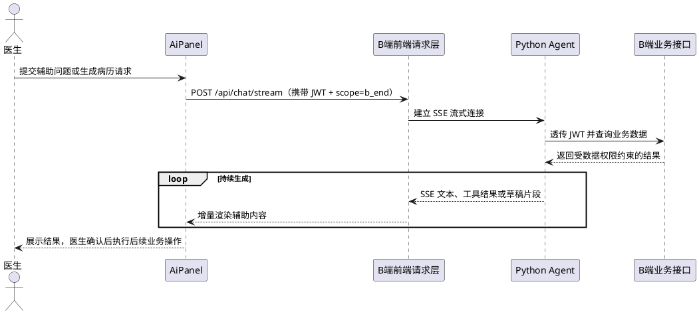

```mermaid
flowchart TD
    A["医生打开 AI 面板"] --> B["输入问题或发起病历草稿请求"]
    B --> C["携带 JWT 建立 SSE 连接"]
    C --> D["Agent 查询受权限约束的 B 端数据"]
    D --> E["持续返回文本、工具结果或草稿片段"]
    E --> F{"医生是否采用结果"}
    F -->|采用| G["确认并保存病历或继续业务操作"]
    F -->|不采用| H["修改内容或继续追问"]
    G --> I["完成 AI 辅助操作"]
    H --> I
```

##### 6.1 架构说明
前端 AI 面板通过 SSE（Server-Sent Events）与 Agent 端建立流式连接。前端在发起 AI 对话请求时，将当前用户的 JWT Token 放入请求头。Agent 端收到请求后，原样透传该 Token 至 B端 REST 接口，B端复用现有的 JWT 鉴权与数据权限逻辑。

##### 6.2 AI 辅助操作接口
AI 辅助面板中的各项能力通过以下 REST 接口实现：

| 操作 | 接口 | 说明 |
| --- | --- | --- |
| AI 对话 | `POST /api/chat/stream` | SSE 流式对话，固定携带 `scope=b_end`，由 Agent 端处理并返回 |
| 生成病历草稿 | `POST /api/chat/stream`（`scope=b_end`） | Agent 根据当前问诊上下文生成草稿；医生确认后通过 `PUT /api/b/doctor/consult/{id}/note` 保存 |
| 查询患者病历 | `GET /api/b/doctor/queue/{id}` | 获取患者详情含历史病历 |
| 处方风险检测 | `POST /api/b/prescriptions` 提交时自动触发 | 后端风险拦截器检测并返回告警 |


##### 6.3 AI 面板加载状态
| 状态 | 前端表现 |
| --- | --- |
| **Loading** | 展示"AI 辅助加载中..."骨架屏 |
| **Error** | Alert 展示错误信息 + 重试按钮 |
| **Empty** | 展示"暂无辅助信息" |
| **Success** | 正常渲染 AI 辅助内容 |


```tsx
// 统一模式
function Page() {
  const { data, isLoading, isError, error, refetch } = useQuery(...);

  if (isLoading) return <Skeleton active />;
  if (isError) return <Alert message={error.message} type="error" action={<Button onClick={refetch}>重试</Button>} />;
  if (!data?.length) return <EmptyState description="暂无数据" />;
  return <NormalRender data={data} />;
}
```

#### 7. 异常与边界处理
##### 7.1 通用状态处理规范
每个列表页/详情页必须处理以下四种状态：

| 状态 | 前端表现 |
| --- | --- |
| **Loading** | AntD `Spin` + 骨架屏（列表用 `Skeleton` 组件） |
| **Empty** | `EmptyState` 组件 + 业务提示文案 |
| **Error** | `Alert` 展示错误信息 + 重试按钮 |
| **Success** | 正常渲染 |


```tsx
// 统一模式
function Page() {
  const { data, isLoading, isError, error, refetch } = useQuery(...);

  if (isLoading) return <Skeleton active />;
  if (isError) return <Alert message={error.message} type="error" action={<Button onClick={refetch}>重试</Button>} />;
  if (!data?.length) return <EmptyState description="暂无数据" />;
  return <NormalRender data={data} />;
}
```

##### 7.2 各类场景处理
| 场景 | 处理方式 |
| --- | --- |
| 网络断开 | Umi Request 拦截器检测网络错误 → 全局提示"网络异常，请检查连接" |
| 请求超时 | 在 request 中配置 `timeout: 15000`，超时后展示"请求超时，请重试" |
| 后端返回 code ≠ 0 | 局部提示业务错误信息（如"该医生当天已有排班"） |
| 表单提交失败 | 保留用户已填写内容，不刷新页面，展示错误提示 |
| 并发提交（防重复点击） | 提交按钮点击后 `loading` 状态，disable 直至响应返回 |
| 接诊页面中离开 | `useEffect` cleanup 中重置 consultStore |
| 大数据量列表 | AntD Table 自带分页，默认每页 20 条 |
| 跨天操作（排班日期选择） | 日期选择器限制不可选择今天之前的日期（后端也会校验） |


##### 7.3 AI 辅助异常场景
| 场景 | 处理 |
| --- | --- |
| AI 响应超时 | 展示“AI 正在思考...” loading 动画，超时后提示重试 |
| 数据加载失败 | 展示错误提示，提供重试按钮 |
| AI 辅助不可用 | 右侧展示“AI 辅助暂不可用”占位，不影响左栏和中栏操作 |


##### 7.4 业务错误码映射表
| 业务码 | 页面反馈 | 前端动作 |
| --- | --- | --- |
| `3001` | 患者不存在 | 刷新列表并提示 |
| `3002` | 问诊记录不存在或不可开方 | 提示错误并返回上一级 |
| `3003` | 药品不存在或已停用 | 提示药品名称并刷新药品目录 |
| `3004` | 红线规则拦截（禁止提交） | Alert 展示禁止原因，医生修改后重新提交 |
| `3010` | 无权查看该患者 | 提示“无权限查看该患者” |
| `3011` | 问诊记录不存在或状态不可接诊 | 刷新接诊队列 |
| `3012` | 医生当前存在未结束的接诊记录 | 提示先结束当前接诊 |
| `3013` | 问诊状态不是 `IN_PROGRESS` | 刷新当前接诊状态 |
| `3014` | 存在未签名的处方草稿 | 提示先提交或删除处方草稿 |
| `3020` | 无权查看该处方 | 提示“无权限查看该处方” |
| `3021` | 当前角色无处方审核权限 | 隐藏审核入口并提示 |
| `3022` | 处方状态不是 `SUBMITTED` | 刷新待审核列表 |
| `3023` | 驳回时必须填写驳回原因 | 标记驳回原因输入框 |
| `4001` | 科室下存在启用医生，无法停用 | Alert 展示原因并阻止操作 |
| `4002` | 科室下存在已发布排班，无法停用 | Alert 展示原因并阻止操作 |
| `4003` | 科室下存在进行中问诊，无法停用 | Alert 展示原因并阻止操作 |


> **注：** 全局通用错误码（`00000`、`A0301`、`A0400`、`A0402`、`A0443`、`A0501`、`A0506`、`B0001`、`B0202` 等）按 §5.1.4 通用错误码与请求层统一处理；本表仅补充 B 端业务模块专属错误码。
>

---

## 第四部分：平台工程规范与跨端协作
### 4.1 独立部署、鉴权与接口域隔离
| 协作项 | 约定 |
| --- | --- |
| 前端部署 | C 端 H5 与 B 端后台独立构建、独立发布、独立运行配置 |
| 用户与权限 | C 端使用患者账号和就诊人归属；B 端使用内部角色、菜单和数据权限 |
| JWT | C/B 端 Token 不能互换；前端仅将本端 Token 发送至对应服务 |
| 接口调用 | C 端只调用 C 端 API；B 端只调用 B 端 API；禁止跨端复用 services、Store 或接口类型 |


### 4.2 组件层级与工程组织
| 组件类别 | C 端实现 | B 端实现 | 复用原则 |
| --- | --- | --- | --- |
| 页面框架 | `AppTabBar`、移动页面容器和 `AgentFloatingButton` | `PageContainer`、侧边栏和工作台布局 | 按端侧设备形态独立实现，不跨端共享布局组件。 |
| 上下文选择 | `PatientSwitcher`、`HospitalSwitcher` | 科室、医生、日期和患者筛选表单 | 切换上下文后重置依赖查询并刷新缓存。 |
| 业务进度 | `AppointmentProgress`、订单与提醒 `StatusTag` | `LockedSlotsTable`、排班与接诊状态标签 | 状态值由端侧后端返回，前端仅负责映射文案和样式。 |
| 表单与确认 | 移动表单、支付确认与 L2 确认卡片 | `SearchForm`、`ConfirmModal`、`PrescriptionForm`、`ScheduleForm` | 创建、取消、支付、开方和审核均需要显式确认与提交中防重。 |
| 详情与选择 | 处方、药房、报告、物流和健康档案卡片 | `PatientCard`、`PatientInfoPanel`、`DrugSelector`、`PrescriptionTable` | 详情组件接收 DTO，不直接发起跨端请求。 |
| AI 与空态 | `MedicalDisclaimer`、ReAct 工具卡片和会话组件 | `AiPanel`、`EmptyState`、加载与错误占位 | AI 不可用时保留传统业务入口，医疗免责声明在患者可见场景固定展示。 |


##### 组件组织规范
+ 通用组件放置在各端 `components/common/`，只承载展示、交互和可配置的状态映射。
+ 业务组件放置在各端 `components/biz/`，以挂号、购药、接诊、处方、排班和 AI 等领域拆分。
+ 页面负责组合组件、路由参数和查询状态；`services/` 负责接口调用；Store 不保存可由服务端缓存恢复的数据。


---

### 4.3 状态管理、缓存与 API 接入
| 状态范围 | C 端职责 | B 端职责 |
| --- | --- | --- |
| 认证状态 | authStore 保存 C 端登录态和 Token | userStore 保存后台用户、角色、科室和 Token |
| 业务上下文 | patientStore、hospitalStore、assistantStore、pharmacyStore | consultStore 保存当前接诊与患者上下文 |
| AI 状态 | agentStore 保存会话、七类 SSE 事件和确认卡片 | AI 面板按当前接诊患者加载辅助内容 |
| 接口隔离 | 仅调用 /api/c/v1 与 C 端 Agent 上下文 | 仅调用 B 端业务接口和 B 端 AI 面板接口 |


#### 缓存与请求通用约定
| 范围 | C 端约定 | B 端约定 | 统一规则 |
| --- | --- | --- | --- |
| 客户端 Store | 保存认证、当前就诊人、医院和 AI 会话临时状态 | 保存用户、角色、当前接诊和页面 UI 状态 | 仅保存客户端上下文；退出登录时清除本端敏感状态。 |
| Query Key | 以 `patientId`、`hospitalId`、业务状态组成查询键 | 以角色、科室、患者、日期和筛选条件组成查询键 | 键必须包含数据权限上下文，禁止两端复用同一缓存键。 |
| 缓存刷新 | 挂号、支付、购药、提醒和资料变更后失效相关查询 | 排班、接诊、处方、库存和审核变更后失效相关查询 | 写操作成功后精准 `invalidate`，避免依赖整页刷新。 |
| 请求拦截 | 注入 C 端 Token，过期后清除登录态并跳转登录 | 注入后台 Token，401 后清除用户状态并跳转登录 | 统一处理网络超时、追踪标识和业务错误；Token 不跨端发送。 |
| 服务层 | 按认证、挂号、问诊、药房、健康和 Agent 域拆分 | 按管理、排班、接诊、处方、药品、患者和统计域拆分 | 页面不拼接接口地址，DTO 与错误码定义跟随本端服务层。 |


#### Store 与服务层设计
##### Zustand Store 设计
 Zustand 是前端的轻量级全局状态管理工具。  这里的几个 Store 用来保存“页面之间需要共享、但不适合每次都从接口重新查询”的客户端状态。  

**userStore：**

```typescript
interface UserStore {
  token: string | null;
  refreshToken: string | null;
  userInfo: {
    id: number;
    name: string;
    role: 'DOCTOR' | 'DEPT_HEAD' | 'ADMIN';
    deptId: number;
    hospitalId: number;
  } | null;

  login: (token: string, refreshToken: string, userInfo: UserInfo) => void;
  setToken: (token: string, refreshToken: string) => void;
  logout: () => void;
}
```

**consultStore：**

```typescript
interface ConsultStore {
  currentConsultId: number | null;   // 当前接诊的 consultId
  currentPatientId: string | null;   // 当前患者 ID
  consultStatus: 'idle' | 'consulting' | 'ended';

  startConsult: (consultId: number, patientId: string) => void;
  endConsult: () => void;
  switchPatient: (consultId: number, patientId: string) => void;
}
```

**接诊状态流转：**

```plain
idle ──（点击接诊 POST /api/b/doctor/consult/{id}/start）──→ consulting
consulting ──（结束问诊 POST /api/b/doctor/consult/{id}/end）──→ ended
ended ──（返回列表 / 切换患者）──→ idle
```

+ **idle**：无接诊会话，显示待接诊列表
+ **consulting**：接诊中，中栏为问诊/病历编辑区，右栏为 AI 辅助面板
+ **ended**：问诊结束，提示医生确认已保存病历和处方后返回列表

**appStore：**

```typescript
interface AppStore {
  sidebarCollapsed: boolean;
  toggleSidebar: () => void;
}
```

##### TanStack Query 使用规范
 TanStack Query 是一个专门管理“后端接口数据”的前端库，也叫服务端状态管理工具。  

**Query Key 命名约定：**

```plain
['schedule', 'list', { date, doctorId }]    // 排班列表
['schedule', 'detail', scheduleId]          // 排班详情
['consult', 'queue', { deptId }]            // 待接诊列表
['consult', 'detail', consultId]            // 患者详情
['prescription', 'list', { status }]        // 处方列表
['prescription', 'pending-audit']           // 待审核列表
['drug', 'catalog', { keyword }]            // 药品目录
['drug', 'inventory', { pharmacyId }]       // 库存列表
['patient', 'list', { keyword }]            // 患者列表
['patient', 'detail', patientId]            // 患者详情
['patient', 'visits', patientId]            // 患者就诊记录
['patient', 'prescriptions', patientId]     // 患者历史处方
['patient', 'medications', patientId]       // 患者用药与随访
['statistics', 'overview', { dateRange }]   // 运营总览
['statistics', 'department', { dateRange }] // 科室统计
```

**缓存策略：**

| Query | staleTime | 刷新时机 |
| --- | --- | --- |
| 排班列表 | 30s | 新增/发布/取消后 `invalidate` |
| 待接诊列表 | 15s | 自动轮询（或接诊/转诊后刷新） |
| 患者详情 | 60s | 切换患者时重新 fetch |
| 处方列表 | 30s | 提交/审核后 `invalidate` |
| 药品目录 | 5min | 变更少，按需手动刷新 |
| 患者列表 | 30s | 搜索条件变更时重新 fetch |
| 患者详情 | 60s | 切换患者时重新 fetch |
| 患者就诊记录 | 60s | 切换 Tab 时刷新 |
| 运营总览 | 5min | 手动刷新，数据实时性要求不高 |


##### services 层编码规范
每个 API 接口在 `services/` 目录下有对应的函数封装：

```typescript
// 示例：services/schedule.ts
import { request } from 'umi';

/** 排班状态枚举 */
type ScheduleStatus = 'DRAFT' | 'PUBLISHED' | 'CANCELLED';

/** 班次枚举 */
type Shift = 'MORNING' | 'AFTERNOON';

/** 查询排班列表 */
export function getScheduleList(params: {
  date?: string;
  doctorId?: number;
  status?: ScheduleStatus;
  shift?: Shift;
  page?: number;
  pageSize?: number;
}) {
  return request<ApiResponse<PageResponse<Schedule>>>('/api/b/admin/schedules', {
    method: 'GET',
    params,
  });
}

/** 创建排班 */
export function createSchedule(data: {
  doctorId: number;
  scheduleDate: string;
  shift: Shift;
  totalSlots: number;
}) {
  return request<ApiResponse<{ id: number; status: ScheduleStatus }>>('/api/b/admin/schedules', {
    method: 'POST',
    data,
  });
}

/** 配置号源时段 */
export function configureSlots(scheduleId: number, slotConfigs: SlotConfig[]) {
  return request<ApiResponse<SlotConfigResult>>(`/api/b/admin/schedules/${scheduleId}/slots`, {
    method: 'PUT',
    data: { slotConfigs },
  });
}

/** 发布排班 */
export function publishSchedule(scheduleId: number) {
  return request<ApiResponse<void>>(`/api/b/admin/schedules/${scheduleId}/publish`, {
    method: 'PUT',
  });
}
```

**命名规范：**

| 操作 | 函数名前缀 | 示例 |
| --- | --- | --- |
| 查询列表 | `getXxxList` / `queryXxx` | `getScheduleList` |
| 查询单条 | `getXxx` / `queryXxx` | `getScheduleDetail` |
| 新增 | `createXxx` | `createSchedule` |
| 编辑 | `updateXxx` | `updateDepartment` |
| 删除/停用 | `deleteXxx` / `disableXxx` | `disableDepartment` |


##### 请求拦截器
```typescript
// app.ts - Umi 运行时配置
import { request } from 'umi';

// Token 注入
request.interceptors.request.use((url, options) => {
  const { token } = useUserStore.getState();
  if (token) {
    options.headers = {
      ...options.headers,
      Authorization: `Bearer ${token}`,
    };
  }
  return { url, options };
});

// 401 统一处理：优先自动刷新令牌，失败后再清除登录态并跳转登录
let isRefreshing = false;   // 防止并发 401 重复刷新
let pendingQueue: Array<(newToken: string) => void> = [];

request.interceptors.response.use(async (response, options) => {
  if (response.status !== 401) return response;

  const { refreshToken } = useUserStore.getState();
  // 无刷新令牌时直接退出登录
  if (!refreshToken) {
    useUserStore.getState().logout();
    history.push('/login');
    return Promise.reject(new Error('登录已过期'));
  }

  // 并发 401 请求共享同一次刷新，刷新完成后用新令牌重放
  if (isRefreshing) {
    return new Promise((resolve) => {
      pendingQueue.push((newToken) => {
        options.headers = { ...options.headers, Authorization: `Bearer ${newToken}` };
        resolve(request(options.url, options));
      });
    });
  }

  isRefreshing = true;
  try {
    const { data } = await refreshBToken(refreshToken);   // 见 §5.3.2 services 封装
    useUserStore.getState().setToken(data.accessToken, data.refreshToken);
    pendingQueue.forEach((cb) => cb(data.accessToken));   // 重放排队请求
    pendingQueue = [];
    options.headers = { ...options.headers, Authorization: `Bearer ${data.accessToken}` };
    return await request(options.url, options);           // 重试当前请求
  } catch (e) {
    pendingQueue = [];
    useUserStore.getState().logout();
    history.push('/login');
    return Promise.reject(new Error('登录已过期'));
  } finally {
    isRefreshing = false;
  }
});
```

---

### 4.4 安全边界与风险
#### 联调与 Agent 边界
##### 前端负责
+ 页面、路由、状态、表单校验、脱敏展示、倒计时、幂等键和错误反馈。
+ 传统 C 端 API 请求与 `patientId`、`hospitalId` 的正确传递。
+ AI 会话 UI、Fetch 流读取、七类 SSE 事件解析、工具卡片配对、L2 确认回调和传统页面跳转。

##### 后端依赖
+ 统一返回 `code`、`message`、`data`、`traceId`。
+ 校验就诊人归属、医院链路、订单状态、库存、支付和幂等键。
+ 药房库存接口仅返回药房、库存、价格和固定快递配送方式。

##### MCP 边界
+ H5 通过运行配置直连 Python Agent `:8081`，调用 `/api/chat/stream` 与 `/api/chat/confirm`；Java 业务接口仍由既有 `request` 层调用 `/api/c/v1`。
+ Agent 通过 `GET /api/c/v1/auth/token/parse` 读取最小身份上下文，再以 MCP 工具调用 C 端业务 API。
+ Agent 的业务查询和操作结果以后端 V1.3 为准：传递所选 `patientId`、相关 `hospitalId` 和创建操作的 `X-Idempotency-Key`，购药只返回院内药房和固定快递配送。
+ 前端展示 Agent 下发的 `action`、`observation` 和 `thought` 事件，但不感知 MCP JSON-RPC 过程，不自行判定工具结果或修改工具参数。
+ Agent 不得代付、修改处方或输出诊断结论。

#### 业务风险与应对
| 风险 | 影响 | 应对 |
| --- | --- | --- |
| 号源被抢完 | 无法挂号 | 展示其他时段和候补入口 |
| 支付超时 | 订单无法支付 | 倒计时、刷新支付状态、重新发起业务 |
| 药房库存变化 | 购药下单失败 | 提示选择其他院内药房 |
| Agent 不可用 | AI 入口不可用 | 传统挂号和购药入口保持可用 |
| SSE 连接中断 | 对话未完成或 loading 持续 | 结束 loading、保留已输出文本并提供重试 |
| 工具卡片未配对 | 工具状态或结果展示错位 | 以 `tool` 配对 action 和 observation，未匹配结果单独展示错误状态 |
| 确认令牌过期 | L2 操作无法执行 | 禁用卡片并引导重新发起 |
| 医疗建议误解 | 患者误用建议 | 固定展示免责声明 |
| 排班或号源冲突 | 后台资源配置失败 | 保留已填写内容，展示后端校验原因并刷新当前数据 |
| 处方红线拦截 | 医生无法提交处方 | 明确展示命中规则，允许修改后重新提交 |
| 库存预警 | 院内药房库存不足 | 以状态标签提示，并在更新后重新拉取库存列表 |


#### 页面状态与业务异常
##### 各类场景处理
| 场景 | 处理方式 |
| --- | --- |
| 网络断开 | Umi Request 拦截器检测网络错误 → 全局提示"网络异常，请检查连接" |
| 请求超时 | 在 request 中配置 `timeout: 15000`，超时后展示"请求超时，请重试" |
| 后端返回 code ≠ 0 | 局部提示业务错误信息（如"该医生当天已有排班"） |
| 表单提交失败 | 保留用户已填写内容，不刷新页面，展示错误提示 |
| 并发提交（防重复点击） | 提交按钮点击后 `loading` 状态，disable 直至响应返回 |
| 接诊页面中离开 | `useEffect` cleanup 中重置 consultStore |
| 大数据量列表 | AntD Table 自带分页，默认每页 20 条 |
| 跨天操作（排班日期选择） | 日期选择器限制不可选择今天之前的日期（后端也会校验） |


##### AI 辅助异常场景
| 场景 | 处理 |
| --- | --- |
| AI 响应超时 | 展示"AI 正在思考..." loading 动画，超时后提示重试 |
| 数据加载失败 | 展示错误提示，提供重试按钮 |
| AI 辅助不可用 | 右侧展示"AI 辅助暂不可用"占位，不影响左栏和中栏操作 |


### 4.5 业务埋点
| 事件 | 触发时机 | 属性 |
| --- | --- | --- |
| `home_hospital_select` | 切换医院 | `hospitalId` |
| `appointment_lock_result` | 锁号返回 | `patientId`、`slotId`、`result`、`traceId` |
| `waitlist_create` | 候补登记返回 | `slotId`、`result` |
| `payment_result` | 模拟支付返回 | `paymentId`、`result` |
| `pharmacy_recommend_view` | 展示院内药房 | `prescriptionId`、`pharmacyCount` |
| `agent_float_open` | 打开 AI 助手 | `currentTab` |
| `agent_stream_start` | 发起流式对话 | `sessionId`、`contextPage` |
| `agent_thought_view` | 展开或收起思考过程 | `sessionId`、`expanded` |
| `agent_tool_action` | 收到工具调用开始事件 | `tool`、`label`、`sessionId` |
| `agent_tool_observation` | 收到工具调用结果事件 | `tool`、`status`、`durationMs`、`sessionId` |
| `agent_stream_done` | 收到 `done` 事件 | `sessionId`、`traceId` |
| `agent_card_show` | 展示 L2 确认卡片 | `cardType`、`sessionId` |
| `agent_confirm_result` | 确认回调返回 | `cardType`、`result`、`errorCode` |
| `schedule_publish_result` | 发布或取消排班返回 | `scheduleId`、`action`、`result`、`traceId` |
| `consult_status_change` | 开始或结束接诊返回 | `consultId`、`status`、`result` |
| `prescription_submit_result` | 提交处方返回 | `prescriptionId`、`riskLevel`、`result` |
| `inventory_update_result` | 更新库存返回 | `drugId`、`result`、`traceId` |


##### 
### 4.6 Agent  跨端协作
| 协作项 | C 端 | B 端 |
| --- | --- | --- |
| 前端入口 | 全局悬浮球与全屏会话页 | 接诊台 AI 辅助面板 |
| 用户上下文 | C 端 JWT、就诊人和当前医院上下文 | B 端 JWT、当前角色和接诊患者上下文 |
| SSE 处理 | 解析 message/thought/action/observation/card/error/done 七类事件 | 按 B 端 AI 面板系分和实际 Agent 契约实现 |
| 业务边界 | 不代付、不改处方、不下诊断结论 | 以 B 端角色权限、处方审核和风险拦截为准 |
| 联调责任 | H5 页面、患者上下文、C 端接口和 SSE 错误反馈 | 后台页面、角色路由、接诊台和 AI 辅助面板 |


Agent 服务负责 JWT 解析、会话编排、MCP 工具调用、SSE 协议和 L2 确认流程；C/B 端后端分别负责各自接口域的鉴权、数据权限、业务状态、库存、支付、处方和审计。

| 协作阶段 | 前端处理 | Agent 与后端处理 | 降级规则 |
| --- | --- | --- | --- |
| 会话建立 | 注入本端 JWT 与业务上下文，展示连接状态 | 校验身份、加载最小权限上下文 | 建立失败时提示重试，传统页面保持可用。 |
| 流式响应 | 增量渲染文本、工具状态和确认卡片 | 编排工具调用并持续输出事件 | 中断时保留已输出内容并结束 loading。 |
| 查询操作 | 直接展示经后端授权的结果 | 执行只读工具调用 | 不展示未授权字段或跨端数据。 |
| 修改操作 | 先展示确认入口，再提交确认结果 | 校验确认令牌、权限和业务状态 | 令牌过期或校验失败时禁用操作并要求重新发起。 |


### 4.7非功能性设计
#### 兼容性设计
| 维度 | C 端患者 H5 | B 端医院管理后台 | 设计要求 |
| --- | --- | --- | --- |
| 运行环境 | 微信内置浏览器、Android/iOS 移动浏览器 | Chrome、Edge 等现代桌面浏览器 | 优先支持近两年主流浏览器版本；不支持 IE。 |
| 屏幕适配 | 320px 至 430px 宽度的手机屏幕 | 1366px × 768px 及以上分辨率 | 页面不得出现横向滚动；关键信息、按钮和表格操作可见。 |
| 系统兼容 | Android 10+、iOS 15+ | Windows 10/11、macOS 常用桌面环境 | 不依赖特定操作系统私有能力。 |
| 布局策略 | 移动端单列布局、底部安全区适配、可点击区域不小于 44px | 响应式栅格、固定侧边栏、表格横向滚动兜底 | 文本过长时换行、截断或展开，不遮挡其他元素。 |
| 网络环境 | 兼容弱网、网络切换和短暂断网 | 兼容院内网络波动、代理网络和请求超时 | 请求失败保留用户已输入内容，并提供明确重试入口。 |
| 流式通信 | 使用 Fetch + ReadableStream 解析 SSE | 使用 Fetch + ReadableStream 解析 SSE | 不支持流式能力时降级为普通提示与传统业务入口，不阻断核心操作。 |
| 日期与金额 | 使用东八区 ISO-8601 时间；金额以分为单位传输 | 使用东八区日期筛选；金额和库存按后端字段展示 | 前端统一格式化展示，避免时区和浮点精度问题。 |
| 无障碍与可读性 | 重要状态使用文字、颜色和图标共同表达 | 表格状态、风险标签和操作按钮具备明确文字说明 | 不仅依赖颜色传达成功、警告或失败状态。 |


#### 性能设计
| 指标 | 目标 | 设计策略 |
| --- | --- | --- |
| 首屏加载 | C 端常规网络下 3 秒内可交互；B 端登录后 3 秒内展示主框架 | 路由级懒加载、静态资源压缩、按需引入组件库模块。 |
| 接口响应反馈 | 500ms 内显示加载反馈 | 使用骨架屏、`Spin`   、按钮 loading 和局部占位，避免页面无响应。 |
| 列表渲染 | 默认分页加载，每页 20 条 | C 端订单、报告、通知采用分页；B 端 Table 使用服务端分页、筛选和缓存。 |
| 缓存策略 | 低频基础数据优先缓存，高频业务状态及时刷新 | 医院、科室、药品目录可设置较长 `staleTime`   ；号源、待接诊队列、支付状态和库存变更后立即刷新。 |
| 写操作防重 | 创建、支付、取消、确认等操作不得重复提交 | 提交按钮进入 loading 并禁用；创建类请求携带 `X-Idempotency-Key`   。 |
| 图片与资源 | 减少无关资源下载 | 图片使用压缩格式和尺寸约束；非首屏资源延迟加载；图标优先使用组件库或轻量资源。 |
| 状态管理 | 避免无关页面重复渲染 | Store 按认证、就诊人、医院、接诊、AI 会话等领域拆分；组件仅订阅所需状态。 |
| 大数据量处理 | 防止后台表格和详情页卡顿 | 使用服务端筛选、分页和条件查询；超长文本折叠展示；必要时采用虚拟列表。 |
| SSE 流式响应 | 保证持续响应期间界面稳定 | 增量追加消息内容；节流处理高频事件；收到 `done`   、异常或取消后关闭读取器并结束 loading。 |
| AI 工具结果 | 防止请求和响应内容影响会话性能 | 工具调用详情默认折叠；Request/Response 使用按需展开、滚动容器和长度限制。 |
| 异常降级 | 核心业务不依赖 AI 可用性 | Agent 或 SSE 不可用时展示重试提示，保留挂号、接诊、处方、购药等传统操作入口。 |
| 性能监控 | 便于定位慢页面和失败请求 | 记录页面加载耗时、接口耗时、SSE 首包时间、工具调用耗时、错误码和 `traceId`   。 |


#### 性能验收场景
| 场景 | 验收要求 |
| --- | --- |
| C 端首页首次进入 | 能展示骨架屏，并在接口返回后加载医院、就诊人和健康待办。 |
| B 端排班与库存列表 | 筛选、分页和刷新不阻塞页面其他操作。 |
| 挂号、支付、处方提交 | 用户连续点击不会产生重复订单、重复支付或重复处方。 |
| AI 流式会话 | 长时间响应期间可持续展示增量内容；中断后不持续 loading。 |
| 弱网或超时 | 展示可理解的错误信息和重试入口，保留已填写的表单内容。 |
| 窄屏与常用桌面分辨率 | C 端 320px 宽度、B 端 1366px × 768px 下无关键内容溢出或遮挡。 |


### 4.8 测试、交付
#### 交付阶段
| 阶段 | C 端交付 | B 端交付 | 共同验收目标 |
| --- | --- | --- | --- |
| 第一阶段 | 登录、首页、就诊助手、挂号和支付 | 登录、角色路由、医院/科室/医生和排班管理 | 完成身份隔离、资源配置和预约闭环。 |
| 第二阶段 | 问诊、处方展示、购药、物流和提醒 | 接诊台、病历、处方、审核和库存管理 | 完成诊中到诊后业务闭环。 |
| 第三阶段 | 我的、档案、报告、随访和通知 | 患者管理、统计报表和后台操作审计 | 完成健康管理和运营管理闭环。 |
| 第四阶段 | AI 悬浮球、SSE 会话和确认卡片 | 接诊台 AI 面板、病历草稿和风险提示 | 完成 Agent 权限透传、流式反馈和人工确认。 |


#### 测试与验收清单
+ C 端覆盖登录、就诊人切换、挂号锁号、支付、候补、购药、提醒和 AI 确认主流程。
+ B 端覆盖角色路由、排班与号源、接诊、处方风险、库存更新、统计查询和 AI 辅助主流程。
+ 两端分别完成本端 API 联调、401 失效处理、错误/空态/加载态、SSE 中断与重试验证。
+ 演示验收以端侧后端的实际契约和权限结果为准，跨端调用、代付、跨角色写操作必须被拒绝。

### 4.9 契约差异与变更治理
当端侧文档对同一平台概念存在不同接口路径、字段、错误码、AI 交互或业务规则时，视为端侧独立契约。联调以该端对应后端的实际实现和端侧前端系分为准；总文档仅建立导航和协作边界，不覆盖任何端侧定义。

| 变更项 | 管理方式 | 兼容与回滚要求 |
| --- | --- | --- |
| 接口路径、字段或错误码 | 更新本端 DTO、services、Mock 和联调用例 | 保留旧字段兼容期；无法兼容时以版本号或特性开关隔离。 |
| 路由、角色或数据权限 | 同步更新路由守卫、菜单和验收账号 | 权限收紧优先上线；回滚后仍不得扩大既有数据访问范围。 |
| SSE 事件或确认卡片 | 更新事件解析、展示组件和异常用例 | 未识别事件降级为可见错误状态，不执行自动业务操作。 |
| 组件与交互规范 | 更新端侧组件说明和流程图 | 视觉改动不得改变接口契约、医疗确认与审计要求。 |


### 4.10 排期计划
<!-- 这是一张图片，ocr 内容为： -->


