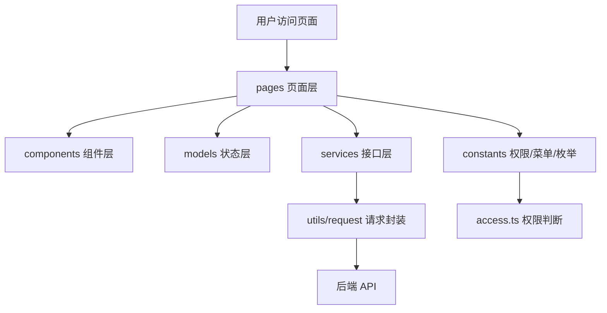
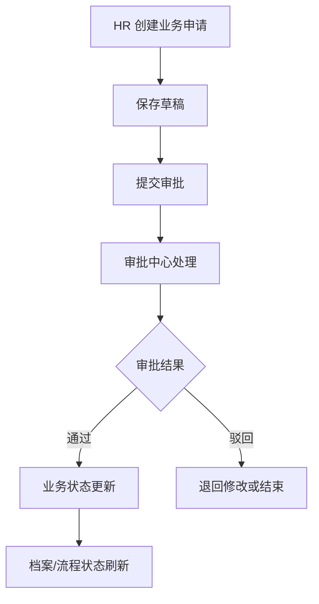

# HRMS 项目前端总系分

| 文档版本 | 日期 | 说明 |
| --- | --- | --- |
| v1.0 | 2026-07-10 | 整合 8 个业务模块前端系分，剥离审批中心与个人中心文档中的后端实现内容 |

---

## 1. 文档说明

本文档用于整合 HRMS 人资管理系统 8 个业务模块的前端系统分析与设计内容，作为前端整体开发、联调、汇报和评审依据。

整合来源包括：

| 来源文档 | 覆盖模块 | 处理说明 |
| --- | --- | --- |
| HRMS-权限体系与组织架构管理-前端系分.md | 权限体系、组织架构 | 保留前端页面、交互、接口、权限与排期 |
| HRMS（4）-员工档案与入转调离流程-前端系分文档.md | 员工档案、入转调离 | 保留前端页面、表单、流程、权限与接口依赖 |
| 考勤与薪资模块前端系分.md | 考勤管理、薪资管理 | 保留前端页面、看板、薪资安全、埋点与风险 |
| module7_审批中心系分.md | 审批中心 | 原文为前后端混合文档，本总系分仅保留前端详细设计、接口依赖、权限与监控 |
| module8_个人中心系分.md | 个人中心 | 原文为前后端混合文档，本总系分仅保留前端详细设计、接口依赖、权限与监控 |

不纳入本文档主体的内容：

- 数据库表结构、索引、SQL 建表语句。
- 后端领域模型、Service、Controller、流程引擎类设计。
- 后端事务、乐观锁、定时任务、消息通知等实现细节。
- 后端独立发布、数据库脚本执行等非前端交付项。

---

## 2. 项目前端总览

HRMS 前端是人资管理系统的统一交互入口，负责页面展示、业务操作、权限菜单、接口调用、表单校验、状态反馈和角色差异化视图。

项目按照 8 个核心业务模块进行前端拆分：

| 序号 | 模块 | 前端页面目录 | 前端接口目录 | 主要用户 |
| --- | --- | --- | --- | --- |
| 1 | 权限体系 auth | `src/pages/system`、`src/pages/login` | `src/services/auth` | 系统管理员 |
| 2 | 组织架构 organization | `src/pages/system` | `src/services/organization` | 系统管理员、HR |
| 3 | 员工档案 employee | `src/pages/employee` | `src/services/employee` | 系统管理员、HR、部门主管 |
| 4 | 入转调离 personnel | `src/pages/process` | `src/services/process` | 系统管理员、HR、部门主管 |
| 5 | 考勤管理 attendance | `src/pages/attendance` | `src/services/attendance` | 系统管理员、HR、部门主管、员工 |
| 6 | 薪资管理 salary | `src/pages/salary` | `src/services/salary` | 系统管理员、HR、财务、员工 |
| 7 | 审批中心 approval | `src/pages/approval` | `src/services/approval` | 系统管理员、HR、部门主管、财务 |
| 8 | 个人中心 mycenter/profile | `src/pages/profile` | `src/services/profile` | 全部登录用户，重点面向普通员工 |

前端整体设计目标：

- 按业务模块拆分页面，保持前后端模块边界一致。
- 按角色权限控制菜单、页面、按钮和字段展示。
- 统一接口调用、错误处理、分页结构和返回体处理。
- 使用 Ant Design 与 Pro Components 提升后台页面开发效率。
- 对列表、详情、表单、审批、图表等高频后台场景形成一致交互。

---

## 3. 前端技术栈与工程约定

| 类型 | 技术选型 | 说明 |
| --- | --- | --- |
| 前端框架 | React 18 | 页面组件开发 |
| 开发语言 | TypeScript 5 | 类型约束、接口类型、枚举定义 |
| 企业级框架 | Umi Max 4.6 | 路由、权限、状态、构建、请求等工程能力 |
| UI 组件库 | Ant Design 5.4 | 表格、表单、弹窗、菜单、步骤条、日历等基础组件 |
| 高级后台组件 | @ant-design/pro-components 2.4 | ProTable、ProForm、ProDescriptions 等后台复杂组件 |
| 图标库 | @ant-design/icons 5.0 | 菜单、按钮、状态图标 |
| 请求库 | axios / Umi request | 接口调用、拦截器、错误处理 |
| 图表 | AntV G2 / 业务图表封装 | 考勤看板、薪资趋势、薪资构成等可视化 |
| E2E 测试 | Playwright | 登录、菜单、审批、核心业务流程验收 |
| 包管理器 | pnpm 11.10.0 | 依赖管理 |
| 运行环境 | Node.js 24.18.0 | 本地开发与构建 |

统一约定：

- 页面代码放在 `src/pages`。
- 接口封装放在 `src/services`，页面禁止直接写 `fetch` 或裸 `axios`。
- 跨页面共享状态放在 `src/models`。
- 类型定义放在 `src/types`。
- 菜单、权限、首页统计卡片、枚举放在 `src/constants`。
- 请求拦截、Token 注入、错误码处理放在 `src/utils/request`。

---

## 4. 前端总体架构

### 4.1 目录职责

| 目录/文件 | 职责 |
| --- | --- |
| `src/pages` | 页面入口，按业务模块组织路由页面 |
| `src/services` | 后端 API 调用封装 |
| `src/models` | Umi Model，全局或模块级状态管理 |
| `src/constants` | 菜单、权限、枚举、首页卡片等配置 |
| `src/types` | TypeScript 类型定义，包括返回体、用户、菜单、业务类型 |
| `src/utils` | 通用工具函数 |
| `src/utils/request` | 请求实例、Token 注入、响应拦截、错误处理 |
| `src/access.ts` | 页面和菜单权限规则 |
| `src/app.ts` | Umi 运行时配置、initialState、布局与登录态初始化 |
| `mock` | Mock 数据，支持前端独立开发阶段 |
| `e2e` | 端到端验收测试 |

### 4.2 前端分层

---

## 5. 角色与权限设计

### 5.1 角色定义

| 角色 | 数据范围 | 核心职责 |
| --- | --- | --- |
| 系统管理员 | 全平台 | 系统配置、用户角色菜单、全部业务兜底管理 |
| HR 专员 | 全部员工 | 员工管理、入转调离、考勤管理、薪资核算、审批处理 |
| 部门主管 | 本部门及下属 | 本部门员工查看、调岗或流程审批、考勤审批 |
| 财务专员 | 薪资相关 | 薪资审核、薪资批次审批、成本报表 |
| 普通员工 | 仅本人 | 个人档案、打卡、请假、工资条、申请进度 |

### 5.2 菜单可见性

| 菜单 | 系统管理员 | HR | 部门主管 | 财务 | 普通员工 |
| --- | :---: | :---: | :---: | :---: | :---: |
| 首页 | 可见 | 可见 | 可见 | 可见 | 可见 |
| 系统管理 | 可见 | 不可见 | 不可见 | 不可见 | 不可见 |
| 员工档案 | 可见 | 可见 | 本部门可见 | 不可见 | 不可见 |
| 入转调离 | 可见 | 可见 | 部分可见 | 不可见 | 不可见 |
| 考勤管理 | 可见 | 可见 | 本部门可见 | 不可见 | 个人中心入口 |
| 薪资管理 | 可见 | 可见 | 不可见 | 可见 | 个人中心入口 |
| 审批中心 | 可见 | 可见 | 可见 | 可见 | 个人中心入口 |
| 个人中心 | 可见 | 可见 | 可见 | 可见 | 可见 |

### 5.3 前端权限实现

- 登录成功后，前端保存 Token，并获取当前用户信息和权限列表。
- `app.ts` 将用户信息写入 Umi `initialState`。
- `access.ts` 根据权限列表生成菜单和路由访问规则。
- `.umirc.ts` 路由配置通过 `access` 字段控制页面访问。
- 页面内按钮、字段、操作入口根据权限码和字段权限接口动态渲染。

---

## 6. 模块一：权限体系 auth

### 6.1 模块目标

权限体系负责登录认证、用户管理、角色管理、菜单管理，是 HRMS 前端权限控制和菜单控制的基础。

### 6.2 页面范围

| 页面 | 路由 | 主要功能 |
| --- | --- | --- |
| 登录页 | `/login` | 用户名密码登录、开发阶段角色选择、Token 保存、跳转首页 |
| 用户列表页 | `/system/user` | 用户查询、新增、编辑、删除、状态展示、角色展示 |
| 用户表单页 | `/system/user/create`、`/system/user/:id/edit` | 用户基本信息、状态、角色分配 |
| 角色列表页 | `/system/role` | 角色查询、角色编辑、权限分配 |
| 菜单管理页 | `/system/menu` | 菜单树展示、目录/菜单/按钮权限维护 |

### 6.3 关键交互

- 登录页校验用户名和密码，登录成功后写入 Token 和用户权限。
- 用户管理使用 ProTable 支持搜索、分页、编辑和删除二次确认。
- 角色权限分配使用菜单树勾选方式，支持回显已分配菜单。
- 菜单管理使用树形表格维护菜单层级、路由和权限标识。

### 6.4 接口依赖

| 接口 | 用途 |
| --- | --- |
| `POST /auth/login` | 登录认证 |
| `GET /auth/current-user` | 获取当前用户与权限 |
| `GET /users` | 用户列表 |
| `POST /users` | 创建用户 |
| `PUT /users/{id}` | 更新用户 |
| `DELETE /users/{id}` | 删除用户 |
| `GET /roles` | 角色列表 |
| `POST /roles/{roleId}/menus` | 分配角色菜单 |
| `GET /menus/tree` | 菜单树 |

---

## 7. 模块二：组织架构 organization

### 7.1 模块目标

组织架构负责部门、职位和字典等基础主数据维护，为员工档案、考勤、薪资、审批等模块提供基础选项和组织范围。

### 7.2 页面范围

| 页面 | 路由 | 主要功能 |
| --- | --- | --- |
| 部门管理页 | `/system/dept` | 部门树形展示、新增、编辑、删除、负责人配置 |
| 职位管理页 | `/system/post` | 职位列表、搜索、新增、编辑、删除 |
| 字典管理页 | `/system/dict` | 左侧字典类型、右侧字典数据维护 |

### 7.3 公共组件

| 组件 | 用途 |
| --- | --- |
| `DeptTreeSelect` | 部门树选择，供员工、调岗、考勤、薪资等模块复用 |
| `DictSelect` | 按字典类型展示下拉选项，供性别、员工状态、职位、请假类型等场景复用 |

### 7.4 接口依赖

| 接口 | 用途 |
| --- | --- |
| `GET /departments/tree` | 部门树 |
| `POST /departments` | 新增部门 |
| `PUT /departments/{id}` | 更新部门 |
| `DELETE /departments/{id}` | 删除部门 |
| `GET /posts` | 职位列表 |
| `POST /posts` | 新增职位 |
| `PUT /posts/{id}` | 更新职位 |
| `DELETE /posts/{id}` | 删除职位 |
| `GET /dict-types` | 字典类型 |
| `GET /dict-data/type/{typeCode}` | 按类型查询字典数据 |

---

## 8. 模块三：员工档案 employee

### 8.1 模块目标

员工档案是 HRMS 的核心主数据模块，负责员工基础信息、个人信息、工作信息、合同薪资信息、调岗记录等前端展示和维护。

### 8.2 页面范围

| 页面 | 路由 | 主要功能 |
| --- | --- | --- |
| 员工列表页 | `/employee/list` | 高级搜索、分页、状态标签、查看、编辑、调岗、离职 |
| 员工详情页 | `/employee/detail/:id` | 分组展示基础信息、个人信息、工作信息、合同薪资信息 |
| 员工编辑/创建页 | `/employee/:id/edit`、创建入口 | 复杂表单、字段权限、保存校验 |
| 合同管理页 | `/employee/contract` | 合同列表、合同状态、合同信息维护 |

### 8.3 前端规则

- 员工列表默认分页，每页 20 条。
- 支持按关键词、部门、职位、在职状态、职级、入职日期筛选。
- 手机号、身份证号、银行账号、薪资信息等敏感字段根据字段权限决定完整展示或脱敏展示。
- 编辑页通过字段权限接口控制字段可编辑、只读或提示走流程。
- 调岗、离职操作根据员工状态和角色权限展示。

### 8.4 接口依赖

| 接口 | 用途 |
| --- | --- |
| `GET /employees` | 员工分页列表 |
| `GET /employees/{id}` | 员工详情 |
| `POST /employees` | 新增员工 |
| `PUT /employees/{id}` | 更新员工 |
| `GET /employees/brief/{id}` | 员工简要信息 |
| `GET /permissions/field` | 字段权限 |
| `GET /departments/tree` | 部门筛选与部门选择 |

---

## 9. 模块四：入转调离 personnel

### 9.1 模块目标

入转调离模块覆盖员工从入职、转正、调岗到离职的全生命周期流程，前端负责申请录入、流程状态展示、审批入口跳转和业务确认操作。

### 9.2 页面范围

| 页面 | 路由 | 主要功能 |
| --- | --- | --- |
| 入职申请列表页 | `/process/entry` | 候选人列表、草稿、提交审批、确认入职 |
| 入职申请表单页 | `/process/entry/create` | 候选人信息、入职部门、职位、试用期、汇报人 |
| 转正管理列表页 | `/process/regular` | 待转正、已评估、发起转正 |
| 转正评估表单页 | `/process/regular/:id/apply` | 评估意见、转正/延长试用/辞退、薪资调整 |
| 调岗申请列表页 | `/process/transfer` | 调岗申请查询、状态展示 |
| 调岗申请表单页 | `/process/transfer/create` | 原部门职位、新部门职位、生效日期、调岗原因 |
| 离职申请列表页 | `/process/leave` | 离职申请查询、状态展示 |
| 离职申请表单页 | `/process/leave/create` | 离职类型、离职日期、交接人、原因说明 |

### 9.3 前端流程

### 9.4 接口依赖

| 接口 | 用途 |
| --- | --- |
| `GET /entry-applications` | 入职申请列表 |
| `POST /entry-applications` | 创建入职申请 |
| `PUT /entry-applications/{id}` | 更新入职申请 |
| `POST /entry-applications/{id}/submit` | 提交入职审批 |
| `POST /entry-applications/{id}/confirm` | 确认入职 |
| `GET /regular-applications` | 转正列表 |
| `POST /regular-applications/{id}/apply` | 发起转正 |
| `GET /transfer-applications` | 调岗申请列表 |
| `POST /transfer-applications` | 创建调岗申请 |
| `GET /leave-applications` | 离职申请列表 |
| `POST /leave-applications` | 创建离职申请 |

---

## 10. 模块五：考勤管理 attendance

### 10.1 模块目标

考勤管理模块面向员工、部门主管和 HR，覆盖考勤组维护、网页打卡、个人考勤、补卡申请、请假申请、考勤记录查询、统计看板等前端场景。

### 10.2 页面范围

| 页面 | 建议路由 | 主要功能 |
| --- | --- | --- |
| 考勤组列表页 | `/attendance/groups` | 考勤组查询、新增、编辑、启停、删除 |
| 考勤组表单页 | `/attendance/groups/new`、`/attendance/groups/:id/edit` | 班次、打卡范围、补卡限制、成员范围 |
| 工作日配置页 | `/attendance/groups/:id/calendar` | 月份日历、工作日/休息日/节假日配置 |
| 员工打卡页 | `/attendance/clock` | 当前时间、定位状态、上班/下班打卡 |
| 个人考勤日历页 | `/attendance/my-calendar` | 月视图、每日状态、缺卡补卡入口 |
| 补卡申请与记录页 | `/attendance/corrections` | 补卡提交、补卡记录、审批状态 |
| 请假申请与记录页 | `/attendance/leaves` | 请假申请、余额展示、附件上传、撤回 |
| 考勤记录管理页 | `/attendance/record` | HR/主管按权限查询考勤记录 |
| 统计与可视化看板页 | `/attendance/summary` | 个人/部门月度统计、异常汇总、图表展示 |

### 10.3 前端规则

- 员工打卡前尝试获取浏览器定位，定位失败时提示但不直接阻断。
- 考勤日历按状态映射颜色：正常、迟到、早退、缺卡、旷工、请假、休息日。
- 请假表单根据请假类型动态控制附件是否必填。
- 补卡和请假提交后进入审批流程，前端展示审批状态。
- 管理端查询由后端处理数据范围，前端只负责角色入口和查询条件。

### 10.4 接口依赖

| 接口 | 用途 |
| --- | --- |
| `GET /api/v1/attendance/groups` | 考勤组列表 |
| `POST /api/v1/attendance/groups` | 创建考勤组 |
| `PUT /api/v1/attendance/groups/{id}` | 更新考勤组 |
| `PATCH /api/v1/attendance/groups/{id}/status` | 启停考勤组 |
| `PUT /api/v1/attendance/groups/{id}/calendar` | 保存工作日配置 |
| `POST /api/v1/attendance/clock` | 打卡 |
| `GET /api/v1/attendance/records/my-calendar` | 个人考勤日历 |
| `POST /api/v1/attendance/corrections` | 提交补卡 |
| `GET /api/v1/attendance/corrections` | 补卡记录 |
| `POST /api/v1/leaves` | 提交请假 |
| `GET /api/v1/leaves` | 请假记录 |
| `PATCH /api/v1/leaves/{id}/withdraw` | 撤回请假 |
| `GET /api/v1/leaves/balances` | 假期余额 |

---

## 11. 模块六：薪资管理 salary

### 11.1 模块目标

薪资管理模块覆盖薪资账套、员工薪资档案、薪资批次、核算预览、异常处理、审批提交、工资条和薪资看板。前端重点保障涉薪数据安全、状态流转清晰、金额展示准确。

### 11.2 页面范围

| 页面 | 建议路由 | 主要功能 |
| --- | --- | --- |
| 薪资账套列表页 | `/salary/templates` | 薪资模板查询、新增、编辑、启停、删除 |
| 薪资账套表单与工资项目页 | `/salary/templates/new`、`/salary/templates/:id/edit` | 工资项目、适用范围、计算项配置 |
| 员工薪资档案页 | `/salary/employee-profiles` | 员工涉薪档案、调薪历史、权限脱敏 |
| 薪资批次列表页 | `/salary/batches` | 批次创建、触发核算、提交审批、确认发放 |
| 薪资批次详情与预览页 | `/salary/batches/:id` | 批次摘要、员工级薪资预览、异常汇总 |
| 薪资异常处理页 | `/salary/batches/:id/exceptions` | 黄色/红色/阻断异常处理 |
| 薪资可视化看板页 | `/salary/dashboard` | 薪资趋势、部门分布、构成占比、异常统计 |
| 我的工资条页 | `/salary/my-payslip` | 二次验证、工资条详情、近 6 月趋势 |
| 工资条查看日志页 | `/salary/payslip-logs` | HR/审计查询工资条查看日志 |

### 11.3 前端规则

- 涉薪金额统一格式化，保留 2 位小数。
- 涉薪字段按权限脱敏，普通员工只能查看本人已开放工资条。
- 工资条详情需二次验证，验证通过后再加载明细。
- 工资条明细不写入本地持久化存储，离开页面清理敏感状态。
- 薪资批次存在阻断异常时，提交审批按钮禁用。
- 薪资批次计算、提交审批、确认发放等关键操作必须 loading、防重复提交、二次确认。

### 11.4 接口依赖

| 接口 | 用途 |
| --- | --- |
| `GET /api/v1/salary/templates` | 薪资账套列表 |
| `POST /api/v1/salary/templates` | 创建薪资账套 |
| `PUT /api/v1/salary/templates/{id}` | 更新薪资账套 |
| `GET /api/v1/salary/employee-profiles` | 员工薪资档案 |
| `POST /api/v1/salary/batches` | 创建薪资批次 |
| `GET /api/v1/salary/batches` | 薪资批次列表 |
| `POST /api/v1/salary/batches/{id}/calculate` | 触发薪资核算 |
| `GET /api/v1/salary/batches/{id}/preview` | 薪资预览 |
| `GET /api/v1/salary/batches/{id}/exceptions` | 薪资异常 |
| `PATCH /api/v1/salary/exceptions/{id}/resolve` | 处理异常 |
| `POST /api/v1/salary/batches/{id}/submit` | 提交财务审批 |
| `PATCH /api/v1/salary/batches/{id}/pay` | 确认发放 |
| `POST /api/v1/salary/payslips/{month}/verify` | 工资条二次验证 |
| `GET /api/v1/salary/payslips/{month}` | 查看工资条 |
| `GET /api/v1/salary/batches/{id}/visualization` | 薪资可视化 |

---

## 12. 模块七：审批中心 approval

### 12.1 模块目标

审批中心是所有流程类业务的统一前端入口，集中展示待审批、已审批、我发起的申请，并提供审批详情、审批操作和委托审批能力。

说明：原审批中心系分包含后端数据库、审批流程引擎、委托关系、并发安全等设计。本文档仅保留前端视角，即页面、交互、状态、权限、接口依赖和联调边界。

### 12.2 页面范围

| 页面 | 建议路由 | 主要功能 |
| --- | --- | --- |
| 审批工作台 | `/approval/workspace` 或 `/approval/pending` | 待审批、已审批、我发起的三个 Tab |
| 审批详情页 | `/approval/detail?id={id}` 或 `/approval/detail/:id` | 申请内容、审批进度、审批历史、审批操作 |
| 委托审批设置页 | `/approval/delegation` | 当前委托、新建委托、取消委托 |

### 12.3 审批工作台设计

- 默认展示待审批 Tab，数字角标显示待办数量。
- 搜索区包含业务类型下拉、关键词输入、查询、重置。
- 待审批列表显示申请标题、申请人、业务类型、申请时间、截止时间。
- 截止时间小于 24 小时标黄，小于 6 小时标红。
- 点击列表行进入审批详情页。
- 支持空状态、加载态、错误态和重试。
- Tab 切换时保留筛选条件、分页和滚动位置。

### 12.4 审批详情页设计

页面从上到下分为：

1. 基础信息区：标题、业务类型、状态、申请人、申请时间。
2. 申请内容区：根据 `businessType` 动态渲染业务字段。
3. 审批进度区：使用 Steps 展示已完成、当前、待处理节点。
4. 审批历史区：使用 Timeline 展示处理人、节点、意见和时间。
5. 审批操作区：仅当前审批人且节点待处理时展示。

审批操作：

| 操作 | 前端规则 |
| --- | --- |
| 通过 | 可填写意见，提交后刷新详情和列表 |
| 拒绝 | 审批意见必填，输入框校验提示 |
| 转交 | 弹出选择用户弹窗，选择目标审批人后提交 |

### 12.5 委托审批设计

- 页面初始化加载我的委托记录。
- 新建委托需选择被委托人、生效时间、结束时间和委托原因。
- 前端校验结束时间必须晚于开始时间，且不能选择过去时间。
- 取消委托需二次确认。
- 操作成功后刷新委托列表。

### 12.6 接口依赖

| 接口 | 用途 |
| --- | --- |
| `GET /api/v1/approval/tasks/pending` | 待审批列表 |
| `GET /api/v1/approval/tasks/history` | 已审批列表 |
| `GET /api/v1/approval/my-applications` | 我发起的申请 |
| `GET /api/v1/approval/{id}` | 审批详情 |
| `POST /api/v1/approval/{id}/operate` | 审批操作：通过、拒绝、转交 |
| `POST /api/v1/approval/{id}/withdraw` | 撤回申请 |
| `POST /api/v1/approval/delegation` | 新建委托 |
| `PUT /api/v1/approval/delegation/{id}/cancel` | 取消委托 |
| `GET /api/v1/approval/delegation/my` | 我的委托 |

---

## 13. 模块八：个人中心 mycenter/profile

### 13.1 模块目标

个人中心是面向所有登录用户，尤其是普通员工的一站式自助入口。前端提供我的档案、我的考勤、我的请假、我的薪资、账号安全等页面，使员工能够自助查看和发起个人相关业务。

说明：原个人中心系分包含数据库表、脱敏后端实现、假期余额计算、数据权限拦截等后端设计。本文档仅保留前端页面、交互、权限、接口依赖和安全展示规则。

### 13.2 页面范围

| 页面 | 路由 | 主要功能 |
| --- | --- | --- |
| 个人中心首页 | `/profile` 或 `/profile/index` | 个人信息摘要、快捷入口、待办提醒 |
| 我的档案 | `/profile/archive` | 档案查看、字段脱敏、可编辑字段维护 |
| 我的考勤 | `/profile/attendance` | 考勤日历、打卡状态、补卡申请、月统计 |
| 我的请假 | `/profile/leave` | 请假记录、提交请假、余额展示、取消申请 |
| 我的薪资 | `/profile/salary` | 工资条列表、二次验证、工资条详情、薪资趋势 |
| 账号安全 | `/profile/security` | 修改密码、手机绑定/解绑、登录日志 |

### 13.3 个人中心首页

- 展示员工姓名、部门、职位、头像或默认头像。
- 展示我的档案、我的考勤、我的请假、我的薪资、账号安全快捷入口。
- 普通员工的核心业务入口集中在个人中心。
- 根据权限决定入口是否显示，例如薪资入口可见但详情需二次验证。

### 13.4 我的档案

- 分组展示基本信息、个人信息、工作信息、紧急联系人。
- 身份证号、银行卡号、薪资等敏感字段按后端返回结果展示，不在前端自行还原。
- `editableFields` 中的字段显示编辑按钮。
- `flowRequiredFields` 中的字段显示“如需修改请联系 HR/走流程”提示。
- 保存时只提交可编辑字段。

### 13.5 我的考勤

- 月视图日历展示每日考勤状态。
- 使用不同颜色标识正常、迟到、早退、缺卡、请假、休息日。
- 打卡按钮根据当天状态置灰或高亮。
- 缺卡日期提供补卡申请入口。
- 月度统计以卡片展示出勤、迟到、早退、缺卡、请假等数据。

### 13.6 我的请假

- 顶部展示年假、调休等假期余额。
- 支持全部、审批中、已通过、已拒绝等状态 Tab。
- 新建请假表单包含请假类型、开始时间、结束时间、事由、附件、工作交接人。
- 请假天数根据起止时间自动计算。
- 病假、婚假、产假等类型可动态要求上传附件。
- 审批中的申请可取消，取消需二次确认。

### 13.7 我的薪资

- 展示近 6 个月实发工资趋势。
- 工资条列表按月份分页。
- 点击查看工资条时，如果未完成二次验证，则弹出密码或短信验证码验证弹窗。
- 验证通过后展示工资条详情，包括收入项、扣除项、应发、应扣、实发。
- 工资条明细不做本地持久化缓存。

### 13.8 账号安全

- 修改密码弹窗需校验旧密码、新密码、确认密码。
- 新密码需满足复杂度要求，例如 8 位以上、包含大小写字母和数字。
- 绑定手机支持短信验证码倒计时。
- 登录日志按时间倒序分页展示。

### 13.9 接口依赖

| 接口 | 用途 |
| --- | --- |
| `GET /api/v1/profile` | 获取我的档案 |
| `PUT /api/v1/profile` | 更新我的档案 |
| `GET /api/v1/attendance/calendar` | 我的考勤日历 |
| `POST /api/v1/attendance/clock-in` | 打卡 |
| `POST /api/v1/attendance/makeup` | 申请补卡 |
| `GET /api/v1/attendance/makeup/list` | 补卡记录 |
| `GET /api/v1/attendance/statistics` | 考勤统计 |
| `POST /api/v1/leave` | 提交请假 |
| `GET /api/v1/leave/list` | 请假记录 |
| `POST /api/v1/leave/{id}/cancel` | 取消请假 |
| `GET /api/v1/leave/balance` | 假期余额 |
| `GET /api/v1/salary/payslips` | 工资条列表 |
| `POST /api/v1/salary/payslip/verify` | 工资条二次验证 |
| `GET /api/v1/salary/payslip/{id}` | 工资条详情 |
| `GET /api/v1/salary/trend` | 薪资趋势 |
| `PUT /api/v1/account/password` | 修改密码 |
| `POST /api/v1/account/phone/bind` | 绑定手机 |
| `POST /api/v1/account/phone/unbind` | 解绑手机 |
| `GET /api/v1/account/login-logs` | 登录日志 |

---

## 14. 首页工作台设计

首页作为登录后的统一入口，根据不同角色展示不同统计卡片和待办区域。

| 角色 | 首页重点展示 |
| --- | --- |
| 系统管理员 | 员工总数、本月入职、待审批、本月薪资、系统概览 |
| HR | 员工总数、本月入职、待审批、考勤异常、薪资批次 |
| 部门主管 | 本部门人数、本部门考勤、本部门待审批 |
| 财务 | 本月薪资总额、待审核薪资批次、薪资异常 |
| 普通员工 | 本月出勤、年假余额、我的申请进度、工资条入口 |

前端实现：

- 首页统计卡片配置放在 `src/constants/home.ts`。
- 待办列表调用审批中心相关接口。
- 普通员工首页更偏个人工作台，管理角色首页更偏管理看板。

---

## 15. 公共前端能力

### 15.1 通用组件

| 组件 | 用途 |
| --- | --- |
| 部门树选择器 | 部门筛选、部门选择、组织范围选择 |
| 字典下拉框 | 性别、职位、员工状态、请假类型、审批状态等 |
| 状态标签 | 员工状态、审批状态、薪资批次状态、考勤状态 |
| 审批时间线 | 审批详情页展示节点历史 |
| 金额展示组件 | 薪资金额格式化和脱敏展示 |
| 页面空状态 | 列表无数据、图表无数据统一展示 |
| 错误重试组件 | 接口失败时统一展示重试入口 |

### 15.2 请求封装

- 请求头统一注入 Token。
- 后端统一返回体按 `Result<T>` 处理。
- 分页接口统一处理 `records`、`total`、`pageNum`、`pageSize`。
- `401xx` 错误跳转登录页。
- `403xx` 或无权限错误跳转 403 页或展示无权限提示。
- 业务错误直接展示后端 message。

### 15.3 状态管理

- 登录用户、权限、菜单放在全局初始状态。
- 列表筛选、分页、Tab 状态可在模块 model 或页面状态中维护。
- 审批列表、工资条验证态等跨页面状态可放入模块 model。
- 敏感数据不写入 localStorage。

---

## 16. 监控和埋点

### 16.1 性能监控

| 场景 | 阈值建议 |
| --- | --- |
| 登录接口响应 | 2s 内 |
| 列表页首屏加载 | 1.5s 内 |
| 员工详情/审批详情加载 | 2s 内 |
| 审批操作提交 | 2s 内 |
| 打卡操作 | 1s 内 |
| 工资条二次验证 | 2s 内 |
| 图表加载 | 2s 内 |

### 16.2 业务埋点

| 模块 | 埋点事件 |
| --- | --- |
| 登录 | 登录成功、登录失败 |
| 权限体系 | 用户创建、用户编辑、角色权限分配 |
| 组织架构 | 部门创建、部门删除、职位创建、字典维护 |
| 员工档案 | 员工列表访问、员工详情访问、员工编辑 |
| 入转调离 | 创建入职、确认入职、发起转正、创建调岗、创建离职 |
| 考勤 | 打卡、补卡申请、请假提交、请假撤回 |
| 薪资 | 创建薪资批次、触发核算、处理异常、工资条验证、工资条查看 |
| 审批中心 | Tab 切换、审批通过、审批拒绝、审批转交、委托创建 |
| 个人中心 | 档案编辑、请假提交、工资条查看、修改密码 |

---

## 17. 非功能性要求

| 维度 | 前端要求 |
| --- | --- |
| 可用性 | 所有列表和详情页覆盖加载态、空态、错误态 |
| 安全性 | Token 统一管理，涉薪和敏感数据不持久化 |
| 权限 | 菜单、页面、按钮、字段均需按权限控制 |
| 一致性 | 表单、表格、弹窗、状态标签采用统一设计规范 |
| 防重复提交 | 审批、打卡、薪资批次、确认发放等关键操作需 loading 和禁用 |
| 可维护性 | 页面按模块拆分，接口放 services，类型放 types |
| 兼容性 | 支持 Chrome、Edge、Firefox 最新两个大版本 |

---

## 18. 前端工作量汇总

| 模块 | 主要页面/功能 | 前端开发估算 |
| --- | --- | --- |
| 权限体系 | 登录、用户、角色、菜单 | 约 6 天 |
| 组织架构 | 部门、职位、字典、公共选择器 | 约 5 天 |
| 员工档案 | 列表、详情、编辑、合同 | 约 6.5 天 |
| 入转调离 | 入职、转正、调岗、离职 | 约 7.5 天 |
| 考勤管理 | 考勤组、打卡、日历、补卡、请假、统计 | 约 10 天 |
| 薪资管理 | 账套、档案、批次、异常、工资条、看板 | 约 13.5 天 |
| 审批中心 | 工作台、详情、委托 | 约 5 天 |
| 个人中心 | 档案、考勤、请假、薪资、安全 | 约 8.5 天 |
| 公共能力 | 请求、权限、状态标签、字典、E2E | 约 4 天 |

说明：以上为前端开发粗估，不包含后端开发、数据库脚本、环境部署时间。具体排期需结合并行开发人数和接口就绪情况调整。

---

## 19. 联调边界

### 19.1 前端负责

- 页面布局、表单、列表、图表、弹窗和交互状态。
- 路由配置、菜单显示、前端权限判断。
- 接口调用封装、请求参数组装、响应数据渲染。
- 基础表单校验、二次确认、防重复提交。
- 加载态、空态、错误态、无权限态。
- 前端埋点、前端异常监控。

### 19.2 后端依赖

- 登录、当前用户、菜单权限、字段权限接口。
- 各业务模块的列表、详情、创建、更新、删除接口。
- 审批流转、业务状态变更、数据权限过滤。
- 敏感字段脱敏、薪资二次验证、数据越权校验。
- 统一错误码和统一返回体。

### 19.3 需重点确认

| 问题 | 涉及模块 |
| --- | --- |
| 权限码是否完全按前端文档和菜单初始化数据返回 | 全部 |
| 字段权限接口返回结构是否稳定 | 员工档案、个人中心 |
| 审批详情中的 `businessType` 和 `formData` 是否可支持动态渲染 | 审批中心、入转调离、考勤、薪资 |
| 请假、补卡、薪资批次是否由业务接口自动触发审批 | 考勤、薪资、审批 |
| 工资条二次验证状态由前端会话保存还是后端会话判断 | 薪资、个人中心 |
| 普通员工入口是统一走个人中心，还是保留考勤/薪资独立菜单 | 考勤、薪资、个人中心 |

---

## 20. 风险与应对

| 风险 | 影响 | 前端应对 |
| --- | --- | --- |
| 接口路径和模块文档不一致 | 联调阻塞 | 在 services 层统一适配，联调前确认接口清单 |
| 权限码不统一 | 菜单或按钮显示异常 | 以总权限矩阵为准，前后端维护同一份权限码清单 |
| 审批 `formData` 字段不稳定 | 审批详情动态渲染困难 | 建立业务类型到字段配置的前端映射 |
| 涉薪数据泄露 | 严重安全风险 | 不持久化工资条明细，金额脱敏，离开页面清理状态 |
| 列表数据量大 | 页面卡顿 | 分页查询、必要时虚拟滚动、筛选条件服务端处理 |
| 图表数据异常 | 看板展示失败 | 图表错误降级为空状态，不阻断主流程 |
| 重复提交 | 业务状态错乱 | 关键按钮 loading、禁用、二次确认 |

---

## 21. 总结

HRMS 前端总体系分以 8 个业务模块为核心，采用 React、TypeScript、Umi Max、Ant Design 的企业后台技术栈，按照页面、接口、状态、类型、常量、工具函数进行分层。

前端整体设计重点是：

- 模块边界清晰：每个业务模块都有对应的页面目录和接口目录。
- 权限控制完整：覆盖菜单、页面、按钮和字段。
- 业务流程闭环：入转调离、考勤、薪资等流程最终统一进入审批中心。
- 员工自助完善：普通员工通过个人中心完成档案、考勤、请假、薪资、安全相关操作。
- 安全和稳定优先：涉薪、敏感字段、审批操作、打卡操作均有明确的前端安全和交互约束。

本文档可作为前端汇报、系分评审、开发拆分、联调确认和测试验收的统一依据。
