# 智愈先锋 C 端 H5 前端系统分析与设计

| 项目 | 内容 |
| --- | --- |
| 文档版本 | V1.1 |
| 编写日期 | 2026-07-30 |
| 适用端 | C 端 H5 患者应用 |
| 关联文档 | 产品说明书、C 端后端系分 V1.3、项目结构、前端系统分析模板 |
| 文档范围 | 首页、就诊助手、购药、我的、AI 助手 |

## 1. 文档说明

本文档用于指导智愈先锋 C 端 H5 前端开发、接口联调与演示验收。C 端面向患者和家属，负责页面展示、操作确认、接口调用、状态反馈和脱敏展示。

本文档以后端系分 V1.3 为唯一 REST 接口、字段和状态依据。不包含数据库、事务、Redis、消息消费和 B 端页面实现；Python Agent 通过 MCP Server 调用传统 C 端 API，前端不定义 Agent 专用 REST 接口。

### 1.1 设计原则

+ 四个底部 Tab 支撑首页、就诊助手、购药和我的；AI 助手为全局入口。
+ 所有患者数据按当前 `patientId` 读取或创建；医院资源请求均显式携带当前 `hospitalId`。
+ 创建、取消和模拟支付操作使用 `X-Idempotency-Key` 防重；支付始终由患者在普通支付页手动完成。
+ 手机号、身份证号仅展示后端返回的脱敏值；不得保存密码、Token 明文或完整证件号。
+ C 端接口基础路径为 `/api/c/v1`；时间使用 ISO-8601 东八区格式，金额使用分的整数 `amountCent`。

## 2. 项目前端总览

### 2.1 用户与模块

| 序号 | 模块 | 主页面/入口 | 主要能力 | 对应后端域 |
| --- | --- | --- | --- | --- |
| 1 | 首页 home | `/home` | 医院与就诊人选择、资源查询、导诊、健康待办 | auth、registration、health |
| 2 | 就诊助手 assistant | `/assistant` | 挂号、候补、支付、预问诊、问诊记录 | registration、consultation |
| 3 | 购药 pharmacy | `/pharmacy` | 处方、院内药房、购药订单、物流、支付 | order、health |
| 4 | 我的 mine | `/mine` | 资料、家庭成员、档案、报告、提醒、通知和设置 | auth、health、notification |
| 5 | AI 助手 agent | 全局悬浮球、`/agent` | AI 会话 UI 与传统业务跳转 | MCP Server / Python Agent |

### 2.2 导航

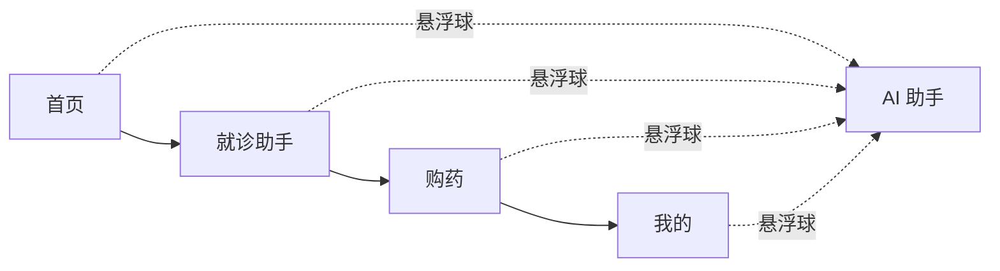

## 3. 前端技术栈与工程约定

| 类型 | 技术选型 | 用途 |
| --- | --- | --- |
| 前端框架 | React 18+、Umi Max 4 | H5 页面、路由和构建 |
| 开发语言 | TypeScript 5+ | API DTO、页面状态和组件类型 |
| 移动组件 | Ant Design Mobile 5+ | TabBar、表单、弹窗、步骤条 |
| 请求层 | Umi Request、TanStack Query | 鉴权、缓存、请求状态和重试 |
| 全局状态 | Zustand | 认证、当前就诊人、当前医院和跨 Tab 状态 |
| 样式 | Less、CSS Modules | 移动端样式隔离 |
| 测试 | Playwright | 认证、挂号、购药和提醒主流程验收 |

### 3.1 工程目录

```text
frontend/
└── C/
    └── user-h5/
        ├── config/
        │   ├── config.ts                 # Umi 运行配置
        │   └── routes.ts                 # 路由配置
        ├── mock/
        │   └── afs2demo/                 # Mock 接口数据
        ├── public/                       # 公共静态资源
        ├── test/                         # 单元测试与 E2E 测试
        ├── docs/                         # 前端开发说明
        ├── .husky/                       # Git Hooks 配置
        ├── .vscode/                      # 编辑器配置
        ├── src/
        │   ├── access.ts                 # 路由访问控制
        │   ├── app.tsx                   # Umi 运行时配置与应用初始化
        │   ├── type.d.ts                 # 全局类型声明
        │   ├── overrides.less            # 全局样式覆盖
        │   ├── assets/                   # 图片、字体等静态资源
        │   ├── components/               # 公共业务组件
        │   │   ├── layout/               # TabBar、页面容器
        │   │   ├── patient/              # 就诊人切换、脱敏资料卡
        │   │   ├── appointment/          # 号源、订单、支付和进度组件
        │   │   ├── pharmacy/             # 处方、药房、物流组件
        │   │   ├── health/               # 报告、提醒、随访组件
        │   │   └── agent/                # AI 悬浮球、会话抽屉组件
        │   ├── constants/                # 路由、业务码、状态和文案常量
        │   ├── hooks/                    # 自定义 Hooks
        │   ├── icons/                    # SVG 图标资源
        │   ├── layouts/                  # 全局布局组件
        │   ├── models/                   # 全局状态模型
        │   │   ├── auth.ts               # 登录状态
        │   │   ├── patient.ts            # 当前就诊人状态
        │   │   ├── hospital.ts           # 当前医院状态
        │   │   └── global.ts             # 全局页面状态
        │   ├── pages/                    # 页面模块
        │   │   ├── login/                # 登录、注册、验证码
        │   │   ├── home/                 # 首页
        │   │   ├── assistant/            # 就诊助手、挂号、问诊
        │   │   ├── pharmacy/             # 购药、药房、订单、物流
        │   │   ├── mine/                 # 我的、档案、报告、通知
        │   │   └── agent/                # AI 助手全屏会话页
        │   ├── services/                 # API 服务层
        │   │   ├── global.ts             # 统一请求封装
        │   │   ├── auth/                 # 认证接口
        │   │   ├── registration/         # 医院、医生、挂号、支付接口
        │   │   ├── consultation/         # 问诊与处方接口
        │   │   ├── pharmacy/             # 药房和购药订单接口
        │   │   ├── health/               # 档案、报告、提醒、随访接口
        │   │   ├── notification/         # 通知接口
        │   │   └── typings.d.ts          # 服务层类型定义
        │   ├── typings/                  # DTO、枚举和页面类型
        │   └── utils/                    # 请求、脱敏、日期、金额等工具
        ├── .editorconfig                 # 编辑器统一格式配置
        ├── .eslintrc.js                  # ESLint 配置
        ├── .prettierrc.js                # Prettier 配置
        ├── .stylelintrc.js               # Stylelint 配置
        ├── README.md                      # 前端项目说明
        ├── package.json                  # 依赖与脚本
        ├── tsconfig.json                 # TypeScript 配置
        └── typings.d.ts                  # Umi 类型声明
```

### 3.2 前端分层

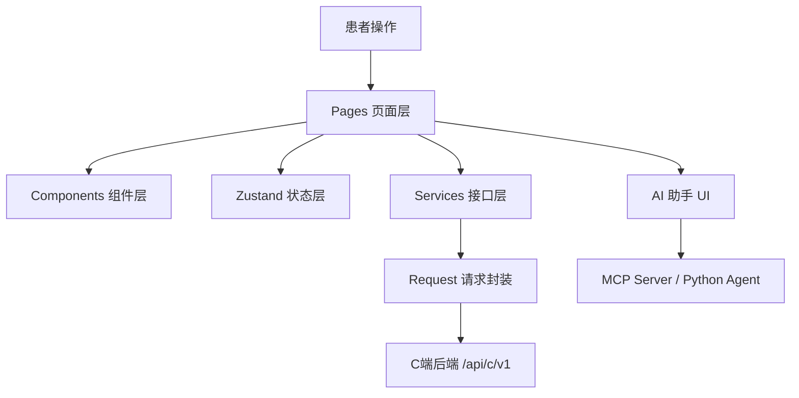

### 3.3 路由设计

```text
/login、/register                         # 登录、注册
/home                                     # 首页 Tab
/assistant、/assistant/appointment/:id   # 就诊助手、挂号详情
/assistant/consultation/:id               # 问诊详情
/pharmacy、/pharmacy/prescription/:id     # 购药、处方与药房
/pharmacy/order/:id、/payments/:paymentId # 订单、普通支付
/mine、/mine/profile、/mine/family-members # 我的、资料、家庭成员
/mine/health-record、/mine/report/:id     # 健康档案、报告
/mine/medication-plans、/mine/follow-ups、/mine/notifications
/agent                                    # AI 助手会话 UI
```

### 3.4 状态管理设计

| Store | 核心状态 | 更新时机 |
| --- | --- | --- |
| `authStore` | 登录用户、访问令牌、刷新令牌、登录态 | 登录、刷新令牌、退出 |
| `patientStore` | 当前 `patientId`、本人、家庭成员、脱敏资料 | 初始化、资料更新、切换就诊人 |
| `hospitalStore` | 当前 `hospitalId`、医院列表 | 进入挂号、切换医院；不持久化 |
| `assistantStore` | 挂号订单、支付单、问诊状态 | 进入就诊助手、订单状态变化 |
| `pharmacyStore` | 处方、院内药房、购药订单 | 选择处方、下单、支付完成 |
| `agentStore` | 悬浮球、抽屉、会话 UI 状态 | 打开或关闭 AI 助手 |

## 4. 全局组件与请求规范

### 4.1 通用组件

| 组件 | 职责 | 使用页面 |
| --- | --- | --- |
| `AppTabBar` | 四项底部导航与当前 Tab 高亮 | 全部 Tab |
| `PatientSwitcher` | 当前就诊人展示与切换 | 首页、就诊助手、我的 |
| `HospitalSwitcher` | 当前医院选择 | 首页、就诊助手 |
| `AppointmentProgress` | 挂号和问诊进度展示 | 就诊助手 |
| `StatusTag` | 订单、支付、问诊和提醒状态映射 | 全部业务页 |
| `AgentFloatingButton` | AI 助手悬浮入口 | 全局 |
| `MedicalDisclaimer` | 医疗建议免责声明 | 导诊、报告、处方、AI 助手 |

### 4.2 请求与认证接口

除本节验证码、注册、登录和刷新接口外，所有接口均携带 `Authorization: Bearer {accessToken}`。响应统一为 `{ code, message, data, traceId }`；成功码为 `00000`。刷新令牌返回 `A0301` 或 `A0230` 时清除登录态并跳转登录。

#### `GET /auth/captcha` - 获取图形验证码
**入参：** 无。

**返回：**
| 字段 | 类型 | 说明 |
| --- | --- | --- |
| `challengeId` | string | 一次性验证码挑战标识 |
| `imageBase64` | string | 图形验证码图片数据 |
| `expireSeconds` | number | 验证码有效秒数 |

#### `POST /auth/register` - 注册 C 端账号
**入参：**
| 字段 | 类型 | 说明 |
| --- | --- | --- |
| `account` | string | 4 至 32 位唯一登录账号 |
| `password` | string | 8 至 64 位登录密码 |
| `challengeId` | string | 获取验证码返回的标识 |
| `captchaCode` | string | 用户输入的图形验证码 |

**返回：**
| 字段 | 类型 | 说明 |
| --- | --- | --- |
| `userId` | number | C 端用户 ID |
| `account` | string | 注册成功的登录账号 |

#### `POST /auth/login` - 账号密码登录
**入参：**
| 字段 | 类型 | 说明 |
| --- | --- | --- |
| `account` | string | C 端登录账号 |
| `password` | string | 登录密码 |

**返回：**
| 字段 | 类型 | 说明 |
| --- | --- | --- |
| `accessToken` | string | C 端访问令牌 |
| `refreshToken` | string | 刷新令牌 |
| `expiresIn` | number | 访问令牌有效秒数 |
| `user.id` | number | 当前用户 ID |
| `user.account` | string | 当前登录账号 |

#### `POST /auth/token/refresh` - 刷新访问令牌
**入参：**
| 字段 | 类型 | 说明 |
| --- | --- | --- |
| `refreshToken` | string | 当前刷新令牌 |

**返回：**
| 字段 | 类型 | 说明 |
| --- | --- | --- |
| `accessToken` | string | 新访问令牌 |
| `refreshToken` | string | 新刷新令牌 |
| `expiresIn` | number | 访问令牌有效秒数 |

#### `POST /auth/logout` - 退出登录
**入参：**
| 字段 | 类型 | 说明 |
| --- | --- | --- |
| `Authorization` | string | 当前 C 端 Bearer Token |
| `refreshToken` | string | 待撤销的刷新令牌 |

**返回：**
| 字段 | 类型 | 说明 |
| --- | --- | --- |
| `loggedOut` | boolean | 是否成功退出 |

## 5. 模块 M1：首页

### 5.1 用例图

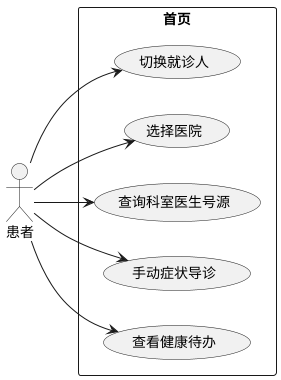

### 5.2 页面范围与界面形态

首页采用“医院品牌区 + 就诊人卡片 + 医院选择 + 搜索/快捷入口 + 健康待办”的纵向信息流。搜索医生、科室和症状分别进入资源查询或手动导诊；当前就诊人切换后刷新待办数据。

### 5.3 首页加载时序

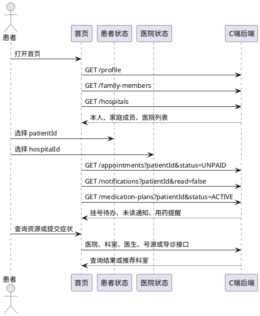

### 5.4 页面状态

| 场景 | 展示规则 | 用户动作 |
| --- | --- | --- |
| 未登录 | 不请求患者业务数据 | 跳转登录页 |
| 无待办 | 展示健康服务引导 | 前往挂号或导诊 |
| 存在 `UNPAID` 挂号 | 顶部展示到期倒计时 | 进入就诊助手支付或取消 |
| 无可约时段 | 展示时段已满状态 | 进入候补登记 |
| 导诊完成 | 展示推荐科室和免责声明 | 进入对应医院科室的医生列表 |
| 网络失败 | 保留已加载内容并展示重试 | 重新加载 |

### 5.5 原型图与接口参数


#### `GET /profile` - 查询本人资料
**入参：**
| 字段 | 类型 | 说明 |
| --- | --- | --- |
| `Authorization` | string | 当前 C 端 Bearer Token |
**返回：**
| 字段 | 类型 | 说明 |
| --- | --- | --- |
| `id` | number | 本人就诊人 ID |
| `name` | string | 姓名 |
| `gender` | string | 性别编码 |
| `birthday` | string | 出生日期 |
| `phone` | string | 脱敏手机号 |
| `emergencyContact` | string | 脱敏紧急联系人信息 |

#### `GET /family-members` - 查询家庭成员
**入参：**
| 字段 | 类型 | 说明 |
| --- | --- | --- |
| `Authorization` | string | 当前 C 端 Bearer Token |
**返回：**
| 字段 | 类型 | 说明 |
| --- | --- | --- |
| `records` | array | 有效家庭成员列表 |
| `records.patientId` | number | 家庭成员就诊人 ID |
| `records.name` | string | 姓名 |
| `records.relation` | string | 家庭关系 |
| `records.phone` | string | 脱敏手机号 |

#### `GET /hospitals` - 查询可用医院
**入参：**
| 字段 | 类型 | 说明 |
| --- | --- | --- |
| `Authorization` | string | 当前 C 端 Bearer Token |
**返回：**
| 字段 | 类型 | 说明 |
| --- | --- | --- |
| `hospitalId` | number | 医院 ID |
| `name` | string | 医院名称 |
| `level` | string | 医院等级 |
| `address` | string | 医院地址 |
| `contact` | string | 联系方式 |

#### `GET /departments` - 查询科室
**入参：**
| 字段 | 类型 | 说明 |
| --- | --- | --- |
| `hospitalId` | number | Query，当前选择医院 ID |
| `keyword` | string | Query，可选科室名称关键词 |
**返回：**
| 字段 | 类型 | 说明 |
| --- | --- | --- |
| `id` | number | 科室 ID |
| `name` | string | 科室名称 |
| `description` | string | 科室说明 |

#### `GET /doctors` - 查询医生
**入参：**
| 字段 | 类型 | 说明 |
| --- | --- | --- |
| `hospitalId` | number | Query，当前选择医院 ID |
| `departmentId` | number | Query，科室 ID |
| `date` | string | Query，可选出诊日期 |
| `pageNo` | number | Query，页码 |
| `pageSize` | number | Query，每页条数 |
**返回：**
| 字段 | 类型 | 说明 |
| --- | --- | --- |
| `pageNo` | number | 当前页码 |
| `pageSize` | number | 每页条数 |
| `total` | number | 总数 |
| `records.id` | number | 医生 ID |
| `records.name` | string | 医生姓名 |
| `records.title` | string | 医生职称 |
| `records.specialty` | string | 专长 |
| `records.registrationFeeCent` | number | 挂号费，单位分 |
| `records.availableCount` | number | 可约号源数 |

#### `GET /doctors/{doctorId}/slots` - 查询可预约时段
**入参：**
| 字段 | 类型 | 说明 |
| --- | --- | --- |
| `doctorId` | number | Path，医生 ID |
| `hospitalId` | number | Query，当前选择医院 ID |
| `date` | string | Query，预约日期 |
**返回：**
| 字段 | 类型 | 说明 |
| --- | --- | --- |
| `slotId` | number | 时段 ID |
| `startTime` | string | 开始时间 |
| `endTime` | string | 结束时间 |
| `feeCent` | number | 挂号费，单位分 |
| `availableCount` | number | 实时可约数量 |
| `scheduleStatus` | string | 排班状态 |

#### `POST /triage/assessments` - 提交症状导诊
**入参：**
| 字段 | 类型 | 说明 |
| --- | --- | --- |
| `X-Idempotency-Key` | string | Header，防重键 |
| `patientId` | number | Body，可选就诊人 ID |
| `hospitalId` | number | Body，当前选择医院 ID |
| `symptom` | string | Body，症状描述 |
| `duration` | string | Body，可选持续时间 |
| `temperature` | number | Body，可选体温，摄氏度 |
| `medicalHistory` | string | Body，可选相关既往史 |
**返回：**
| 字段 | 类型 | 说明 |
| --- | --- | --- |
| `assessmentId` | number | 导诊评估 ID |
| `urgency` | string | 紧急程度 |
| `recommendedDepartments` | array | 推荐科室列表 |
| `recommendedDepartments.id` | number | 科室 ID |
| `recommendedDepartments.name` | string | 科室名称 |
| `recommendedDepartments.reason` | string | 推荐原因 |
| `disclaimer` | string | 医疗免责声明 |

#### `GET /appointments` - 查询首页挂号待办
**入参：**
| 字段 | 类型 | 说明 |
| --- | --- | --- |
| `patientId` | number | Query，可选就诊人 ID |
| `status` | string | Query，首页查询 `UNPAID` |
| `pageNo` | number | Query，页码 |
| `pageSize` | number | Query，每页条数 |
**返回：**
| 字段 | 类型 | 说明 |
| --- | --- | --- |
| `pageNo` | number | 当前页码 |
| `pageSize` | number | 每页条数 |
| `total` | number | 总数 |
| `records.id` | number | 挂号订单 ID |
| `records.doctorName` | string | 医生姓名 |
| `records.departmentName` | string | 科室名称 |
| `records.startTime` | string | 就诊时段 |
| `records.status` | string | `UNPAID/PAID/COMPLETED/CANCELLED` |
| `records.amountCent` | number | 挂号金额，单位分 |
| `records.expireAt` | string | 待支付到期时间 |

#### `GET /notifications` - 查询未读通知
**入参：**
| 字段 | 类型 | 说明 |
| --- | --- | --- |
| `patientId` | number | Query，可选就诊人 ID |
| `read` | boolean | Query，首页传 `false` |
| `pageNo` | number | Query，页码 |
| `pageSize` | number | Query，每页条数 |
**返回：**
| 字段 | 类型 | 说明 |
| --- | --- | --- |
| `total` | number | 未读通知总数 |
| `records.id` | number | 通知 ID |
| `records.type` | string | 通知类型 |
| `records.title` | string | 标题 |
| `records.content` | string | 内容 |
| `records.read` | boolean | 是否已读 |
| `records.createdAt` | string | 创建时间 |

#### `GET /medication-plans` - 查询用药提醒
**入参：**
| 字段 | 类型 | 说明 |
| --- | --- | --- |
| `patientId` | number | Query，可选就诊人 ID |
| `status` | string | Query，首页传 `ACTIVE` |
**返回：**
| 字段 | 类型 | 说明 |
| --- | --- | --- |
| `id` | number | 用药计划 ID |
| `drugName` | string | 药品名称 |
| `dosage` | string | 单次用量 |
| `frequency` | string | 用药频次 |
| `nextReminderAt` | string | 下次提醒时间 |
| `status` | string | `ACTIVE/PAUSED/COMPLETED` |

## 6. 模块 M2：就诊助手

### 6.1 用例图

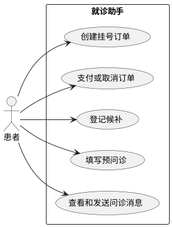

### 6.2 页面范围与界面形态

就诊助手顶部显示当前就诊人，中部展示“选择医院科室医生时段、锁号支付、预问诊、文字问诊”的当前阶段，底部展示挂号记录和问诊记录。阶段完全依据服务端订单与问诊状态计算。

### 6.3 当前就诊流程时序

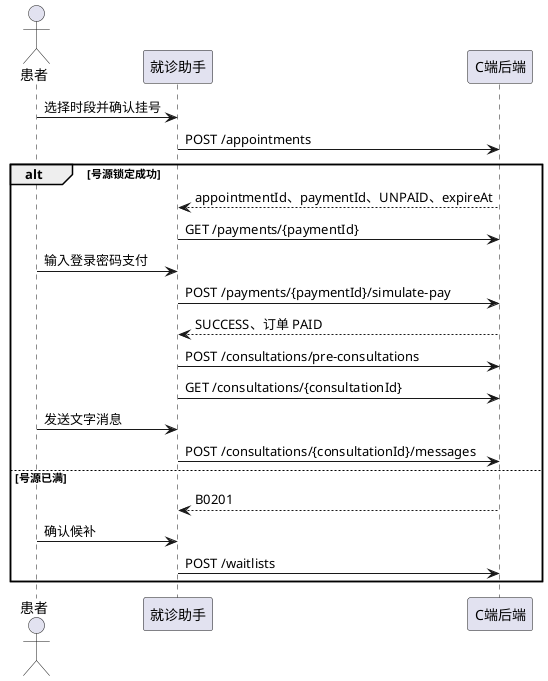

### 6.4 页面状态

| 场景 | 展示规则 | 用户动作 |
| --- | --- | --- |
| 无有效挂号 | 展示挂号入口 | 选择医院、科室、医生和时段 |
| `UNPAID` | 展示 15 分钟倒计时 | 支付或取消 |
| 号源已满 | 展示库存不足提示 | 候补登记或选择其他时段 |
| `PAID` 且无问诊 | 展示预问诊入口 | 填写预问诊 |
| `PENDING/IN_PROGRESS` | 显示文字问诊进行中 | 进入详情、发送消息 |
| `CANCELLED` | 仅展示历史记录 | 重新挂号 |

### 6.5 原型图与接口参数


#### `POST /appointments` - 创建挂号锁定订单
**入参：**
| 字段 | 类型 | 说明 |
| --- | --- | --- |
| `X-Idempotency-Key` | string | Header，防重键 |
| `patientId` | number | Body，可选就诊人 ID |
| `hospitalId` | number | Body，当前医院 ID |
| `slotId` | number | Body，预约时段 ID |
**返回：**
| 字段 | 类型 | 说明 |
| --- | --- | --- |
| `appointmentId` | number | 挂号订单 ID |
| `status` | string | 固定为 `UNPAID` |
| `amountCent` | number | 挂号金额，单位分 |
| `expireAt` | string | 支付到期时间 |
| `paymentId` | number | 支付单 ID |

#### `GET /appointments` - 查询挂号订单
**入参：**
| 字段 | 类型 | 说明 |
| --- | --- | --- |
| `patientId` | number | Query，可选就诊人 ID |
| `status` | string | Query，可选订单状态 |
| `pageNo` | number | Query，页码 |
| `pageSize` | number | Query，每页条数 |
**返回：**
| 字段 | 类型 | 说明 |
| --- | --- | --- |
| `total` | number | 订单总数 |
| `records.id` | number | 挂号订单 ID |
| `records.doctorName` | string | 医生姓名 |
| `records.departmentName` | string | 科室名称 |
| `records.startTime` | string | 就诊时段 |
| `records.status` | string | 订单状态 |
| `records.amountCent` | number | 金额，单位分 |
| `records.expireAt` | string | 待支付到期时间 |

#### `GET /appointments/{appointmentId}` - 查询挂号详情
**入参：**
| 字段 | 类型 | 说明 |
| --- | --- | --- |
| `appointmentId` | number | Path，挂号订单 ID |
**返回：**
| 字段 | 类型 | 说明 |
| --- | --- | --- |
| `id` | number | 挂号订单 ID |
| `status` | string | 挂号订单状态 |
| `doctor` | object | 医生和科室信息 |
| `slot` | object | 预约时段信息 |
| `amountCent` | number | 挂号金额，单位分 |
| `expireAt` | string | 支付到期时间 |
| `payment.id` | number | 支付单 ID |
| `payment.status` | string | 支付单状态 |

#### `POST /appointments/{appointmentId}/cancel` - 取消未支付挂号
**入参：**
| 字段 | 类型 | 说明 |
| --- | --- | --- |
| `X-Idempotency-Key` | string | Header，防重键 |
| `appointmentId` | number | Path，仅可取消 `UNPAID` 订单 |
**返回：**
| 字段 | 类型 | 说明 |
| --- | --- | --- |
| `appointmentId` | number | 挂号订单 ID |
| `status` | string | 固定为 `CANCELLED` |

#### `POST /waitlists` - 创建候补登记
**入参：**
| 字段 | 类型 | 说明 |
| --- | --- | --- |
| `X-Idempotency-Key` | string | Header，防重键 |
| `patientId` | number | Body，可选就诊人 ID |
| `slotId` | number | Body，已满时段 ID |
**返回：**
| 字段 | 类型 | 说明 |
| --- | --- | --- |
| `waitlistId` | number | 候补登记 ID |
| `slotId` | number | 候补时段 ID |
| `status` | string | 固定为 `WAITING` |
| `queueNo` | number | 候补排队序号 |

#### `GET /payments/{paymentId}` - 查询支付状态
**入参：**
| 字段 | 类型 | 说明 |
| --- | --- | --- |
| `paymentId` | number | Path，支付单 ID |
**返回：**
| 字段 | 类型 | 说明 |
| --- | --- | --- |
| `id` | number | 支付单 ID |
| `appointmentOrderId` | number | 关联挂号订单 ID |
| `drugOrderId` | number | 关联购药订单 ID |
| `amountCent` | number | 支付金额，单位分 |
| `status` | string | `PENDING/SUCCESS/FAILED/CLOSED` |
| `paidAt` | string | 支付完成时间 |
| `expireAt` | string | 支付到期时间 |

#### `POST /payments/{paymentId}/simulate-pay` - 模拟支付挂号
**入参：**
| 字段 | 类型 | 说明 |
| --- | --- | --- |
| `X-Idempotency-Key` | string | Header，防重键 |
| `paymentId` | number | Path，挂号支付单 ID |
| `loginPassword` | string | Body，当前登录密码 |
**返回：**
| 字段 | 类型 | 说明 |
| --- | --- | --- |
| `paymentId` | number | 支付单 ID |
| `status` | string | 固定为 `SUCCESS` |
| `paidAt` | string | 支付完成时间 |

#### `POST /consultations/pre-consultations` - 创建或保存预问诊
**入参：**
| 字段 | 类型 | 说明 |
| --- | --- | --- |
| `X-Idempotency-Key` | string | Header，防重键 |
| `patientId` | number | Body，可选就诊人 ID |
| `appointmentId` | number | Body，已支付挂号订单 ID |
| `chiefComplaint` | string | Body，主诉 |
| `historyOfPresentIllness` | string | Body，可选现病史 |
| `attachments` | array | Body，可选附件列表 |
**返回：**
| 字段 | 类型 | 说明 |
| --- | --- | --- |
| `consultationId` | number | 问诊记录 ID |
| `status` | string | 问诊状态 |
| `savedAt` | string | 保存时间 |

#### `GET /consultations` - 查询问诊记录
**入参：**
| 字段 | 类型 | 说明 |
| --- | --- | --- |
| `patientId` | number | Query，可选就诊人 ID |
| `status` | string | Query，可选问诊状态 |
| `pageNo` | number | Query，页码 |
| `pageSize` | number | Query，每页条数 |
**返回：**
| 字段 | 类型 | 说明 |
| --- | --- | --- |
| `total` | number | 问诊总数 |
| `records.id` | number | 问诊 ID |
| `records.appointmentId` | number | 关联挂号订单 ID |
| `records.doctorName` | string | 医生姓名 |
| `records.status` | string | `PENDING/IN_PROGRESS/COMPLETED/NO_SHOW` |
| `records.updatedAt` | string | 最近更新时间 |

#### `GET /consultations/{consultationId}` - 查询问诊详情与消息
**入参：**
| 字段 | 类型 | 说明 |
| --- | --- | --- |
| `consultationId` | number | Path，问诊 ID |
**返回：**
| 字段 | 类型 | 说明 |
| --- | --- | --- |
| `id` | number | 问诊 ID |
| `status` | string | 问诊状态 |
| `doctor` | object | 医生信息 |
| `preConsultation` | object | 预问诊内容 |
| `messages` | array | 文字消息列表 |
| `messages.id` | number | 消息 ID |
| `messages.senderType` | string | 发送方类型 |
| `messages.content` | string | 消息内容 |
| `messages.createdAt` | string | 发送时间 |

#### `POST /consultations/{consultationId}/messages` - 发送文字问诊消息
**入参：**
| 字段 | 类型 | 说明 |
| --- | --- | --- |
| `X-Idempotency-Key` | string | Header，防重键 |
| `consultationId` | number | Path，问诊 ID |
| `content` | string | Body，文字消息内容 |
**返回：**
| 字段 | 类型 | 说明 |
| --- | --- | --- |
| `messageId` | number | 消息 ID |
| `consultationId` | number | 问诊 ID |
| `senderType` | string | 固定为患者发送方 |
| `content` | string | 已发送内容 |
| `createdAt` | string | 发送时间 |

## 7. 模块 M3：购药

### 7.1 用例图

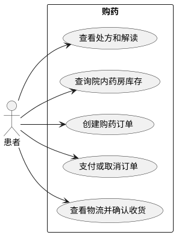

### 7.2 页面范围与界面形态

购药 Tab 首屏展示当前就诊人的已批准处方和购药订单。选中处方后只展示处方所属医院内启用且库存满足处方的药房，默认药房置顶；配送方式固定为 `COURIER`，不展示距离、经纬度或配送时效。

### 7.3 购药与快递配送时序

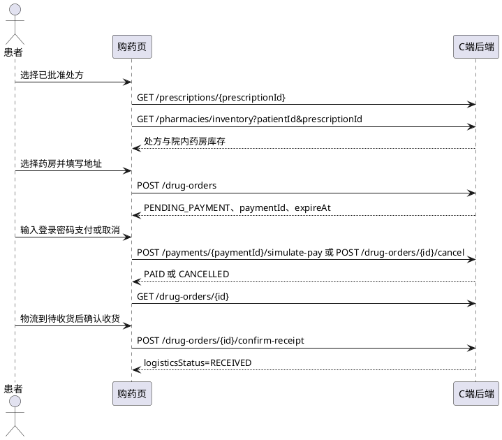

### 7.4 页面状态

| 场景 | 展示规则 | 用户动作 |
| --- | --- | --- |
| 无 `APPROVED` 处方 | 展示空态 | 前往就诊助手 |
| 院内药房库存不足 | 显示库存不足提示 | 选择其他院内药房 |
| 未填写地址 | 下单按钮禁用 | 填写收货地址 |
| `PENDING_PAYMENT` | 显示 15 分钟倒计时 | 支付或取消订单 |
| 支付超时 | 刷新订单状态 | 返回处方重新下单 |
| `TO_RECEIVE` | 显示确认收货操作 | 确认收货 |
| `RECEIVED` | 展示已收货状态 | 查看用药提醒 |

### 7.5 原型图与接口参数


#### `GET /prescriptions` - 查询处方列表
**入参：**
| 字段 | 类型 | 说明 |
| --- | --- | --- |
| `patientId` | number | Query，可选就诊人 ID |
| `pageNo` | number | Query，页码 |
| `pageSize` | number | Query，每页条数 |
**返回：**
| 字段 | 类型 | 说明 |
| --- | --- | --- |
| `total` | number | 处方总数 |
| `records.id` | number | 处方 ID |
| `records.consultationId` | number | 关联问诊 ID |
| `records.doctorName` | string | 开方医生 |
| `records.status` | string | 处方状态，仅展示 `APPROVED` |
| `records.issuedAt` | string | 开具时间 |

#### `GET /prescriptions/{prescriptionId}` - 查询处方详情
**入参：**
| 字段 | 类型 | 说明 |
| --- | --- | --- |
| `prescriptionId` | number | Path，处方 ID |
**返回：**
| 字段 | 类型 | 说明 |
| --- | --- | --- |
| `id` | number | 处方 ID |
| `status` | string | 处方状态 |
| `doctorName` | string | 开方医生 |
| `items` | array | 药品明细 |
| `items.drugId` | number | 药品 ID |
| `items.drugName` | string | 药品名称 |
| `items.specification` | string | 药品规格 |
| `items.dosage` | string | 单次用量 |
| `items.frequency` | string | 用药频次 |
| `items.usage` | string | 用药方式 |
| `items.durationDays` | number | 用药天数 |

#### `GET /prescriptions/{prescriptionId}/interpretation` - 查询处方解读
**入参：**
| 字段 | 类型 | 说明 |
| --- | --- | --- |
| `prescriptionId` | number | Path，处方 ID |
**返回：**
| 字段 | 类型 | 说明 |
| --- | --- | --- |
| `prescriptionId` | number | 处方 ID |
| `content` | string | 处方说明内容 |
| `disclaimer` | string | 医疗免责声明 |
| `generatedAt` | string | 生成时间 |

#### `GET /pharmacies/inventory` - 查询院内药房库存
**入参：**
| 字段 | 类型 | 说明 |
| --- | --- | --- |
| `patientId` | number | Query，可选就诊人 ID |
| `prescriptionId` | number | Query，已批准处方 ID |
**返回：**
| 字段 | 类型 | 说明 |
| --- | --- | --- |
| `pharmacyId` | number | 药房 ID |
| `name` | string | 药房名称 |
| `hospitalId` | number | 所属医院 ID |
| `isDefault` | boolean | 是否默认药房 |
| `deliveryMethod` | string | 固定为 `COURIER` |
| `items.drugId` | number | 药品 ID |
| `items.availableCount` | number | 可售库存 |
| `items.unitPriceCent` | number | 单价，单位分 |

#### `POST /drug-orders` - 创建购药订单草稿
**入参：**
| 字段 | 类型 | 说明 |
| --- | --- | --- |
| `X-Idempotency-Key` | string | Header，防重键 |
| `patientId` | number | Body，可选就诊人 ID |
| `prescriptionId` | number | Body，已批准处方 ID |
| `pharmacyId` | number | Body，选定院内药房 ID |
| `deliveryAddress` | string | Body，快递收货地址 |
**返回：**
| 字段 | 类型 | 说明 |
| --- | --- | --- |
| `drugOrderId` | number | 购药订单 ID |
| `status` | string | 固定为 `PENDING_PAYMENT` |
| `deliveryMethod` | string | 固定为 `COURIER` |
| `amountCent` | number | 订单金额，单位分 |
| `expireAt` | string | 支付到期时间 |
| `paymentId` | number | 支付单 ID |
| `items` | array | 药品与购买数量 |

#### `GET /drug-orders` - 查询购药订单列表
**入参：**
| 字段 | 类型 | 说明 |
| --- | --- | --- |
| `patientId` | number | Query，可选就诊人 ID |
| `status` | string | Query，可选订单状态 |
| `logisticsStatus` | string | Query，可选 `IN_TRANSIT/TO_RECEIVE/RECEIVED` |
| `pageNo` | number | Query，页码 |
| `pageSize` | number | Query，每页条数 |
**返回：**
| 字段 | 类型 | 说明 |
| --- | --- | --- |
| `total` | number | 订单总数 |
| `records.id` | number | 购药订单 ID |
| `records.pharmacyName` | string | 药房名称 |
| `records.status` | string | 购药订单状态 |
| `records.logisticsStatus` | string | 物流状态 |
| `records.latestLogisticsNode` | string | 最新物流节点 |
| `records.amountCent` | number | 订单金额，单位分 |
| `records.expireAt` | string | 支付到期时间 |

#### `GET /drug-orders/{drugOrderId}` - 查询购药订单详情
**入参：**
| 字段 | 类型 | 说明 |
| --- | --- | --- |
| `drugOrderId` | number | Path，购药订单 ID |
**返回：**
| 字段 | 类型 | 说明 |
| --- | --- | --- |
| `id` | number | 购药订单 ID |
| `status` | string | 订单状态 |
| `pharmacy` | object | 药房信息 |
| `delivery.method` | string | 配送方式 |
| `delivery.address` | string | 收货地址 |
| `delivery.company` | string | 快递公司 |
| `delivery.trackingNo` | string | 快递单号 |
| `delivery.logisticsStatus` | string | 物流状态 |
| `delivery.traces` | array | 物流轨迹 |
| `items` | array | 药品明细 |
| `amountCent` | number | 订单金额，单位分 |
| `payment` | object | 支付信息 |

#### `POST /drug-orders/{drugOrderId}/cancel` - 取消购药订单
**入参：**
| 字段 | 类型 | 说明 |
| --- | --- | --- |
| `X-Idempotency-Key` | string | Header，防重键 |
| `drugOrderId` | number | Path，待取消订单 ID |
**返回：**
| 字段 | 类型 | 说明 |
| --- | --- | --- |
| `drugOrderId` | number | 购药订单 ID |
| `status` | string | 固定为 `CANCELLED` |
| `cancelledAt` | string | 取消时间 |

#### `POST /drug-orders/{drugOrderId}/confirm-receipt` - 确认收货
**入参：**
| 字段 | 类型 | 说明 |
| --- | --- | --- |
| `X-Idempotency-Key` | string | Header，防重键 |
| `drugOrderId` | number | Path，待收货订单 ID |
**返回：**
| 字段 | 类型 | 说明 |
| --- | --- | --- |
| `drugOrderId` | number | 购药订单 ID |
| `logisticsStatus` | string | 固定为 `RECEIVED` |
| `receivedAt` | string | 确认收货时间 |

#### `POST /payments/{paymentId}/simulate-pay` - 模拟支付购药订单
**入参：**
| 字段 | 类型 | 说明 |
| --- | --- | --- |
| `X-Idempotency-Key` | string | Header，防重键 |
| `paymentId` | number | Path，购药支付单 ID |
| `loginPassword` | string | Body，当前登录密码 |
**返回：**
| 字段 | 类型 | 说明 |
| --- | --- | --- |
| `paymentId` | number | 支付单 ID |
| `status` | string | 固定为 `SUCCESS` |

## 8. 模块 M4：我的

### 8.1 用例图

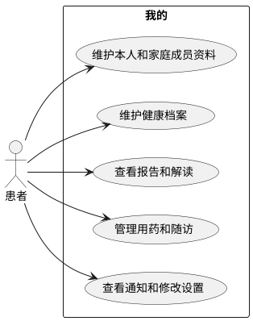

### 8.2 页面范围与界面形态

我的 Tab 顶部展示本人或当前家庭成员的脱敏资料，中部为健康档案、报告、提醒、随访和通知入口，底部为家庭成员管理、修改密码和退出登录。本人资料与家庭成员资料使用不同接口；本人不可解绑。

### 8.3 我的页面初始化时序

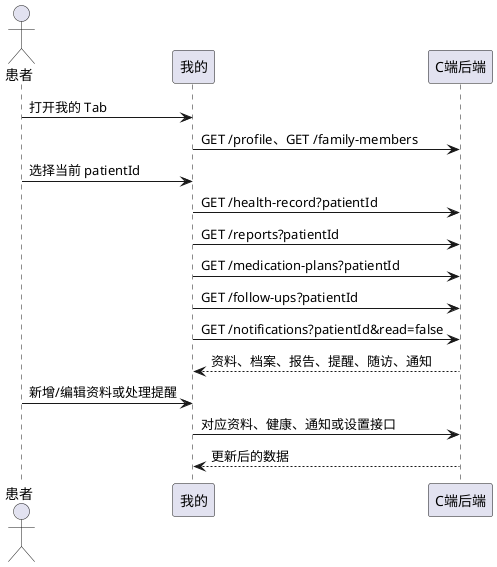

### 8.4 页面状态

| 场景 | 展示规则 | 用户动作 |
| --- | --- | --- |
| 无家庭成员 | 展示添加家庭成员入口 | 新增家庭成员 |
| 健康档案为空 | 展示过敏史和既往史录入引导 | 新增档案记录 |
| 解读未生成 | 显示处理中与免责声明 | 稍后重试 |
| 存在未读通知 | 显示未读角标 | 打开并标记已读 |
| 用药计划 `ACTIVE` | 显示下次提醒时间 | 暂停、恢复或完成 |
| 待确认随访 | 显示确认操作 | 选择提醒时间并确认 |
| 退出登录 | 二次确认 | 撤销刷新令牌并回到登录页 |

### 8.5 原型图与接口参数


#### `GET /profile` - 查询本人资料
**入参：**
| 字段 | 类型 | 说明 |
| --- | --- | --- |
| `Authorization` | string | 当前 C 端 Bearer Token |
**返回：**
| 字段 | 类型 | 说明 |
| --- | --- | --- |
| `id` | number | 本人就诊人 ID |
| `name` | string | 姓名 |
| `gender` | string | 性别编码 |
| `birthday` | string | 出生日期 |
| `phone` | string | 脱敏手机号 |
| `emergencyContact` | string | 脱敏紧急联系人信息 |

#### `GET /family-members` - 查询家庭成员
**入参：**
| 字段 | 类型 | 说明 |
| --- | --- | --- |
| `Authorization` | string | 当前 C 端 Bearer Token |
**返回：**
| 字段 | 类型 | 说明 |
| --- | --- | --- |
| `records` | array | 有效家庭成员列表 |
| `records.patientId` | number | 家庭成员就诊人 ID |
| `records.name` | string | 姓名 |
| `records.relation` | string | 家庭关系 |
| `records.phone` | string | 脱敏手机号 |

#### `PUT /profile` - 更新本人资料
**入参：**
| 字段 | 类型 | 说明 |
| --- | --- | --- |
| `name` | string | Body，本人姓名 |
| `gender` | string | Body，可选性别 |
| `birthday` | string | Body，可选出生日期 |
| `phone` | string | Body，可选联系电话 |
| `emergencyContact` | string | Body，可选紧急联系人 |
**返回：**
| 字段 | 类型 | 说明 |
| --- | --- | --- |
| `id` | number | 本人就诊人 ID |
| `name` | string | 更新后姓名 |
| `phone` | string | 脱敏手机号 |
| `updatedAt` | string | 更新时间 |

#### `POST /family-members` - 新增家庭成员
**入参：**
| 字段 | 类型 | 说明 |
| --- | --- | --- |
| `X-Idempotency-Key` | string | Header，防重键 |
| `name` | string | Body，成员姓名 |
| `relation` | string | Body，家庭关系，非 `SELF` |
| `gender` | string | Body，可选性别 |
| `birthday` | string | Body，可选出生日期 |
| `phone` | string | Body，可选联系电话 |
| `idCardNo` | string | Body，可选身份证号，不回显 |
| `emergencyContact` | string | Body，可选紧急联系人 |
**返回：**
| 字段 | 类型 | 说明 |
| --- | --- | --- |
| `patientId` | number | 新家庭成员就诊人 ID |
| `name` | string | 成员姓名 |
| `relation` | string | 家庭关系 |
| `phone` | string | 脱敏手机号 |

#### `PUT /family-members/{patientId}` - 更新家庭成员
**入参：**
| 字段 | 类型 | 说明 |
| --- | --- | --- |
| `patientId` | number | Path，家庭成员就诊人 ID |
| `name` | string | Body，成员姓名 |
| `relation` | string | Body，家庭关系 |
| `gender` | string | Body，可选性别 |
| `birthday` | string | Body，可选出生日期 |
| `phone` | string | Body，可选联系电话 |
| `idCardNo` | string | Body，可选身份证号，不回显 |
| `emergencyContact` | string | Body，可选紧急联系人 |
**返回：**
| 字段 | 类型 | 说明 |
| --- | --- | --- |
| `patientId` | number | 家庭成员就诊人 ID |
| `name` | string | 更新后姓名 |
| `relation` | string | 更新后关系 |
| `phone` | string | 脱敏手机号 |
| `updatedAt` | string | 更新时间 |

#### `DELETE /family-members/{patientId}` - 解绑家庭成员
**入参：**
| 字段 | 类型 | 说明 |
| --- | --- | --- |
| `patientId` | number | Path，待解绑家庭成员 ID |
**返回：**
| 字段 | 类型 | 说明 |
| --- | --- | --- |
| `patientId` | number | 家庭成员就诊人 ID |
| `unbound` | boolean | 是否已解绑 |
| `unboundAt` | string | 解绑时间 |

#### `PUT /auth/password` - 修改登录密码
**入参：**
| 字段 | 类型 | 说明 |
| --- | --- | --- |
| `oldPassword` | string | Body，当前密码 |
| `newPassword` | string | Body，新密码 |
**返回：**
| 字段 | 类型 | 说明 |
| --- | --- | --- |
| `passwordChanged` | boolean | 是否修改成功 |

#### `GET /health-record` - 查询健康档案
**入参：**
| 字段 | 类型 | 说明 |
| --- | --- | --- |
| `patientId` | number | Query，可选就诊人 ID |
**返回：**
| 字段 | 类型 | 说明 |
| --- | --- | --- |
| `profile` | object | 就诊人基本资料 |
| `allergies` | array | 过敏史列表 |
| `allergies.id` | number | 过敏史 ID |
| `allergies.allergen` | string | 过敏原 |
| `allergies.reaction` | string | 过敏反应 |
| `medicalHistories` | array | 既往史列表 |
| `medicalHistories.id` | number | 既往史 ID |
| `medicalHistories.content` | string | 既往史内容 |
| `summary` | string | 健康档案摘要 |

#### `POST /health-record/allergies` - 新增过敏史
**入参：**
| 字段 | 类型 | 说明 |
| --- | --- | --- |
| `X-Idempotency-Key` | string | Header，防重键 |
| `patientId` | number | Body，可选就诊人 ID |
| `allergen` | string | Body，过敏原名称 |
| `reaction` | string | Body，可选过敏反应 |
**返回：**
| 字段 | 类型 | 说明 |
| --- | --- | --- |
| `id` | number | 过敏史 ID |
| `allergen` | string | 过敏原 |
| `reaction` | string | 过敏反应 |

#### `PUT /health-record/allergies/{allergyId}` - 更新过敏史
**入参：**
| 字段 | 类型 | 说明 |
| --- | --- | --- |
| `allergyId` | number | Path，过敏史 ID |
| `allergen` | string | Body，过敏原名称 |
| `reaction` | string | Body，可选过敏反应 |
**返回：**
| 字段 | 类型 | 说明 |
| --- | --- | --- |
| `id` | number | 过敏史 ID |
| `allergen` | string | 过敏原 |
| `reaction` | string | 过敏反应 |
| `updatedAt` | string | 更新时间 |

#### `POST /health-record/histories` - 新增既往史
**入参：**
| 字段 | 类型 | 说明 |
| --- | --- | --- |
| `X-Idempotency-Key` | string | Header，防重键 |
| `patientId` | number | Body，可选就诊人 ID |
| `content` | string | Body，既往史内容 |
| `occurredAt` | string | Body，可选发生日期 |
**返回：**
| 字段 | 类型 | 说明 |
| --- | --- | --- |
| `id` | number | 既往史 ID |
| `content` | string | 既往史内容 |
| `occurredAt` | string | 发生日期 |

#### `PUT /health-record/histories/{historyId}` - 更新既往史
**入参：**
| 字段 | 类型 | 说明 |
| --- | --- | --- |
| `historyId` | number | Path，既往史 ID |
| `content` | string | Body，既往史内容 |
| `occurredAt` | string | Body，可选发生日期 |
**返回：**
| 字段 | 类型 | 说明 |
| --- | --- | --- |
| `id` | number | 既往史 ID |
| `content` | string | 既往史内容 |
| `occurredAt` | string | 发生日期 |
| `updatedAt` | string | 更新时间 |

#### `POST /reports` - 录入检查报告
**入参：**
| 字段 | 类型 | 说明 |
| --- | --- | --- |
| `X-Idempotency-Key` | string | Header，防重键 |
| `patientId` | number | Body，可选就诊人 ID |
| `reportName` | string | Body，报告名称 |
| `reportDate` | string | Body，报告日期 |
| `indicators` | array | Body，指标列表 |
| `indicators.name` | string | 指标名称 |
| `indicators.value` | string | 指标数值 |
| `indicators.unit` | string | 指标单位 |
| `indicators.referenceRange` | string | 参考区间 |
**返回：**
| 字段 | 类型 | 说明 |
| --- | --- | --- |
| `reportId` | number | 报告 ID |
| `status` | string | 固定为 `RECORDED` |

#### `GET /reports` - 查询检查报告
**入参：**
| 字段 | 类型 | 说明 |
| --- | --- | --- |
| `patientId` | number | Query，可选就诊人 ID |
| `pageNo` | number | Query，页码 |
| `pageSize` | number | Query，每页条数 |
**返回：**
| 字段 | 类型 | 说明 |
| --- | --- | --- |
| `total` | number | 报告总数 |
| `records.id` | number | 报告 ID |
| `records.reportName` | string | 报告名称 |
| `records.reportDate` | string | 报告日期 |
| `records.indicatorCount` | number | 指标数量 |

#### `GET /reports/{reportId}` - 查询报告详情
**入参：**
| 字段 | 类型 | 说明 |
| --- | --- | --- |
| `reportId` | number | Path，报告 ID |
**返回：**
| 字段 | 类型 | 说明 |
| --- | --- | --- |
| `id` | number | 报告 ID |
| `reportName` | string | 报告名称 |
| `reportDate` | string | 报告日期 |
| `indicators` | array | 报告指标 |
| `indicators.name` | string | 指标名称 |
| `indicators.value` | string | 指标数值 |
| `indicators.unit` | string | 指标单位 |
| `indicators.referenceRange` | string | 参考区间 |

#### `GET /reports/{reportId}/interpretation` - 查询报告解读
**入参：**
| 字段 | 类型 | 说明 |
| --- | --- | --- |
| `reportId` | number | Path，报告 ID |
**返回：**
| 字段 | 类型 | 说明 |
| --- | --- | --- |
| `reportId` | number | 报告 ID |
| `indicatorExplanations` | array | 指标说明列表 |
| `suggestedDepartmentId` | number | 推荐科室 ID |
| `disclaimer` | string | 医疗免责声明 |

#### `GET /medication-plans` - 查询用药计划
**入参：**
| 字段 | 类型 | 说明 |
| --- | --- | --- |
| `patientId` | number | Query，可选就诊人 ID |
| `status` | string | Query，可选状态 |
**返回：**
| 字段 | 类型 | 说明 |
| --- | --- | --- |
| `id` | number | 用药计划 ID |
| `drugName` | string | 药品名称 |
| `dosage` | string | 单次用量 |
| `frequency` | string | 用药频次 |
| `nextReminderAt` | string | 下次提醒时间 |
| `status` | string | 计划状态 |

#### `PATCH /medication-plans/{planId}` - 更新用药计划
**入参：**
| 字段 | 类型 | 说明 |
| --- | --- | --- |
| `planId` | number | Path，用药计划 ID |
| `action` | string | Body，暂停、恢复或完成动作 |
**返回：**
| 字段 | 类型 | 说明 |
| --- | --- | --- |
| `id` | number | 用药计划 ID |
| `status` | string | 更新后状态 |
| `nextReminderAt` | string | 更新后下次提醒时间 |

#### `GET /follow-ups` - 查询随访计划
**入参：**
| 字段 | 类型 | 说明 |
| --- | --- | --- |
| `patientId` | number | Query，可选就诊人 ID |
| `status` | string | Query，可选状态 |
**返回：**
| 字段 | 类型 | 说明 |
| --- | --- | --- |
| `id` | number | 随访计划 ID |
| `type` | string | 随访类型 |
| `dueAt` | string | 建议完成时间 |
| `content` | string | 随访内容 |
| `status` | string | `PENDING_CONFIRM/CONFIRMED/COMPLETED/CANCELLED` |

#### `POST /follow-ups/{followUpId}/confirm` - 确认随访计划
**入参：**
| 字段 | 类型 | 说明 |
| --- | --- | --- |
| `followUpId` | number | Path，随访计划 ID |
| `remindAt` | string | Body，确认后的提醒时间 |
**返回：**
| 字段 | 类型 | 说明 |
| --- | --- | --- |
| `id` | number | 随访计划 ID |
| `status` | string | 固定为 `CONFIRMED` |
| `remindAt` | string | 已确认提醒时间 |

#### `GET /notifications` - 查询通知列表
**入参：**
| 字段 | 类型 | 说明 |
| --- | --- | --- |
| `patientId` | number | Query，可选就诊人 ID |
| `read` | boolean | Query，可选已读状态 |
| `pageNo` | number | Query，页码 |
| `pageSize` | number | Query，每页条数 |
**返回：**
| 字段 | 类型 | 说明 |
| --- | --- | --- |
| `total` | number | 通知总数 |
| `records.id` | number | 通知 ID |
| `records.type` | string | 通知类型 |
| `records.patientId` | number | 关联就诊人 ID |
| `records.patientName` | string | 就诊人姓名 |
| `records.title` | string | 标题 |
| `records.content` | string | 内容 |
| `records.read` | boolean | 是否已读 |
| `records.createdAt` | string | 创建时间 |

#### `POST /notifications/{notificationId}/read` - 标记通知已读
**入参：**
| 字段 | 类型 | 说明 |
| --- | --- | --- |
| `notificationId` | number | Path，通知 ID |
**返回：**
| 字段 | 类型 | 说明 |
| --- | --- | --- |
| `id` | number | 通知 ID |
| `read` | boolean | 固定为 `true` |
| `readAt` | string | 已读时间 |

## 9. 模块 M5：AI助手

### 9.1 用例图

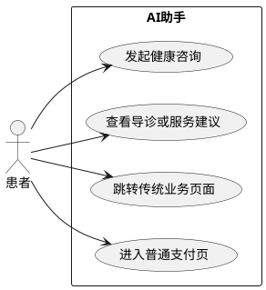

### 9.2 页面范围与界面形态

AI 悬浮球固定在四个 Tab 的右下角，点击后打开抽屉或全屏会话 UI。会话展示健康建议、免责声明和传统页面跳转入口；不直接执行支付、修改处方或作出诊断结论。

### 9.3 AI 助手协作时序

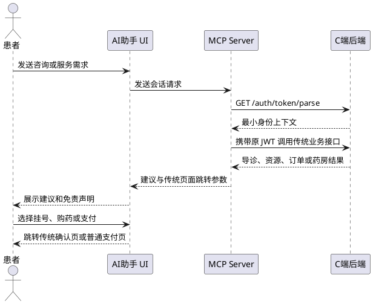

### 9.4 页面状态

| 场景 | 展示规则 | 用户动作 |
| --- | --- | --- |
| 会话未接入 | 显示功能准备中 | 使用传统首页入口 |
| MCP 返回建议 | 展示建议和免责声明 | 跳转对应传统页面 |
| Token 无效 | 清理登录态 | 跳转登录页 |
| 涉及支付 | 不显示代付操作 | 跳转普通支付页 |
| 涉及处方或诊断 | 只展示说明 | 查看医生处方或就医建议 |

### 9.5 原型图与接口参数


AI 助手没有专用 C 端 REST 接口。以下接口仅由 MCP Server 使用，H5 不直接调用；其返回值不能作为后续业务接口的二次授权凭据。

#### `GET /auth/token/parse` - 解析当前 C 端 JWT
**入参：**
| 字段 | 类型 | 说明 |
| --- | --- | --- |
| `Authorization` | string | Header，当前 C 端 Bearer Access Token |
**返回：**
| 字段 | 类型 | 说明 |
| --- | --- | --- |
| `userId` | number | 当前 C 端用户 ID |
| `account` | string | 当前登录账号 |
| `tokenExpiresAt` | string | Token 到期时间 |

## 10. 接口依赖与字段映射

| 页面能力 | 关键接口 | 前端处理 |
| --- | --- | --- |
| 认证 | `/auth/*` | 保存令牌、自动刷新、失效后回到登录 |
| 当前就诊人 | `/profile`、`/family-members` | 切换后使患者相关查询失效并重新请求 |
| 手动挂号 | `/hospitals`、`/departments`、`/doctors`、`/appointments`、`/waitlists` | 显式传 `hospitalId`，按 `UNPAID` 展示倒计时 |
| 问诊 | `/consultations/*` | 按服务端状态展示消息和进度 |
| 购药 | `/prescriptions`、`/pharmacies/inventory`、`/drug-orders` | 仅展示院内药房和固定快递配送 |
| 健康管理 | `/health-record`、`/reports`、`/medication-plans`、`/follow-ups` | 按 `patientId` 查询和维护 |
| 通知 | `/notifications` | 未读角标与打开后已读更新 |
| AI 助手 | `/auth/token/parse` | MCP Server 调用，H5 仅展示会话 UI |

## 11. 前端错误处理与页面反馈

| 业务码 | 页面反馈 | 前端动作 |
| --- | --- | --- |
| `A0301/A0230` | 登录已失效 | 清理登录态并跳转登录 |
| `A0400/A0420/A0430` | 输入内容不符合要求 | 标记表单字段 |
| `A0441` | 支付超时 | 刷新订单和支付单 |
| `A0443` | 当前状态不可操作 | 刷新详情并禁用操作 |
| `A0506` | 请勿重复提交 | 保留首次结果 |
| `B0201` | 号源已满 | 展示其他时段和候补入口 |
| `B0202` | 解读生成中 | 显示处理中并支持重试 |
| `B0300` | 药品库存不足 | 更换院内药房 |

## 12. 埋点与非功能要求

### 12.1 业务埋点

| 事件 | 触发时机 | 属性 |
| --- | --- | --- |
| `home_hospital_select` | 切换医院 | `hospitalId` |
| `appointment_lock_result` | 锁号返回 | `patientId`、`slotId`、`result`、`traceId` |
| `waitlist_create` | 候补登记返回 | `slotId`、`result` |
| `payment_result` | 模拟支付返回 | `paymentId`、`result` |
| `pharmacy_recommend_view` | 展示院内药房 | `prescriptionId`、`pharmacyCount` |
| `agent_float_open` | 打开 AI 助手 | `currentTab` |

### 12.2 性能与适配

+ 四个 Tab 保留滚动位置和筛选条件；订单、支付状态和倒计时重新进入页面时刷新。
+ 处方、报告、通知、问诊记录使用分页、骨架屏和错误重试。
+ H5 保证 320px 至 430px 宽度下文本、按钮和卡片不溢出。

## 13. 联调边界

### 13.1 前端负责

+ 页面、路由、状态、表单校验、脱敏展示、倒计时、幂等键和错误反馈。
+ 传统 C 端 API 请求与 `patientId`、`hospitalId` 的正确传递。
+ AI 会话 UI 与传统页面跳转，不直接调用 Agent 专用 REST 接口。

### 13.2 后端依赖

+ 统一返回 `code`、`message`、`data`、`traceId`。
+ 校验就诊人归属、医院链路、订单状态、库存、支付和幂等键。
+ 药房库存接口仅返回院内药房、库存、价格和固定快递配送方式。

### 13.3 MCP 边界

+ MCP Server 通过 `GET /auth/token/parse` 读取最小身份上下文。
+ MCP 调用后续业务接口时仍携带原 C 端 JWT、所选 `patientId`、相关 `hospitalId` 和创建操作的 `X-Idempotency-Key`。
+ Agent 不得代付、修改处方或输出诊断结论。

## 14. 风险与应对

| 风险 | 影响 | 应对 |
| --- | --- | --- |
| 号源被抢完 | 无法挂号 | 展示其他时段和候补入口 |
| 支付超时 | 订单无法支付 | 倒计时、刷新支付状态、重新发起业务 |
| 药房库存变化 | 购药下单失败 | 提示选择其他院内药房 |
| Agent 不可用 | AI 入口不可用 | 传统挂号和购药入口保持可用 |
| 医疗建议误解 | 患者误用建议 | 固定展示免责声明 |

## 15. 前端工作量汇总

| 阶段 | 页面/能力 | 交付目标 |
| --- | --- | --- |
| 第一阶段 | 登录、首页、就诊助手、手动挂号和支付 | 完成 MVP 挂号闭环 |
| 第二阶段 | 问诊、处方、购药、物流和提醒 | 完成诊后购药闭环 |
| 第三阶段 | 我的、档案、报告、随访、通知 | 完成健康管理闭环 |
| 第四阶段 | AI 悬浮球和会话 UI | 对接 MCP / Agent 能力 |

## 16. 总结

C 端 H5 以五个界面承载患者服务：首页完成资源发现和导诊，就诊助手完成挂号与问诊，购药完成处方到快递闭环，我的承载健康管理，AI 助手作为 MCP 编排下的可插拔服务入口。所有传统业务均以后端 V1.3 契约为准。
