# 智愈先锋 C 端 H5 前端系统分析与设计

| 项目 | 内容 |
| --- | --- |
| 文档版本 | V1.0 |
| 编写日期 | 2026-07-29 |
| 适用端 | C 端 H5 患者应用 |
| 关联文档 | 产品说明书、C 端后端系分、项目结构、前端系统分析模板 |
| 文档范围 | 首页、就诊助手、购药、我的、全局 AI 助手悬浮球 |

## 1. 文档说明

本文档用于指导智愈先锋 C 端 H5 前端开发、接口联调与演示验收。C 端面向患者/家属，负责医疗服务的页面展示、操作确认、接口调用、状态反馈和脱敏展示。

本文档不包含 PostgreSQL 建表、后端事务、Redis 锁库存、RabbitMQ 消费逻辑和 B 端页面实现。Agent 服务端接口尚未开发，前端仅预留 AI 助手会话、确认卡片和状态管理边界。

### 1.1 设计原则

- 以四个底部 Tab 支撑高频患者任务：首页、就诊助手、购药、我的。
- 挂号、购药、提醒等涉及用户权益的操作必须明确确认；支付始终由用户在普通支付页手动完成。
- AI 生成的导诊、报告解读、处方说明、用药提醒页面固定展示“AI 建议仅供参考，不替代医生诊断”。
- 手机号、身份证号、就诊卡号等敏感信息只展示脱敏内容；前端不得保存密码、Token 明文或完整证件信息。
- C 端仅使用 `/api/c/v1` 后端接口，不调用 B 端接口。

## 2. 项目前端总览

### 2.1 用户与模块

| 序号 | 模块 | 主页面/入口 | 主要能力 | 对应后端域 |
| --- | --- | --- | --- | --- |
| 1 | 首页 home | `/home` | 医院服务入口、搜索、快捷操作、就诊人卡片、健康提醒 | auth、registration、health |
| 2 | 就诊助手 assistant | `/assistant` | 当前就诊进度、挂号/问诊/退号记录、待办引导 | registration、consultation |
| 3 | 购药 pharmacy | `/pharmacy` | 处方、药店推荐、快递配送下单、支付、提醒 | order、health |
| 4 | 我的 mine | `/mine` | 个人资料、就诊人、健康档案、报告、通知和设置 | auth、health、notification |
| 5 | AI 助手 agent | 全局悬浮球 | 导诊/挂号/购药/提醒辅助，待 Agent 模块接入 | 待 Agent 模块提供 |

### 2.2 底部导航

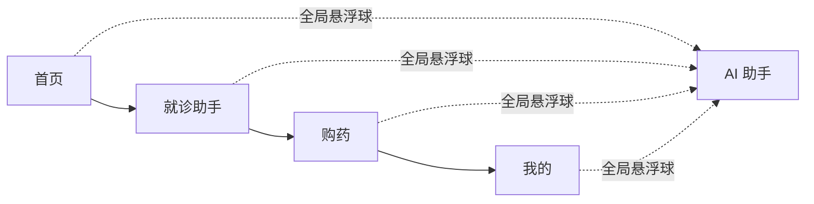

| Tab | 图标语义 | 页面目标 | 原型参考 |
| --- | --- | --- | --- |
| 首页 | 医疗服务首页 | 快速开始挂号、导诊、问诊、查报告 | 图 1 |
| 就诊助手 | 十字医疗标识 | 展示当前就诊步骤与历史就诊记录 | 图 2、图 3 |
| 购药 | 药盒/处方标识 | 从处方到快递配送与用药提醒 | 产品说明书 5.3 |
| 我的 | 用户标识 | 就诊人、档案、常用工具和设置 | 图 4 |

## 3. 前端技术栈与工程约定

| 类型 | 技术选型 | 版本/约定 | 用途 |
| --- | --- | --- | --- |
| 前端框架 | React | 18+ | H5 页面与组件开发 |
| 开发语言 | TypeScript | 5+ | 类型约束与接口模型 |
| 应用框架 | Umi | Umi Max 4 | 路由、构建、运行时配置 |
| 移动端组件 | Ant Design Mobile | 5+ | TabBar、列表、弹窗、表单、步骤条 |
| 请求层 | Umi Request + TanStack Query | 项目统一封装 | Token 注入、缓存、请求状态与重试 |
| 全局状态 | Zustand | 项目统一封装 | 登录态、当前就诊人、AI 抽屉、跨 Tab 状态 |
| 样式 | Less + CSS Modules | 项目统一约定 | 移动端样式隔离与主题变量 |
| 图标 | Ant Design Mobile / 项目图标资源 | 按需使用 | 快捷入口与状态图标 |
| 测试 | Playwright | E2E | 登录、挂号、购药、提醒等主流程验收 |

### 3.1 工程目录

```text
c-end/frontend/
└── src/
    ├── pages/
    │   ├── login/                  # 登录、注册、图形验证码
    │   ├── home/                   # 首页
    │   ├── assistant/              # 就诊助手 Tab
    │   ├── pharmacy/               # 购药 Tab、药店与订单详情
    │   ├── mine/                   # 我的 Tab、档案、报告、通知
    │   └── agent/                  # AI 助手会话页或抽屉内容
    ├── components/
    │   ├── layout/                 # 四 Tab 布局、页面容器
    │   ├── patient/                # 就诊人卡片、脱敏信息、切换器
    │   ├── appointment/            # 号源卡片、就诊步骤条、订单卡片
    │   ├── pharmacy/               # 处方卡片、药店推荐、配送状态
    │   ├── health/                 # 报告卡片、提醒卡片、随访卡片
    │   └── agent/                  # 悬浮球、会话抽屉、确认卡片
    ├── services/
    │   ├── auth.ts
    │   ├── registration.ts
    │   ├── consultation.ts
    │   ├── pharmacy.ts
    │   ├── health.ts
    │   ├── notification.ts
    │   └── agent.ts                # 预留 Agent 接口，不接入传统后端
    ├── stores/
    │   ├── authStore.ts
    │   ├── patientStore.ts
    │   ├── assistantStore.ts
    │   └── agentStore.ts
    ├── types/                      # API DTO、页面 ViewModel、枚举
    ├── constants/                  # 路由、错误码、快捷入口、文案
    ├── utils/                      # request、脱敏、日期、金额、状态映射
    ├── app.ts                      # Umi 运行时与登录态初始化
    └── routes.ts                   # 路由配置
```

### 3.2 前端分层

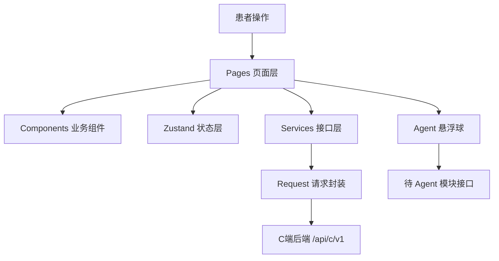

### 3.3 路由设计

```text
/login                                  # 登录
/register                               # 注册
/home                                   # 首页 Tab
/assistant                              # 就诊助手 Tab
/assistant/appointment/:appointmentId   # 挂号详情
/assistant/consultation/:consultationId # 问诊详情
/pharmacy                               # 购药 Tab，处方列表
/pharmacy/prescription/:prescriptionId  # 处方与药店推荐
/pharmacy/order/:drugOrderId            # 购药订单与快递状态
/mine                                   # 我的 Tab
/mine/profile                           # 个人资料
/mine/health-record                     # 健康档案
/mine/report/:reportId                  # 检查报告与解读
/mine/medication-plans                  # 用药提醒
/mine/follow-ups                        # 随访计划
/mine/notifications                     # 通知
/agent                                  # AI 助手全屏会话，待 Agent 模块接入
```

### 3.4 状态管理设计

| Store | 核心状态 | 更新时机 |
| --- | --- | --- |
| `authStore` | `accessToken`、登录用户、登录态 | 登录、刷新 Token、退出 |
| `patientStore` | 当前就诊人、脱敏资料、就诊卡 | 初始化、资料更新、切换就诊人 |
| `assistantStore` | 当前挂号订单、问诊列表、就诊流程状态 | 进入就诊助手、订单状态变化 |
| `pharmacyStore` | 当前处方、药店推荐、购药订单草稿 | 选择处方、创建订单、支付完成 |
| `agentStore` | 悬浮球开关、会话消息、待确认操作卡片 | 打开 AI 助手、Agent 返回操作建议 |

请求数据使用 TanStack Query 缓存；页面本地输入使用 `useState`。Token 不写入页面 URL，不在日志中输出。

## 4. 全局组件与请求规范

### 4.1 通用组件

| 组件 | 职责 | 使用页面 |
| --- | --- | --- |
| `AppTabBar` | 四项底部导航与当前 Tab 高亮 | 全部 Tab |
| `PatientSwitcher` | 当前就诊人展示、切换和脱敏证件信息 | 首页、就诊助手、我的 |
| `AppointmentProgress` | 就诊步骤条与当前节点说明 | 就诊助手 |
| `EmptyState` | 空态插图、说明与主要行动按钮 | 记录、处方、提醒列表 |
| `StatusTag` | 订单、问诊、支付、提醒状态颜色映射 | 全部业务页 |
| `AgentFloatingButton` | 固定右下角 AI 助手悬浮球 | 全局 |
| `AgentActionConfirmCard` | Agent 操作确认、取消、跳转支付 | AI 助手 |
| `MedicalDisclaimer` | AI 医疗建议免责声明 | 导诊、报告、处方、提醒 |

### 4.2 请求与错误处理

- `request` 统一添加 `Authorization: Bearer {accessToken}`，登录/注册/验证码/刷新 Token 接口除外。
- 创建、更新、取消、支付请求由 `services` 自动生成 `X-Idempotency-Key`；重复点击时按钮进入加载态。
- 统一解析后端返回 `{ code, message, data, traceId }`；成功码为 `00000`。
- `A0301`：清除登录态并跳转登录；`A0441`：提示支付超时并刷新订单；`B0201/B0300`：提示号源或药品库存不足；`A0506`：返回首次请求结果或提示勿重复提交。
- 页面错误态保留 `traceId` 的复制入口，便于演示和问题排查；不显示 Token、密码或完整敏感字段。

## 5. 模块 M1：首页

### 5.1 用例图

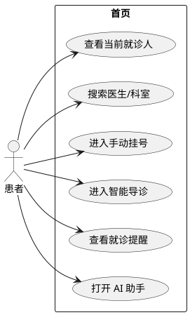

### 5.2 页面范围与界面形态

首页参考图 1，使用“医院品牌区 + 搜索 + 快捷入口 + 就诊人卡片 + 服务宫格 + 健康提醒”的纵向信息流。首屏优先展示用户下一步可执行的医疗服务，而非营销内容。

| 区域 | 页面元素 | 数据来源 | 交互规则 |
| --- | --- | --- | --- |
| 顶部 | 医院名称、品牌图、消息入口 | 静态配置、通知未读数 | 消息入口跳转通知页 |
| 搜索 | 医生、科室、症状关键词 | `GET /departments`、`GET /doctors` | 输入后展示匹配结果，症状搜索跳转导诊 |
| 快捷入口 | 挂号、智能导诊、在线问诊、处方购药 | 页面配置 | 跳转对应业务页 |
| 就诊人卡片 | 姓名、脱敏证件、就诊码 | `GET /profile` | 进入我的或切换就诊人 |
| 健康提醒 | 待支付、待问诊、待服药、待随访 | 订单/提醒/通知接口 | 点击进入对应详情 |

### 5.3 首页加载时序

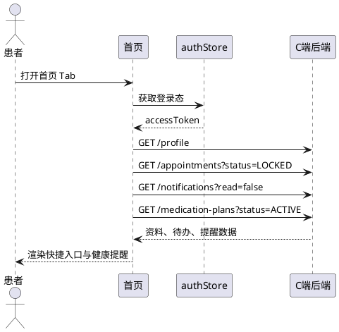

### 5.4 页面状态

| 场景      | 展示规则            | 用户动作       |
| ------- | --------------- | ---------- |
| 未登录     | 不加载医疗数据         | 跳转登录页      |
| 无待办     | 隐藏提醒红点，展示健康服务引导 | 前往挂号或导诊    |
| 存在待支付挂号 | 顶部优先展示倒计时卡片     | 进入订单并支付/取消 |
| 网络失败    | 轻量错误提示与重试按钮     | 重新加载首页数据   |

## 6. 模块 M2：就诊助手

### 6.1 用例图

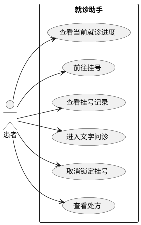

### 6.2 页面范围与界面形态

就诊助手参考图 2、图 3。页面顶部固定当前就诊人；核心区域为“预约挂号 → 报到候诊 → 门诊缴费 → 检验检查 → 查看报告”的纵向进度。进度基于当前有效挂号和问诊状态计算，不由前端自行修改。

| 区域 | 页面元素 | 接口依赖 | 交互规则 |
| --- | --- | --- | --- |
| 就诊人栏 | 姓名、登记号、切换入口 | `GET /profile` | 展示脱敏资料 |
| 当前进度 | 步骤条、当前状态、主行动按钮 | `GET /appointments`、`GET /consultations` | 未挂号时主按钮为“前往挂号” |
| 挂号记录 | 医生、科室、时间、支付状态 | `GET /appointments` | 查看详情、取消锁定订单 |
| 在线问诊 | 问诊状态、最新消息 | `GET /consultations` | 跳转文字问诊详情 |
| 处方入口 | 已签发处方摘要 | `GET /prescriptions` | 跳转购药 Tab |

### 6.3 当前就诊流程时序

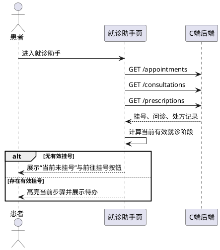

### 6.4 状态规则

| 后端状态 | 前端展示 | 可操作项 |
| --- | --- | --- |
| 无有效挂号 | 当前未挂号 | 前往挂号、打开 AI 导诊 |
| `LOCKED` | 待支付，展示倒计时 | 支付、取消 |
| `PAID` + 无问诊 | 已挂号，待填写预问诊 | 填写预问诊 |
| `PENDING/IN_PROGRESS` 问诊 | 文字问诊进行中 | 进入问诊详情、发送消息 |
| 已签发处方 | 诊后购药引导 | 前往购药 |

## 7. 模块 M3：购药

### 7.1 用例图

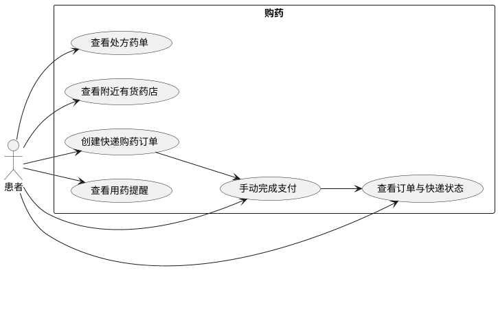

### 7.2 页面范围与界面形态

购药 Tab 首屏展示已签发处方。用户选择处方后，前端请求附近有货药店，按“药品可售、总价、距离、快递配送时效”排序。仅支持 `COURIER` 快递配送，不展示自提或配送方式选择。

| 区域   | 页面元素              | 接口依赖                                      | 交互规则               |
| ---- | ----------------- | ----------------------------------------- | ------------------ |
| 处方列表 | 医生、开具时间、药品数、状态    | `GET /prescriptions`                      | 选择处方查看详情           |
| 处方详情 | 药品、规格、用法用量、解读入口   | `GET /prescriptions/{prescriptionId}`     | 可查看处方解读            |
| 药店推荐 | 药店名、距离、价格、库存、快递标签 | `GET /pharmacies/inventory`               | 默认按可供药品/价格/距离/时效排序 |
| 收货地址 | 地址选择或填写           | 前端地址状态                                    | 未填写不可创建订单          |
| 订单确认 | 药品明细、配送地址、总价      | `POST /drug-orders`                       | 确认后生成待支付订单         |
| 支付结果 | 支付状态、倒计时、订单详情     | `POST /payments/{paymentId}/simulate-pay` | 用户手动输入密码完成演示支付     |
| 用药提醒 | 用药计划列表、暂停/完成      | `GET/PATCH /medication-plans`             | 支付完成后刷新            |
|      |                   |                                           |                    |

### 7.3 购药与快递配送时序

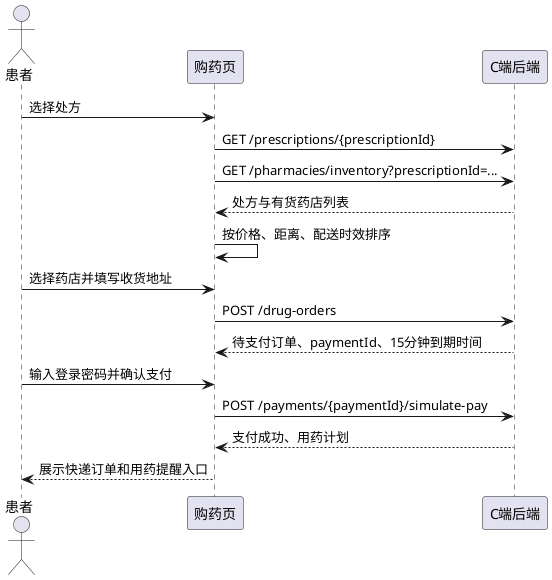

### 7.4 页面状态

| 场景 | 展示规则 | 用户动作 |
| --- | --- | --- |
| 无处方 | 空态说明“暂无可购药处方” | 前往就诊助手 |
| 药店库存不足 | 显示库存不足提示 | 更换药店或等待补货 |
| 未填写地址 | 确认下单按钮禁用 | 填写收货地址 |
| 待支付 | 显示 15 分钟倒计时 | 手动支付或取消订单 |
| 支付超时 | 刷新订单为已过期 | 返回处方重新选择药店 |
| 支付成功 | 展示快递配送状态与提醒入口 | 查看订单、管理提醒 |

## 8. 模块 M4：我的

### 8.1 用例图

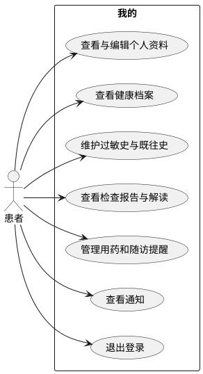

### 8.2 页面范围与界面形态

我的 Tab 参考图 4，顶部为就诊人卡片和就诊码，中部为常用工具宫格，底部为就诊人管理、地址、反馈等设置项。身份证号与手机号必须使用后端返回的脱敏值。

| 区域    | 页面元素                   | 接口依赖                                                 | 交互规则          |
| ----- | ---------------------- | ---------------------------------------------------- | ------------- |
| 就诊人卡片 | 姓名、登记号、脱敏身份证/手机、就诊码    | `GET /profile`                                       | 点击进入资料编辑      |
| 常用工具  | 我的处方、诊断、就诊记录、缴费、报告、云影像 | 对应列表接口                                               | 未实现功能显示“暂未开放” |
| 健康档案  | 过敏史、既往史、就诊汇总           | `GET /health-record`                                 | 支持新增/更新健康资料   |
| 检查报告  | 报告列表、详情、解读             | `GET /reports`、`GET /reports/{reportId}`             | 解读页显示免责声明     |
| 提醒与随访 | 用药计划、随访计划              | `GET/PATCH /medication-plans`、`GET/POST /follow-ups` | 支持暂停、完成、确认    |
| 通知    | 未读/全部通知                | `GET /notifications`                                 | 打开后标记已读       |
| 账户设置  | 修改密码、退出登录              | `PUT /auth/password`、`POST /auth/logout`             | 二次确认后退出       |

### 8.3 我的页面初始化时序

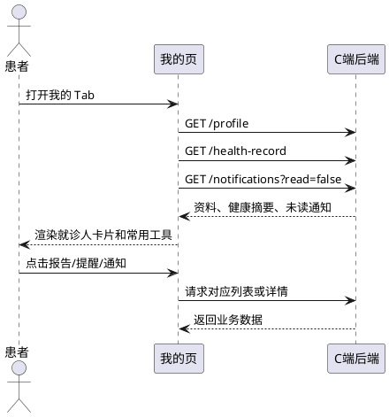

## 9. 全局 AI 助手悬浮球（预留）

### 9.1 能力边界

AI 悬浮球固定在四个 Tab 的右下角，点击后打开 AI 助手抽屉；移动端窄屏可转为全屏会话页。该模块待 Agent 服务端提供接口，前端不能直接调用医疗决策或支付能力。

| 能力 | 前端交互 | 后端依赖状态 |
| --- | --- | --- |
| 智能导诊 | 会话中输入症状，显示建议科室与免责声明 | 待 Agent 模块提供 |
| 挂号引导 | 展示医生/号源确认卡片，跳转传统锁号接口 | Agent 预留 + 传统接口已存在 |
| 药店推荐 | 展示处方匹配药店、价格、距离、快递时效 | Agent 预留 + 药店库存接口已存在 |
| 购药草稿 | 展示订单确认卡片，用户确认后创建草稿 | 待 Agent 模块提供 |
| 用药提醒建议 | 展示建议频次和时间，用户确认后创建提醒 | 待 Agent 模块提供 |
| 支付 | 仅跳转普通支付页面 | 禁止 Agent 代付 |

### 9.2 用例图

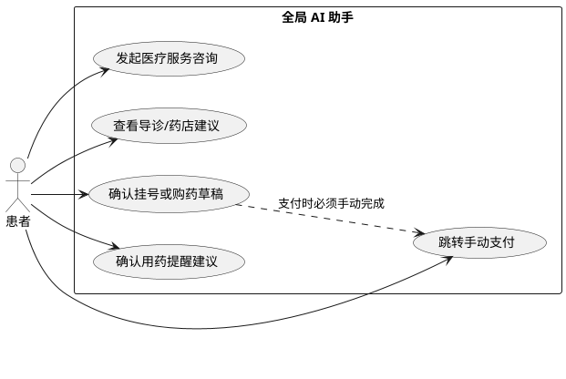

### 9.3 Agent 操作确认时序

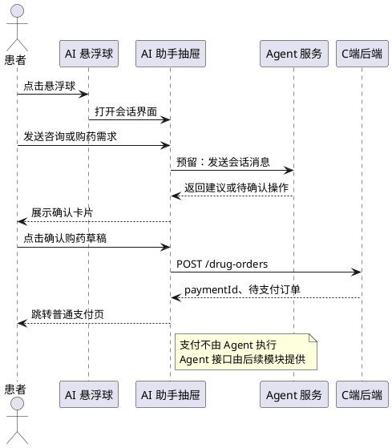

### 9.4 预留接口契约

| 接口 | 用途 | 前端状态 | 说明 |
| --- | --- | --- | --- |
| `POST /api/c/v1/agent/conversations` | 创建或继续会话 | 会话 ID、消息列表 | 待 Agent 模块提供 |
| `POST /api/c/v1/agent/conversations/{id}/messages` | 发送患者消息 | 发送中、流式/完成态 | 待 Agent 模块提供 |
| `GET /api/c/v1/agent/actions/{actionId}` | 获取待确认操作 | 确认卡片 | 待 Agent 模块提供 |
| `POST /api/c/v1/agent/actions/{actionId}/confirm` | 确认 L2 业务操作 | 确认中、成功/失败 | 待 Agent 模块提供 |
| `POST /api/c/v1/agent/actions/{actionId}/reject` | 拒绝建议操作 | 卡片关闭 | 待 Agent 模块提供 |

## 10. 接口依赖与字段映射

### 10.1 传统业务接口

| 页面能力 | 接口 | 关键响应字段 | 前端处理 |
| --- | --- | --- | --- |
| 登录 | `POST /auth/login` | `accessToken`、`refreshToken`、`user` | 写入认证 Store，跳转首页 |
| 个人资料 | `GET/PUT /profile` | `name`、`phone`、`idCardNo` | 仅展示脱敏值 |
| 挂号记录 | `GET /appointments` | `status`、`expireAt`、医生/科室/时段 | 计算进度和倒计时 |
| 锁号/取消 | `POST /appointments`、`POST /appointments/{id}/cancel` | `appointmentId`、`paymentId` | 操作按钮防重、刷新列表 |
| 问诊 | `GET /consultations`、`POST /consultations/{id}/messages` | `status`、`messages` | 消息按时间滚动与发送态 |
| 处方 | `GET /prescriptions`、`GET /prescriptions/{id}` | 药品、用法用量 | 购药入口与处方详情 |
| 药店推荐 | `GET /pharmacies/inventory` | 药店、距离、库存、价格 | 排序后展示快递标签 |
| 购药订单 | `POST/GET /drug-orders` | `drugOrderId`、`paymentId`、`expireAt` | 待支付倒计时与订单详情 |
| 支付 | `POST /payments/{paymentId}/simulate-pay` | `status`、`paidAt` | 用户手动输入密码后支付 |
| 健康管理 | `/health-record`、`/reports`、`/medication-plans`、`/follow-ups` | 档案/报告/提醒数据 | 分页、编辑与状态更新 |
| 通知 | `GET /notifications`、`POST /notifications/{id}/read` | `read`、`createdAt` | 未读角标与已读更新 |

### 10.2 页面字段脱敏规则

| 字段 | 展示示例 | 规则 |
| --- | --- | --- |
| 手机号 | `138****8000` | 保留前 3 位和后 4 位 |
| 身份证号 | `1101********1234` | 保留前 4 位和后 4 位 |
| 就诊卡号 | `4107********9516` | 保留前 4 位和后 4 位 |
| 密码 | 不展示 | 不写入页面状态、日志或埋点 |

## 11. 前端错误处理与页面反馈

| 业务码 | 页面反馈 | 前端动作 |
| --- | --- | --- |
| `00000` | 请求成功 | 更新 Query 缓存或 Store |
| `A0301` | 登录已失效 | 清理登录态，跳转登录页 |
| `A0400/A0420/A0430` | 输入内容不符合要求 | 标记表单字段并显示错误说明 |
| `A0441` | 支付已超时 | 刷新订单，展示重新购药/挂号入口 |
| `A0443` | 当前状态不可操作 | 刷新详情并禁用无效操作 |
| `A0506` | 请勿重复提交 | 保留首次结果，结束按钮加载态 |
| `B0201` | 号源已被预约 | 推荐其他时段或候补登记 |
| `B0300` | 药品库存不足 | 提示更换药店 |
| 网络错误 | 网络连接异常 | 保留页面数据并提供重试 |

## 12. 埋点与非功能要求

### 12.1 业务埋点

| 事件 | 触发时机 | 属性 |
| --- | --- | --- |
| `home_quick_entry_click` | 点击首页快捷入口 | `entryType`、`patientId` |
| `appointment_start` | 开始挂号 | `source`、`departmentId` |
| `appointment_lock_result` | 锁号返回 | `result`、`errorCode`、`traceId` |
| `consultation_enter` | 进入问诊详情 | `consultationId`、`status` |
| `pharmacy_recommend_view` | 展示药店推荐 | `prescriptionId`、`pharmacyCount` |
| `drug_order_create` | 创建购药订单 | `pharmacyId`、`amountCent` |
| `agent_float_open` | 打开 AI 悬浮球 | `currentTab` |
| `agent_action_confirm` | 确认 Agent 操作 | `actionType`、`result` |

### 12.2 性能与适配

- 四个 Tab 采用保活策略，保留滚动位置、筛选条件和已加载列表；订单和倒计时数据在重新进入页面时刷新。
- 处方、报告、通知、问诊记录使用分页和骨架屏，避免首屏加载完整历史数据。
- 图片使用压缩资源和懒加载；医院品牌图不阻塞快捷入口渲染。
- H5 页面按 375px 设计基准适配，保证 320px 至 430px 宽度下文字、按钮和卡片不溢出。
- AI 会话抽屉与网络请求超时后显示“处理中”状态；不阻塞传统挂号、购药页面操作。

## 13. 联调边界

### 13.1 前端负责

- 四个 Tab 页面、路由、状态管理、表单校验、脱敏展示和错误反馈。
- 对传统 C 端 API 的请求封装、幂等键生成、支付前确认和订单倒计时展示。
- AI 悬浮球、会话 UI、确认卡片和预留接口状态。

### 13.2 后端依赖

- C 端后端按 `00000` 和五位业务码返回统一响应。
- 挂号、购药订单返回明确状态、到期时间、支付单 ID 和 `traceId`。
- 药店库存接口返回快递配送所需的药店、库存、价格、距离和配送时效字段。
- 用药计划、随访、通知接口提供用户归属校验和状态更新能力。

### 13.3 待 Agent 模块确认

- 会话是否使用流式输出，以及流式消息协议。
- Agent 建议、确认卡片、拒绝操作和操作结果的字段结构。
- Agent 创建购药草稿、提醒建议时与传统 C 端订单/提醒接口的职责边界。
- Agent 失败、超时或越权时的统一错误码与降级文案。

## 14. 风险与应对

| 风险 | 影响 | 应对 |
| --- | --- | --- |
| 号源被并发抢完 | 用户无法挂号 | 展示库存不足、其他时段和候补入口 |
| 支付超时 | 锁定订单失效 | 倒计时、明确超时提示、刷新订单状态 |
| 药店库存变化 | 购药下单失败 | 创建订单前刷新库存，提示更换药店 |
| Agent 服务未完成 | AI 入口不可用 | 悬浮球显示“功能准备中”，传统入口不受影响 |
| 医疗建议误解 | 用户误用建议 | 所有 AI 内容固定展示医疗免责声明 |
| 敏感信息泄露 | 患者隐私风险 | 统一脱敏、禁止记录密码和 Token |

## 15. 前端工作量汇总

| 阶段 | 页面/能力 | 交付目标 |
| --- | --- | --- |
| 第一阶段 | 登录、首页、手动挂号、就诊助手 | 完成 MVP 挂号闭环 |
| 第二阶段 | 问诊、处方、购药、快递订单、支付 | 完成诊后购药闭环 |
| 第三阶段 | 我的、健康档案、报告、提醒、随访、通知 | 完成健康管理闭环 |
| 第四阶段 | AI 悬浮球、会话 UI、确认卡片 | 对接后续 Agent 模块 |

## 16. 总结

C 端 H5 以前台四个 Tab 承载患者高频服务，以全局 AI 悬浮球承载后续智能能力。传统业务可独立完成登录、挂号、问诊、购药、快递配送、提醒和档案管理；Agent 能力作为可插拔增强层，不影响传统业务主链路。
