# 智愈先锋 C 端传统业务后端系统分析与设计

| 项目 | 内容 |
| --- | --- |
| 产品名称 | 智愈先锋 AI 驱动医疗健康平台 |
| 文档范围 | H5 C 端传统业务，不包含 Agent 对话、工具调用、确认编排与审计接口 |
| 文档版本 | V1.0 |
| 技术基线 | Java 21、Spring Boot、PostgreSQL、Redis |
| 编写日期 | 2026-07-28 |

## 1. 变更记录

| 日期 | 版本 | 修订说明 | 作者 |
| --- | --- | --- | --- |
| 2026-07-28 | V1.0 | 初版：C 端传统业务系统分析与接口设计 | 后端团队 |

## 2. 项目背景与边界

患者通过 H5 完成账号注册登录、手动挂号、文字问诊、处方购药和健康管理。C 端账号系统与医院 B 端账号系统完全独立：两端不共享用户表、角色、JWT 签发密钥、刷新令牌或权限。

本期 MVP 必做：认证、科室/医生/号源查询、挂号锁号、防超卖、模拟支付和挂号订单。在线问诊、购药、档案、提醒和随访按完整闭环设计。所有导诊、报告和处方解读仅展示健康说明，不得形成诊断结论、修改处方或替代执业医生。

### 2.1 功能模块树

```text
C 端传统业务
├── 认证与个人资料（MVP）
│   ├── 图形验证码、注册、登录、刷新令牌、退出
│   └── 个人资料、密码修改
├── 手动挂号（MVP）
│   ├── 科室、医生、号源查询
│   ├── 锁号、取消、候补、模拟支付
│   └── 订单与支付状态查询
├── 在线问诊（扩展）
│   ├── 预问诊、文字消息、问诊记录
│   └── 处方与处方解读
├── 处方购药（扩展）
│   ├── 药店库存查询、购药草稿、模拟支付
│   └── 药品订单查询
└── 健康管理（扩展）
    ├── 档案、过敏史、既往史、检查报告
    ├── 用药计划、随访计划
    └── 通知
```

### 2.2 项目结构
```
c-end/backend       // C 端独立 Spring Boot 服务，端口 8082
    └── src/main/
        ├── java/com/sphp/patient/
        │   ├── PatientApplication.java  // C 端启动类
        │   ├── config/       // CORS、Jackson、WebMvc、定时任务配置
        │   ├── filter/  // C 端 JWT 认证、TraceId、幂等请求过滤器
        │   ├── support/
        │   │   ├── idempotency/     // 幂等键处理
        │   │   ├── inventory/    // Redis Lua 锁库存、库存补偿
        │   │   ├── payment/     // 模拟支付、支付回调分发
        │   │   └── job/      // 超时释放、提醒、通知任务
        │   └── modules/
        │       ├── auth/    // 注册、登录、Token、密码
        │       ├── triage/    // 症状导诊、导诊评估记录
        │       ├── registration/ // 科室/医生/号源查询、挂号、候补
        │       ├── consultation/      // 预问诊、文字问诊、处方查询与解读
        │       ├── order/      / 药店库存查询、购药订单、支付单
        │       ├── health/    // 档案、过敏史、既往史、报告、提醒、随访
        │       └── notification/     // 站内通知、已读状态
        └── resources/
            ├── application.yml  // C 端服务配置
            └── mapper/           // MyBatis XML（仅复杂 SQL）
```

#### 职责边界

| 模块             | 职责                        | 禁止事项                           |
| -------------- | ------------------------- | ------------------------------ |
| `sphp-shared`  | 返回体、异常、通用枚举、JWT 公共能力、基础配置 | 禁止依赖 C/B 业务模块；禁止写业务 Controller |
| `auth`         | C 端独立账号、图形验证码、Token、密码校验  | 禁止读取 B 端账号或权限数据                |
| `triage`       | 导诊评估及评估记录                 | 禁止输出诊断结论、处方或治疗决定               |
| `registration` | 号源、挂号、候补、挂号订单查询           | 禁止直接处理支付密码                     |
| `consultation` | 预问诊、消息、处方查询/解读            | 禁止开方、修改已签发处方                   |
| `order`        | 药店库存、仅快递配送购药订单、支付单        | 禁止将支付逻辑散落到挂号/健康模块              |
| `health`       | 档案、报告、用药提醒、随访             | 禁止访问其他患者的健康记录                  |
| `notification` | C 端通知查询与已读                | 禁止依赖 B 端用户体系                   |
| `support`      | 幂等、锁库存、超时释放、支付回调、异步任务     | 禁止暴露 Controller 或承载业务编排        |
### 2.3 后端技术栈
| 类别       | 技术/组件                  | 版本                       | 用途                                            |
| -------- | ---------------------- | ------------------------ | --------------------------------------------- |
| 开发语言     | Java                   | `17`（当前 POM）             | C 端后端开发语言；若要与系分的 Java 21 约束一致，应将父 POM 改为 `21` |
| 应用框架     | Spring Boot            | `3.5.3`                  | Web 服务、配置管理、依赖注入、定时任务                         |
| Web 框架   | Spring MVC             | 随 Spring Boot `3.5.3`    | RESTful API、参数校验、全局异常处理                       |
| ORM 框架   | MyBatis-Plus           | `3.5.7`                  | PostgreSQL 数据访问、Mapper、分页查询                   |
| 关系数据库    | PostgreSQL + pgvector  | `16`                     | C 端账号、挂号、问诊、购药、健康档案等数据存储                      |
| 缓存       | Redis                  | `7`                      | Token 会话、图形验证码、幂等键、号源/库存预扣                    |
| 消息队列     | RabbitMQ               | 建议固定 `3.13.x-management` | 支付超时释放、通知投递、用药提醒、随访任务等异步处理                    |
| 身份认证     | JWT                    | `0.12.6`                 | C 端独立 JWT Access Token / Refresh Token        |
| 参数校验     | Jakarta Validation     | 随 Spring Boot `3.5.3`    | 请求 DTO 的非空、长度、格式校验                            |
| JSON 序列化 | Jackson                | 随 Spring Boot `3.5.3`    | 请求/响应 JSON、时间格式化                              |
| 数据库驱动    | PostgreSQL JDBC Driver | 由 Spring Boot BOM 管理     | Java 连接 PostgreSQL                            |
| 构建工具     | Maven                  | `3.9+` 建议                | 多模块构建与依赖管理                                    |
| 简化开发     | Lombok                 | 由 Spring Boot BOM 管理     | 实体、DTO、日志等样板代码简化                              |
| 简化开发     | HuTool                 | 由 Spring Boot BOM 管理     | 提供各种便捷工具类                                     |


### 2.3 核心业务流程

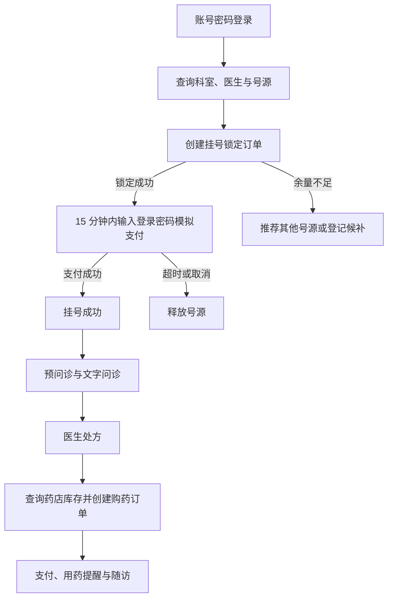


> **演示环境安全说明：** 本项目为本地/课堂演示，密码、手机号、身份证号和药店联系电话按存储。任何生产环境、联网部署或真实患者数据场景，必须改用 BCrypt 密码哈希、敏感字段加密与访问审计。接口响应不得返回密码，手机号和身份证号仅以 `***` 形式脱敏展示。
## 3. 全局接口约定

### 3.1 基础约定

- 基础路径：`/api/c/v1`。
- 除验证码、注册、登录和刷新令牌外，所有接口携带 `Authorization: Bearer {accessToken}`。
- 所有创建型接口携带 `X-Idempotency-Key`，服务端以“用户 ID + 接口路径 + 幂等键”在 Redis 保存 24 小时结果。
- 时间使用 ISO-8601、东八区，例如 `2026-07-28T09:00:00+08:00`；金额使用分的整数 `amountCent`。
- HTTP 状态码仅表达协议处理结果：参数校验通常使用 `400`，未认证 `401`，无权限 `403`，资源不存在 `404`，状态冲突/库存不足 `409`，限流 `429`。业务码始终按本节五位编码返回，后二者不存在编号映射关系。

### 3.2 统一响应格式

```json
{
    "code":  "00000",
    "message":  "操作成功",
    "data":  {

             },
    "traceId":  "01J7X..."
}
```

| 字段      | 类型     | 说明                     |
| ------- | ------ | ---------------------- |
| code    | string | 五位字符串业务码；成功固定为 `00000` |
| message | string | 面向调用方的简要消息             |
| data    | object | 当前接口的业务数据，失败时为 `null`  |
| traceId | string | 请求追踪 ID                |

列表 `data` 固定为：

```json
{
    "pageNo":  1,
    "pageSize":  20,
    "total":  100,
    "records":  [

                ]
}
```

### 3.3 业务码规范

参考阿里Java开发手册，业务码为字符串类型，共五位：首位表示错误来源，后四位为编号。编号按大类预留 100 的间隔；后三位与 HTTP 状态码无关。

| 代码 | 中文描述 | 来源 | 使用场景 |
| --- | --- | --- | --- |
| `00000` | 一切正常 | 成功 | 请求正确执行后的返回 |
| `A0111` | 账号已存在 | 用户 | 注册账号重复 |
| `A0120` | 密码校验失败 | 用户 | 登录、修改密码或模拟支付密码不正确/不合规 |
| `A0203` | 账号已停用 | 用户 | 已停用账号尝试登录 |
| `A0210` | 用户登录失败 | 用户 | 账号不存在或登录密码错误 |
| `A0211` | 用户输入密码错误次数超限 | 用户 | 登录失败次数超过限制 |
| `A0230` | 用户登录已过期 | 用户 | 刷新令牌已过期 |
| `A0240` | 用户验证码错误 | 用户 | 图形验证码错误、过期或已使用 |
| `A0241` | 用户验证码尝试次数超限 | 用户 | 验证码请求或校验超过频控阈值 |
| `A0301` | 访问未授权 | 用户 | 缺少有效令牌或访问非本人资源 |
| `A0341` | 用户签名异常 | 用户 | 支付渠道回调签名不匹配 |
| `A0400` | 用户请求参数错误 | 用户 | 参数格式、必填项或资料校验失败 |
| `A0402` | 无效的用户输入 | 用户 | 路径或查询中指定的业务资源不存在 |
| `A0420` | 请求参数值超出允许范围 | 用户 | 日期、分页大小或枚举值超出允许范围 |
| `A0430` | 用户输入内容非法 | 用户 | 症状、消息等内容为空、超长或不合规 |
| `A0441` | 用户支付超时 | 用户 | 超过 15 分钟支付窗口 |
| `A0443` | 订单已关闭或状态不可操作 | 用户 | 已关闭订单、未支付挂号或不允许的状态转换 |
| `A0501` | 请求次数超出限制 | 用户 | 用户访问超过频率限制 |
| `A0506` | 用户重复请求 | 用户 | 幂等键冲突、重复挂号、重复候补或重复创建问诊 |
| `B0001` | 系统执行出错 | 系统 | 系统内部未预期异常 |
| `B0201` | 系统高并发库存竞争 | 系统 | 抢号、锁号时库存已被并发请求占用 |
| `B0202` | 系统业务状态冲突 | 系统 | 解读尚未生成、资源状态冲突等业务处理失败 |
| `B0300` | 系统资源或库存不足 | 系统 | 药品库存不足 |
| `C0001` | 调用第三方服务出错 | 第三方 | 第三方支付、消息或外部服务调用失败 |
| `C0200` | 第三方系统执行超时 | 第三方 | 支付、消息等第三方服务超时 |
| `C0500` | 通知服务出错 | 第三方 | 短信、站内通知等投递失败 |

### 3.4 核心状态

| 领域 | 状态 |
| --- | --- |
| 挂号订单 | `LOCKED`、`PAID`、`CANCELLED`、`EXPIRED` |
| 购药订单 | `DRAFT`、`PENDING_PAYMENT`、`PAID`、`CANCELLED`、`EXPIRED` |
| 支付单 | `PENDING`、`SUCCESS`、`FAILED`、`CLOSED` |
| 问诊 | `PENDING`、`IN_PROGRESS`、`COMPLETED` |
| 提醒 | `ACTIVE`、`PAUSED`、`COMPLETED` |
| 随访 | `PENDING_CONFIRM`、`CONFIRMED`、`COMPLETED`、`CANCELLED` |

## 4. 核心领域模型

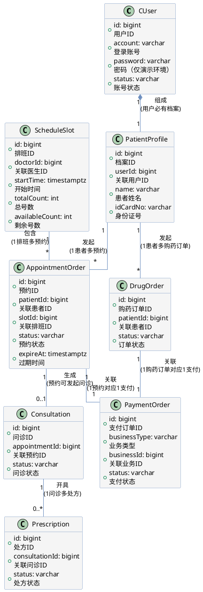

## 5. API 设计

每个接口的流程图和 PlantUML 时序图后均紧跟 `RESTFUL API设计`，用于定义请求参数、格式化响应示例和错误码。

### 5.1 认证与个人资料（MVP）

#### 5.1.1 获取图形验证码

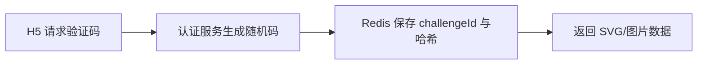

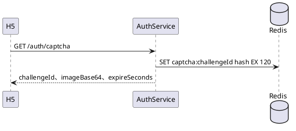

##### RESTFUL API设计

**接口路径：** GET /auth/captcha

**接口信息：** 无需鉴权；用于注册前取得一次性图形验证码。

**请求参数：** 无。

**响应示例：**
```json
{
    "code":  "00000",
    "message":  "获取验证码成功",
    "data":  {
                 "challengeId":  "cap_01J7X8A2",
                 "imageBase64":  "data:image/svg+xml;base64,PHN2Zy...",
                 "expireSeconds":  120
             },
    "traceId":  "01J7X8B3"
}
```

#### 5.1.2 注册 C 端账号

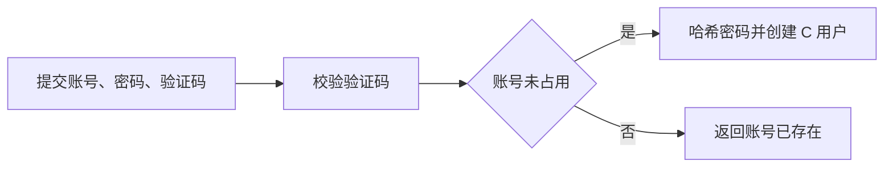

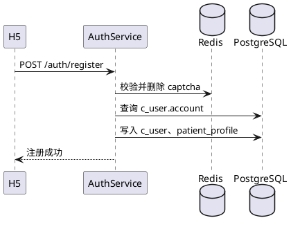

##### RESTFUL API设计

**接口路径：** POST /auth/register

**请求参数：**

| 参数 | 位置 | 类型 | 必填 | 描述 | 示例/默认值 |
| --- | --- | --- | --- | --- | --- |
| account | Body | String | 是 | C 端唯一登录账号，4 至 32 位 | `patient_zhangsan` |
| password | Body | String | 是 | 登录密码，8 至 64 位，仅通过 TLS 传输 | `P@ssw0rd123` |
| challengeId | Body | String | 是 | 获取图形验证码时返回的挑战标识 | `cap_01J7X8A2` |
| captchaCode | Body | String | 是 | 用户填写的图形验证码 | `A7K9` |

**响应示例：**
```json
{
    "code":  "00000",
    "message":  "注册成功",
    "data":  {
                 "userId":  10001,
                 "account":  "patient_zhangsan"
             },
    "traceId":  "01J7X8C4"
}
```

| 错误码 | HTTP 状态 | 含义 | 触发场景 |
| --- | --- | --- | --- |
| A0240 | 400 | 图形验证码无效 | 验证码错误、过期或已使用 |
| A0111 | 409 | 登录账号已存在 | `account` 与已有 C 端账号重复 |
| A0120 | 400 | 密码格式不合法 | 密码长度或复杂度不满足规则 |

#### 5.1.3 账号密码登录

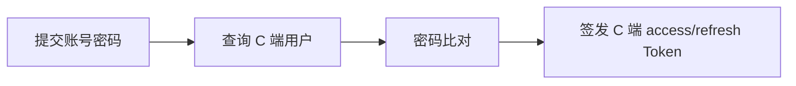

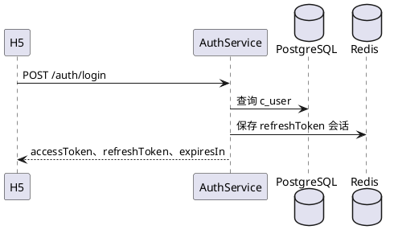

##### RESTFUL API设计

**接口路径：** POST /auth/login

**请求参数：**

| 参数 | 位置 | 类型 | 必填 | 描述 | 示例/默认值 |
| --- | --- | --- | --- | --- | --- |
| account | Body | String | 是 | C 端登录账号 | `patient_zhangsan` |
| password | Body | String | 是 | 登录密码 | `P@ssw0rd123` |

**响应示例：**
```json
{
    "code":  "00000",
    "message":  "登录成功",
    "data":  {
                 "accessToken":  "eyJhbGciOiJIUzI1NiJ9...",
                 "refreshToken":  "rt_01J7X8D5...",
                 "expiresIn":  7200,
                 "user":  {
                              "id":  10001,
                              "account":  "patient_zhangsan"
                          }
             },
    "traceId":  "01J7X8E6"
}
```

| 错误码 | HTTP 状态 | 含义 | 触发场景 |
| --- | --- | --- | --- |
| A0210 | 401 | 账号或密码错误 | 账号不存在或 输入密码与已保存密码不一致 |
| A0203 | 403 | 账号已被停用 | `c_user.status` 为 `DISABLED` |
| A0211 | 429 | 登录暂时锁定 | 连续失败 5 次后的 15 分钟锁定期内 |

#### 5.1.4 刷新访问令牌

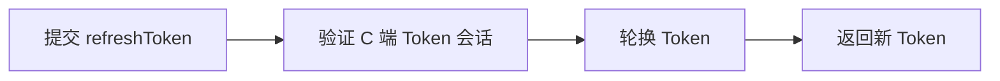

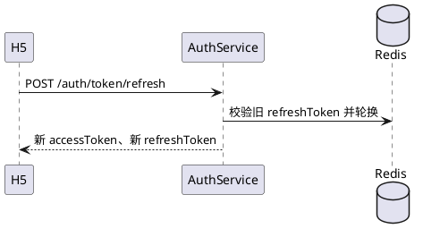

##### RESTFUL API设计

**接口路径：** POST /auth/token/refresh

**请求参数：**

| 参数 | 位置 | 类型 | 必填 | 描述 | 示例/默认值 |
| --- | --- | --- | --- | --- | --- |
| refreshToken | Body | String | 是 | 登录成功后取得的 C 端刷新令牌 | `rt_01J7X8D5...` |

**响应示例：**
```json
{
    "code":  "00000",
    "message":  "令牌刷新成功",
    "data":  {
                 "accessToken":  "eyJhbGciOiJIUzI1NiJ9.new...",
                 "refreshToken":  "rt_01J7X9F7...",
                 "expiresIn":  7200
             },
    "traceId":  "01J7X9G8"
}
```

| 错误码 | HTTP 状态 | 含义 | 触发场景 |
| --- | --- | --- | --- |
| A0301 | 401 | 刷新令牌无效 | 令牌格式不正确、签名错误或已撤销 |
| A0230 | 401 | 刷新令牌已过期 | 超过刷新令牌有效期 |

#### 5.1.5 退出登录


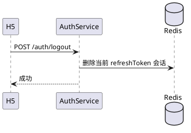

##### RESTFUL API设计

**接口路径：** POST /auth/logout

**请求参数：**

| 参数 | 位置 | 类型 | 必填 | 描述 | 示例/默认值 |
| --- | --- | --- | --- | --- | --- |
| Authorization | Header | String | 是 | 当前 C 端访问令牌 | `Bearer eyJ...` |
| refreshToken | Body | String | 是 | 需要撤销的刷新令牌 | `rt_01J7X9F7...` |

**响应示例：**
```json
{
    "code":  "00000",
    "message":  "退出登录成功",
    "data":  {
                 "loggedOut":  true
             },
    "traceId":  "01J7X9H9"
}
```

| 错误码 | HTTP 状态 | 含义 | 触发场景 |
| --- | --- | --- | --- |
| A0301 | 401 | 当前会话无效 | accessToken 或 refreshToken 已失效 |

#### 5.1.6 查询和更新个人资料
##### 查询
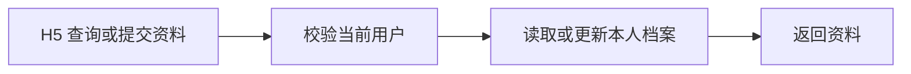

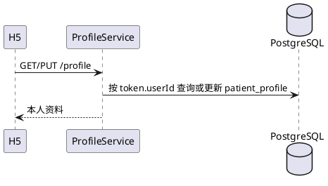

###### RESTFUL API设计

**接口路径：** GET /profile

**请求参数：**

| 参数 | 位置 | 类型 | 必填 | 描述 | 示例/默认值 |
| --- | --- | --- | --- | --- | --- |
| Authorization | Header | String | 是 | 当前 C 端访问令牌 | `Bearer eyJ...` |

**响应示例：**

```json
{
    "code":  "00000",
    "message":  "查询成功",
    "data":  {
                 "id":  20001,
                 "name":  "张三",
                 "gender":  "MALE",
                 "birthday":  "1990-05-20",
                 "phone":  "138****8000",
                 "emergencyContact":  "李四 139****9000"
             },
    "traceId":  "01J7X9J0"
}
```

| 错误码 | HTTP 状态 | 含义 | 触发场景 |
| --- | --- | --- | --- |
| A0301 | 401 | 未登录或令牌失效 | 未携带有效 C 端 accessToken |

##### 更新

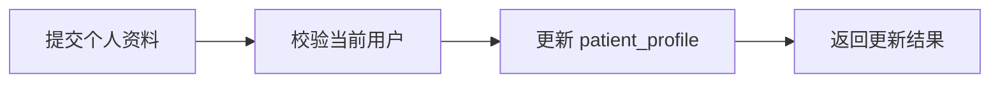

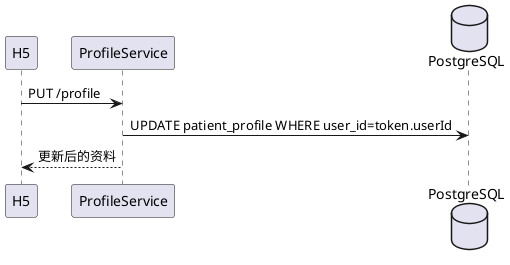
###### RESTFUL API设计
**接口路径：** PUT /profile
**请求参数：**

| 参数             | 位置   | 类型   | 必填 | 描述              | 示例/默认值        |
| ---------------- | ------ | ------ | ---- | ----------------- | ------------------ |
| Authorization    | Header | String | 是   | 当前 C 端访问令牌 | `Bearer eyJ...`    |
| name             | Body   | String | 是   | 患者姓名          | `张三`             |
| gender           | Body   | String | 否   | 性别枚举          | `MALE`             |
| birthday         | Body   | Date   | 否   | 出生日期          | `1990-05-20`       |
| phone            | Body   | String | 否   | 联系电话          | `13800138000`      |
| emergencyContact | Body   | String | 否   | 紧急联系人及电话  | `李四 13900139000` |

**响应示例：**

```json
{
    "code":  "00000",
    "message":  "个人资料已更新",
    "data":  {
                 "id":  20001,
                 "name":  "张三",
                 "phone":  "138****8000",
                 "updatedAt":  "2026-07-28T10:00:00+08:00"
             },
    "traceId":  "01J7X9K1"
}
```

| 错误码 | HTTP 状态 | 含义             | 触发场景                       |
| ------ | --------- | ---------------- | ------------------------------ |
| A0400  | 400       | 资料字段校验失败 | 姓名、日期或联系方式格式不合法 |
| A0301  | 401       | 未登录或令牌失效 | 未携带有效 C 端 accessToken    |

#### 5.1.7 修改登录密码

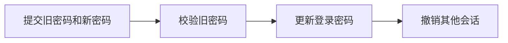

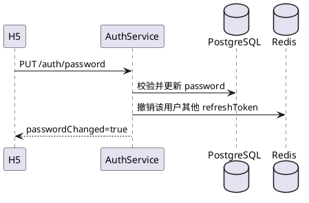

##### RESTFUL API设计

**接口路径：** PUT /auth/password

**请求参数：**

| 参数 | 位置 | 类型 | 必填 | 描述 | 示例/默认值 |
| --- | --- | --- | --- | --- | --- |
| Authorization | Header | String | 是 | 当前 C 端访问令牌 | `Bearer eyJ...` |
| oldPassword | Body | String | 是 | 当前登录密码 | `P@ssw0rd123` |
| newPassword | Body | String | 是 | 新登录密码，8 至 64 位 | `NewP@ssw0rd123` |

**响应示例：**
```json
{
    "code":  "00000",
    "message":  "密码修改成功",
    "data":  {
                 "passwordChanged":  true
             },
    "traceId":  "01J7X9L2"
}
```

| 错误码 | HTTP 状态 | 含义 | 触发场景 |
| --- | --- | --- | --- |
| A0120 | 400 | 当前密码不正确 | `oldPassword` 与已保存密码不一致 |
| A0120 | 400 | 新密码格式不合法 | 新密码不符合长度或复杂度规则 |

### 5.2 挂号资源查询与导诊（MVP）

#### 5.2.1 查询科室

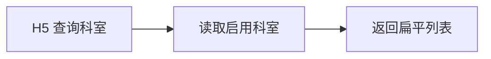

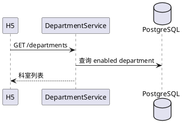

##### RESTFUL API设计

**接口路径：** GET /departments

**请求参数：**

| 参数            | 位置     | 类型     | 必填  | 描述         | 示例/默认值          |
| ------------- | ------ | ------ | --- | ---------- | --------------- |
| Authorization | Header | String | 是   | 当前 C 端访问令牌 | `Bearer eyJ...` |
| keyword       | Query  | String | 否   | 按科室名称模糊搜索  | `呼吸`            |
|               |        |        |     |            |                 |

**响应示例：**
```json
{
    "code":  "00000",
    "message":  "查询成功",
    "data":  [
                 {
                     "id":  301,
                     "name":  "呼吸内科",
                     "description":  "呼吸系统疾病诊疗"
                 }
             ],
    "traceId":  "01J7X9M3"
}
```

| 错误码 | HTTP 状态 | 含义 | 触发场景 |
| --- | --- | --- | --- |
| A0301 | 401 | 未登录或令牌失效 | 未携带有效 C 端 accessToken |

#### 5.2.2 查询医生

```mermaid
flowchart LR
    A[H5 按科室筛选] --> B[过滤在岗医生] --> C[返回医生与号源概览]
```

```plantuml
@startuml
participant H5
participant DoctorService
database PostgreSQL
H5 -> DoctorService: GET /doctors
DoctorService -> PostgreSQL: 查询启用医生与近期余量
DoctorService --> H5: 分页医生列表
@enduml
```

##### RESTFUL API设计

**接口路径：** GET /doctors

**请求参数：**

| 参数 | 位置 | 类型 | 必填 | 描述 | 示例/默认值 |
| --- | --- | --- | --- | --- | --- |
| Authorization | Header | String | 是 | 当前 C 端访问令牌 | `Bearer eyJ...` |
| departmentId | Query | Long | 是 | 需查询的科室 ID | `301` |
| date | Query | Date | 否 | 用于聚合号源余量的出诊日期 | `2026-07-30` |
| pageNo | Query | Integer | 否 | 页码，从 1 开始 | `1` |
| pageSize | Query | Integer | 否 | 每页条数，默认 20，最大 100 | `20` |

**响应示例：**
```json
{
    "code":  "00000",
    "message":  "查询成功",
    "data":  {
                 "pageNo":  1,
                 "pageSize":  20,
                 "total":  1,
                 "records":  [
                                 {
                                     "id":  401,
                                     "name":  "王医生",
                                     "title":  "主任医师",
                                     "specialty":  "哮喘、慢阻肺",
                                     "registrationFeeCent":  5000,
                                     "availableCount":  6
                                 }
                             ]
             },
    "traceId":  "01J7X9N4"
}
```

| 错误码 | HTTP 状态 | 含义 | 触发场景 |
| --- | --- | --- | --- |
| A0402 | 404 | 科室不存在或已停用 | `departmentId` 不可用于 C 端查询 |
| A0420 | 400 | 分页大小不合法 | `pageSize` 小于 1 或大于 100 |

#### 5.2.3 查询医生可预约时段

```mermaid
flowchart LR
    A[H5 选择医生和日期] --> B[查询已发布时段] --> C[返回实时余量]
```

```plantuml
@startuml
participant H5
participant ScheduleService
database Redis
database PostgreSQL
H5 -> ScheduleService: GET /doctors/{doctorId}/slots
ScheduleService -> Redis: 获取可用余量
ScheduleService -> PostgreSQL: 补充排班资料
ScheduleService --> H5: 时段及 availableCount
@enduml
```

##### RESTFUL API设计

**接口路径：** GET /doctors/{doctorId}/slots


**请求参数：**

| 参数 | 位置 | 类型 | 必填 | 描述 | 示例/默认值 |
| --- | --- | --- | --- | --- | --- |
| Authorization | Header | String | 是 | 当前 C 端访问令牌 | `Bearer eyJ...` |
| doctorId | Path | Long | 是 | 医生 ID | `401` |
| date | Query | Date | 是 | 查询指定日期的出诊时段 | `2026-07-30` |

**响应示例：**
```json
{
    "code":  "00000",
    "message":  "查询成功",
    "data":  [
                 {
                     "slotId":  501,
                     "startTime":  "2026-07-30T09:00:00+08:00",
                     "endTime":  "2026-07-30T09:30:00+08:00",
                     "feeCent":  5000,
                     "availableCount":  6,
                     "status":  "OPEN"
                 }
             ],
    "traceId":  "01J7X9P5"
}
```

| 错误码 | HTTP 状态 | 含义 | 触发场景 |
| --- | --- | --- | --- |
| A0402 | 404 | 医生不存在或不可预约 | `doctorId` 未找到或医生已停诊 |
| A0420 | 400 | 查询日期不合法 | 日期为空、已过期或超出放号周期 |

#### 5.2.4 提交症状获取导诊建议

```mermaid
flowchart LR
    A[提交症状] --> B[规则库匹配风险与科室] --> C[返回非诊断性建议]
```

```plantuml
@startuml
participant H5
participant TriageService
database PostgreSQL
H5 -> TriageService: POST /triage/assessments
TriageService -> PostgreSQL: 读取导诊规则与科室
TriageService --> H5: 推荐科室、风险提示
@enduml
```

##### RESTFUL API设计

**接口路径：** POST /triage/assessments


**请求参数：**

| 参数 | 位置 | 类型 | 必填 | 描述 | 示例/默认值 |
| --- | --- | --- | --- | --- | --- |
| Authorization | Header | String | 是 | 当前 C 端访问令牌 | `Bearer eyJ...` |
| symptom | Body | String | 是 | 患者当前症状描述，1 至 1000 字 | `咳嗽发热三天` |
| duration | Body | String | 否 | 症状持续时间 | `3天` |
| temperature | Body | Number | 否 | 最近一次体温，单位摄氏度 | `38.5` |
| medicalHistory | Body | String | 否 | 与本次症状相关的既往史 | `无慢性肺病` |

**响应示例：**
```json
{
    "code":  "00000",
    "message":  "导诊评估完成",
    "data":  {
                 "assessmentId":  601,
                 "urgency":  "MEDIUM",
                 "recommendedDepartments":  [
                                                {
                                                    "id":  301,
                                                    "name":  "呼吸内科",
                                                    "reason":  "症状与呼吸系统相关"
                                                }
                                            ],
                 "disclaimer":  "本结果仅供健康咨询参考，不替代医生诊断。"
             },
    "traceId":  "01J7X9Q6"
}
```

| 错误码 | HTTP 状态 | 含义 | 触发场景 |
| --- | --- | --- | --- |
| A0430 | 400 | 症状内容不合法 | 症状为空、超长或包含不允许内容 |
| A0301 | 401 | 未登录或令牌失效 | 未携带有效 C 端 accessToken |

### 5.3 挂号订单与模拟支付（MVP）

#### 5.3.1 创建挂号锁定订单

```mermaid
flowchart LR
    A[提交 slotId] --> B[幂等校验] --> C{Redis 原子预扣成功}
    C -->|是| D[事务创建锁定订单与支付单]
    C -->|否| E[返回号源不足]
```

```plantuml
@startuml
participant H5
participant AppointmentService
database Redis
database PostgreSQL
H5 -> AppointmentService: POST /appointments
AppointmentService -> Redis: Lua 原子扣减 slot 库存
alt 预扣成功
  AppointmentService -> PostgreSQL: 创建 LOCKED 订单和 PENDING 支付单
  AppointmentService --> H5: 订单、15 分钟到期时间
else 预扣失败
  AppointmentService --> H5: B0201
end
@enduml
```

##### RESTFUL API设计

**接口路径：** POST /appointments

**请求参数：**

| 参数 | 位置 | 类型 | 必填 | 描述 | 示例/默认值 |
| --- | --- | --- | --- | --- | --- |
| Authorization | Header | String | 是 | 当前 C 端访问令牌 | `Bearer eyJ...` |
| X-Idempotency-Key | Header | String | 是 | 防止重复锁号的客户端唯一请求键 | `uuid-v7` |
| slotId | Body | Long | 是 | 要预约的医生时段 ID | `501` |

**响应示例：**
```json
{
    "code":  "00000",
    "message":  "号源锁定成功，请在15分钟内完成支付",
    "data":  {
                 "appointmentId":  7001,
                 "status":  "LOCKED",
                 "amountCent":  5000,
                 "expireAt":  "2026-07-28T10:15:00+08:00",
                 "paymentId":  8001
             },
    "traceId":  "01J7X9R7"
}
```

| 错误码 | HTTP 状态 | 含义 | 触发场景 |
| --- | --- | --- | --- |
| B0201 | 409 | 号源已约满 | Redis 原子预扣时余量不足 |
| A0443 | 409 | 当前时段不可预约 | 时段停诊、未开放或已过期 |
| A0506 | 409 | 存在冲突的有效挂号 | 当前用户已预约同一时段 |
| A0506 | 409 | 幂等键参数不一致 | 同一幂等键对应不同业务请求 |

#### 5.3.2 查询挂号订单列表

```mermaid
flowchart LR
    A[H5 查询本人订单] --> B[按 patientId 分页] --> C[返回列表]
```

```plantuml
@startuml
participant H5
participant AppointmentService
database PostgreSQL
H5 -> AppointmentService: GET /appointments
AppointmentService -> PostgreSQL: 查询本人订单
AppointmentService --> H5: 分页订单
@enduml
```

##### RESTFUL API设计

**接口路径：** GET /appointments

**请求参数：**

| 参数 | 位置 | 类型 | 必填 | 描述 | 示例/默认值 |
| --- | --- | --- | --- | --- | --- |
| Authorization | Header | String | 是 | 当前 C 端访问令牌 | `Bearer eyJ...` |
| status | Query | String | 否 | 按订单状态筛选 | `PAID` |
| pageNo | Query | Integer | 否 | 页码，从 1 开始 | `1` |
| pageSize | Query | Integer | 否 | 每页条数 | `20` |

**响应示例：**
```json
{
    "code":  "00000",
    "message":  "查询成功",
    "data":  {
                 "pageNo":  1,
                 "pageSize":  20,
                 "total":  1,
                 "records":  [
                                 {
                                     "id":  7001,
                                     "doctorName":  "王医生",
                                     "departmentName":  "呼吸内科",
                                     "startTime":  "2026-07-30T09:00:00+08:00",
                                     "status":  "PAID",
                                     "amountCent":  5000,
                                     "expireAt":  null
                                 }
                             ]
             },
    "traceId":  "01J7X9S8"
}
```

| 错误码 | HTTP 状态 | 含义 | 触发场景 |
| --- | --- | --- | --- |
| A0420 | 400 | 分页大小不合法 | `pageSize` 小于 1 或大于 100 |

#### 5.3.3 查询挂号订单详情

```mermaid
flowchart LR
    A[H5 请求详情] --> B[校验订单归属] --> C[返回订单及支付信息]
```

```plantuml
@startuml
participant H5
participant AppointmentService
database PostgreSQL
H5 -> AppointmentService: GET /appointments/{appointmentId}
AppointmentService -> PostgreSQL: 查询订单且 patient_id=当前患者
AppointmentService --> H5: 订单详情
@enduml
```

##### RESTFUL API设计

**接口路径：** GET /appointments/{appointmentId}

**请求参数：**

| 参数 | 位置 | 类型 | 必填 | 描述 | 示例/默认值 |
| --- | --- | --- | --- | --- | --- |
| Authorization | Header | String | 是 | 当前 C 端访问令牌 | `Bearer eyJ...` |
| appointmentId | Path | Long | 是 | 挂号订单 ID | `7001` |

**响应示例：**
```json
{
    "code":  "00000",
    "message":  "查询成功",
    "data":  {
                 "id":  7001,
                 "status":  "LOCKED",
                 "doctor":  {
                                "id":  401,
                                "name":  "王医生",
                                "departmentName":  "呼吸内科"
                            },
                 "slot":  {
                              "id":  501,
                              "startTime":  "2026-07-30T09:00:00+08:00",
                              "endTime":  "2026-07-30T09:30:00+08:00"
                          },
                 "amountCent":  5000,
                 "expireAt":  "2026-07-28T10:15:00+08:00",
                 "payment":  {
                                 "id":  8001,
                                 "status":  "PENDING"
                             }
             },
    "traceId":  "01J7X9T9"
}
```

| 错误码 | HTTP 状态 | 含义 | 触发场景 |
| --- | --- | --- | --- |
| A0402 | 404 | 挂号订单不存在 | `appointmentId` 未找到 |
| A0301 | 403 | 无权查看该订单 | 订单不属于当前患者 |

#### 5.3.4 取消挂号锁定订单

```mermaid
flowchart LR
    A[用户取消 LOCKED 订单] --> B[条件更新订单] --> C[释放 Redis 和数据库库存] --> D[关闭支付单]
```

```plantuml
@startuml
participant H5
participant AppointmentService
database PostgreSQL
database Redis
H5 -> AppointmentService: POST /appointments/{appointmentId}/cancel
AppointmentService -> PostgreSQL: LOCKED -> CANCELLED 条件更新
AppointmentService -> Redis: 归还 slot 库存
AppointmentService --> H5: cancelled=true
@enduml
```

##### RESTFUL API设计

**接口路径：** POST /appointments/{appointmentId}/cancel

**请求参数：**

| 参数 | 位置 | 类型 | 必填 | 描述 | 示例/默认值 |
| --- | --- | --- | --- | --- | --- |
| Authorization | Header | String | 是 | 当前 C 端访问令牌 | `Bearer eyJ...` |
| X-Idempotency-Key | Header | String | 是 | 防止重复取消的请求键 | `uuid-v7` |
| appointmentId | Path | Long | 是 | 待取消的锁定订单 ID | `7001` |

**响应示例：**
```json
{
    "code":  "00000",
    "message":  "挂号订单已取消",
    "data":  {
                 "appointmentId":  7001,
                 "status":  "CANCELLED"
             },
    "traceId":  "01J7X9U0"
}
```

| 错误码 | HTTP 状态 | 含义 | 触发场景 |
| --- | --- | --- | --- |
| A0443 | 409 | 当前订单不可取消 | 订单不是 `LOCKED` 状态 |
| A0301 | 403 | 无权取消该订单 | 订单不属于当前患者 |

#### 5.3.5 创建候补登记

```mermaid
flowchart LR
    A[目标时段已满] --> B[校验无重复候补] --> C[写入候补队列] --> D[返回登记结果]
```

```plantuml
@startuml
participant H5
participant WaitlistService
database PostgreSQL
H5 -> WaitlistService: POST /waitlists
WaitlistService -> PostgreSQL: 写入 appointment_waitlist
WaitlistService --> H5: waitlistId、排队序号
@enduml
```

##### RESTFUL API设计

**接口路径：** POST /waitlists

**请求参数：**

| 参数                | 位置     | 类型     | 必填  | 描述              | 示例/默认值          |
| ----------------- | ------ | ------ | --- | --------------- | --------------- |
| Authorization     | Header | String | 是   | 当前 C 端访问令牌      | `Bearer eyJ...` |
| X-Idempotency-Key | Header | String | 是   | 防止重复登记的请求键      | `uuid-v7`       |
| slotId            | Body   | Long   | 是   | 已约满或待候补的号源时段 ID | `501`           |

**响应示例：**
```json
{
    "code":  "00000",
    "message":  "候补登记成功",
    "data":  {
                 "waitlistId":  9001,
                 "slotId":  501,
                 "status":  "WAITING",
                 "queueNo":  3
             },
    "traceId":  "01J7X9V1"
}
```

| 错误码 | HTTP 状态 | 含义 | 触发场景 |
| --- | --- | --- | --- |
| A0506 | 409 | 已登记该时段候补 | 当前患者对同一时段重复登记 |
| A0402 | 404 | 号源时段不存在 | `slotId` 未找到 |

#### 5.3.6 模拟支付挂号订单

```mermaid
flowchart LR
    A[输入登录密码] --> B[校验订单归属和有效期] --> C[密码比对] --> D[事务标记支付成功] --> E[确认挂号]
```

```plantuml
@startuml
participant H5
participant PaymentService
database PostgreSQL
H5 -> PaymentService: POST /payments/{paymentId}/simulate-pay
PaymentService -> PostgreSQL: 校验订单、密码和支付状态
PaymentService -> PostgreSQL: PENDING -> SUCCESS，LOCKED -> PAID
PaymentService --> H5: paymentStatus=SUCCESS
@enduml
```

##### RESTFUL API设计

**接口路径：** POST /payments/{paymentId}/simulate-pay

**请求参数：**

| 参数 | 位置 | 类型 | 必填 | 描述 | 示例/默认值 |
| --- | --- | --- | --- | --- | --- |
| Authorization | Header | String | 是 | 当前 C 端访问令牌 | `Bearer eyJ...` |
| X-Idempotency-Key | Header | String | 是 | 防止重复支付的请求键 | `uuid-v7` |
| paymentId | Path | Long | 是 | 待付款的挂号或购药支付单 ID | `8001` |
| loginPassword | Body | String | 是 | 当前 C 端登录密码，用于模拟付款校验 | `P@ssw0rd123` |

**响应示例：**
```json
{
    "code":  "00000",
    "message":  "支付成功",
    "data":  {
                 "paymentId":  8002,
                 "status":  "SUCCESS",
                 "paidAt":  "2026-07-29T10:17:00+08:00"
             },
    "traceId":  "01J7X-EXAMPLE"
}
```

| 错误码 | HTTP 状态 | 含义 | 触发场景 |
| --- | --- | --- | --- |
| A0120 | 400 | 支付密码校验失败 | `loginPassword` 与当前登录密码不匹配 |
| A0441 | 409 | 支付单已过期 | 超过 15 分钟待支付窗口 |
| A0301 | 403 | 无权支付该订单 | 支付单不属于当前 C 端用户 |
| A0443 | 409 | 支付单状态不允许付款 | 支付单已成功、关闭或失败 |

#### 5.3.7 查询支付状态

```mermaid
flowchart LR
    A[H5 轮询支付状态] --> B[校验支付单归属] --> C[返回状态]
```

```plantuml
@startuml
participant H5
participant PaymentService
database PostgreSQL
H5 -> PaymentService: GET /payments/{paymentId}
PaymentService -> PostgreSQL: 查询本人支付单
PaymentService --> H5: status、paidAt、expireAt
@enduml
```

##### RESTFUL API设计

**接口路径：** GET /payments/{paymentId}

**请求参数：**

| 参数 | 位置 | 类型 | 必填 | 描述 | 示例/默认值 |
| --- | --- | --- | --- | --- | --- |
| Authorization | Header | String | 是 | 当前 C 端访问令牌 | `Bearer eyJ...` |
| paymentId | Path | Long | 是 | 支付单 ID | `8001` |

**响应示例：**
```json
{
    "code":  "00000",
    "message":  "查询成功",
    "data":  {
                 "id":  8001,
                 "appointmentOrderId":  7001,
                 "drugOrderId":  null,
                 "amountCent":  5000,
                 "status":  "SUCCESS",
                 "paidAt":  "2026-07-28T10:02:00+08:00",
                 "expireAt":  "2026-07-28T10:15:00+08:00"
             },
    "traceId":  "01J7X9X3"
}
```

| 错误码 | HTTP 状态 | 含义 | 触发场景 |
| --- | --- | --- | --- |
| A0402 | 404 | 支付单不存在 | `paymentId` 未找到 |
| A0301 | 403 | 无权查看该支付单 | 支付单不属于当前用户 |

#### 5.3.8 支付回调预留接口

```mermaid
flowchart LR
    A[支付渠道回调] --> B[验签与幂等校验] --> C[更新支付与业务订单] --> D[返回 ACK]
```

```plantuml
@startuml
participant Provider
participant PaymentCallbackService
database PostgreSQL
Provider -> PaymentCallbackService: POST /internal/payment-callbacks
PaymentCallbackService -> PostgreSQL: 幂等更新 payment_order 与业务订单
PaymentCallbackService --> Provider: 200 ACK
@enduml
```

##### RESTFUL API设计

**接口路径：** POST /internal/payment-callbacks

**请求参数：** 该接口仅允许已签名的内部支付渠道调用，不使用 H5 Bearer Token。

| 参数 | 位置 | 类型 | 必填 | 描述 | 示例/默认值 |
| --- | --- | --- | --- | --- | --- |
| providerTransactionId | Body | String | 是 | 支付渠道交易流水号 | `wx_202607280001` |
| paymentId | Body | Long | 是 | 平台支付单 ID | `8001` |
| status | Body | String | 是 | 渠道支付结果 | `SUCCESS` |
| paidAt | Body | DateTime | 是 | 渠道实际付款时间 | `2026-07-28T10:02:00+08:00` |
| signature | Body | String | 是 | 渠道回调签名 | `sha256=...` |

**响应示例：**
```json
{
    "code":  "00000",
    "message":  "回调已受理",
    "data":  {
                 "accepted":  true
             },
    "traceId":  "01J7X9Y4"
}
```

| 错误码 | HTTP 状态 | 含义 | 触发场景 |
| --- | --- | --- | --- |
| A0341 | 401 | 回调签名验证失败 | `signature` 与渠道签名不匹配 |
| A0402 | 404 | 支付单不存在 | `paymentId` 未找到 |

### 5.4 在线问诊与处方（扩展）

#### 5.4.1 创建或保存预问诊

```mermaid
flowchart LR
    A[填写病情资料] --> B[校验挂号归属] --> C[保存草稿或提交] --> D[返回问诊信息]
```

```plantuml
@startuml
participant H5
participant ConsultationService
database PostgreSQL
H5 -> ConsultationService: POST /consultations/pre-consultations
ConsultationService -> PostgreSQL: 校验 PAID 挂号并保存摘要
ConsultationService --> H5: consultationId、status
@enduml
```

##### RESTFUL API设计

**接口路径：** POST /consultations/pre-consultations

**请求参数：**

| 参数 | 位置 | 类型 | 必填 | 描述 | 示例/默认值 |
| --- | --- | --- | --- | --- | --- |
| Authorization | Header | String | 是 | 当前 C 端访问令牌 | `Bearer eyJ...` |
| X-Idempotency-Key | Header | String | 是 | 防止重复保存的请求键 | `uuid-v7` |
| appointmentId | Body | Long | 是 | 已支付的挂号订单 ID | `7001` |
| chiefComplaint | Body | String | 是 | 患者主诉 | `咳嗽发热三天` |
| submit | Body | Boolean | 是 | `false` 保存为 `DRAFT` 草稿，`true` 提交为 `PENDING` 待接诊 | `true` |

**响应示例：**
```json
{
    "code":  "00000",
    "message":  "预问诊已提交",
    "data":  {
                 "consultationId":  10001,
                 "status":  "PENDING",
                 "submittedAt":  "2026-07-29T10:10:00+08:00"
             },
    "traceId":  "01J7X-EXAMPLE"
}
```

| 错误码 | HTTP 状态 | 含义 | 触发场景 |
| --- | --- | --- | --- |
| A0443 | 409 | 当前状态不允许创建预问诊 | 挂号未支付、已取消或问诊状态不允许保存/提交 |
| A0506 | 409 | 重复请求或幂等冲突 | 相同业务重复提交或幂等键已被其他参数占用 |
| A0301 | 403 | 无权访问该患者资源 | 资源不属于当前 C 端用户 |

#### 5.4.2 查询问诊记录列表

```mermaid
flowchart LR
    A[查询我的问诊] --> B[按患者归属分页] --> C[返回问诊列表]
```

```plantuml
@startuml
participant H5
participant ConsultationService
database PostgreSQL
H5 -> ConsultationService: GET /consultations
ConsultationService -> PostgreSQL: 查询本人问诊
ConsultationService --> H5: 分页记录
@enduml
```

##### RESTFUL API设计

**接口路径：** GET /consultations

**请求参数：**

| 参数 | 位置 | 类型 | 必填 | 描述 | 示例/默认值 |
| --- | --- | --- | --- | --- | --- |
| Authorization | Header | String | 是 | 当前 C 端访问令牌 | `Bearer eyJ...` |
| status | Query | String | 否 | 问诊状态筛选 | `PENDING` |
| pageNo | Query | Integer | 否 | 页码，从 1 开始 | `1` |
| pageSize | Query | Integer | 否 | 每页条数 | `20` |

**响应示例：**
```json
{
    "code":  "00000",
    "message":  "查询成功",
    "data":  {
                 "pageNo":  1,
                 "pageSize":  20,
                 "total":  1,
                 "records":  [
                                 {
                                     "id":  10001,
                                     "appointmentId":  7001,
                                     "doctorName":  "王医生",
                                     "status":  "PENDING",
                                     "updatedAt":  "2026-07-29T10:10:00+08:00"
                                 }
                             ]
             },
    "traceId":  "01J7X-EXAMPLE"
}
```

| 错误码 | HTTP 状态 | 含义 | 触发场景 |
| --- | --- | --- | --- |
| A0402 | 404 | 资源不存在或当前用户无可访问资源 | 请求的业务资源未找到或不可访问 |
| A0301 | 403 | 无权访问该患者资源 | 资源不属于当前 C 端用户 |

#### 5.4.3 查询问诊详情和文字消息

```mermaid
flowchart LR
    A[请求问诊详情] --> B[校验本人归属] --> C[读取摘要与消息] --> D[返回详情]
```

```plantuml
@startuml
participant H5
participant ConsultationService
database PostgreSQL
H5 -> ConsultationService: GET /consultations/{consultationId}
ConsultationService -> PostgreSQL: 查询本人问诊、摘要和消息
ConsultationService --> H5: 问诊详情
@enduml
```

##### RESTFUL API设计

**接口路径：** GET /consultations/{consultationId}

**请求参数：**

| 参数 | 位置 | 类型 | 必填 | 描述 | 示例/默认值 |
| --- | --- | --- | --- | --- | --- |
| Authorization | Header | String | 是 | 当前 C 端访问令牌 | `Bearer eyJ...` |
| consultationId | Path | Long | 是 | 问诊记录 ID | `10001` |

**响应示例：**
```json
{
    "code":  "00000",
    "message":  "查询成功",
    "data":  {
                 "id":  10001,
                 "status":  "IN_PROGRESS",
                 "preConsultation":  {
                                         "chiefComplaint":  "咳嗽发热三天",
                                         "submittedAt":  "2026-07-29T10:10:00+08:00"
                                     },
                 "messages":  [
                                  {
                                      "id":  11001,
                                      "senderType":  "DOCTOR",
                                      "content":  "请问体温最高多少？",
                                      "createdAt":  "2026-07-29T10:11:00+08:00"
                                  }
                              ],
                 "prescriptionIds":  [

                                     ]
             },
    "traceId":  "01J7X-EXAMPLE"
}
```

| 错误码 | HTTP 状态 | 含义 | 触发场景 |
| --- | --- | --- | --- |
| A0402 | 404 | 资源不存在或当前用户无可访问资源 | 请求的业务资源未找到或不可访问 |
| A0301 | 403 | 无权访问该患者资源 | 资源不属于当前 C 端用户 |

#### 5.4.4 发送文字问诊消息

```mermaid
flowchart LR
    A[患者发送文字] --> B[校验问诊进行中] --> C[持久化消息] --> D[通知医生端]
```

```plantuml
@startuml
participant H5
participant ConsultationService
participant NotificationService
database PostgreSQL
H5 -> ConsultationService: POST /consultations/{consultationId}/messages
ConsultationService -> PostgreSQL: 写入 consultation_message
ConsultationService -> NotificationService: 创建医生待处理通知
ConsultationService --> H5: messageId
@enduml
```

##### RESTFUL API设计

**接口路径：** POST /consultations/{consultationId}/messages

**请求参数：**

| 参数 | 位置 | 类型 | 必填 | 描述 | 示例/默认值 |
| --- | --- | --- | --- | --- | --- |
| Authorization | Header | String | 是 | 当前 C 端访问令牌 | `Bearer eyJ...` |
| X-Idempotency-Key | Header | String | 是 | 防止重复发送的请求键 | `uuid-v7` |
| consultationId | Path | Long | 是 | 问诊记录 ID | `10001` |
| content | Body | String | 是 | 文字问诊内容，1 至 2000 字 | `最高体温38.5度` |

**响应示例：**
```json
{
    "code":  "00000",
    "message":  "消息已发送",
    "data":  {
                 "messageId":  11002,
                 "senderType":  "PATIENT",
                 "createdAt":  "2026-07-29T10:12:00+08:00"
             },
    "traceId":  "01J7X-EXAMPLE"
}
```

| 错误码 | HTTP 状态 | 含义 | 触发场景 |
| --- | --- | --- | --- |
| A0443 | 409 | 当前状态不允许创建预问诊 | 挂号未支付、已取消或问诊状态不允许保存/提交 |
| A0430 | 409 | 当前业务状态不允许该操作 | 资源状态不满足创建、修改或支付条件 |
| A0301 | 403 | 无权访问该患者资源 | 资源不属于当前 C 端用户 |

#### 5.4.5 查询处方列表和详情
##### 分页列表

```mermaid
flowchart LR
    A[查询本人处方] --> B[按患者归属过滤] --> C[返回处方及明细]
```

```plantuml
@startuml
participant H5
participant PrescriptionService
database PostgreSQL
H5 -> PrescriptionService: GET /prescriptions 或 /prescriptions/{prescriptionId}
PrescriptionService -> PostgreSQL: 查询本人已签发处方
PrescriptionService --> H5: 处方列表或详情
@enduml
```

###### RESTFUL API设计

**接口路径：** GET /prescriptions
**请求参数：**

| 参数 | 位置 | 类型 | 必填 | 描述 | 示例/默认值 |
| --- | --- | --- | --- | --- | --- |
| Authorization | Header | String | 是 | 当前 C 端访问令牌 | `Bearer eyJ...` |
| pageNo | Query | Integer | 否 | 页码，从 1 开始 | `1` |
| pageSize | Query | Integer | 否 | 每页条数 | `20` |

**响应示例：**
```json
{
    "code":  "00000",
    "message":  "查询成功",
    "data":  {
                 "pageNo":  1,
                 "pageSize":  20,
                 "total":  1,
                 "records":  [
                                 {
                                     "id":  12001,
                                     "consultationId":  10001,
                                     "doctorName":  "王医生",
                                     "status":  "ISSUED",
                                     "issuedAt":  "2026-07-29T10:20:00+08:00"
                                 }
                             ]
             },
    "traceId":  "01J7X-EXAMPLE"
}
```

| 错误码   | HTTP 状态 | 含义               | 触发场景            |
| ----- | ------- | ---------------- | --------------- |
| A0402 | 404     | 资源不存在或当前用户无可访问资源 | 请求的业务资源未找到或不可访问 |
| A0301 | 403     | 无权访问该患者资源        | 资源不属于当前 C 端用户   |


##### 详情

```mermaid
flowchart LR
    A[请求处方详情] --> B[校验患者归属] --> C[查询处方与明细] --> D[返回详情]
```

```plantuml
@startuml
participant H5
participant PrescriptionService
database PostgreSQL
H5 -> PrescriptionService: GET /prescriptions/{prescriptionId}
PrescriptionService -> PostgreSQL: 查询处方、明细且 patient_id=当前患者
PrescriptionService --> H5: 处方详情
@enduml
```

###### RESTFUL API设计

**接口路径：** GET /prescriptions/{prescriptionId}

**请求参数：**

| 参数 | 位置 | 类型 | 必填 | 描述 | 示例/默认值 |
| --- | --- | --- | --- | --- | --- |
| Authorization | Header | String | 是 | 当前 C 端访问令牌 | `Bearer eyJ...` |
| prescriptionId | Path | Long | 是 | 处方 ID | `12001` |

**响应示例：**
```json
{
    "code":  "00000",
    "message":  "查询成功",
    "data":  {
                 "id":  12001,
                 "status":  "ISSUED",
                 "doctorName":  "王医生",
                 "items":  [
                               {
                                   "drugId":  13001,
                                   "drugName":  "阿莫西林胶囊",
                                   "specification":  "0.25g*24粒",
                                   "dosage":  "0.5g",
                                   "frequency":  "每日3次",
                                   "usage":  "口服",
                                   "durationDays":  5
                               }
                           ]
             },
    "traceId":  "01J7X-EXAMPLE"
}
```

| 错误码 | HTTP 状态 | 含义 | 触发场景 |
| --- | --- | --- | --- |
| A0402 | 404 | 资源不存在或当前用户无可访问资源 | 请求的业务资源未找到或不可访问 |
| A0301 | 403 | 无权访问该患者资源 | 资源不属于当前 C 端用户 |


#### 5.4.6 查询处方解读

```mermaid
flowchart LR
    A[请求处方解读] --> B[校验本人处方] --> C[读取医生确认的解读] --> D[返回免责声明]
```

```plantuml
@startuml
participant H5
participant PrescriptionService
database PostgreSQL
H5 -> PrescriptionService: GET /prescriptions/{prescriptionId}/interpretation
PrescriptionService -> PostgreSQL: 查询已生成解读
PrescriptionService --> H5: 解读内容及免责声明
@enduml
```

##### RESTFUL API设计

**接口路径：** GET /prescriptions/{prescriptionId}/interpretation

**请求参数：**

| 参数 | 位置 | 类型 | 必填 | 描述 | 示例/默认值 |
| --- | --- | --- | --- | --- | --- |
| Authorization | Header | String | 是 | 当前 C 端访问令牌 | `Bearer eyJ...` |
| prescriptionId | Path | Long | 是 | 处方 ID | `12001` |

**响应示例：**
```json
{
    "code":  "00000",
    "message":  "查询成功",
    "data":  {
                 "prescriptionId":  12001,
                 "content":  "请按医嘱服用，如有不适及时就医。",
                 "disclaimer":  "AI建议仅供参考，不替代医生诊断",
                 "generatedAt":  "2026-07-29T10:21:00+08:00"
             },
    "traceId":  "01J7X-EXAMPLE"
}
```

| 错误码 | HTTP 状态 | 含义 | 触发场景 |
| --- | --- | --- | --- |
| B0202 | 409 | 解读结果尚未生成 | 处方或报告解读尚处于生成中或状态冲突 |
| A0301 | 403 | 无权访问该患者资源 | 资源不属于当前 C 端用户 |

### 5.5 处方购药与模拟支付（扩展）

#### 5.5.1 查询药店和处方药库存

```mermaid
flowchart LR
    A[选择处方] --> B[验证本人处方] --> C[查询药店库存] --> D[返回可供药店]
```

```plantuml
@startuml
participant H5
participant PharmacyService
database PostgreSQL
H5 -> PharmacyService: GET /pharmacies/inventory
PharmacyService -> PostgreSQL: 查询处方药在售库存
PharmacyService --> H5: 药店及库存列表
@enduml
```

##### RESTFUL API设计

**接口路径：** GET /pharmacies/inventory

**请求参数：**

| 参数 | 位置 | 类型 | 必填 | 描述 | 示例/默认值 |
| --- | --- | --- | --- | --- | --- |
| Authorization | Header | String | 是 | 当前 C 端访问令牌 | `Bearer eyJ...` |
| prescriptionId | Query | Long | 是 | 要匹配药店库存的本人处方 ID | `12001` |
| longitude | Query | Number | 否 | 当前位置经度，用于距离排序 | `116.397` |
| latitude | Query | Number | 否 | 当前位置纬度，用于距离排序 | `39.908` |

**响应示例：**
```json
{
    "code":  "00000",
    "message":  "查询成功",
    "data":  [
                 {
                     "pharmacyId":  14001,
                     "name":  "健康药房",
                     "address":  "北京市东城区示例路1号",
                     "distanceMeter":  850,
                     "deliveryMethod":  "COURIER",
                     "items":  [
                                   {
                                       "drugId":  13001,
                                       "availableCount":  20,
                                       "unitPriceCent":  3500
                                   }
                               ]
                 }
             ],
    "traceId":  "01J7X-EXAMPLE"
}
```

| 错误码 | HTTP 状态 | 含义 | 触发场景 |
| --- | --- | --- | --- |
| A0402 | 404 | 资源不存在或当前用户无可访问资源 | 请求的业务资源未找到或不可访问 |
| A0301 | 403 | 无权访问该患者资源 | 资源不属于当前 C 端用户 |

#### 5.5.2 创建购药订单草稿

```mermaid
flowchart LR
    A[提交药店和处方] --> B[校验处方及库存] --> C[Redis 预留库存] --> D[创建 DRAFT 订单]
```

```plantuml
@startuml
participant H5
participant DrugOrderService
database Redis
database PostgreSQL
H5 -> DrugOrderService: POST /drug-orders
DrugOrderService -> Redis: 原子预留各药品库存
DrugOrderService -> PostgreSQL: 创建 DRAFT 订单、明细、支付单
DrugOrderService --> H5: 订单与 expireAt
@enduml
```

##### RESTFUL API设计

**接口路径：** POST /drug-orders

**请求参数：**

| 参数 | 位置 | 类型 | 必填 | 描述 | 示例/默认值 |
| --- | --- | --- | --- | --- | --- |
| Authorization | Header | String | 是 | 当前 C 端访问令牌 | `Bearer eyJ...` |
| X-Idempotency-Key | Header | String | 是 | 防止重复下单的请求键 | `uuid-v7` |
| prescriptionId | Body | Long | 是 | 本人有效处方 ID | `12001` |
| pharmacyId | Body | Long | 是 | 选定药店 ID | `14001` |
| deliveryAddress | Body | String | 是 | 快递配送收货地址 | `北京市东城区示例路1号` |

**响应示例：**
```json
{
    "code":  "00000",
    "message":  "购药订单已创建，请在15分钟内完成支付",
    "data":  {
                 "drugOrderId":  15001,
                 "status":  "PENDING_PAYMENT",
                 "deliveryMethod":  "COURIER",
                 "amountCent":  7000,
                 "expireAt":  "2026-07-29T10:30:00+08:00",
                 "paymentId":  8002,
                 "items":  [
                               {
                                   "drugId":  13001,
                                   "drugName":  "阿莫西林胶囊",
                                   "quantity":  2
                               }
                           ]
             },
    "traceId":  "01J7X-EXAMPLE"
}
```

| 错误码 | HTTP 状态 | 含义 | 触发场景 |
| --- | --- | --- | --- |
| B0300 | 409 | 药品库存不足 | 药店可售库存不足以创建购药订单 |
| A0443 | 409 | 当前业务状态不允许该操作 | 资源状态不满足创建、修改或支付条件 |
| A0301 | 403 | 无权访问该患者资源 | 资源不属于当前 C 端用户 |

#### 5.5.3 查询购药订单列表和详情
##### 分页列表

```mermaid
flowchart LR
    A[查询本人购药订单] --> B[按患者归属读取] --> C[返回列表或详情]
```

```plantuml
@startuml
participant H5
participant DrugOrderService
database PostgreSQL
H5 -> DrugOrderService: GET /drug-orders 或 /drug-orders/{drugOrderId}
DrugOrderService -> PostgreSQL: 查询本人订单与明细
DrugOrderService --> H5: 订单数据
@enduml
```

###### RESTFUL API设计

**接口路径：** GET /drug-orders

**请求参数：**

| 参数 | 位置 | 类型 | 必填 | 描述 | 示例/默认值 |
| --- | --- | --- | --- | --- | --- |
| Authorization | Header | String | 是 | 当前 C 端访问令牌 | `Bearer eyJ...` |
| status | Query | String | 否 | 订单状态筛选 | `PENDING_PAYMENT` |
| pageNo | Query | Integer | 否 | 页码 | `1` |
| pageSize | Query | Integer | 否 | 每页条数 | `20` |

**响应示例：**
```json
{
    "code":  "00000",
    "message":  "查询成功",
    "data":  {
                 "pageNo":  1,
                 "pageSize":  20,
                 "total":  1,
                 "records":  [
                                 {
                                     "id":  15001,
                                     "pharmacyName":  "健康药房",
                                     "status":  "PENDING_PAYMENT",
                                     "amountCent":  7000,
                                     "expireAt":  "2026-07-29T10:30:00+08:00"
                                 }
                             ]
             },
    "traceId":  "01J7X-EXAMPLE"
}
```

| 错误码 | HTTP 状态 | 含义 | 触发场景 |
| --- | --- | --- | --- |
| A0402 | 404 | 资源不存在或当前用户无可访问资源 | 请求的业务资源未找到或不可访问 |
| A0301 | 403 | 无权访问该患者资源 | 资源不属于当前 C 端用户 |

##### 详情

```mermaid
flowchart LR
    A[请求购药订单] --> B[校验患者归属] --> C[查询订单与明细] --> D[返回详情]
```

```plantuml
@startuml
participant H5
participant DrugOrderService
database PostgreSQL
H5 -> DrugOrderService: GET /drug-orders/{drugOrderId}
DrugOrderService -> PostgreSQL: 查询订单明细且 patient_id=当前患者
DrugOrderService --> H5: 购药订单详情
@enduml
```

###### RESTFUL API设计

**接口路径：** GET /drug-orders/{drugOrderId}

**请求参数：**

| 参数 | 位置 | 类型 | 必填 | 描述 | 示例/默认值 |
| --- | --- | --- | --- | --- | --- |
| Authorization | Header | String | 是 | 当前 C 端访问令牌 | `Bearer eyJ...` |
| drugOrderId | Path | Long | 是 | 购药订单 ID | `15001` |

**响应示例：**
```json
{
    "code":  "00000",
    "message":  "查询成功",
    "data":  {
                 "id":  15001,
                 "status":  "PENDING_PAYMENT",
                 "pharmacy":  {
                                  "id":  14001,
                                  "name":  "健康药房"
                              },
                 "delivery":  {
                                  "method":  "COURIER",
                                  "address":  "北京市东城区示例路1号"
                              },
                 "items":  [
                               {
                                   "drugId":  13001,
                                   "drugName":  "阿莫西林胶囊",
                                   "quantity":  2,
                                   "unitPriceCent":  3500
                               }
                           ],
                 "amountCent":  7000,
                 "payment":  {
                                 "id":  8002,
                                 "status":  "PENDING"
                             }
             },
    "traceId":  "01J7X-EXAMPLE"
}
```

| 错误码 | HTTP 状态 | 含义 | 触发场景 |
| --- | --- | --- | --- |
| A0402 | 404 | 资源不存在或当前用户无可访问资源 | 请求的业务资源未找到或不可访问 |
| A0301 | 403 | 无权访问该患者资源 | 资源不属于当前 C 端用户 |


#### 5.5.4 取消购药订单

```mermaid
flowchart LR
    A[取消待付款订单] --> B[条件更新订单] --> C[释放预留库存] --> D[关闭支付单]
```

```plantuml
@startuml
participant H5
participant DrugOrderService
database PostgreSQL
database Redis
H5 -> DrugOrderService: POST /drug-orders/{drugOrderId}/cancel
DrugOrderService -> PostgreSQL: PENDING_PAYMENT -> CANCELLED
DrugOrderService -> Redis: 归还药品预留库存
DrugOrderService --> H5: cancelled=true
@enduml
```

##### RESTFUL API设计

**接口路径：** POST /drug-orders/{drugOrderId}/cancel

**请求参数：**

| 参数 | 位置 | 类型 | 必填 | 描述 | 示例/默认值 |
| --- | --- | --- | --- | --- | --- |
| Authorization | Header | String | 是 | 当前 C 端访问令牌 | `Bearer eyJ...` |
| X-Idempotency-Key | Header | String | 是 | 防止重复取消的请求键 | `uuid-v7` |
| drugOrderId | Path | Long | 是 | 待取消的购药订单 ID | `15001` |

**响应示例：**
```json
{
    "code":  "00000",
    "message":  "购药订单已取消",
    "data":  {
                 "drugOrderId":  15001,
                 "status":  "CANCELLED",
                 "cancelledAt":  "2026-07-29T10:18:00+08:00"
             },
    "traceId":  "01J7X-EXAMPLE"
}
```

| 错误码 | HTTP 状态 | 含义 | 触发场景 |
| --- | --- | --- | --- |
| A0402 | 404 | 资源不存在或当前用户无可访问资源 | 请求的业务资源未找到或不可访问 |
| A0443 | 409 | 当前业务状态不允许该操作 | 资源状态不满足创建、修改或支付条件 |
| A0301 | 403 | 无权访问该患者资源 | 资源不属于当前 C 端用户 |

#### 5.5.5 模拟支付购药订单

```mermaid
flowchart LR
    A[输入登录密码] --> B[校验支付单] --> C[校验密码] --> D[支付成功并扣减库存] --> E[创建用药计划]
```

```plantuml
@startuml
participant H5
participant PaymentService
participant ReminderService
database PostgreSQL
H5 -> PaymentService: POST /payments/{paymentId}/simulate-pay
PaymentService -> PostgreSQL: 更新支付单和购药订单为成功
PaymentService -> ReminderService: 按处方创建用药计划
PaymentService --> H5: SUCCESS
@enduml
```

##### RESTFUL API设计

**接口路径：** POST /payments/{paymentId}/simulate-pay

**请求参数：**

| 参数 | 位置 | 类型 | 必填 | 描述 | 示例/默认值 |
| --- | --- | --- | --- | --- | --- |
| Authorization | Header | String | 是 | 当前 C 端访问令牌 | `Bearer eyJ...` |
| X-Idempotency-Key | Header | String | 是 | 防止重复支付的请求键 | `uuid-v7` |
| paymentId | Path | Long | 是 | 购药支付单 ID | `8002` |
| loginPassword | Body | String | 是 | 当前登录密码，用于模拟支付校验 | `P@ssw0rd123` |

**响应示例：**
```json
{
    "code":  "00000",
    "message":  "操作成功",
    "data":  {
                 "paymentId":  "paymentId",
                 "status":  "SUCCESS"
             },
    "traceId":  "01J7X-EXAMPLE"
}
```

| 错误码 | HTTP 状态 | 含义 | 触发场景 |
| --- | --- | --- | --- |
| A0301 | 404 | 资源不存在或当前用户无可访问资源 | 请求的业务资源未找到或不可访问 |
| A0443 | 409 | 当前业务状态不允许该操作 | 资源状态不满足创建、修改或支付条件 |
| A0301 | 403 | 无权访问该患者资源 | 资源不属于当前 C 端用户 |

### 5.6 健康档案、提醒、随访和通知（扩展）

#### 5.6.1 查询健康档案

```mermaid
flowchart LR
    A[请求本人健康档案] --> B[按用户归属读取] --> C[汇总基础与健康信息] --> D[返回档案]
```

```plantuml
@startuml
participant H5
participant HealthRecordService
database PostgreSQL
H5 -> HealthRecordService: GET /health-record
HealthRecordService -> PostgreSQL: 查询本人资料、过敏史和既往史
HealthRecordService --> H5: 健康档案
@enduml
```

##### RESTFUL API设计

**接口路径：** GET /health-record

**请求参数：**

| 参数 | 位置 | 类型 | 必填 | 描述 | 示例/默认值 |
| --- | --- | --- | --- | --- | --- |
| Authorization | Header | String | 是 | 当前 C 端访问令牌 | `Bearer eyJ...` |

**响应示例：**
```json
{
    "code":  "00000",
    "message":  "查询成功",
    "data":  {
                 "profile":  {
                                 "id":  20001,
                                 "name":  "张三",
                                 "gender":  "MALE"
                             },
                 "allergies":  [
                                   {
                                       "id":  16001,
                                       "allergen":  "青霉素",
                                       "reaction":  "皮疹"
                                   }
                               ],
                 "medicalHistories":  [
                                          {
                                              "id":  17001,
                                              "content":  "高血压病史5年",
                                              "recordedAt":  "2026-07-29"
                                          }
                                      ],
                 "summary":  "已记录1项过敏史和1项既往史"
             },
    "traceId":  "01J7X-EXAMPLE"
}
```

| 错误码 | HTTP 状态 | 含义 | 触发场景 |
| --- | --- | --- | --- |
| A0402 | 404 | 资源不存在或当前用户无可访问资源 | 请求的业务资源未找到或不可访问 |
| A0301 | 403 | 无权访问该患者资源 | 资源不属于当前 C 端用户 |

#### 5.6.2 维护过敏史
##### 提交

```mermaid
flowchart LR
    A[提交过敏史] --> B[校验本人档案] --> C[新增或更新记录] --> D[返回记录]
```

```plantuml
@startuml
participant H5
participant HealthRecordService
database PostgreSQL
H5 -> HealthRecordService: POST/PUT /health-record/allergies
HealthRecordService -> PostgreSQL: 写入 patient_allergy
HealthRecordService --> H5: 过敏史记录
@enduml
```

###### RESTFUL API设计

**接口路径：** POST /health-record/allergies

**请求参数：**

| 参数 | 位置 | 类型 | 必填 | 描述 | 示例/默认值 |
| --- | --- | --- | --- | --- | --- |
| Authorization | Header | String | 是 | 当前 C 端访问令牌 | `Bearer eyJ...` |
| allergyId | Path | Long | 条件必填 | 更新记录时的过敏史 ID | `16001` |
| allergen | Body | String | 是 | 过敏原名称 | `青霉素` |
| reaction | Body | String | 否 | 过敏反应描述 | `皮疹` |

**响应示例：**
```json
{
    "code":  "00000",
    "message":  "过敏史已保存",
    "data":  {
                 "id":  16001,
                 "allergen":  "青霉素",
                 "reaction":  "皮疹"
             },
    "traceId":  "01J7X-EXAMPLE"
}
```

| 错误码 | HTTP 状态 | 含义 | 触发场景 |
| --- | --- | --- | --- |
| A0402 | 404 | 资源不存在或当前用户无可访问资源 | 请求的业务资源未找到或不可访问 |
| A0301 | 403 | 无权访问该患者资源 | 资源不属于当前 C 端用户 |

##### 更新

```mermaid
flowchart LR
    A[提交过敏史修改] --> B[校验 allergy 归属] --> C[更新记录] --> D[返回结果]
```

```plantuml
@startuml
participant H5
participant HealthRecordService
database PostgreSQL
H5 -> HealthRecordService: PUT /health-record/allergies/{allergyId}
HealthRecordService -> PostgreSQL: UPDATE patient_allergy WHERE id=? AND patient_id=?
HealthRecordService --> H5: 更新后的过敏史
@enduml
```

###### RESTFUL API设计

**接口路径：** PUT /health-record/allergies/{allergyId}

**请求参数：**

| 参数 | 位置 | 类型 | 必填 | 描述 | 示例/默认值 |
| --- | --- | --- | --- | --- | --- |
| Authorization | Header | String | 是 | 当前 C 端访问令牌 | `Bearer eyJ...` |
| allergyId | Path | Long | 条件必填 | 更新记录时的过敏史 ID | `16001` |
| allergen | Body | String | 是 | 过敏原名称 | `青霉素` |
| reaction | Body | String | 否 | 过敏反应描述 | `皮疹` |

**响应示例：**
```json
{
    "code":  "00000",
    "message":  "过敏史已更新",
    "data":  {
                 "id":  16001,
                 "allergen":  "青霉素",
                 "reaction":  "皮疹",
                 "updatedAt":  "2026-07-29T10:25:00+08:00"
             },
    "traceId":  "01J7X-EXAMPLE"
}
```

| 错误码 | HTTP 状态 | 含义 | 触发场景 |
| --- | --- | --- | --- |
| A0402 | 404 | 资源不存在或当前用户无可访问资源 | 请求的业务资源未找到或不可访问 |
| A0301 | 403 | 无权访问该患者资源 | 资源不属于当前 C 端用户 |


#### 5.6.3 维护既往史
##### 提交
```mermaid
flowchart LR
    A[提交既往史] --> B[校验归属] --> C[写入记录] --> D[返回既往史]
```

```plantuml
@startuml
participant H5
participant HealthRecordService
database PostgreSQL
H5 -> HealthRecordService: POST/PUT /health-record/histories
HealthRecordService -> PostgreSQL: 写入 patient_medical_history
HealthRecordService --> H5: 既往史记录
@enduml
```

###### RESTFUL API设计

**接口路径：** POST /health-record/histories


**请求参数：**

| 参数 | 位置 | 类型 | 必填 | 描述 | 示例/默认值 |
| --- | --- | --- | --- | --- | --- |
| Authorization | Header | String | 是 | 当前 C 端访问令牌 | `Bearer eyJ...` |
| historyId | Path | Long | 条件必填 | 更新记录时的既往史 ID | `17001` |
| content | Body | String | 是 | 既往病史内容 | `高血压病史5年` |
| occurredAt | Body | Date | 否 | 病史发生或记录日期 | `2021-01-01` |

**响应示例：**
```json
{
    "code":  "00000",
    "message":  "既往史已保存",
    "data":  {
                 "id":  17001,
                 "content":  "高血压病史5年",
                 "occurredAt":  "2021-01-01"
             },
    "traceId":  "01J7X-EXAMPLE"
}
```

| 错误码 | HTTP 状态 | 含义 | 触发场景 |
| --- | --- | --- | --- |
| A0402 | 404 | 资源不存在或当前用户无可访问资源 | 请求的业务资源未找到或不可访问 |
| A0301 | 403 | 无权访问该患者资源 | 资源不属于当前 C 端用户 |

##### 更新

```mermaid
flowchart LR
    A[提交既往史修改] --> B[校验记录归属] --> C[更新记录] --> D[返回结果]
```

```plantuml
@startuml
participant H5
participant HealthRecordService
database PostgreSQL
H5 -> HealthRecordService: PUT /health-record/histories/{historyId}
HealthRecordService -> PostgreSQL: UPDATE patient_medical_history WHERE id=? AND patient_id=?
HealthRecordService --> H5: 更新后的既往史
@enduml
```

###### RESTFUL API设计

**接口路径：** PUT /health-record/histories/{historyId}

**请求参数：**

| 参数 | 位置 | 类型 | 必填 | 描述 | 示例/默认值 |
| --- | --- | --- | --- | --- | --- |
| Authorization | Header | String | 是 | 当前 C 端访问令牌 | `Bearer eyJ...` |
| historyId | Path | Long | 条件必填 | 更新记录时的既往史 ID | `17001` |
| content | Body | String | 是 | 既往病史内容 | `高血压病史5年` |
| occurredAt | Body | Date | 否 | 病史发生或记录日期 | `2021-01-01` |

**响应示例：**
```json
{
    "code":  "00000",
    "message":  "既往史已更新",
    "data":  {
                 "id":  17001,
                 "content":  "高血压病史5年",
                 "occurredAt":  "2021-01-01",
                 "updatedAt":  "2026-07-29T10:25:00+08:00"
             },
    "traceId":  "01J7X-EXAMPLE"
}
```

| 错误码 | HTTP 状态 | 含义 | 触发场景 |
| --- | --- | --- | --- |
| A0402 | 404 | 资源不存在或当前用户无可访问资源 | 请求的业务资源未找到或不可访问 |
| A0301 | 403 | 无权访问该患者资源 | 资源不属于当前 C 端用户 |

#### 5.6.4 录入和查询检查报告
##### 录入

```mermaid
flowchart LR
    A[录入或查询报告] --> B[校验本人归属] --> C[写入或分页读取] --> D[返回报告]
```

```plantuml
@startuml
participant H5
participant ReportService
database PostgreSQL
H5 -> ReportService: POST/GET /reports
ReportService -> PostgreSQL: 写入或查询 patient_report
ReportService --> H5: 报告数据
@enduml
```

###### RESTFUL API设计

**接口路径：** POST /reports

**请求参数：**

| 参数 | 位置 | 类型 | 必填 | 描述 | 示例/默认值 |
| --- | --- | --- | --- | --- | --- |
| Authorization | Header | String | 是 | 当前 C 端访问令牌 | `Bearer eyJ...` |
| X-Idempotency-Key | Header | String | 条件必填 | 录入报告时的防重键 | `uuid-v7` |
| reportName | Body | String | 条件必填 | 检查报告名称 | `血常规` |
| reportDate | Body | Date | 条件必填 | 报告日期 | `2026-07-28` |
| indicators | Body | Array | 条件必填 | 指标数组，元素含名称、数值、单位和参考区间 | `[{"name":"白细胞","value":"12.5"}]` |

**响应示例：**
```json
{
    "code":  "00000",
    "message":  "报告已录入",
    "data":  {
                 "reportId":  18001,
                 "status":  "RECORDED"
             },
    "traceId":  "01J7X-EXAMPLE"
}
```

| 错误码 | HTTP 状态 | 含义 | 触发场景 |
| --- | --- | --- | --- |
| A0402 | 404 | 资源不存在或当前用户无可访问资源 | 请求的业务资源未找到或不可访问 |
| A0301 | 403 | 无权访问该患者资源 | 资源不属于当前 C 端用户 |

##### 分页查询

```mermaid
flowchart LR
    A[请求报告列表] --> B[按本人档案过滤] --> C[分页查询] --> D[返回列表]
```

```plantuml
@startuml
participant H5
participant ReportService
database PostgreSQL
H5 -> ReportService: GET /reports
ReportService -> PostgreSQL: SELECT patient_report WHERE patient_id=?
ReportService --> H5: 分页报告列表
@enduml
```

###### RESTFUL API设计

**接口路径：** GET /reports

**请求参数：**

| 参数 | 位置 | 类型 | 必填 | 描述 | 示例/默认值 |
| --- | --- | --- | --- | --- | --- |
| Authorization | Header | String | 是 | 当前 C 端访问令牌 | `Bearer eyJ...` |
| pageNo | Query | Integer | 否 | 页码 | `1` |
| pageSize | Query | Integer | 否 | 每页条数 | `20` |

**响应示例：**
```json
{
    "code":  "00000",
    "message":  "查询成功",
    "data":  {
                 "pageNo":  1,
                 "pageSize":  20,
                 "total":  1,
                 "records":  [
                                 {
                                     "id":  18001,
                                     "reportName":  "血常规",
                                     "reportDate":  "2026-07-29",
                                     "indicatorCount":  1
                                 }
                             ]
             },
    "traceId":  "01J7X-EXAMPLE"
}
```

| 错误码   | HTTP 状态 | 含义               | 触发场景            |
| ----- | ------- | ---------------- | --------------- |
| A0402 | 404     | 资源不存在或当前用户无可访问资源 | 请求的业务资源未找到或不可访问 |
| A0301 | 403     | 无权访问该患者资源        | 资源不属于当前 C 端用户   |

##### 查看详情

```mermaid
flowchart LR
    A[请求报告详情] --> B[校验报告归属] --> C[查询指标] --> D[返回报告]
```

```plantuml
@startuml
participant H5
participant ReportService
database PostgreSQL
H5 -> ReportService: GET /reports/{reportId}
ReportService -> PostgreSQL: 查询报告及指标且 patient_id=?
ReportService --> H5: 报告详情
@enduml
```

###### RESTFUL API设计

**接口路径：** GET /reports/{reportId}

**请求参数：**

| 参数 | 位置 | 类型 | 必填 | 描述 | 示例/默认值 |
| --- | --- | --- | --- | --- | --- |
| Authorization | Header | String | 是 | 当前 C 端访问令牌 | `Bearer eyJ...` |
| reportId | Path | Long | 是 | 检查报告 ID | `18001` |

**响应示例：**
```json
{
    "code":  "00000",
    "message":  "查询成功",
    "data":  {
                 "id":  18001,
                 "reportName":  "血常规",
                 "reportDate":  "2026-07-29",
                 "indicators":  [
                                    {
                                        "name":  "白细胞计数",
                                        "value":  "12.5",
                                        "unit":  "10^9/L",
                                        "referenceRange":  "3.5-9.5"
                                    }
                                ]
             },
    "traceId":  "01J7X-EXAMPLE"
}
```

| 错误码 | HTTP 状态 | 含义 | 触发场景 |
| --- | --- | --- | --- |
| A0402 | 404 | 资源不存在或当前用户无可访问资源 | 请求的业务资源未找到或不可访问 |
| A0301 | 403 | 无权访问该患者资源 | 资源不属于当前 C 端用户 |

#### 5.6.5 查询报告解读

```mermaid
flowchart LR
    A[请求报告说明] --> B[校验报告归属] --> C[读取已生成说明] --> D[返回免责声明]
```

```plantuml
@startuml
participant H5
participant ReportService
database PostgreSQL
H5 -> ReportService: GET /reports/{reportId}/interpretation
ReportService -> PostgreSQL: 查询报告说明
ReportService --> H5: 指标说明、就医建议、免责声明
@enduml
```

##### RESTFUL API设计

**接口路径：** GET /reports/{reportId}/interpretation

**请求参数：**

| 参数 | 位置 | 类型 | 必填 | 描述 | 示例/默认值 |
| --- | --- | --- | --- | --- | --- |
| Authorization | Header | String | 是 | 当前 C 端访问令牌 | `Bearer eyJ...` |
| reportId | Path | Long | 是 | 检查报告 ID | `18001` |

**响应示例：**
```json
{
    "code":  "00000",
    "message":  "查询成功",
    "data":  {
                 "reportId":  18001,
                 "indicatorExplanations":  [
                                               {
                                                   "indicator":  "白细胞计数",
                                                   "explanation":  "该指标用于反映白细胞数量，建议结合医生意见判断。"
                                               }
                                           ],
                 "suggestedDepartmentId":  301,
                 "disclaimer":  "AI建议仅供参考，不替代医生诊断"
             },
    "traceId":  "01J7X-EXAMPLE"
}
```

| 错误码 | HTTP 状态 | 含义 | 触发场景 |
| --- | --- | --- | --- |
| B0202 | 409 | 解读结果尚未生成 | 处方或报告解读尚处于生成中或状态冲突 |
| A0301 | 403 | 无权访问该患者资源 | 资源不属于当前 C 端用户 |

#### 5.6.6 查询与更新用药计划
##### 查询

```mermaid
flowchart LR
    A[查询或更新提醒] --> B[校验计划归属] --> C[读取或变更状态] --> D[返回计划]
```

```plantuml
@startuml
participant H5
participant ReminderService
database PostgreSQL
H5 -> ReminderService: GET /medication-plans 或 PATCH /medication-plans/{planId}
ReminderService -> PostgreSQL: 查询或更新本人用药计划
ReminderService --> H5: 用药计划
@enduml
```

###### RESTFUL API设计

**接口路径：** GET /medication-plans

**请求参数：**

| 参数 | 位置 | 类型 | 必填 | 描述 | 示例/默认值 |
| --- | --- | --- | --- | --- | --- |
| Authorization | Header | String | 是 | 当前 C 端访问令牌 | `Bearer eyJ...` |
| planId | Path | 条件必填 | 更新计划时的计划 ID | `19001` |
| status | Query | String | 否 | 查询状态筛选 | `ACTIVE` |
| action | Body | String | 条件必填 | 更新动作，暂停、恢复或完成 | `PAUSE` |

**响应示例：**
```json
{
    "code":  "00000",
    "message":  "查询成功",
    "data":  [
                 {
                     "id":  19001,
                     "drugName":  "阿莫西林胶囊",
                     "dosage":  "0.5g",
                     "frequency":  "每日3次",
                     "nextReminderAt":  "2026-07-29T14:00:00+08:00",
                     "status":  "ACTIVE"
                 }
             ],
    "traceId":  "01J7X-EXAMPLE"
}
```

| 错误码   | HTTP 状态 | 含义               | 触发场景              |
| ----- | ------- | ---------------- | ----------------- |
| A0402 | 404     | 资源不存在或当前用户无可访问资源 | 请求的业务资源未找到或不可访问   |
| A0443 | 409     | 当前业务状态不允许该操作     | 资源状态不满足创建、修改或支付条件 |
| A0301 | 403     | 无权访问该患者资源        | 资源不属于当前 C 端用户     |

##### 更新

```mermaid
flowchart LR
    A[暂停、恢复或完成] --> B[校验计划归属和状态] --> C[更新计划] --> D[返回状态]
```

```plantuml
@startuml
participant H5
participant ReminderService
database PostgreSQL
H5 -> ReminderService: PATCH /medication-plans/{planId}
ReminderService -> PostgreSQL: 条件更新 medication_plan
ReminderService --> H5: 计划新状态
@enduml
```

###### RESTFUL API设计

**接口路径：** PATCH /medication-plans/{planId}

**请求参数：**

| 参数 | 位置 | 类型 | 必填 | 描述 | 示例/默认值 |
| --- | --- | --- | --- | --- | --- |
| Authorization | Header | String | 是 | 当前 C 端访问令牌 | `Bearer eyJ...` |
| planId | Path | 条件必填 | 更新计划时的计划 ID | `19001` |
| status | Query | String | 否 | 查询状态筛选 | `ACTIVE` |
| action | Body | String | 条件必填 | 更新动作，暂停、恢复或完成 | `PAUSE` |

**响应示例：**
```json
{
    "code":  "00000",
    "message":  "用药计划已更新",
    "data":  {
                 "id":  19001,
                 "status":  "PAUSED",
                 "nextReminderAt":  null
             },
    "traceId":  "01J7X-EXAMPLE"
}
```

| 错误码 | HTTP 状态 | 含义 | 触发场景 |
| --- | --- | --- | --- |
| A0402 | 404 | 资源不存在或当前用户无可访问资源 | 请求的业务资源未找到或不可访问 |
| A0443 | 409 | 当前业务状态不允许该操作 | 资源状态不满足创建、修改或支付条件 |
| A0301 | 403 | 无权访问该患者资源 | 资源不属于当前 C 端用户 |


#### 5.6.7 查询与确认随访计划
##### 查询

```mermaid
flowchart LR
    A[查询或确认随访] --> B[校验本人归属] --> C[读取或更新确认状态] --> D[返回计划]
```

```plantuml
@startuml
participant H5
participant FollowUpService
database PostgreSQL
H5 -> FollowUpService: GET /follow-ups 或 POST /follow-ups/{followUpId}/confirm
FollowUpService -> PostgreSQL: 查询或更新 follow_up_plan
FollowUpService --> H5: 随访计划
@enduml
```

###### RESTFUL API设计

**接口路径：** GET /follow-ups

**请求参数：**

| 参数 | 位置 | 类型 | 必填 | 描述 | 示例/默认值 |
| --- | --- | --- | --- | --- | --- |
| Authorization | Header | String | 是 | 当前 C 端访问令牌 | `Bearer eyJ...` |
| followUpId | Path | 条件必填 | 确认随访时的计划 ID | `20001` |
| status | Query | String | 否 | 查询状态筛选 | `PENDING_CONFIRM` |
| remindAt | Body | DateTime | 条件必填 | 确认后的提醒时间 | `2026-08-10T09:00:00+08:00` |

**响应示例：**
```json
{
    "code":  "00000",
    "message":  "查询成功",
    "data":  [
                 {
                     "id":  20001,
                     "type":  "复查",
                     "dueAt":  "2026-08-10T09:00:00+08:00",
                     "content":  "两周后复查血常规",
                     "status":  "PENDING_CONFIRM"
                 }
             ],
    "traceId":  "01J7X-EXAMPLE"
}
```

| 错误码 | HTTP 状态 | 含义 | 触发场景 |
| --- | --- | --- | --- |
| A0402 | 404 | 资源不存在或当前用户无可访问资源 | 请求的业务资源未找到或不可访问 |
| A0443 | 409 | 当前业务状态不允许该操作 | 资源状态不满足创建、修改或支付条件 |
| A0301 | 403 | 无权访问该患者资源 | 资源不属于当前 C 端用户 |
##### 确认

```mermaid
flowchart LR
    A[确认提醒时间] --> B[校验计划归属] --> C[状态改为 CONFIRMED] --> D[返回计划]
```

```plantuml
@startuml
participant H5
participant FollowUpService
database PostgreSQL
H5 -> FollowUpService: POST /follow-ups/{followUpId}/confirm
FollowUpService -> PostgreSQL: 更新 follow_up_plan 为 CONFIRMED
FollowUpService --> H5: 已确认的随访计划
@enduml
```

###### RESTFUL API设计

**接口路径：** POST /follow-ups/{followUpId}/confirm

**请求参数：**

| 参数 | 位置 | 类型 | 必填 | 描述 | 示例/默认值 |
| --- | --- | --- | --- | --- | --- |
| Authorization | Header | String | 是 | 当前 C 端访问令牌 | `Bearer eyJ...` |
| followUpId | Path | 条件必填 | 确认随访时的计划 ID | `20001` |
| status | Query | String | 否 | 查询状态筛选 | `PENDING_CONFIRM` |
| remindAt | Body | DateTime | 条件必填 | 确认后的提醒时间 | `2026-08-10T09:00:00+08:00` |

**响应示例：**
```json
{
    "code":  "00000",
    "message":  "随访计划已确认",
    "data":  {
                 "id":  20001,
                 "status":  "CONFIRMED",
                 "remindAt":  "2026-08-10T09:00:00+08:00"
             },
    "traceId":  "01J7X-EXAMPLE"
}
```

| 错误码 | HTTP 状态 | 含义 | 触发场景 |
| --- | --- | --- | --- |
| A0402 | 404 | 资源不存在或当前用户无可访问资源 | 请求的业务资源未找到或不可访问 |
| A0443 | 409 | 当前业务状态不允许该操作 | 资源状态不满足创建、修改或支付条件 |
| A0301 | 403 | 无权访问该患者资源 | 资源不属于当前 C 端用户 |

#### 5.6.8 查询和标记通知已读
##### 查询
```mermaid
flowchart LR
    A[查询或已读通知] --> B[按当前用户过滤] --> C[分页读取或更新] --> D[返回结果]
```

```plantuml
@startuml
participant H5
participant NotificationService
database PostgreSQL
H5 -> NotificationService: GET /notifications 或 POST /notifications/{notificationId}/read
NotificationService -> PostgreSQL: 查询或更新本人通知
NotificationService --> H5: 通知数据
@enduml
```

###### RESTFUL API设计

**接口路径：** GET /notifications

**请求参数：**

| 参数 | 位置 | 类型 | 必填 | 描述 | 示例/默认值 |
| --- | --- | --- | --- | --- | --- |
| Authorization | Header | String | 是 | 当前 C 端访问令牌 | `Bearer eyJ...` |
| notificationId | Path | 条件必填 | 标记已读时的通知 ID | `21001` |
| read | Query | Boolean | 否 | 是否筛选已读状态 | `false` |
| pageNo | Query | Integer | 否 | 页码 | `1` |
| pageSize | Query | Integer | 否 | 每页条数 | `20` |

**响应示例：**
```json
{
    "code":  "00000",
    "message":  "查询成功",
    "data":  {
                 "pageNo":  1,
                 "pageSize":  20,
                 "total":  1,
                 "records":  [
                                 {
                                     "id":  21001,
                                     "type":  "APPOINTMENT",
                                     "title":  "挂号成功",
                                     "content":  "您已成功预约王医生。",
                                     "read":  false,
                                     "createdAt":  "2026-07-29T10:17:00+08:00"
                                 }
                             ]
             },
    "traceId":  "01J7X-EXAMPLE"
}
```

| 错误码 | HTTP 状态 | 含义 | 触发场景 |
| --- | --- | --- | --- |
| A0402 | 404 | 资源不存在或当前用户无可访问资源 | 请求的业务资源未找到或不可访问 |
| A0301 | 403 | 无权访问该患者资源 | 资源不属于当前 C 端用户 |

##### 标记

```mermaid
flowchart LR
    A[标记已读] --> B[校验通知归属] --> C[写入 read_at] --> D[返回已读状态]
```

```plantuml
@startuml
participant H5
participant NotificationService
database PostgreSQL
H5 -> NotificationService: POST /notifications/{notificationId}/read
NotificationService -> PostgreSQL: UPDATE notification SET read_at=now() WHERE id=? AND user_id=?
NotificationService --> H5: read=true
@enduml
```

###### RESTFUL API设计

**接口路径：** POST /notifications/{notificationId}/read

**请求参数：**

| 参数 | 位置 | 类型 | 必填 | 描述 | 示例/默认值 |
| --- | --- | --- | --- | --- | --- |
| Authorization | Header | String | 是 | 当前 C 端访问令牌 | `Bearer eyJ...` |
| notificationId | Path | 条件必填 | 标记已读时的通知 ID | `21001` |
| read | Query | Boolean | 否 | 是否筛选已读状态 | `false` |
| pageNo | Query | Integer | 否 | 页码 | `1` |
| pageSize | Query | Integer | 否 | 每页条数 | `20` |

**响应示例：**
```json
{
    "code":  "00000",
    "message":  "通知已标记为已读",
    "data":  {
                 "id":  21001,
                 "read":  true,
                 "readAt":  "2026-07-29T10:27:00+08:00"
             },
    "traceId":  "01J7X-EXAMPLE"
}
```

| 错误码 | HTTP 状态 | 含义 | 触发场景 |
| --- | --- | --- | --- |
| A0402 | 404 | 资源不存在或当前用户无可访问资源 | 请求的业务资源未找到或不可访问 |
| A0301 | 403 | 无权访问该患者资源 | 资源不属于当前 C 端用户 |

## 6. PostgreSQL 数据库设计

所有主表使用 `bigint generated by default as identity` 主键、`timestamptz not null default now()` 创建和更新时间，业务删除优先使用 `deleted_at` 软删除。身份证号、联系电话和密码均按存储；接口响应中必须按规则脱敏展示。

| 表名                                            | 用途        | 核心字段与约束                                             |
| --------------------------------------------- | --------- | --------------------------------------------------- |
| `c_user`                                      | C 端独立账号   | `account` 唯一，`password`，`status`               |
| `c_refresh_token`                             | C 端刷新令牌会话 | `token_hash` 唯一，`user_id`，`expired_at`，`revoked_at` |
| `patient_profile`                             | 患者基础资料    | `user_id` 唯一，姓名、性别、生日、联系方式（响应脱敏）                        |
| `patient_allergy` / `patient_medical_history` | 健康病史      | `patient_id` 外键与归属索引                                |
| `triage_assessment` | 导诊评估记录 | 患者、输入快照、紧急程度与科室推荐快照 |
| `department` / `doctor` / `schedule_slot`     | 挂号资源      | 启用状态；时段唯一 `(doctor_id,start_time)`                  |
| `appointment_order`                           | 挂号订单      | `(patient_id,slot_id)` 的有效订单唯一约束，状态、到期时间            |
| `appointment_waitlist`                        | 候补队列      | `(patient_id,slot_id)` 唯一，`queue_no`                |
| `payment_order` | 抽象支付单 | 挂号或购药订单二选一外键，金额、支付状态、到期时间 |
| `consultation` / `consultation_message`       | 问诊与文字消息   | `appointment_id` 唯一，按问诊和发送时间索引                      |
| `prescription` / `prescription_item`          | 医生签发处方    | 处方状态、药品、频次、用法、疗程                                    |
| `pharmacy` / `pharmacy_drug_stock`            | 药店和药品库存   | `(pharmacy_id,drug_id)` 唯一，`available_count >= 0`   |
| `drug_order` / `drug_order_item`              | 购药订单与明细   | 订单状态、配送信息、预留到期时间                                    |
| `patient_report` / `patient_report_indicator` | 检查报告      | 报告归属、指标值与参考区间                                       |
| `medication_plan` / `follow_up_plan`          | 提醒与随访     | 状态、下次提醒时间、患者归属                                      |
| `notification`                                | C 端通知     | `(user_id,created_at desc)` 索引、已读时间                 |

### 6.1 关键建表示例

```sql
-- 说明：仅创建 C 端业务表；updated_at 由 Spring Boot 应用层维护。


-- C 端独立登录用户表
create table if not exists c_user (
    id bigint generated by default as identity primary key, -- 用户主键
    account varchar(32) not null, -- C 端登录账号
    password varchar(64) not null, -- 登录密码，仅限演示环境
    status varchar(20) not null default 'ACTIVE', -- 账号状态
    last_login_at timestamptz, -- 最近登录时间
    created_at timestamptz not null default now(), -- 创建时间
    updated_at timestamptz not null default now(), -- 更新时间
    deleted_at timestamptz, -- 软删除时间
    constraint uk_c_user_account unique (account),
    constraint ck_c_user_status check (status in ('ACTIVE', 'DISABLED'))
);
comment on table c_user is 'C端独立登录用户表，不与B端账号体系关联';

-- C 端刷新令牌会话表
create table if not exists c_refresh_token (
    id bigint generated by default as identity primary key, -- 会话主键
    user_id bigint not null references c_user(id), -- 所属C端用户
    token_hash varchar(128) not null, -- 刷新令牌哈希
    device_id varchar(128), -- 客户端设备标识
    expired_at timestamptz not null, -- 令牌过期时间
    revoked_at timestamptz, -- 令牌撤销时间
    created_at timestamptz not null default now(), -- 创建时间
    updated_at timestamptz not null default now(), -- 更新时间
    constraint uk_c_refresh_token_hash unique (token_hash)
);
create index if not exists idx_c_refresh_token_user on c_refresh_token(user_id, expired_at desc);
comment on table c_refresh_token is 'C端刷新令牌会话表';

-- 患者基础档案表
create table if not exists patient_profile (
    id bigint generated by default as identity primary key, -- 患者档案主键
    user_id bigint not null references c_user(id), -- 对应C端用户
    name varchar(64), -- 患者姓名
    gender varchar(16), -- 性别
    birthday date, -- 出生日期
    phone varchar(20), -- 联系电话，仅限演示环境
    id_card_no varchar(32), -- 身份证号，仅限演示环境
    emergency_contact varchar(128), -- 紧急联系人信息
    created_at timestamptz not null default now(), -- 创建时间
    updated_at timestamptz not null default now(), -- 更新时间
    deleted_at timestamptz, -- 软删除时间
    constraint uk_patient_profile_user unique (user_id),
    constraint ck_patient_profile_gender check (gender is null or gender in ('MALE', 'FEMALE', 'UNKNOWN'))
);
comment on table patient_profile is '患者基础档案表';

-- 患者过敏史表
create table if not exists patient_allergy (
    id bigint generated by default as identity primary key, -- 过敏史主键
    patient_id bigint not null references patient_profile(id), -- 所属患者
    allergen varchar(128) not null, -- 过敏原
    reaction varchar(512), -- 过敏反应描述
    severity varchar(20), -- 严重程度
    created_at timestamptz not null default now(), -- 创建时间
    updated_at timestamptz not null default now(), -- 更新时间
    deleted_at timestamptz -- 软删除时间
);
create index if not exists idx_patient_allergy_patient on patient_allergy(patient_id) where deleted_at is null;
comment on table patient_allergy is '患者过敏史表';

-- 患者既往史表
create table if not exists patient_medical_history (
    id bigint generated by default as identity primary key, -- 既往史主键
    patient_id bigint not null references patient_profile(id), -- 所属患者
    content varchar(1000) not null, -- 既往病史内容
    occurred_at date, -- 病史发生日期
    created_at timestamptz not null default now(), -- 创建时间
    updated_at timestamptz not null default now(), -- 更新时间
    deleted_at timestamptz -- 软删除时间
);
create index if not exists idx_patient_history_patient on patient_medical_history(patient_id) where deleted_at is null;
comment on table patient_medical_history is '患者既往病史表';

-- 导诊评估记录表
create table if not exists triage_assessment (
    id bigint generated by default as identity primary key, -- 导诊评估主键
    patient_id bigint not null references patient_profile(id), -- 发起评估的患者
    symptom_input jsonb not null, -- 症状、病史和体温等输入快照
    urgency varchar(20) not null, -- 紧急程度
    recommended_departments jsonb not null default '[]'::jsonb, -- 推荐科室和理由快照
    created_at timestamptz not null default now(), -- 创建时间
    constraint ck_triage_assessment_urgency check (urgency in ('LOW', 'MEDIUM', 'HIGH'))
);
create index if not exists idx_triage_assessment_patient_created on triage_assessment(patient_id, created_at desc);
comment on table triage_assessment is '患者导诊评估记录表';

-- 医院科室表
create table if not exists department (
    id bigint generated by default as identity primary key, -- 科室主键
    parent_id bigint references department(id), -- 上级科室
    name varchar(64) not null, -- 科室名称
    code varchar(32) not null, -- 科室编码
    description varchar(500), -- 科室简介
    status varchar(20) not null default 'ENABLED', -- 启用状态
    sort_order integer not null default 0, -- 展示排序
    created_at timestamptz not null default now(), -- 创建时间
    updated_at timestamptz not null default now(), -- 更新时间
    deleted_at timestamptz, -- 软删除时间
    constraint uk_department_code unique (code),
    constraint ck_department_status check (status in ('ENABLED', 'DISABLED'))
);
create index if not exists idx_department_parent on department(parent_id, sort_order) where deleted_at is null;
comment on table department is '医院科室表';

-- 医生基础信息表
create table if not exists doctor (
    id bigint generated by default as identity primary key, -- 医生主键
    department_id bigint not null references department(id), -- 执业科室
    name varchar(64) not null, -- 医生姓名
    title varchar(64), -- 医生职称
    specialty varchar(1000), -- 擅长领域
    introduction varchar(2000), -- 医生简介
    registration_fee_cent integer not null default 0, -- 挂号费，单位分
    status varchar(20) not null default 'ENABLED', -- 出诊状态
    created_at timestamptz not null default now(), -- 创建时间
    updated_at timestamptz not null default now(), -- 更新时间
    deleted_at timestamptz, -- 软删除时间
    constraint ck_doctor_fee check (registration_fee_cent >= 0),
    constraint ck_doctor_status check (status in ('ENABLED', 'DISABLED', 'SUSPENDED'))
);
create index if not exists idx_doctor_department on doctor(department_id, status) where deleted_at is null;
comment on table doctor is '医生基础信息表';

-- 医生可预约号源时段表
create table if not exists schedule_slot (
    id bigint generated by default as identity primary key, -- 号源时段主键
    doctor_id bigint not null references doctor(id), -- 出诊医生
    start_time timestamptz not null, -- 时段开始时间
    end_time timestamptz not null, -- 时段结束时间
    total_count integer not null, -- 总号源数
    available_count integer not null, -- PostgreSQL最终一致性可约余量
    fee_cent integer not null, -- 当前时段挂号费，单位分
    status varchar(20) not null default 'OPEN', -- 时段状态
    created_at timestamptz not null default now(), -- 创建时间
    updated_at timestamptz not null default now(), -- 更新时间
    deleted_at timestamptz, -- 软删除时间
    constraint uk_schedule_slot unique (doctor_id, start_time),
    constraint ck_schedule_slot_time check (end_time > start_time),
    constraint ck_schedule_slot_count check (total_count >= 0 and available_count between 0 and total_count),
    constraint ck_schedule_slot_fee check (fee_cent >= 0),
    constraint ck_schedule_slot_status check (status in ('OPEN', 'CLOSED', 'SUSPENDED'))
);
create index if not exists idx_schedule_slot_doctor_time on schedule_slot(doctor_id, start_time) where deleted_at is null;
create index if not exists idx_schedule_slot_open_time on schedule_slot(status, start_time) where status = 'OPEN' and deleted_at is null;
comment on table schedule_slot is '医生可预约号源时段表';

-- 挂号订单表
create table if not exists appointment_order (
    id bigint generated by default as identity primary key, -- 挂号订单主键
    patient_id bigint not null references patient_profile(id), -- 就诊患者
    slot_id bigint not null references schedule_slot(id), -- 预约号源时段
    status varchar(20) not null, -- 挂号订单状态
    amount_cent integer not null, -- 挂号金额，单位分
    expire_at timestamptz, -- 锁号支付到期时间
    paid_at timestamptz, -- 支付完成时间
    cancelled_at timestamptz, -- 取消时间
    created_at timestamptz not null default now(), -- 创建时间
    updated_at timestamptz not null default now(), -- 更新时间
    constraint ck_appointment_status check (status in ('LOCKED', 'PAID', 'CANCELLED', 'EXPIRED')),
    constraint ck_appointment_amount check (amount_cent >= 0)
);
create unique index if not exists uk_appointment_active_patient_slot on appointment_order(patient_id, slot_id) where status in ('LOCKED', 'PAID');
create index if not exists idx_appointment_patient_created on appointment_order(patient_id, created_at desc);
create index if not exists idx_appointment_expire on appointment_order(expire_at) where status = 'LOCKED';
comment on table appointment_order is 'C端挂号订单表';

-- 挂号候补队列表
create table if not exists appointment_waitlist (
    id bigint generated by default as identity primary key, -- 候补记录主键
    patient_id bigint not null references patient_profile(id), -- 候补患者
    slot_id bigint not null references schedule_slot(id), -- 候补号源时段
    queue_no integer not null, -- 候补排队序号
    status varchar(20) not null default 'WAITING', -- 候补状态
    notified_at timestamptz, -- 通知候补时间
    created_at timestamptz not null default now(), -- 创建时间
    updated_at timestamptz not null default now(), -- 更新时间
    constraint uk_waitlist_patient_slot unique (patient_id, slot_id),
    constraint uk_waitlist_slot_queue unique (slot_id, queue_no),
    constraint ck_waitlist_status check (status in ('WAITING', 'NOTIFIED', 'CANCELLED', 'EXPIRED'))
);
comment on table appointment_waitlist is '挂号候补队列表';

-- 支付抽象订单表
create table if not exists payment_order (
    id bigint generated by default as identity primary key, -- 支付单主键
    appointment_order_id bigint references appointment_order(id), -- 关联挂号订单
    drug_order_id bigint, -- 关联购药订单，后续通过外键约束关联
    payer_user_id bigint not null references c_user(id), -- 付款C端用户
    amount_cent integer not null, -- 应付金额，单位分
    status varchar(20) not null default 'PENDING', -- 支付状态
    expire_at timestamptz not null, -- 支付到期时间
    paid_at timestamptz, -- 支付完成时间
    provider_transaction_id varchar(128), -- 外部支付流水号
    created_at timestamptz not null default now(), -- 创建时间
    updated_at timestamptz not null default now(), -- 更新时间
    constraint uk_payment_provider_transaction unique (provider_transaction_id),
    constraint ck_payment_business check (num_nonnulls(appointment_order_id, drug_order_id) = 1),
    constraint ck_payment_status check (status in ('PENDING', 'SUCCESS', 'FAILED', 'CLOSED')),
    constraint ck_payment_amount check (amount_cent >= 0)
);
create index if not exists idx_payment_payer_created on payment_order(payer_user_id, created_at desc);
create index if not exists idx_payment_expire on payment_order(expire_at) where status = 'PENDING';
create unique index if not exists uk_payment_appointment_order on payment_order(appointment_order_id) where appointment_order_id is not null;
create unique index if not exists uk_payment_drug_order on payment_order(drug_order_id) where drug_order_id is not null;
comment on table payment_order is '抽象支付订单表，且仅关联一个挂号订单或购药订单';

-- 在线问诊表
create table if not exists consultation (
    id bigint generated by default as identity primary key, -- 问诊主键
    appointment_id bigint not null references appointment_order(id), -- 关联挂号订单
    patient_id bigint not null references patient_profile(id), -- 问诊患者
    doctor_id bigint not null references doctor(id), -- 接诊医生
    status varchar(20) not null default 'DRAFT', -- 问诊状态
    pre_consultation jsonb not null default '{}'::jsonb, -- 预问诊结构化内容
    pre_consultation_submitted_at timestamptz, -- 预问诊提交给医生的时间
    started_at timestamptz, -- 问诊开始时间
    completed_at timestamptz, -- 问诊结束时间
    created_at timestamptz not null default now(), -- 创建时间
    updated_at timestamptz not null default now(), -- 更新时间
    constraint uk_consultation_appointment unique (appointment_id),
    constraint ck_consultation_status check (status in ('DRAFT', 'PENDING', 'IN_PROGRESS', 'COMPLETED', 'CANCELLED'))
);
create index if not exists idx_consultation_patient_created on consultation(patient_id, created_at desc);
create index if not exists idx_consultation_doctor_status on consultation(doctor_id, status, created_at desc);
comment on table consultation is '在线文字问诊表';

-- 问诊文字消息表
create table if not exists consultation_message (
    id bigint generated by default as identity primary key, -- 消息主键
    consultation_id bigint not null references consultation(id), -- 所属问诊
    sender_type varchar(20) not null, -- 发送方类型
    sender_id bigint, -- 发送方业务主键
    content varchar(2000) not null, -- 文本消息内容
    created_at timestamptz not null default now(), -- 创建时间
    constraint ck_consultation_message_sender check (sender_type in ('PATIENT', 'DOCTOR', 'SYSTEM'))
);
create index if not exists idx_consultation_message_time on consultation_message(consultation_id, created_at);
comment on table consultation_message is '问诊文字消息表';

-- 药品目录主表
create table if not exists drug (
    id bigint generated by default as identity primary key, -- 药品主键
    name varchar(128) not null, -- 药品名称
    specification varchar(256) not null, -- 药品规格
    manufacturer varchar(256), -- 生产厂家
    approval_number varchar(128), -- 批准文号
    unit varchar(32) not null default '盒', -- 最小销售单位
    status varchar(20) not null default 'ENABLED', -- 药品状态
    created_at timestamptz not null default now(), -- 创建时间
    updated_at timestamptz not null default now(), -- 更新时间
    deleted_at timestamptz, -- 软删除时间
    constraint uk_drug_approval_number unique (approval_number),
    constraint ck_drug_status check (status in ('ENABLED', 'DISABLED'))
);
create index if not exists idx_drug_name on drug(name) where deleted_at is null;
comment on table drug is '药品目录主表';

-- 医生签发处方表
create table if not exists prescription (
    id bigint generated by default as identity primary key, -- 处方主键
    consultation_id bigint not null references consultation(id), -- 关联问诊
    patient_id bigint not null references patient_profile(id), -- 患者
    doctor_id bigint not null references doctor(id), -- 开方医生
    status varchar(20) not null default 'ISSUED', -- 处方状态
    diagnosis_summary varchar(2000), -- 医生填写的诊疗摘要
    interpretation text, -- 医生确认后的处方解读
    issued_at timestamptz not null default now(), -- 签发时间
    created_at timestamptz not null default now(), -- 创建时间
    updated_at timestamptz not null default now(), -- 更新时间
    constraint ck_prescription_status check (status in ('DRAFT', 'ISSUED', 'CANCELLED', 'COMPLETED'))
);
create index if not exists idx_prescription_patient_issued on prescription(patient_id, issued_at desc);
create index if not exists idx_prescription_consultation on prescription(consultation_id);
comment on table prescription is '医生签发电子处方表';

-- 处方药品明细表
create table if not exists prescription_item (
    id bigint generated by default as identity primary key, -- 处方明细主键
    prescription_id bigint not null references prescription(id), -- 所属处方
    drug_id bigint not null references drug(id), -- 药品主数据
    drug_name_snapshot varchar(128) not null, -- 开方时药品名称快照
    specification_snapshot varchar(256) not null, -- 开方时规格快照
    dosage varchar(128) not null, -- 单次用量
    frequency varchar(128) not null, -- 用药频次
    usage_method varchar(128) not null, -- 用药方式
    duration_days integer not null, -- 用药天数
    quantity integer not null, -- 开方数量
    created_at timestamptz not null default now(), -- 创建时间
    constraint ck_prescription_item_duration check (duration_days > 0),
    constraint ck_prescription_item_quantity check (quantity > 0)
);
create index if not exists idx_prescription_item_prescription on prescription_item(prescription_id);
comment on table prescription_item is '处方药品明细表';

-- 药店表
create table if not exists pharmacy (
    id bigint generated by default as identity primary key, -- 药店主键
    name varchar(128) not null, -- 药店名称
    address varchar(500) not null, -- 药店地址
    longitude numeric(10, 7), -- 经度
    latitude numeric(10, 7), -- 纬度
    phone varchar(20), -- 药店联系电话，仅限演示环境
    status varchar(20) not null default 'ENABLED', -- 药店状态
    created_at timestamptz not null default now(), -- 创建时间
    updated_at timestamptz not null default now(), -- 更新时间
    deleted_at timestamptz, -- 软删除时间
    constraint ck_pharmacy_status check (status in ('ENABLED', 'DISABLED'))
);
create index if not exists idx_pharmacy_status on pharmacy(status) where deleted_at is null;
comment on table pharmacy is '药店基础信息表';

-- 药店药品库存表
create table if not exists pharmacy_drug_stock (
    id bigint generated by default as identity primary key, -- 库存主键
    pharmacy_id bigint not null references pharmacy(id), -- 所属药店
    drug_id bigint not null references drug(id), -- 药品主数据
    available_count integer not null default 0, -- 可售库存数量
    locked_count integer not null default 0, -- 待支付锁定库存数量
    safety_stock integer not null default 0, -- 安全库存阈值
    unit_price_cent integer not null, -- 单价，单位分
    updated_at timestamptz not null default now(), -- 更新时间
    constraint uk_pharmacy_drug_stock unique (pharmacy_id, drug_id),
    constraint ck_stock_count check (available_count >= 0 and locked_count >= 0 and safety_stock >= 0),
    constraint ck_stock_price check (unit_price_cent >= 0)
);
create index if not exists idx_pharmacy_drug_stock_drug on pharmacy_drug_stock(drug_id, available_count);
comment on table pharmacy_drug_stock is '药店药品实时库存表';

-- 购药订单表
create table if not exists drug_order (
    id bigint generated by default as identity primary key, -- 购药订单主键
    patient_id bigint not null references patient_profile(id), -- 购药患者
    prescription_id bigint not null references prescription(id), -- 使用处方
    pharmacy_id bigint not null references pharmacy(id), -- 供药药店
    status varchar(20) not null default 'PENDING_PAYMENT', -- 购药订单状态
    delivery_method varchar(20) not null default 'COURIER', -- 固定快递配送方式
    delivery_address varchar(500) not null, -- 快递配送收货地址
    amount_cent integer not null, -- 订单金额，单位分
    expire_at timestamptz, -- 待支付到期时间
    paid_at timestamptz, -- 支付时间
    cancelled_at timestamptz, -- 取消时间
    created_at timestamptz not null default now(), -- 创建时间
    updated_at timestamptz not null default now(), -- 更新时间
    constraint ck_drug_order_status check (status in ('DRAFT', 'PENDING_PAYMENT', 'PAID', 'CANCELLED', 'EXPIRED')),
    constraint ck_drug_order_delivery check (delivery_method = 'COURIER'),
    constraint ck_drug_order_amount check (amount_cent >= 0)
);
create index if not exists idx_drug_order_patient_created on drug_order(patient_id, created_at desc);
create index if not exists idx_drug_order_expire on drug_order(expire_at) where status = 'PENDING_PAYMENT';
comment on table drug_order is 'C端处方购药订单表';

-- 补充购药订单支付外键，避免 payment_order 的多态关联产生孤儿数据
alter table payment_order
    add constraint fk_payment_drug_order
    foreign key (drug_order_id) references drug_order(id);

-- 购药订单药品明细表
create table if not exists drug_order_item (
    id bigint generated by default as identity primary key, -- 购药明细主键
    drug_order_id bigint not null references drug_order(id), -- 所属购药订单
    prescription_item_id bigint not null references prescription_item(id), -- 对应处方药品明细
    drug_id bigint not null references drug(id), -- 药品主数据
    drug_name_snapshot varchar(128) not null, -- 下单时药品名称快照
    specification_snapshot varchar(256) not null, -- 下单时规格快照
    quantity integer not null, -- 购买数量
    unit_price_cent integer not null, -- 下单单价，单位分
    created_at timestamptz not null default now(), -- 创建时间
    constraint ck_drug_order_item_quantity check (quantity > 0),
    constraint ck_drug_order_item_price check (unit_price_cent >= 0)
);
create index if not exists idx_drug_order_item_order on drug_order_item(drug_order_id);
comment on table drug_order_item is '购药订单药品明细表';

-- 患者检查报告表
create table if not exists patient_report (
    id bigint generated by default as identity primary key, -- 报告主键
    patient_id bigint not null references patient_profile(id), -- 所属患者
    report_name varchar(256) not null, -- 报告名称
    report_date date not null, -- 报告日期
    source varchar(64), -- 报告来源
    interpretation text, -- 报告解读内容
    interpretation_status varchar(20) not null default 'PENDING', -- 解读生成状态
    created_at timestamptz not null default now(), -- 创建时间
    updated_at timestamptz not null default now(), -- 更新时间
    deleted_at timestamptz, -- 软删除时间
    constraint ck_report_interpretation_status check (interpretation_status in ('PENDING', 'READY', 'FAILED'))
);
create index if not exists idx_patient_report_patient_date on patient_report(patient_id, report_date desc) where deleted_at is null;
comment on table patient_report is '患者检查报告表';

-- 检查报告指标明细表
create table if not exists patient_report_indicator (
    id bigint generated by default as identity primary key, -- 报告指标主键
    report_id bigint not null references patient_report(id), -- 所属检查报告
    name varchar(128) not null, -- 指标名称
    value varchar(128) not null, -- 指标检测值
    unit varchar(64), -- 指标单位
    reference_range varchar(256), -- 指标参考区间
    created_at timestamptz not null default now() -- 创建时间
);
create index if not exists idx_report_indicator_report on patient_report_indicator(report_id);
comment on table patient_report_indicator is '检查报告指标明细表';

-- 用药提醒计划表
create table if not exists medication_plan (
    id bigint generated by default as identity primary key, -- 用药计划主键
    patient_id bigint not null references patient_profile(id), -- 所属患者
    prescription_item_id bigint not null references prescription_item(id), -- 对应处方明细
    drug_name_snapshot varchar(128) not null, -- 药品名称快照
    dosage varchar(128) not null, -- 单次用量
    frequency varchar(128) not null, -- 用药频次
    reminder_times jsonb not null default '[]'::jsonb, -- 每日提醒时间数组
    next_reminder_at timestamptz, -- 下次提醒时间
    status varchar(20) not null default 'ACTIVE', -- 提醒状态
    created_at timestamptz not null default now(), -- 创建时间
    updated_at timestamptz not null default now(), -- 更新时间
    constraint ck_medication_plan_status check (status in ('ACTIVE', 'PAUSED', 'COMPLETED'))
);
create index if not exists idx_medication_plan_patient_status on medication_plan(patient_id, status, next_reminder_at);
comment on table medication_plan is '患者用药提醒计划表';

-- 随访计划表
create table if not exists follow_up_plan (
    id bigint generated by default as identity primary key, -- 随访计划主键
    patient_id bigint not null references patient_profile(id), -- 所属患者
    appointment_id bigint references appointment_order(id), -- 关联挂号订单
    consultation_id bigint references consultation(id), -- 关联问诊记录
    type varchar(64) not null, -- 随访类型
    content varchar(2000) not null, -- 随访内容
    due_at timestamptz not null, -- 建议完成时间
    remind_at timestamptz, -- 用户确认的提醒时间
    status varchar(20) not null default 'PENDING_CONFIRM', -- 随访状态
    created_at timestamptz not null default now(), -- 创建时间
    updated_at timestamptz not null default now(), -- 更新时间
    constraint ck_follow_up_status check (status in ('PENDING_CONFIRM', 'CONFIRMED', 'COMPLETED', 'CANCELLED'))
);
create index if not exists idx_follow_up_patient_status on follow_up_plan(patient_id, status, due_at);
comment on table follow_up_plan is '患者随访计划表';

-- C端站内通知表
create table if not exists notification (
    id bigint generated by default as identity primary key, -- 通知主键
    user_id bigint not null references c_user(id), -- 接收C端用户
    type varchar(64) not null, -- 通知业务类型
    title varchar(256) not null, -- 通知标题
    content text not null, -- 通知正文
    payload jsonb not null default '{}'::jsonb, -- 跳转和业务扩展参数
    read_at timestamptz, -- 已读时间
    created_at timestamptz not null default now(), -- 创建时间
    deleted_at timestamptz -- 软删除时间
);
create index if not exists idx_notification_user_created on notification(user_id, created_at desc) where deleted_at is null;
create index if not exists idx_notification_user_unread on notification(user_id, created_at desc) where read_at is null and deleted_at is null;
comment on table notification is 'C端站内通知表';


```

## 7. 关键技术设计

### 7.1 号源和药品库存防超卖

1. 查询接口读取 Redis 余量快照；下单不能信任前端余量。
2. 创建订单执行 Redis Lua 脚本：校验余量大于零、扣减余量、写入 15 分钟锁定标记，保证原子性。
3. Redis 扣减成功后，在 PostgreSQL 事务中创建订单、支付单和库存流水；事务失败时执行补偿归还 Redis 库存。
4. 支付、取消和超时处理以订单状态条件更新保证幂等。超时任务扫描 `LOCKED/PENDING_PAYMENT` 且 `expire_at < now()` 的订单，关闭支付单并释放预留。
5. 每分钟校验 Redis 与 PostgreSQL 库存差异，发生差异时暂停该时段下单并告警、重建缓存。

### 7.2 密码、认证与数据权限

- 图形验证码以哈希形式存入 Redis，120 秒过期且验证一次即删除；按 IP 和账号限流。
- 登录密码和模拟支付均采用密码比对；密码不得出现在响应、日志或异常信息中。
- JWT 设置 `aud=c-h5` (验证当前账号是否为)和独立签名密钥；C 端网关拒绝 B 端 `aud`，B 端网关同样拒绝 C 端 `aud`。
- 所有患者资源查询强制追加 `patient_id = currentPatientId`，禁止仅按资源 ID 读取；病历、处方、报告和订单不提供匿名访问。

### 7.3 异步任务与通知

- 超时释放、候补通知、用药提醒和随访提醒通过持久化任务表或消息队列触发，任务消费必须以业务唯一键幂等。
- 支付成功后，购药订单用事务外盒模式创建用药计划；失败可重试，不影响已成功支付的订单。
- 通知仅写入当前 C 端用户的 `notification`，不向 B 端账号域写入患者消息。

## 8. 验收与测试场景

| 场景 | 预期结果 |
| --- | --- |
| 验证码错误、过期、重复使用 | 注册失败；验证码不可重复验证 |
| C/B Token 混用 | 网关拒绝，返回未认证 |
| 两人并发抢最后一个号源 | 仅一人创建 `LOCKED` 订单，另一人返回 `B0201` |
| 重复提交创建或支付 | 根据幂等键返回首次结果，不重复扣库存或重复支付 |
| 15 分钟未支付 | 订单和支付单关闭，库存准确归还 |
| 密码错误、支付单非本人或已关闭 | 支付失败，订单与库存不变 |
| 重复支付回调 | 仅首次改变状态，后续回调成功 ACK 且不重复执行业务动作 |
| 非本人访问档案、处方、报告或订单 | 返回 `A0301` 或资源不存在，不泄露资源信息 |
| 报告/处方解读 | 仅展示说明和“仅供参考，不替代医生诊断”声明，不输出确诊或修改处方 |

## 9. 排期建议

| 阶段 | 内容 | 交付 |
| --- | --- | --- |
| 第一阶段 | C 端认证、资料、科室医生号源查询、锁号与模拟支付 | MVP 挂号闭环 |
| 第二阶段 | 候补、超时任务、库存核对、通知 | 挂号可靠性完善 |
| 第三阶段 | 问诊、处方、购药订单与提醒 | 诊后购药闭环 |
| 第四阶段 | 档案、报告、随访与运营监控 | 健康管理闭环 |
