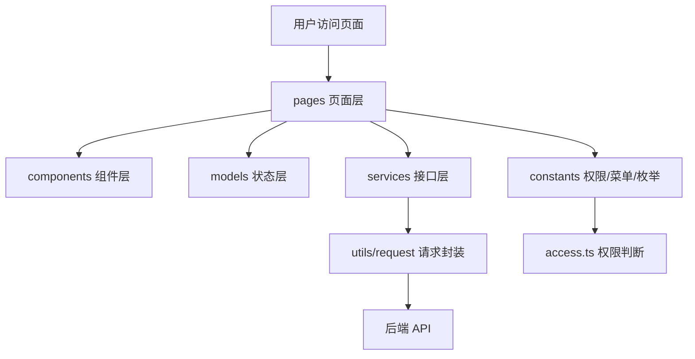
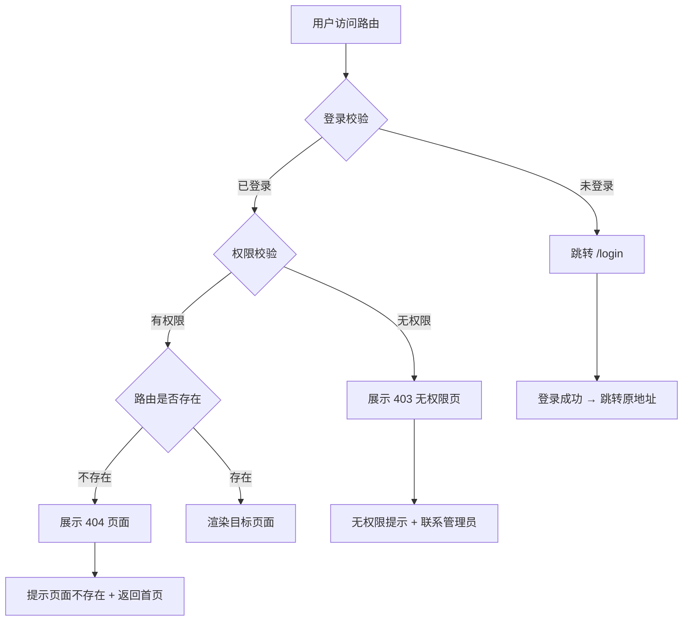
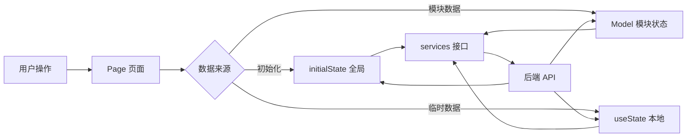
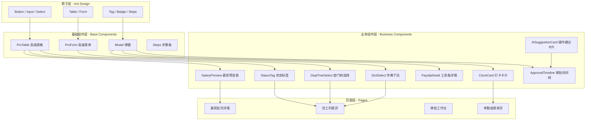
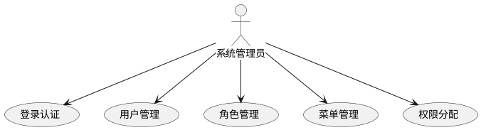
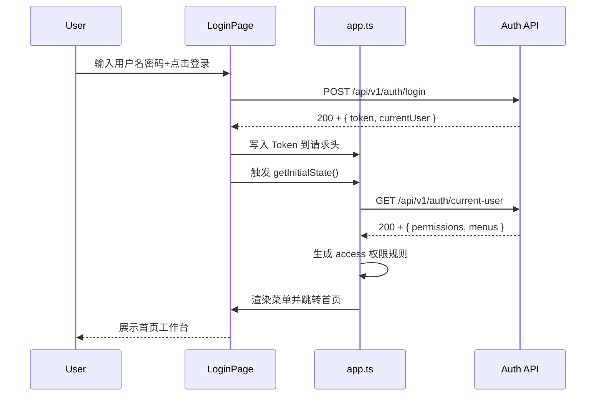

# HRMS 项目前端总系分
| 文档版本 | 日期         | 说明                               |
| ---- | ---------- | -------------------------------- |
| v1.2 | 2026-07-11 | 补充原型图页面元素-字段映射表；展开接口依赖为入参/出参详细定义 |


---

## 1. 文档说明
本文档用于整合 HRMS 人资管理系统 9 个业务模块的前端系统分析与设计内容，作为前端整体开发、联调、汇报和评审依据。

整合来源包括：

| 来源文档 | 覆盖模块 | 处理说明 |
| --- | --- | --- |
| HRMS-权限体系与组织架构管理-前端系分.md | 权限体系、组织架构 | 保留前端页面、交互、接口、权限与排期 |


不纳入本文档主体的内容：

+ 数据库表结构、索引、SQL 建表语句。
+ 后端领域模型、Service、Controller、流程引擎类设计。
+ 后端事务、乐观锁、定时任务、消息通知等实现细节。
+ 后端独立发布、数据库脚本执行等非前端交付项。

---

## 2. 项目前端总览
HRMS 前端是人资管理系统的统一交互入口，负责页面展示、业务操作、权限菜单、接口调用、表单校验、状态反馈和角色差异化视图。

项目按照 9 个核心业务模块进行前端拆分：

| 序号 | 模块 | 前端页面目录 | 前端接口目录 | 主要用户 |
| --- | --- | --- | --- | --- |
| 1 | 权限体系 auth | `src/pages/system`、`src/pages/login` | `src/services/auth` | 系统管理员 |
| 2 | 组织架构 organization | `src/pages/system` | `src/services/organization` | 系统管理员、HR |
| 3 | 员工档案 employee | `src/pages/employee` | `src/services/employee` | 系统管理员、HR、部门主管 |
| 4 | 入转调离 personnel | `src/pages/process` | `src/services/process` | 系统管理员、HR、部门主管 |
| 5 | 考勤管理 attendance | `src/pages/attendance` | `src/services/attendance` | 系统管理员、HR、部门主管、员工 |
| 6 | 薪资管理 salary | `src/pages/salary` | `src/services/salary` | 系统管理员、HR、财务、员工 |
| 7 | 审批中心 approval | `src/pages/approval` | `src/services/approval` | 系统管理员、HR、部门主管、财务 |
| 8 | 个人中心 mycenter/profile | `src/pages/profile` | `src/services/profile` | 全部登录用户，重点面向普通员工 |
| 9 | AI 智能助手 ai | `src/pages/ai` | `src/services/ai` | 全部登录用户、系统管理员 |


前端整体设计目标：

+ 按业务模块拆分页面，保持前后端模块边界一致。
+ 按角色权限控制菜单、页面、按钮和字段展示。
+ 统一接口调用、错误处理、分页结构和返回体处理。
+ 使用 Ant Design 与 Pro Components 提升后台页面开发效率。
+ 对列表、详情、表单、审批、图表等高频后台场景形成一致交互。

---

## 3. 前端技术栈与工程约定
| 类型 | 技术选型 | 说明 |
| --- | --- | --- |
| 前端框架 | React 18 | 页面组件开发 |
| 开发语言 | TypeScript 5 | 类型约束、接口类型、枚举定义 |
| 企业级框架 | Umi Max 4.6 | 路由、权限、状态、构建、请求等工程能力 |
| UI 组件库 | Ant Design 5.4 | 表格、表单、弹窗、菜单、步骤条、日历等基础组件 |
| 高级后台组件 | @ant-design/pro-components 2.4 | ProTable、ProForm、ProDescriptions 等后台复杂组件 |
| 图标库 | @ant-design/icons 5.0 | 菜单、按钮、状态图标 |
| 请求库 | axios / Umi request | 接口调用、拦截器、错误处理 |
| 图表 | AntV G2 / 业务图表封装 | 考勤看板、薪资趋势、薪资构成等可视化 |
| E2E 测试 | Playwright | 登录、菜单、审批、核心业务流程验收 |
| 包管理器 | pnpm 11.10.0 | 依赖管理 |
| 运行环境 | Node.js 24.18.0 | 本地开发与构建 |


统一约定：

+ 页面代码放在 `src/pages`。
+ 接口封装放在 `src/services`，页面禁止直接写 `fetch` 或裸 `axios`。
+ 跨页面共享状态放在 `src/models`。
+ 类型定义放在 `src/types`。
+ 菜单、权限、首页统计卡片、枚举放在 `src/constants`。
+ 请求拦截、Token 注入、错误码处理放在 `src/utils/request`。

---

## 4. 前端总体架构
### 4.1 目录职责
| 目录/文件 | 职责 |
| --- | --- |
| `src/pages` | 页面入口，按业务模块组织路由页面 |
| `src/services` | 后端 API 调用封装 |
| `src/models` | Umi Model，全局或模块级状态管理 |
| `src/constants` | 菜单、权限、枚举、首页卡片等配置 |
| `src/types` | TypeScript 类型定义，包括返回体、用户、菜单、业务类型 |
| `src/utils` | 通用工具函数 |
| `src/utils/request` | 请求实例、Token 注入、响应拦截、错误处理 |
| `src/access.ts` | 页面和菜单权限规则 |
| `src/app.ts` | Umi 运行时配置、initialState、布局与登录态初始化 |
| `mock` | Mock 数据，支持前端独立开发阶段 |
| `e2e` | 端到端验收测试 |


### 4.2 前端分层


### 4.3 路由设计
#### 路由结构
前端采用 Umi Max 约定式路由 + 权限路由守卫，按业务模块组织页面目录。路由层级如下：

```plain
/login                          # 登录页（无权限拦截）
/                                # 布局级路由（需登录）
├── /system                      # 系统管理（仅系统管理员可见）
│   ├── /system/user             # 用户管理
│   ├── /system/user/create      # 新建用户
│   ├── /system/user/:id/edit    # 编辑用户
│   ├── /system/role             # 角色管理
│   ├── /system/menu             # 菜单管理
│   ├── /system/dept             # 部门管理
│   ├── /system/post             # 职位管理
│   └── /system/dict             # 字典管理
├── /employee                    # 员工档案
│   ├── /employee/list           # 员工列表
│   ├── /employee/detail/:id     # 员工详情
│   ├── /employee/:id/edit       # 编辑员工
│   └── /employee/contract       # 合同管理
├── /process                     # 入转调离
│   ├── /process/entry           # 入职管理
│   ├── /process/regular         # 转正管理
│   ├── /process/transfer        # 调岗管理
│   └── /process/leave           # 离职管理
├── /attendance                  # 考勤管理
│   ├── /attendance/groups       # 考勤组
│   ├── /attendance/clock        # 打卡
│   ├── /attendance/my-calendar  # 个人考勤
│   ├── /attendance/corrections  # 补卡
│   ├── /attendance/overtime    # 加班申请
│   ├── /attendance/leaves       # 请假
│   ├── /attendance/record       # 考勤记录
│   └── /attendance/summary      # 统计看板
├── /salary                      # 薪资管理
│   ├── /salary/templates        # 薪资账套
│   ├── /salary/employee-profiles # 员工薪资档案
│   ├── /salary/batches          # 薪资批次
│   └── /salary/dashboard        # 薪资看板
├── /approval                    # 审批中心
│   ├── /approval/workspace      # 审批工作台
│   ├── /approval/detail/:id     # 审批详情
│   └── /approval/delegation     # 委托审批
├── /profile                     # 个人中心
│   ├── /profile                 # 个人中心首页
│   ├── /profile/archive         # 我的档案
│   ├── /profile/attendance      # 我的考勤
│   ├── /profile/leave           # 我的请假
│   ├── /profile/salary          # 我的薪资
│   └── /profile/security        # 账号安全
└── /ai                          # AI 智能助手
    ├── /ai/chat                 # AI 对话
    └── /ai/knowledge            # 知识库管理（仅系统管理员）
```

#### 路由懒加载策略
| 路由分组 | 打包策略 | 拆分说明 |
| --- | --- | --- |
| 登录页 | 独立 chunk | `login.chunk.js`，首屏加载 |
| 系统管理 | 公共 chunk | `system.chunk.js`，管理员场景 |
| 员工档案 + 入转调离 | 合并 chunk | `employee.chunk.js`，HR 高频操作 |
| 考勤管理 | 独立 chunk | `attendance.chunk.js`，考勤高频页 |
| 薪资管理 | 独立 chunk | `salary.chunk.js`，涉敏单独拆分 |
| 审批中心 | 独立 chunk | `approval.chunk.js`，跨角色共用 |
| 个人中心 | 合并 chunk | `profile.chunk.js`，全量用户访问 |
| AI 智能助手 | 独立 chunk | `ai.chunk.js`，AI 对话页按需加载 |
| 首页 | 公共 chunk | 随 Layout 加载 |
| Ant Design 组件 | vendor | 缓存稳定 |
| ProComponents | vendor | 缓存稳定 |


#### 路由守卫与 403/404 兜底


#### 路由实现要点
+ 登录页路由独立于 Layout 之外，不加载菜单和权限数据。
+ Layout 路由在 `app.ts` 的 `getInitialState` 中完成登录态和权限初始化。
+ 普通员工权限较少时，前端自动折叠无权限菜单但不阻断路由；直接访问 URL 时路由守卫拦截并跳转 403。
+ 404 页面作为路由配置的最后兜底，捕获所有未匹配路径。
+ 所有 `:id` 参数路由通过 `params` 获取 ID，页面组件内处理无效 ID 的错误态。

### 4.4 状态管理设计
#### 状态分层原则
前端状态按作用域划分为三层：

| 层级 | 存储位置 | 典型场景 | 生命周期 |
| --- | --- | --- | --- |
| 全局状态 | Umi `initialState` + `access` | 登录用户、权限码、菜单树 | 应用级别，刷新重新加载 |
| 模块状态 | Umi Model | 审批列表、考勤日历、AI 会话列表 | 模块级别，页面切换保留 |
| 本地状态 | React `useState` / `useReducer` | 表单输入、弹窗开关、选中行 | 组件级别，卸载即销毁 |


#### 全局状态
```typescript
// src/app.ts — initial state structure
interface InitialState {
  currentUser?: CurrentUser;         // 当前登录用户
  permissions?: string[];            // 权限码列表
  menus?: MenuItem[];                // 菜单树
  fieldPermissions?: FieldPermMap;   // 字段权限映射
  settings?: AppSettings;            // 系统配置
  fetchUserInfo: () => Promise<void>;// 刷新用户信息
}
```

初始化流程：`app.ts` → `getInitialState()` → 调用 `GET /api/v1/auth/current-user` → 写入 `initialState` → `access.ts` 生成权限规则 → 渲染菜单和路由。

#### 模块状态
| 模块 | Model 文件 | 主要状态 |
| --- | --- | --- |
| 考勤 | `src/models/attendance.ts` | 考勤组列表、当前考勤日历、打卡状态 |
| 薪资 | `src/models/salary.ts` | 批次列表、异常列表、工资条验证态 |
| 审批 | `src/models/approval.ts` | Tab 切换、筛选条件、分页位置 |
| AI 助手 | `src/models/ai.ts` | 会话列表、当前消息、streaming 状态 |


模块状态的跨页面保持原则：列表页的筛选条件、分页、Tab 在页面切换后保留，离开模块时清理。

#### 数据流方向


#### 缓存策略
| 数据 | 策略 | 说明 |
| --- | --- | --- |
| 用户信息/权限 | `initialState` 内存 | 刷新重新加载，不持久化 |
| 菜单树 | `initialState` 内存 | 由后端权限动态生成 |
| 字典数据 | `useModel` 缓存 | 首次加载后模块内复用 |
| 部门树 | 模块 Model 缓存 | 员工/考勤等模块间共享 |
| 列表数据 | 不缓存 | 每次进入页面重新请求 |
| AI 会话列表 | Model 内存 | 页面切换保留，关闭清理 |
| 工资条明细 | 不持久化 | 离开页面清理敏感数据 |


### 4.5 组件体系设计
#### 组件分层架构
前端组件按复用粒度分为四层：



#### 通用组件清单
| 组件 | 组件层级 | 复用范围 | 输入接口 |
| --- | --- | --- | --- |
| `DeptTreeSelect` | 业务组件 | 员工、考勤、薪资、审批 | `value`, `onChange`, `excludeDeptId?` |
| `DictSelect` | 业务组件 | 全局（性别、状态、类型） | `dictType`, `value`, `onChange` |
| `StatusTag` | 业务组件 | 全局（状态展示） | `status`, `typeMap`, `size?` |
| `ApprovalTimeline` | 业务组件 | 审批详情 | `approvalNodes: Node[]` |
| `AmountDisplay` | 业务组件 | 薪资模块 | `value`, `precision=2`, `masked?` |
| `EmptyState` | 基础组件 | 全局（列表/图表空态） | `description`, `actionText?`, `onAction?` |
| `ErrorRetry` | 基础组件 | 全局（接口异常展示） | `message`, `onRetry` |
| `AiFloatingBall` | 业务组件 | 全局 Layout | `visible`, `onToggle` |
| `StreamRenderer` | 基础组件 | AI 对话 | `tokens: string[]`, `onComplete` |
| `ActionSuggestionCard` | 业务组件 | AI 对话 | `actions: Suggestion[]`, `onClick` |


#### 组件设计规范
+ 通用业务组件放在 `src/components/{ComponentName}`，使用 `index.tsx` 导出。
+ 业务组件接收明确的数据接口（TypeScript interface），不直接依赖 Model。
+ 组件内部状态变化通过 `onChange`/`onXxx` 回调通知父级。
+ 每个业务组件必须有加载态、空态、错误态处理。
+ 涉敏业务组件（薪资、身份证）通过 `masked?` 属性控制脱敏展示。

### 4.6 错误处理体系
#### 前端错误分类
| 错误类型 | 典型场景 | 处理策略 |
| --- | --- | --- |
| 接口异常 | 网络超时、500 错误 | 错误提示 + 重试入口 |
| 业务异常 | 400xx 业务错误码 | 展示后端 message |
| 权限异常 | 401xx 未登录、403xx 无权限 | 跳转登录/403 页 |
| 前端异常 | 组件渲染崩溃 | ErrorBoundary 兜底 |
| AI SSE 异常 | SSE 断连、服务超时 | 保留已接收内容 + 重试按钮 |


#### 统一请求拦截
`utils/request.ts` 拦截器处理层级：

```typescript
// 响应拦截伪代码
response => {
    if (response.status === 401) {
        // Token 过期或无效 → 清空登录态 → 跳转登录
        redirect('/login');
        return Promise.reject('未登录');
    }
    if (response.status === 403) {
        // 无权限 → 跳转 403 页面
        redirect('/403');
        return Promise.reject('无权限');
    }
    if (response.data.code !== 20000) {
        // 业务异常 → 统一提示后端 message
        message.error(response.data.message);
        return Promise.reject(response.data);
    }
    return response.data.data;  // 解包成功数据
}
```

#### 前端异常边界
+ 每个模块的页面组件外层包裹 ErrorBoundary，捕获渲染异常后展示降级页面。
+ 降级页面包含：错误说明、重试按钮、返回首页入口。
+ ErrorBoundary 不阻断菜单和路由导航，仅当前页面降级。

#### 错误码映射（前端侧）
后端统一异常码在前端的映射处理：

| 异常码范围 | 前端行为 | 用户提示 |
| --- | --- | --- |
| 20000 | 业务成功 | 无 |
| 40001-40099 | 参数校验 | `message.error(后端message)` |
| 40101-40103 | 认证异常 | 跳转登录页 |
| 40300-40302 | 权限不足 | 跳转 403 页 |
| 40401-40499 | 数据不存在 | 空态展示 |
| 50001-50002 | 服务端异常 | `message.error('系统繁忙，请稍后重试')` |


#### 降级与重试策略
| 场景 | 降级行为 | 重试方式 |
| --- | --- | --- |
| 列表页接口失败 | 展示 ErrorRetry 组件 | 点击重试按钮 |
| 详情页接口失败 | 展示 ErrorRetry 组件 | 点击重试按钮 |
| 提交/保存失败 | `message.error()` + 按钮恢复 | 用户重新提交 |
| AI SSE 断连 | AI 气泡展示错误提示 | 重试按钮重新发送 |
| 图表加载失败 | 图表区域展示空态 | 不影响页面其他内容 |
| 子组件崩溃 | ErrorBoundary 降级该区域 | 刷新页面恢复 |


---

## 5. 角色与权限设计
### 5.1 角色定义
| 角色 | 数据范围 | 核心职责 |
| --- | --- | --- |
| 系统管理员 | 全平台 | 系统配置、用户角色菜单、全部业务兜底管理 |
| HR 专员 | 全部员工 | 员工管理、入转调离、考勤管理、薪资核算、审批处理 |
| 部门主管 | 本部门及下属 | 本部门员工查看、调岗或流程审批、考勤审批 |
| 财务专员 | 薪资相关 | 薪资审核、薪资批次审批、成本报表 |
| 普通员工 | 仅本人 | 个人档案、打卡、请假、工资条、申请进度 |

### 5.2 前端权限实现
+ 登录成功后，前端保存 Token，并获取当前用户信息和权限列表。
+ `app.ts` 将用户信息写入 Umi `initialState`。
+ `access.ts` 根据权限列表生成菜单和路由访问规则。
+ `.umirc.ts` 路由配置通过 `access` 字段控制页面访问。
+ 页面内按钮、字段、操作入口根据权限码和字段权限接口动态渲染。

---

## 6. 模块 M1：权限体系 auth
### 6.1 用例分析
#### 用例图

#### 用例描述
| 编号 | 用例名称 | 参与者 | 前置条件 | 后置条件 | 业务描述 |
| --- | --- | --- | --- | --- | --- |
| UC-06-01 | 登录认证 | 系统管理员 | 无 | 进入首页 | 系统管理员通过用户名密码登录系统，获取 Token 和权限信息 |
| UC-06-02 | 用户管理 | 系统管理员 | 已登录 | 用户数据变更 | 对系统用户进行增删改查和状态管理，分配角色 |
| UC-06-03 | 角色管理 | 系统管理员 | 已登录 | 角色数据变更 | 维护角色信息，配置角色的数据范围和菜单权限 |
| UC-06-04 | 菜单管理 | 系统管理员 | 已登录 | 菜单树变更 | 维护目录、菜单、按钮三级权限树 |
| UC-06-05 | 权限分配 | 系统管理员 | 已选择角色 | 角色权限变更 | 为角色分配菜单/按钮访问权限，支持树形勾选 |


### 6.2 模块目标
权限体系负责登录认证、用户管理、角色管理、菜单管理，是 HRMS 前端权限控制和菜单控制的基础。

### 6.3 页面范围
| 页面 | 路由 | 主要功能 |
| --- | --- | --- |
| 登录页 | `/login` | 用户名密码登录、开发阶段角色选择、Token 保存、跳转首页 |
| 用户列表页 | `/system/user` | 用户查询、新增、编辑、删除、状态展示、角色展示 |
| 用户表单页 | `/system/user/create`、`/system/user/:id/edit` | 用户基本信息、状态、角色分配 |
| 角色列表页 | `/system/role` | 角色查询、角色编辑、权限分配 |
| 菜单管理页 | `/system/menu` | 菜单树展示、目录/菜单/按钮权限维护 |


### 6.4 界面形态
权限体系采用典型后台管理界面形态：顶部为系统 Header，左侧为菜单导航，右侧为内容工作区。

| 页面 | 界面形态描述 |
| --- | --- |
| 登录页 | 居中登录卡片，包含系统名称、用户名输入框、密码输入框、开发阶段角色选择下拉框和登录按钮；背景保持简洁，突出登录动作。 |
| 用户列表页 | 顶部为查询筛选区，支持用户名、真实姓名、状态筛选；中部为 ProTable 表格；右上角工具栏放“新增用户”；表格操作列放“编辑”“删除”。 |
| 用户表单页 | 表单页或抽屉/弹窗形态，按“基本信息”“角色分配”分组；新增时展示密码字段，编辑时可隐藏或置为重置密码入口。 |
| 角色列表页 | 表格型页面，字段包括角色名称、角色编码、数据范围、状态、排序；“分配权限”打开菜单树弹窗，左侧树形勾选，底部保存/取消。 |
| 菜单管理页 | 树形表格页面，按目录、菜单、按钮层级缩进展示；菜单类型使用 Tag 区分；新增/编辑菜单使用弹窗表单，包含父级菜单、路由、权限标识、排序等字段。 |


#### 核心原型图
<!-- 这是一张图片，ocr 内容为： -->
  
图 6-1 登录页原型：展示 HRMS 登录入口、用户名密码输入和开发阶段角色选择。

##### 页面元素 → 字段映射
| 页面元素 | 对应字段 | 说明 |
| --- | --- | --- |
| 用户名输入框 | `username` | 用户账号，必填 |
| 密码输入框 | `password` | 登录密码，必填 |
| 角色选择下拉框 | `role` | 开发阶段允许手动切换角色，生产环境隐藏 |
| 登录按钮 | — | 触发 `POST /api/v1/auth/login`，需 loading 防重复提交 |


<!-- 这是一张图片，ocr 内容为： -->


图 6-2 用户管理页原型：展示筛选区、用户表格、新增用户和行内编辑/删除操作。

##### 页面元素 → 字段映射
| 页面元素 | 对应字段 | 说明 |
| --- | --- | --- |
| 用户名查询 | `username` | 搜索条件，模糊匹配 |
| 真实姓名查询 | `realName` | 搜索条件，模糊匹配 |
| 状态筛选 | `status` | 下拉单选：启用 / 禁用 |
| 用户名列 | `username` | 表格展示 |
| 真实姓名列 | `realName` | 表格展示 |
| 角色列 | `roleNames` | 表格展示，多角色用逗号分隔 |
| 状态列 | `status` | Tag 展示：启用(green) / 禁用(red) |
| 创建时间列 | `createdAt` | 表格展示 |
| 新增用户按钮 | — | 跳转用户表单页 `/system/user/create` |
| 编辑按钮 | — | 跳转用户表单页 `/system/user/:id/edit` |
| 删除按钮 | — | 二次确认后调 `DELETE /api/v1/users/{id}` |


<!-- 这是一张图片，ocr 内容为： -->


图 6-3 角色权限分配原型：展示角色列表和菜单权限树勾选弹窗。

##### 页面元素 → 字段映射
| 页面元素 | 对应字段 | 说明 |
| --- | --- | --- |
| 角色名称列 | `roleName` | 表格展示 |
| 角色编码列 | `roleCode` | 表格展示 |
| 数据范围列 | `dataScope` | 表格展示：全部/本部门/本部门及下属/本人 |
| 状态列 | `status` | Tag 展示 |
| 分配权限按钮 | — | 打开菜单树弹窗 |
| 菜单树 | `menuIds` | 树形勾选，回显当前角色已分配菜单 ID |
| 保存按钮 | — | 提交 `POST /api/v1/roles/{roleId}/menus` |


### 6.5 关键交互
#### 登录流程时序


+ 登录页校验用户名和密码非空，登录成功后 Token 写入 localStorage 和请求头。
+ 用户管理使用 ProTable 支持搜索、分页、编辑和删除二次确认。
+ 角色权限分配使用菜单树勾选方式，支持回显已分配菜单。
+ 菜单管理使用树形表格维护菜单层级、路由和权限标识。

### 6.6 接口依赖
#### `POST /api/v1/auth/login` — 登录认证
**入参：**

| 字段 | 类型 | 说明 |
| --- | --- | --- |
| `username` | `string` | 用户名，必填 |
| `password` | `string` | 密码，必填 |


**出参：**

| 字段 | 类型 | 说明 |
| --- | --- | --- |
| `token` | `string` | JWT Token，前端写入 localStorage 和请求头 |
| `currentUser` | `CurrentUser` | 当前登录用户信息 |


`CurrentUser`**：**

| 字段 | 类型 | 说明 |
| --- | --- | --- |
| `id` | `number` | 用户 ID |
| `username` | `string` | 用户名 |
| `realName` | `string` | 真实姓名 |
| `role` | `string` | 当前角色编码 |


---

#### `GET /api/v1/auth/current-user` — 获取当前用户与权限
**出参：**

| 字段 | 类型 | 说明 |
| --- | --- | --- |
| `user` | `CurrentUser` | 当前用户信息 |
| `permissions` | `string[]` | 权限码列表，如 `["user:create", "role:assign"]` |
| `menus` | `MenuItem[]` | 菜单树 |
| `fieldPermissions` | `FieldPermMap` | 字段权限映射 |


`MenuItem`**：**

| 字段 | 类型 | 说明 |
| --- | --- | --- |
| `id` | `number` | 菜单 ID |
| `name` | `string` | 菜单名称 |
| `path` | `string` | 前端路由路径 |
| `icon` | `string` | 图标名称 |
| `type` | `string` | 类型：directory / menu / button |
| `children` | `MenuItem[]` | 子菜单 |


`FieldPermMap`**：**

| 字段 | 类型 | 说明 |
| --- | --- | --- |
| `editableFields` | `string[]` | 可编辑字段列表 |
| `flowFields` | `string[]` | 需走流程修改的字段 |
| `hiddenFields` | `string[]` | 隐藏字段列表 |


---

#### `GET /api/v1/users` — 用户列表
**入参：**

| 字段 | 类型 | 说明 |
| --- | --- | --- |
| `username` | `string` | 用户名模糊搜索 |
| `realName` | `string` | 真实姓名模糊搜索 |
| `status` | `string` | 状态筛选：active / disabled |
| `pageNum` | `number` | 页码，默认 1 |
| `pageSize` | `number` | 每页条数，默认 20 |


**出参：**

| 字段 | 类型 | 说明 |
| --- | --- | --- |
| `records` | `User[]` | 用户列表 |
| `total` | `number` | 总记录数 |


`User`**：**

| 字段 | 类型 | 说明 |
| --- | --- | --- |
| `id` | `number` | 用户 ID |
| `username` | `string` | 用户名 |
| `realName` | `string` | 真实姓名 |
| `roleIds` | `number[]` | 角色 ID 列表 |
| `roleNames` | `string[]` | 角色名称列表 |
| `status` | `string` | active / disabled |
| `createdAt` | `string` | 创建时间 |


---

#### `POST /api/v1/users` — 创建用户
**入参：**

| 字段 | 类型 | 说明 |
| --- | --- | --- |
| `username` | `string` | 用户名，必填 |
| `password` | `string` | 密码，必填 |
| `realName` | `string` | 真实姓名，必填 |
| `roleIds` | `number[]` | 角色 ID 列表 |


**出参：**

| 字段 | 类型 | 说明 |
| --- | --- | --- |
| `id` | `number` | 新用户 ID |


---

#### `PUT /api/v1/users/{id}` — 更新用户
**入参：**

| 字段 | 类型 | 说明 |
| --- | --- | --- |
| `realName` | `string` | 真实姓名 |
| `status` | `string` | active / disabled |
| `roleIds` | `number[]` | 角色 ID 列表 |
| `password` | `string` | 修改密码时传入 |


**出参：**

| 字段 | 类型 | 说明 |
| --- | --- | --- |
| `success` | `boolean` | 是否成功 |


---

#### `DELETE /api/v1/users/{id}` — 删除用户
**入参：** 路径参数 `id`（用户 ID）

**出参：**

| 字段 | 类型 | 说明 |
| --- | --- | --- |
| `success` | `boolean` | 是否成功 |


---

#### `GET /api/v1/roles` — 角色列表
**入参：**

| 字段 | 类型 | 说明 |
| --- | --- | --- |
| `roleName` | `string` | 角色名称搜索 |
| `status` | `string` | 状态筛选 |
| `pageNum` | `number` | 页码，默认 1 |
| `pageSize` | `number` | 每页条数，默认 20 |


**出参：**

| 字段 | 类型 | 说明 |
| --- | --- | --- |
| `records` | `Role[]` | 角色列表 |
| `total` | `number` | 总记录数 |


`Role`**：**

| 字段 | 类型 | 说明 |
| --- | --- | --- |
| `id` | `number` | 角色 ID |
| `roleName` | `string` | 角色名称 |
| `roleCode` | `string` | 角色编码 |
| `dataScope` | `string` | 数据范围：all / dept / dept_and_sub / self |
| `status` | `string` | active / disabled |
| `sort` | `number` | 排序号 |
| `menuIds` | `number[]` | 已分配菜单 ID 列表 |


---

#### `POST /api/v1/roles/{roleId}/menus` — 分配角色菜单
**入参：**

| 字段 | 类型 | 说明 |
| --- | --- | --- |
| `menuIds` | `number[]` | 菜单 ID 列表，必填 |


**出参：**

| 字段 | 类型 | 说明 |
| --- | --- | --- |
| `success` | `boolean` | 是否成功 |


---

#### `GET /api/v1/menus/tree` — 菜单树
**出参：**

| 字段 | 类型 | 说明 |
| --- | --- | --- |
| `menus` | `MenuItem[]` | 完整菜单树 |


---


### 14.8 权限与显示规则
| 权限码 | 控制范围 | 说明 |
| --- | --- | --- |
| `ai:chat:view` | AI 对话页、悬浮助手入口 | 全部登录用户默认可用，游客或未登录用户不进入后台业务页面 |
| `ai:knowledge:manage` | 知识库管理页、上传/编辑/删除/重新索引操作 | 仅系统管理员可见 |


菜单设计上，`AI智能助手` 作为一级菜单放在个人中心之后；`知识库管理` 可放入 AI 模块下或系统管理下，最终以菜单初始化数据为准。前端需同时支持菜单权限和路由权限校验。

---

## 15. 首页工作台设计
首页作为登录后的统一入口，根据不同角色展示不同统计卡片和待办区域。

| 角色 | 首页重点展示 |
| --- | --- |
| 系统管理员 | 员工总数、本月入职、待审批、本月薪资、系统概览 |
| HR | 员工总数、本月入职、待审批、考勤异常、薪资批次 |
| 部门主管 | 本部门人数、本部门考勤、本部门待审批 |
| 财务 | 本月薪资总额、待审核薪资批次、薪资异常 |
| 普通员工 | 本月出勤、年假余额、我的申请进度、工资条入口 |


前端实现：

+ 首页统计卡片配置放在 `src/constants/home.ts`。
+ 待办列表调用审批中心相关接口。
+ 普通员工首页更偏个人工作台，管理角色首页更偏管理看板。

---

## 16. 公共前端能力
### 16.1 通用组件
| 组件 | 用途 |
| --- | --- |
| 部门树选择器 | 部门筛选、部门选择、组织范围选择 |
| 字典下拉框 | 性别、职位、员工状态、请假类型、审批状态等 |
| 状态标签 | 员工状态、审批状态、薪资批次状态、考勤状态 |
| 审批时间线 | 审批详情页展示节点历史 |
| 金额展示组件 | 薪资金额格式化和脱敏展示 |
| 页面空状态 | 列表无数据、图表无数据统一展示 |
| 错误重试组件 | 接口失败时统一展示重试入口 |
| 全局 AI 悬浮入口 | 通用业务页面常驻 AI 小球，支持展开、收起和隐私页面隐藏 |
| 流式文本渲染器 | 对 SSE token 进行批量渲染，减少高频刷新导致的页面卡顿 |
| 操作建议卡片 | 展示 AI 返回的业务路由建议，支持点击跳转到对应页面 |


### 16.2 请求封装
+ 请求头统一注入 Token。
+ 后端统一返回体按 `Result<T>` 处理。
+ 分页接口统一处理 `records`、`total`、`pageNum`、`pageSize`。
+ `401xx` 错误跳转登录页。
+ `403xx` 或无权限错误跳转 403 页或展示无权限提示。
+ 业务错误直接展示后端 message。
+ AI 对话接口需支持 SSE 响应解析、断连提示、重试和完成态回调。

### 16.3 状态管理
+ 登录用户、权限、菜单放在全局初始状态。
+ 列表筛选、分页、Tab 状态可在模块 model 或页面状态中维护。
+ 审批列表、工资条验证态等跨页面状态可放入模块 model。
+ 敏感数据不写入 localStorage。
+ AI 会话、当前消息列表和 streaming 状态可放入模块 model 或轻量状态仓库，切换会话时优先复用已加载数据。

---

## 17. 监控和埋点
### 17.1 性能监控
| 场景 | 阈值建议 |
| --- | --- |
| 登录接口响应 | 2s 内 |
| 列表页首屏加载 | 1.5s 内 |
| 员工详情/审批详情加载 | 2s 内 |
| 审批操作提交 | 2s 内 |
| 打卡操作 | 1s 内 |
| 工资条二次验证 | 2s 内 |
| 图表加载 | 2s 内 |
| AI 首 token 展示 | 5s 内 |
| 知识库文档列表加载 | 1.5s 内 |


### 17.2 业务埋点
| 模块 | 埋点事件 |
| --- | --- |
| 登录 | 登录成功、登录失败 |
| 权限体系 | 用户创建、用户编辑、角色权限分配 |
| 组织架构 | 部门创建、部门删除、职位创建、字典维护 |
| 员工档案 | 员工列表访问、员工详情访问、员工编辑 |
| 入转调离 | 创建入职、确认入职、发起转正、创建调岗、创建离职 |
| 考勤 | 打卡、补卡申请、请假提交、请假撤回 |
| 薪资 | 创建薪资批次、触发核算、处理异常、工资条验证、工资条查看 |
| 审批中心 | Tab 切换、审批通过、审批拒绝、审批转交、委托创建 |
| 个人中心 | 档案编辑、请假提交、工资条查看、修改密码 |
| AI智能助手 | 发送消息、建议卡片点击、新建会话、切换会话、删除会话、上传知识库文档、SSE 连接失败 |


---

## 18. 非功能性要求
| 维度 | 前端要求 |
| --- | --- |
| 可用性 | 所有列表和详情页覆盖加载态、空态、错误态 |
| 安全性 | Token 统一管理，涉薪和敏感数据不持久化 |
| 权限 | 菜单、页面、按钮、字段均需按权限控制 |
| 一致性 | 表单、表格、弹窗、状态标签采用统一设计规范 |
| 防重复提交 | 审批、打卡、薪资批次、确认发放等关键操作需 loading 和禁用 |
| 可维护性 | 页面按模块拆分，接口放 services，类型放 types |
| 兼容性 | 支持 Chrome、Edge、Firefox 最新两个大版本 |
| AI 安全 | AI 回复内容安全渲染，隐私数据查询需依赖后端权限过滤和脱敏结果 |


---

## 19. 前端工作量汇总
| 模块 | 主要页面/功能 | 前端开发估算 |
| --- | --- | --- |
| 权限体系 | 登录、用户、角色、菜单 | 约 6 天 |
| 组织架构 | 部门、职位、字典、公共选择器 | 约 5 天 |
| 员工档案 | 列表、详情、编辑、合同 | 约 6.5 天 |
| 入转调离 | 入职、转正、调岗、离职 | 约 7.5 天 |
| 考勤管理 | 考勤组、打卡、日历、补卡、请假、统计 | 约 10 天 |
| 薪资管理 | 账套、档案、批次、异常、工资条、看板 | 约 13.5 天 |
| 审批中心 | 工作台、详情、委托 | 约 5 天 |
| 个人中心 | 档案、考勤、请假、薪资、安全 | 约 8.5 天 |
| AI智能助手 | 悬浮入口、聊天小窗、对话页、知识库管理、SSE 渲染、建议卡片 | 约 8.5 天开发 / 3 天联调 / 2.5 天自测 |
| 公共能力 | 请求、权限、状态标签、字典、E2E | 约 4 天 |


说明：以上为前端开发粗估，不包含后端开发、数据库脚本、环境部署时间。具体排期需结合并行开发人数和接口就绪情况调整。

---

## 20. 联调边界
### 20.1 前端负责
+ 页面布局、表单、列表、图表、弹窗和交互状态。
+ 路由配置、菜单显示、前端权限判断。
+ 接口调用封装、请求参数组装、响应数据渲染。
+ 基础表单校验、二次确认、防重复提交。
+ 加载态、空态、错误态、无权限态。
+ 前端埋点、前端异常监控。
+ AI 悬浮入口、聊天小窗、流式文本渲染、建议卡片和知识库管理页面展示。

### 20.2 后端依赖
+ 登录、当前用户、菜单权限、字段权限接口。
+ 各业务模块的列表、详情、创建、更新、删除接口。
+ 审批流转、业务状态变更、数据权限过滤。
+ 敏感字段脱敏、薪资二次验证、数据越权校验。
+ 统一错误码和统一返回体。
+ AI 对话 SSE 流式响应、RAG 检索结果、知识库权限过滤、路由建议结构、LLM 异常降级提示。

### 20.3 需重点确认
| 问题 | 涉及模块 |
| --- | --- |
| 权限码是否完全按前端文档和菜单初始化数据返回 | 全部 |
| 字段权限接口返回结构是否稳定 | 员工档案、个人中心 |
| 审批详情中的 `businessType` 和 `formData` 是否可支持动态渲染 | 审批中心、入转调离、考勤、薪资 |
| 请假、补卡、薪资批次是否由业务接口自动触发审批 | 考勤、薪资、审批 |
| 工资条二次验证状态由前端会话保存还是后端会话判断 | 薪资、个人中心 |
| 普通员工入口是统一走个人中心，还是保留考勤/薪资独立菜单 | 考勤、薪资、个人中心 |
| AI SSE 事件结构、done 元数据和路由建议字段是否稳定 | AI智能助手 |
| 知识库文档分类、可见角色和索引状态枚举是否由后端统一返回 | AI智能助手 |


---

## 21. 风险与应对
| 风险 | 影响 | 前端应对 |
| --- | --- | --- |
| 接口路径和模块文档不一致 | 联调阻塞 | 在 services 层统一适配，联调前确认接口清单 |
| 权限码不统一 | 菜单或按钮显示异常 | 以总权限矩阵为准，前后端维护同一份权限码清单 |
| 审批 `formData` 字段不稳定 | 审批详情动态渲染困难 | 建立业务类型到字段配置的前端映射 |
| 涉薪数据泄露 | 严重安全风险 | 不持久化工资条明细，金额脱敏，离开页面清理状态 |
| 列表数据量大 | 页面卡顿 | 分页查询、必要时虚拟滚动、筛选条件服务端处理 |
| 图表数据异常 | 看板展示失败 | 图表错误降级为空状态，不阻断主流程 |
| 重复提交 | 业务状态错乱 | 关键按钮 loading、禁用、二次确认 |
| SSE 连接中断 | AI 回复不完整 | 展示断连提示和重试按钮，保留已接收内容 |
| AI 幻觉或错误回答 | 用户获取错误制度信息 | 前端展示“AI 生成仅供参考”提示，重要业务仍以系统页面和制度文档为准 |
| AI 隐私越界 | 敏感信息泄露 | 隐私查询依赖后端权限过滤，前端不缓存敏感回复并隐藏隐私页面入口 |
| Markdown/XSS 风险 | 恶意内容注入页面 | AI 回复安全渲染，禁用危险 HTML 标签和脚本 |


---

## 22. 总结
HRMS 前端总体系分以 9 个业务模块为核心，采用 React、TypeScript、Umi Max、Ant Design 的企业后台技术栈，按照页面、接口、状态、类型、常量、工具函数进行分层。

前端整体设计重点是：

+ 模块边界清晰：每个业务模块都有对应的页面目录和接口目录。
+ 权限控制完整：覆盖菜单、页面、按钮和字段。
+ 业务流程闭环：入转调离、考勤、薪资等流程最终统一进入审批中心。
+ 员工自助完善：普通员工通过个人中心完成档案、考勤、请假、薪资、安全相关操作。
+ 智能助手增强：通过全局悬浮入口和 AI 对话能力，补充制度问答、操作引导和知识库检索体验。
+ 安全和稳定优先：涉薪、敏感字段、审批操作、打卡操作均有明确的前端安全和交互约束。

本文档可作为前端汇报、系分评审、开发拆分、联调确认和测试验收的统一依据。

