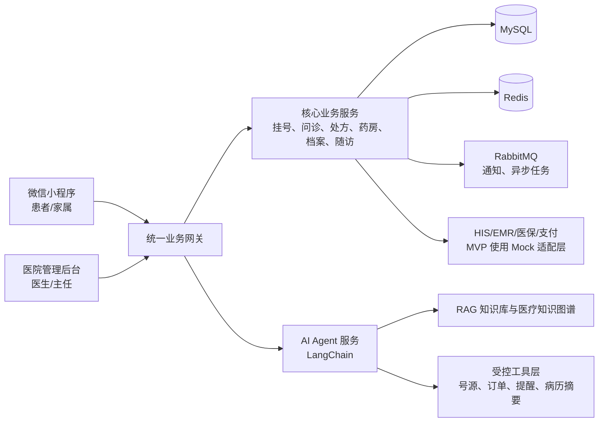
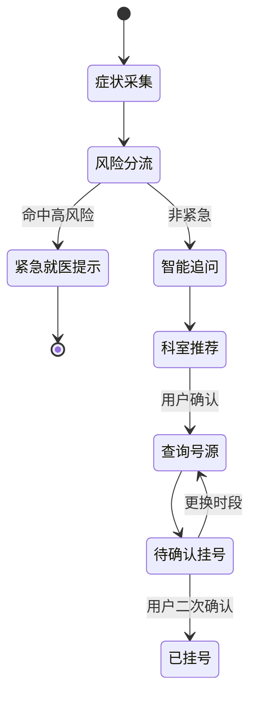

# 智慧先锋医院平台详细产品规格说明书

| 项目 | 内容 |
| --- | --- |
| 产品名称 | 智慧先锋 - AI 驱动的全链路医疗健康平台 |
| 文档版本 | 1.0 |
| 文档日期 | 2026-07-28 |
| 文档定位 | 产品规格说明，覆盖业务规则、用户体验、权限与 AI 安全边界 |

## 1. 概述

### 1.1 项目背景

患者在就医前常面临“不知道该挂哪个科、号源难找、检查报告难懂、复诊与用药容易遗漏”等问题；医生则需要在有限的接诊时间内重复收集病情、核对病历和解释检查结果。医院管理侧还需协调科室、医生排班、号源、处方和药品库存等传统业务。

智慧先锋构建 **C 端微信小程序 + B 端医院网页后台 + AI Agent 服务** 的联动平台。AI 不是独立聊天机器人：它需要在用户授权与人工确认前提下，调用挂号、预约、订单、通知和随访等业务工具，将就医服务组织成完整闭环。

> **医疗安全声明：所有 AI 生成的导诊、报告解读、用药提醒和健康建议均须在界面显著标注“AI 建议仅供参考，不替代医生诊断”。急危重症风险、处方、诊断及关键治疗决策必须由执业医生确认。**

### 1.2 产品目标与成功标准

| 目标 | 成功标准 |
| --- | --- |
| 降低就医决策成本 | 患者可在一次 AI 会话中完成症状描述、导诊、医生选择与挂号确认。 |
| 提升接诊效率 | 医生在接诊前获得可追溯的 AI 病情摘要，并可查看原始问答。 |
| 完成诊后服务 | 处方解读、购药、用药提醒、报告解读与慢病随访可持续触达患者。 |
| 保障医疗安全 | 全部 AI 输出留痕，关键工具调用需二次确认，风险场景优先转人工或急诊。 |

### 1.3 用户角色

| 角色 | 使用端 | 核心需求 |
| --- | --- | --- |
| 患者/家属 | 微信小程序 | 导诊、挂号、问诊、购药、查看报告与档案、管理家庭成员。 |
| 医生 | B 端网页 | 接诊、病历记录、开方、随访，以及被分配的同级复核任务。 |
| 主任（全院管理员） | B 端网页 | 全院人员与资源管理、审核终审、药品与履约配置、运营看板、AI 治理和审计。 |

### 1.4 核心名词

| 名词 | 定义 |
| --- | --- |
| AI 导诊 | 基于症状追问、规则与知识检索，推荐就诊科室和就医紧急程度的辅助能力。 |
| 号源 | 某医生在指定日期、班次、时段可预约的接诊名额。 |
| 问诊前摘要 | AI 将患者主动描述、结构化追问和历史信息整理的医生辅助材料。 |
| 医疗工具调用 | Agent 调用受控业务能力，如查询号源、创建挂号单、创建购药订单、创建提醒。 |
| 家庭代办 | 患者获得被代办人授权后，为儿童、老人等家庭成员挂号、购药和查看档案。 |
| 知识库 | 经审核的医疗科普、院内流程、药品说明和随访规范内容集合。 |

## 2. 产品架构与导航

### 2.1 业务架构

### 2.2 C 端小程序导航

| 一级入口 | 二级页面 | 关键操作 |
| --- | --- | --- |
| 首页 | AI 健康助手、附近医院、服务快捷入口 | 发起导诊、进入挂号/问诊/报告解读。 |
| 就医 | 智能导诊、医院/科室、医生列表、确认挂号、挂号记录 | 查询并确认号源，取消未就诊预约。 |
| 健康 | 健康档案、检查报告、用药提醒、慢病计划 | 查看本人或已授权家庭成员数据。 |
| 订单 | 药品订单、处方购药、配送进度 | 确认购药、支付和查看物流。 |
| 我的 | 家庭成员、授权管理、隐私与通知设置 | 管理代办关系、撤回授权。 |

### 2.3 B 端网页导航

| 模块 | 页面 | 核心能力 |
| --- | --- | --- |
| 医生工作台 | 今日接诊、患者详情、电子病历、处方、随访、复核任务 | 处理接诊任务、发起同级复核并确认关键医疗内容。 |
| 主任管理 | 医院、科室、医生、排班、号源、药品与履约配置 | 管理全院资源、人员和预约规则。 |
| 审核中心 | 风险处方、病历抽检、AI 风险事件 | 向非经办医生分派复核，主任执行终审和升级处理。 |
| 运营与 AI 治理 | 运营看板、知识库、提示词策略、工具权限、会话审计 | 主任管理 AI 内容、工具写权限和全院审计。 |

## 3. 权限与数据保护

### 3.1 数据权限规则

| 数据/操作 | 患者/家属 | 医生 | 主任（全院管理员） |
| --- | --- | --- | --- |
| 健康档案 | 本人及有效授权对象 | 本人接诊或被分配复核患者的最小必要数据 | 全院管理与审计范围，默认脱敏展示。 |
| 病历与问诊摘要 | 本人可见 | 本人接诊或复核任务范围内可读写；可查看 AI 引用来源 | 全院可审计、抽检和终审。 |
| 处方与药品订单 | 本人及代办对象 | 本人开具范围；风险事项可执行非经办复核 | 全院药品、库存、履约配置及终审。 |
| 排班与号源 | 仅查询可预约项 | 仅查看本人排班和接诊号源 | 全院人员、排班、号源和停诊规则管理。 |
| AI 知识与审计 | 不可见 | 仅查看接诊范围内的摘要、引用和复核记录 | 管理知识库、提示词、工具写权限、风险事件和全院审计。 |

### 3.2 审核与升级规则

- 普通病历、处方和随访计划由经办医生提交并生效，无需额外审核。
- 命中药物禁忌、相互作用、患者关键指标异常、AI 高风险提示、病历抽检或主任指定条件时，系统自动创建复核任务。
- 系统优先分派给同院且非经办的医生；复核人不得与经办医生为同一人。无可用复核医生、超时未处理或出现争议时，任务自动升级至主任。
- 复核结果为 `通过`、`退回修改`、`升级主任`；主任可终审、重新分派或关闭风险事件。复核意见、操作者与版本差异必须保留审计记录。

### 3.3 隐私与审计规则

- 家庭代办必须由被代办人授权；未成年人由监护人关系认证后代办，授权可随时撤回。
- 身份证、手机号、病历文本、检查报告、处方等敏感信息在传输与存储中加密；列表默认脱敏。
- 医生查看病历、医生/主任复核、主任导出数据、Agent 调用医疗工具均写入不可篡改审计日志。
- 仅主任可处理脱敏会话样本、知识库和提示词策略；原始身份信息和完整病历不进入 AI 治理界面。

## 4. C 端核心业务规格

### 4.1 AI 智能导诊与挂号

**目标：** 让用户用自然语言完成“症状描述 -> 风险识别 -> 科室/医生推荐 -> 号源选择 -> 确认挂号”。

1. 用户输入症状、持续时间、既往病史或上传检查资料；系统先展示隐私授权与免责声明。
2. Agent 依据症状模板进行最少必要追问，输出紧急程度、建议科室及推荐理由，并展示引用的科普来源。
3. 若命中胸痛、呼吸困难、意识异常、大出血等高风险规则，停止普通导诊，提示立即急诊/拨打急救电话并提供人工入口。
4. 用户确认后，Agent 调用“查询号源”工具；页面展示医院、医生、日期、班次、费用与剩余号源。
5. 用户在确认页二次确认就诊人、时段和费用，才可调用“创建挂号单”工具；成功后发送服务通知。

| 关键字段 | 规则 |
| --- | --- |
| 症状描述 | 必填，支持文字与图片；图片仅用于人工/模型辅助理解，不作为诊断依据。 |
| 紧急程度 | `普通`、`尽快就医`、`紧急就医`；由规则和模型联合判定，紧急优先规则兜底。 |
| 推荐科室 | 至少一个，最多三个；必须说明推荐原因与“仅供参考”声明。 |
| 就诊人 | 必填，须为本人或存在有效授权的家庭成员。 |
| 号源状态 | `可预约`、`余量紧张`、`已约满`、`已停诊`。 |

### 4.2 在线问诊

- 患者选择图文问诊或视频问诊并支付/确认权益后进入候诊；医生接诊前可查看 AI 预问诊摘要、原始信息和风险标签。
- 医生可编辑或忽略 AI 摘要；AI 不可自动生成最终诊断、处方或病历签名。
- 问诊结束可由医生发起电子处方、检查建议和随访任务；患者端提供通俗化的处方解读。
- 超时未接诊、网络异常或医生停诊时，系统通知患者并提供改约/退款/人工客服规则。

### 4.3 处方购药与用药提醒

| 环节 | 业务规则 |
| --- | --- |
| 处方解读 | 以医生已签名处方为唯一依据，解释药品用途、常见注意事项和服用时间；不可修改医嘱。 |
| 禁忌提示 | 对过敏史、重复用药、相互作用命中项做醒目提示，并自动创建非经办医生或主任复核任务。 |
| 下单 | 仅当处方有效、风险复核通过（如触发）且库存充足时可创建订单；支付与医保首期走 Mock 适配层。 |
| 提醒 | 用户确认后创建用药计划，支持按时提醒、漏服记录与“已服用”打卡。 |
| 风险升级 | 出现严重不良反应描述时，停止普通问答，提供立即就医/联系医生入口。 |

### 4.4 健康档案、报告解读与慢病随访

- 健康档案汇总基础资料、过敏史、既往史、就诊记录、处方、检查报告和用药计划；患者可按本人/家属切换。
- 报告解读以结构化指标、参考范围和来源医院为基础，使用通俗语言说明“可能代表什么、建议与谁沟通”，不得下诊断结论。
- 慢病计划由医生模板或患者确认后的 Agent 计划创建，包含复诊、复查、用药、生活方式与自评任务。
- 随访提醒通过微信服务通知触达；连续未完成、指标异常或用户主动求助时生成医生/主任待办。

## 5. B 端核心业务规格

### 5.1 医院、科室、医生、排班与号源

| 对象 | 必填字段 | 核心规则 |
| --- | --- | --- |
| 医院 | 名称、等级、地址、联系方式 | 可配置服务范围、线上问诊开关与药房能力。 |
| 科室 | 名称、编码、所属医院、负责人 | 支持多级科室；停用前必须转移在途号源。 |
| 医生 | 姓名、职称、执业科室、擅长、执业状态 | 仅在执业有效且排班启用时对外展示。 |
| 排班 | 医生、日期、班次、接诊类型、地点 | 调整已发布排班时，需要通知已预约患者。 |
| 号源 | 排班、时段、总数、费用 | 已支付/确认的预约不可被超卖；余量变化需实时同步。 |

### 5.2 医生工作台

- 今日接诊列表按“已报到、待接诊、问诊中、已完成、爽约”展示，支持风险标签置顶。
- 患者详情展示基本资料、过敏史、既往史、近期处方、检查报告和问诊前摘要；每条 AI 摘要都能展开原始问答与引用来源。
- 医生可记录病历、开具电子处方、提交检查建议和创建随访计划；处方由医生签名，命中风险规则时自动流转至非经办医生或主任复核。
- 工作台中 AI 提示仅提供“病情整理、漏项提醒、知识检索、风险提示”，不能代替医生填写诊断。

### 5.3 药房中心与处方复核

- 复核医生或主任的待复核列表展示处方、患者过敏史、相互作用提示和库存情况；系统禁止绕过风险复核直接进入订单履约。
- 复核状态包括 `待复核`、`复核通过`、`退回医生修改`、`升级主任`、`已出库`、`已取消`；每次状态变更记录复核意见。
- 主任维护药品目录、库存和履约配置；库存低于安全库存、药品停用或批次过期时禁止下单并通知患者替代处理路径。MVP 的出库与配送由 Mock 流程完成。

### 5.4 运营与 AI 治理

| 页面 | 指标/能力 |
| --- | --- |
| 医疗运营看板 | 挂号转化率、号源利用率、候诊时长、线上问诊完成率、药品履约率、随访完成率。 |
| 知识库 | 文档上传、分段检索、版本、适用范围、审核人、失效时间；未审核内容不可被 Agent 引用。 |
| 工具权限 | 定义哪些 Agent 可调用哪些工具、读写范围、是否强制用户确认、限流和审批人。 |
| 会话审计 | 检索来源、模型回答、工具参数摘要、确认记录、拒答记录和人工接管记录。 |
| 风险事件 | 高风险症状、违规工具调用、敏感信息泄露风险、用户投诉；支持分派、复核、闭环。 |

## 6. AI Agent 规格与安全边界

### 6.1 Agent 能力矩阵

| Agent 能力 | 输入 | 可调用工具 | 输出/限制 |
| --- | --- | --- | --- |
| 智能导诊 | 症状、病程、既往史 | 知识检索、科室查询、号源查询 | 推荐科室与风险提示；不可诊断。 |
| 预约助手 | 就诊人、科室、偏好时间 | 号源查询、创建/取消挂号 | 创建前必须展示订单确认页并取得用户确认。 |
| 问诊整理 | 预问诊问答、历史资料 | 病历查询、知识检索 | 输出医生可编辑摘要；不能写入正式病历。 |
| 用药助手 | 医生处方、过敏史、用户问题 | 药品说明、药品库存、提醒创建 | 不可改变处方；提醒创建需用户确认。 |
| 报告助手 | 结构化报告指标 | 报告知识检索、随访模板查询 | 解释指标与建议就医方向；不可给出确诊。 |
| 慢病随访 | 医生计划、打卡、指标 | 随访任务、通知、异常待办 | 异常指标触发人工待办，不能自行调整治疗方案。 |

### 6.2 执行策略

1. **身份与授权校验：** 业务网关验证登录态、机构范围、家庭授权和隐私同意后，Agent 才可访问最小必要数据。
2. **检索增强：** LangChain 先检索经审核知识库与知识图谱关系，再组装带来源的上下文；无可靠来源时拒绝编造。
3. **风险策略：** 规则引擎先于大模型执行，覆盖紧急症状、敏感医疗内容、药物风险和越权请求。
4. **工具调用：** 只允许注册工具；读操作受数据权限限制，写操作必须具备幂等键、审计记录及用户/医生确认。
5. **人工兜底：** 模型服务不可用、知识不足、风险命中或用户要求时，立即提供人工客服、医生问诊或传统菜单入口。

### 6.3 工具接口边界

| 工具 | 读写 | 触发条件 | 确认规则 |
| --- | --- | --- | --- |
| `query_available_slots` | 读 | 用户已选择医院/科室或接受推荐 | 无需二次确认。 |
| `create_registration` | 写 | 已选就诊人、时段和费用 | 小程序确认页二次确认。 |
| `create_consultation_order` | 写 | 已选医生与服务类型 | 小程序确认页二次确认。 |
| `create_medication_reminder` | 写 | 存在有效处方或用户手动配置 | 用户确认提醒时间。 |
| `create_follow_up_task` | 写 | 医生模板或患者确认的计划 | 医生创建可直接生效；AI 建议需患者确认。 |
| `create_risk_case` | 写 | 急症、药物风险、合规事件 | 系统自动创建，通知人工队列。 |

## 7. 核心原型图

### 7.1 C 端微信小程序：AI 导诊、挂号与健康档案

### 7.2 B 端网页：医生工作台、运营后台与 AI 治理

## 8. 技术架构约束

| 层级 | 技术选型 | 使用范围 |
| --- | --- | --- |
| B 端 | React、TypeScript、Umi、Ant Design、AntV、Zustand、TanStack Query/axios | 医生接诊/复核网页与主任全院管理网页。 |
| C 端 | 原生微信小程序、TypeScript | 患者/家属移动服务，接入微信授权与服务通知。 |
| 核心业务 | Spring、Spring Boot、MyBatis、MySQL、Redis、RabbitMQ | 账户、权限、挂号、问诊、处方、药房、档案、通知与审计。 |
| AI 服务 | Python、FastAPI、LangChain | Agent 编排、RAG、知识图谱推理、工具调用、风险策略适配。 |
| 外部适配 | HIS/EMR、医保、支付、短信/微信通知 | MVP 使用 Mock 适配层，接口稳定后替换真实实现。 |

## 9. 非功能需求

### 9.1 性能与可用性

| 指标 | 目标 |
| --- | --- |
| 核心页面首屏加载 | 正常网络下小程序与 B 端均小于 2 秒。 |
| 号源查询 | 95% 请求小于 1 秒，创建挂号接口需支持幂等与防超卖。 |
| AI 首次响应 | 普通问答小于 5 秒；超时后显示处理中并支持转人工。 |
| B 端列表查询 | 1000 条记录筛选小于 1 秒。 |
| 并发能力 | MVP 支持 300 名同时在线用户，号源写入采用分布式锁与消息削峰。 |

### 9.2 安全与合规

- 全站 HTTPS；小程序登录使用微信授权换取平台会话，后台启用强密码与可配置二次验证。
- 敏感数据加密、脱敏展示、最小授权、访问留痕与定期审计；用户可管理家庭授权和通知偏好。
- AI 请求禁止携带非必要身份信息；日志按权限分级保存，模型供应商接入需满足数据处理合规要求。
- 处方、病历和审核记录必须保留版本与操作者；所有医疗建议始终展示免责声明和人工入口。

### 9.3 状态颜色规范

| 状态 | 颜色 | 使用场景 |
| --- | --- | --- |
| 待处理/草稿 | 灰色 | 草稿、待确认、未开始。 |
| 进行中 | 蓝色 | 问诊中、审核中、处理中。 |
| 成功 | 绿色 | 已挂号、审核通过、已完成。 |
| 提醒 | 橙色 | 号源紧张、库存预警、临近随访。 |
| 风险/失败 | 红色 | 紧急就医、处方驳回、操作失败。 |
| 归档 | 深灰色 | 已取消、已结束、已失效。 |

## 10. MVP 范围与验收

### 10.1 MVP 范围

- C 端完成 AI 智能导诊至挂号成功的主链路，支持报告解读、健康档案、处方购药 Mock 与用药提醒。
- B 端完成医院/科室/医生/排班/号源管理、医生工作台、基础处方与药品管理、AI 知识库及审计页面。
- 真实支付、医保、HIS/EMR、物流均通过 Mock 适配层演示，保留替换接口。

### 10.2 验收场景

1. 患者描述普通症状，完成追问、科室推荐、号源选择、二次确认和挂号成功通知。
2. 患者描述高风险症状，系统不提供普通挂号结论，展示紧急就医和人工入口并创建风险记录。
3. 医生在工作台查看问诊前摘要、展开原始对话、修改病历并提交处方；AI 不可替代医生签名。
4. 命中禁忌提示的处方由非经办医生或主任复核通过后，订单状态与患者端展示同步更新。
5. 家属在有效授权范围内完成代办；授权撤回后立即无法继续访问被代办人的健康数据。
6. Agent 工具调用均可在审计页面查看发起人、输入摘要、确认记录、执行结果和风险策略结果。
