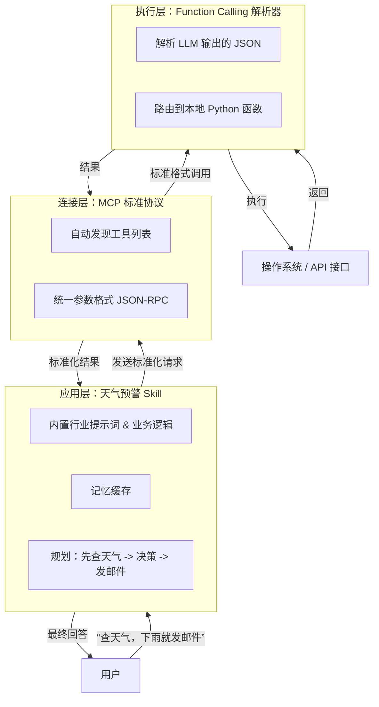

# Agent基本原理
在人工智能和大模型（LLM）领域，**Agent（智能体）** 是当前最火热的概念。如果仅仅把大模型比作一个“超级大脑”，那么 **Agent 就是一个“有了手和脚，能自己完成任务的数字员工”**。

要理解 Agent，核心记住一句话：**传统的 LLM 只负责“思考”（生成文本），而 Agent 负责“思考 + 行动 + 使用工具”。**

我将从**定义本质**、**四大核心组件**和**底层运行原理（ReAct 框架）**三个层面，为你彻底拆解 Agent。

---

### 1. 什么是 Agent？（定义与对比）

-   **LLM（纯大模型）**：像一个博学的**顾问**。你问它“明天北京天气怎么样？”，它只能根据训练数据回答“北京通常...”，或者编一段代码，但它**无法主动查实时数据**。
-   **Agent（智能体）**：像一个有执行力的**助理**。你告诉它“帮我安排明天北京的行程，考虑天气和交通”。Agent 会自己拆解任务 -> 调用天气 API 查实时天气 -> 调用地图 API 规划路线 -> 调用订票工具 -> 最后把整理好的行程单回复给你。

**本质定义**：Agent 是一个**能够感知环境（Perceive）、自主规划（Plan）、调用工具（Use Tools）并采取行动（Act）以达成特定目标**的软件实体。

---

### 2. Agent 的四大核心组件（底层构成）

一个完整的 Agent 框架，在代码层面通常由以下四部分构成：

1.  **大脑（核心 LLM）**：负责逻辑推理、决策和生成自然语言。它不再只是生成下一个字，而是生成“下一步该做什么”的指令。
2.  **规划模块（Planning）**：将用户的复杂目标拆解为一系列可执行的子任务（Step-by-step）。常用技术包括 **CoT（思维链）** 和 **ReAct**。
3.  **记忆模块（Memory）**：
    -   **短期记忆（上下文）**：当前会话的对话历史（受上下文窗口长度限制）。
    -   **长期记忆（向量数据库）**：将历史对话或知识库通过 Embedding 存入向量库，需要时检索，让 Agent 拥有“长期经验”。
4.  **工具集（Tools）**：Agent 的“手脚”。这包括外部 API（查天气、搜网页）、内部系统（数据库查询、代码解释器）、甚至是其他 Agent。

---

### 3. 基本原理：ReAct 范式（思考-行动-观察循环）

这是目前主流 Agent（如 AutoGPT、LangChain Agent）的最底层运行逻辑。**ReAct = Reason（推理） + Act（行动）**。

它不是一个静态的流程，而是一个 **“While 循环”**，直到任务完成为止。循环步骤如下：

> **用户提问 -> 思考（Thought） -> 行动（Action） -> 观察（Observation） -> 再次思考（Thought） -> ... -> 输出最终答案（Final Answer）**

为了让你直观理解，看一个底层伪代码的执行流：

**任务：**“帮我查一下马斯克今天的微博粉丝数。”

| 循环次数 | Agent 内部执行状态（底层日志） | 具体动作 |
| :--- | :--- | :--- |
| **Step 1** | **Thought（思考）**：我需要知道马斯克的微博 ID，并获取粉丝数。我没有直接数据，需要调用搜索工具和爬虫工具。<br>**Action（行动）**：调用 `SearchTool(query="马斯克微博")`。<br>**Observation（观察）**：工具返回“马斯克微博 ID 是 @elonmusk”。 | 调用搜索引擎 |
| **Step 2** | **Thought**：已获取 ID，现在需要查粉丝数。<br>**Action**：调用 `WeiboFansTool(id="@elonmusk")`。<br>**Observation**：工具返回“当前粉丝数为 620 万”。 | 调用微博工具 |
| **Step 3** | **Thought**：我已经获得了确切的粉丝数，任务完成。<br>**Action（输出）**：返回 `Final Answer`：“马斯克今天的微博粉丝数是 620 万。” | 回复用户 |

---

### 4. Agent 的“工具调用”底层机制（Function Calling）

你可能会好奇，Agent 是怎么让大模型去“调用代码”的？这依赖于大模型底层的 **Function Calling（函数调用）** 能力：

1.  开发者在 System Prompt 中告诉大模型：“这里有 10 个函数，功能分别是 `get_weather`、`search_web`...”。
2.  用户提问时，大模型**不直接回答**，而是输出一段**结构化的 JSON**，比如：`{"function": "get_weather", "params": {"city": "Beijing"}}`。
3.  外部程序（代码）监听到这段 JSON，解析后去执行对应的本地函数（真的去请求天气预报 API）。
4.  程序将 API 返回的结果拼接到新的 Prompt 中，再次发给大模型。
5.  大模型根据返回的数据，组织成自然语言回复给用户。

**关键点**：Agent 本质上还是“文字接龙”，只不过它接出来的文字是“指令 JSON”，由外部代码代理去执行物理世界的操作。

---

### 5. 当前 Agent 的局限性（务必清醒认知）

虽然 Agent 看起来很强大，但工业界目前仍面临三大棘手难题：

-   **幻觉累积（Error Propagation）**：如果第一步“思考”错了，后面的所有行动都会错，且无法自动纠正（陷入死循环）。
-   **消耗 Token 极高**：每次循环（Thought + Observation）都要消耗大模型一次推理费用，完成一个复杂任务可能需要几十轮对话，成本是纯聊天的数十倍。
-   **规划能力上限**：当前的 Agent 只能处理有限步骤的任务（5-10 步内）。对于需要几十步甚至上百步的极复杂任务，目前的 LLM 逻辑规划能力（类似“走迷宫”）仍然较弱，容易迷失方向。

---

### 总结：一句话记住 Agent

> **Agent = 大模型（大脑） + 规划（思维链） + 记忆（向量库） + 工具（API/函数）。**
> 它的基本原理是**“ReAct 循环”**：不断地**思考**怎么做，**调用工具**去执行，**观察**结果，再根据结果决定下一步，直到任务结束。


# function calling(),Skill,MCP这三者有什么区别
这是一个非常前沿且极易混淆的问题。很多开发者会把它们混为一谈，但事实上，**它们完全不在同一个维度上**。

我用一句话帮你理清本质：

-   **Function Calling（函数调用）**  是 **“沟通语法”**（大模型怎么开口说要调工具）。
-   **MCP（模型上下文协议）** 是**“通用接口标准”**（工具以什么“插头”接入系统）。
-   **Skill（技能）**  是 **“打包好的应用方案”**（给用户直接用的、封装好的完整功能）。

为了让你彻底分清，我从**层级、作用范围、标准化程度和开发者视角**四个维度来拆解：

---

### 1. Function Calling（函数调用）—— 大模型的“输出格式”
**它解决的是“大模型如何表达意图”的问题。**

-   **本质**：这是一种**交互协议**，定义了大模型在回答时，不直接输出纯文本，而是输出一段**结构化的 JSON**（包含函数名和参数）。
-   **底层原理**：在模型预训练和微调阶段，厂商（如 OpenAI、Anthropic）让模型学会了识别特定的训练数据。当用户提问时，模型根据上下文“推理”出需要调哪个工具，并把参数填好。
-   **特点**：
    -   它是**单向**的（模型 -> 应用端）。
    -   它**不负责执行**，只负责“喊口令”。真正的执行（查天气、发邮件）是由应用端（你的代码）监听到 JSON 后去执行的。
    -   它是**厂商强绑定**的（OpenAI 的 FC 格式和 Gemini 的不完全一样）。


---

### 2. MCP（模型上下文协议，Model Context Protocol）——  AI 的“USB-C 通用接口”
**它解决的是“应用/工具如何标准化接入 AI”的问题。**
==MCP规定了如何发现函数以及如何调用函数==
-   **本质**：这是 Anthropic（Claude 母公司）在 2024 年底推出的**开放标准协议**。它相当于给 AI 工具制定了一个统一的“即插即用”规范。
-   **底层原理**：MCP 定义了 **MCP Server（工具提供方）** 和 **MCP Client（AI 宿主，如 Claude App）** 之间的通信规范（基于 JSON-RPC）。工具开发者只要按照 MCP 标准写一个 Server，任何支持 MCP 的 AI 客户端都能直接调用它，无需为每个 AI 平台单独写适配代码。
-   **特点**：
    -   它是**双向**的，不仅提供工具，还能向 AI 提供上下文资源（如本地文件系统、数据库）。
    -   它是**标准化**的，把过去碎片化的“API 转接层”统一了。
    -   它是**基础设施层**的（类比 JDBC 之于 Java 数据库连接）。

**注意:** MCP负责函数的注册和使用, MCP协议没有规定如何与LLM交互

![[面试/agent/Attachment/image.png]]

### 3. Skill（技能）—— 面向用户的“成品 App”
**它解决的是“用户如何直接解决特定复杂任务”的问题。**

-   **本质**：这是一个**业务层面的封装概念**。它不是底层协议，而是一个包含 **Prompt（提示词） + 工具链（Tools） + 工作流（Workflow）** 的完整套件。
-   **具体表现**：在 Coze、Dify、豆包等平台上，你看到的“新闻摘要技能”、“一键生成周报技能”、“竞品分析技能”就是 Skill。
-   **底层原理**：一个 Skill 内部可能调用了 5 个 Function Calling，涉及 3 个不同系统的 API（MCP 或非 MCP 协议），并内嵌了复杂的 ReAct 循环逻辑。它对用户屏蔽了所有技术细节，只暴露一个输入框和输出结果。
-   **特点**：
    -   它是**面向场景**的（端到端解决需求）。
    -   它是**可复用/可售卖**的资产。

---

### 4. 三者协同工作的层级关系（极简架构图）

为了让你一目了然，假设你要做一个“自动竞品分析 Agent”：

| 层级           | 组件                   | 扮演角色          | 在此场景下的例子                                                  |
| :----------- | :------------------- | :------------ | :-------------------------------------------------------- |
| **应用层（用户侧）** | **Skill（技能）**        | **“老板”**      | 打包好的“竞品分析助手”面板，用户点一下就能用。                                  |
| **逻辑层（大脑侧）** | **Function Calling** | **“翻译官”**     | 大模型输出 JSON：`{"action":"scrape_web","url":"..."}`。         |
| **连接层（通道侧）** | **MCP 协议**           | **“USB 集线器”** | 爬虫工具按照 MCP 标准挂载到系统上，AI 通过统一接口调用它。无论底层是 Python 还是 Node.js。 |

---

### 5. 核心区别速查表（面试/实战必备）

| 对比维度      | Function Calling   | MCP                      | Skill                 |
| :-------- | :----------------- | :----------------------- | :-------------------- |
| **核心定位**  | 模型的**输出格式规范**      | 工具的**接入接口规范**            | 业务的**功能封装体**          |
| **标准化程度** | 各家模型厂商不同（碎片化）      | 统一标准协议（Anthropic 主导）     | 各平台自定义（无统一标准）         |
| **由谁实现**  | 由 **LLM 厂商** 训练提供  | 由 **中间件/社区** 维护 Server   | 由 **开发者/平台运营者** 编排    |
| **解决痛点**  | 大模型无法直接操作外部世界      | 每接一个新工具就要写一套鉴权和解析逻辑      | 用户不懂代码和 Prompt，需要开箱即用 |
| **是否必须**  | **必须**，没有它模型无法输出指令 | **可选**，你可以自己写 http 调用替代它 | **可选**，你可以把代码写死在后端    |

---

### 6. 给开发者的实战建议

-   **如果你在写底层后端逻辑**：你要关注 **Function Calling** 的 JSON Schema 定义，确保模型输出能被你的代码安全解析。
-   **如果你在做平台/框架**：你应该拥抱 **MCP**，把自己的数据库、内部 API 封装成 MCP Server，让所有支持 MCP 的 AI（如 Claude Desktop、Zed）都能直接接入你的业务。
-   **如果你在做产品交付（To C / To B）**：你应该封装 **Skill**。用户不关心你底层用的是 FC 还是 MCP，用户只关心“上传 Excel，自动生成报表”这个 Skill 好不好用。

**一句话总结：Function Calling 是“嘴”，MCP 是“通用电源线”，Skill 是“装好电源线的全自动洗衣机”。**

为了让你彻底看清三者的本质区别，我们设定一个统一的业务场景：**“帮我查一下北京今天的天气，如果下雨，就发邮件提醒我带伞。”**

在这个场景下，我用 **Python 代码 + Markdown 流程图** 为你分别演示三者的具体落地形态。

---
## 三者示例
### 场景预设（通用组件）
假设我们有两个基础函数（工具）：

```python
# 模拟的工具函数
def get_weather(city: str) -> str:
    return f"{city}：多云转阵雨，气温 22°C"  # 模拟返回

def send_email(recipient: str, content: str) -> bool:
    print(f"📧 正在发送邮件给 {recipient}，内容：{content}")
    return True
```

---

### 1. Function Calling（函数调用）—— 底层“翻译官”
**核心作用**：让大模型输出**结构化的 JSON 指令**，而不是自然语言。代码层负责“翻译”这个 JSON 并执行本地函数。

```python
import json

# 1. 定义大模型可识别的“工具描述”（通常放在 System Prompt 或 API 参数中）
tools_schema = [
    {
        "type": "function",
        "function": {
            "name": "get_weather",
            "description": "查询指定城市的天气",
            "parameters": {
                "type": "object",
                "properties": {
                    "city": {"type": "string", "description": "城市名称，如北京"}
                },
                "required": ["city"]
            }
        }
    },
    {
        "type": "function",
        "function": {
            "name": "send_email",
            "description": "发送邮件",
            "parameters": {
                "type": "object",
                "properties": {
                    "recipient": {"type": "string"},
                    "content": {"type": "string"}
                },
                "required": ["recipient", "content"]
            }
        }
    }
]

# 2. 模拟大模型的返回结果（LLM 根据用户提问推理后输出的 JSON）
llm_response = {
    "tool_calls": [
        {
            "id": "call_1",
            "function": {
                "name": "get_weather",
                "arguments": json.dumps({"city": "北京"})
            }
        }
    ]
}

# 3. 底层执行器解析 JSON 并调用本地函数（这就是 FC 的本质工作）
def execute_function_call(tool_call):
    func_name = tool_call["function"]["name"]
    args = json.loads(tool_call["function"]["arguments"])
    
    if func_name == "get_weather":
        return get_weather(**args)
    elif func_name == "send_email":
        return send_email(**args)

# 执行
result = execute_function_call(llm_response["tool_calls"][0])
print(f"🔧 工具执行结果：{result}")
# 输出：🔧 工具执行结果：北京：多云转阵雨，气温 22°C
```

**核心特征**：FC 只负责“吐 JSON”和“调本地函数”，**完全不关心**业务逻辑是否跑通。

---

### 2. MCP（模型上下文协议）—— 标准化“电源插座”
**核心作用**：定义工具以**统一标准（JSON-RPC）**挂载到服务器上，让任何支持 MCP 的 AI 客户端都能自动发现并调用。

```python
# 这是一个标准的 MCP Server 实现（使用官方 Python SDK）
import asyncio
from mcp.server import Server, NotificationOptions
from mcp.server.models import InitializationOptions
import mcp.server.stdio
import mcp.types as types

# 1. 实例化 MCP 服务器
server = Server("weather-email-server")

# 2. 注册工具列表（暴露给 AI 客户端的“说明书”）
@server.list_tools()
async def handle_list_tools() -> list[types.Tool]:
    return [
        types.Tool(
            name="get_weather",
            description="查询天气",
            inputSchema={
                "type": "object",
                "properties": {"city": {"type": "string"}},
                "required": ["city"],
            },
        ),
        types.Tool(
            name="send_email",
            description="发送邮件",
            inputSchema={
                "type": "object",
                "properties": {
                    "recipient": {"type": "string"},
                    "content": {"type": "string"},
                },
                "required": ["recipient", "content"],
            },
        ),
    ]

# 3. 执行工具调用（处理来自任何 MCP Client 的请求）
@server.call_tool()
async def handle_call_tool(
    name: str, arguments: dict | None
) -> list[types.TextContent | types.ImageContent | types.EmbeddedResource]:
    if name == "get_weather":
        city = arguments.get("city")
        result = get_weather(city)  # 复用上面的基础函数
        return [types.TextContent(type="text", text=result)]
    elif name == "send_email":
        recipient = arguments.get("recipient")
        content = arguments.get("content")
        status = send_email(recipient, content)
        return [types.TextContent(type="text", text=f"邮件发送状态：{status}")]

# 4. 启动服务器（通过 stdio 或 SSE 与 AI 客户端通信）
async def main():
    async with mcp.server.stdio.stdio_server() as (read_stream, write_stream):
        await server.run(
            read_stream,
            write_stream,
            InitializationOptions(
                server_name="weather-email-demo",
                server_version="1.0.0",
            ),
        )

if __name__ == "__main__":
    asyncio.run(main())
```

**核心特征**：MCP 完全**不关心**业务逻辑，它只干一件事——**定义“插头”长得什么样**。Claude Desktop 等客户端只要插上这个 Server，就能自动识别 `get_weather` 和 `send_email`。

---

### 3. Skill（技能）—— 开箱即用的“全自动应用”
**核心作用**：封装完整的 **Prompt（人设）+ 工作流（多轮决策）+ 业务异常处理**。用户不用管 JSON 或 Server，点一下按钮就能解决“天气+邮件”这个完整需求。

```python
# 这是一个面向最终用户的“智能助理技能”类
class WeatherEmailSkill:
    """
    技能名称：天气预警邮件助手
    技能描述：自动查询指定城市天气，如果判断为“雨/雪”则自动发送预警邮件。
    """
    
    def __init__(self, default_recipient="admin@company.com"):
        self.recipient = default_recipient
        # 内部隐藏了复杂的 System Prompt（AI 人设）
        self.system_prompt = """
        你是一个谨慎的助理。你的任务：
        1. 调用 get_weather 获取天气。
        2. 如果天气描述中包含“雨”、“雪”、“暴雨”，则调用 send_email。
        3. 否则只回复“天气良好，无需提醒”。
        4. 邮件内容必须包含天气详情和建议。
        """
        self.chat_history = []  # Skill 内部维护记忆

    def run(self, user_input: str) -> str:
        """
        用户只需调用这个方法，Skill 内部自动完成：
        规划（Plan） -> 调用 FC 或 MCP 工具 -> 观察（Observe） -> 决策（Decide）
        """
        # 模拟一次完整的 ReAct 循环（这里简化为逻辑硬编码，实际生产中由 LLM 驱动）
        print(f"👤 用户指令：{user_input}")
        
        # 1. 执行第一步：查天气
        weather_result = get_weather("北京")  # 实际生产会调用 FC 或 MCP Client
        print(f"🌤️ 步骤1 - 天气结果：{weather_result}")
        
        # 2. 业务决策逻辑（内嵌行业经验）
        if "雨" in weather_result or "雪" in weather_result:
            email_content = f"紧急提醒！{weather_result}，出门请务必带伞！"
            # 3. 执行第二步：发邮件
            send_status = send_email(self.recipient, email_content)
            final_answer = f"✅ 已发送预警邮件。状态：{send_status}"
        else:
            final_answer = "☀️ 天气晴好，今天不需要带伞。"
        
        # 4. 记录日志，供后续复盘
        self.chat_history.append({"input": user_input, "output": final_answer})
        return final_answer

# 前端/用户直接调用：
skill = WeatherEmailSkill()
result = skill.run("帮我处理一下今天的天气预警")
print(f"🤖 技能最终输出：{result}")
# 输出：🤖 技能最终输出：✅ 已发送预警邮件。状态：True
```

**核心特征**：Skill 是最上层的，它**把复杂的多步骤决策（if-else）、提示词和工具调用打包**，只给用户暴露一个极简的 `run()` 接口。

---

### 4. 三者在一个完整业务流程中的协作全景图（Markdown）



### 总结对比表

| 维度 | Function Calling | MCP | Skill |
| :--- | :--- | :--- | :--- |
| **代码形态** | 解析 JSON 的 `if-else` 语句 | 基于 ASGI/stdio 的独立 Server | 包含 Prompt 和状态机的 Class |
| **谁会用到它** | **后端开发工程师**（接 API 的人） | **中间件/平台架构师**（做生态的人） | **产品/业务开发**（解决用户痛点的人） |
| **输入** | 大模型吐出的 JSON 字符串 | 符合 JSON-RPC 标准的网络请求 | 用户的一句话（自然语言） |
| **输出** | 本地函数的执行结果 | 符合标准格式的 Tool Result | 一段解决实际问题的自然语言回复 |
| **能否独立运行** | ❌ 不能，必须依附于上层应用 | ✅ 能，作为独立进程运行 | ✅ 能，作为库直接调用 |

简单来说：**Function Calling 是“嘴”在说话，MCP 是“插头”在导电，Skill 是“装好插头的全自动洗衣机”**。
如果你要写代码：
-  做 AI 插件生态，**必写 MCP Server**。
-  做内部系统对接，**只写 FC 解析**就够了。
-  做 AI 应用产品化，**必须封装 Skill**。

# skill和Claude的claude.md或者codex的AGENTS.md,有什么区别
这三者的核心区别在于：**Skill 是“可复用的能力包”**，而 **`CLAUDE.md` 和 `AGENTS.md` 是“项目特定的规则文件”**。

为了让你更直观地理解，我把它们比作一个公司的运作：

*   **Skill（技能）**：相当于**外聘的专家顾问**。每个顾问都有自己擅长的领域（比如“代码审查专家”、“数据库迁移专家”），他们带着自己的一套工作手册（`SKILL.md`）和工具（脚本）。当有需要时，AI 可以随时“召唤”他们来协助完成特定任务。
*   **`CLAUDE.md` / `AGENTS.md`**：相当于**公司内部的《员工手册》或《项目章程》**。它规定了整个团队（AI）在任何时候都需要遵守的通用规则、代码规范和项目结构。

下面我从几个关键维度来详细拆解它们的区别：

### 🎯 核心定位：能力 vs. 规则

*   **`CLAUDE.md` / `AGENTS.md`（规则文件）**：它们是项目的“**宪法**”或“**持久记忆**”。作用是为 AI 提供**项目级别的上下文**，确保 AI 理解项目的架构、技术栈、编码规范、常用命令等。它是一个**必须始终遵守的基础规则集**。

*   **Skill（技能）**：它们是可插拔的“**专家模块**”。作用是赋予 AI **特定的、可复用的专业能力**。它封装了完成某类特定任务所需的知识、工作流程甚至可执行脚本。AI 可以根据任务需要，**按需动态加载**相应的 Skill。

### 📦 作用范围：全局项目 vs. 按需激活

*   **`CLAUDE.md` / `AGENTS.md`**：**作用范围是永久的、全局的**。只要 AI 在该项目（或子目录）中工作，这些规则就会在**每次对话开始时自动加载**，并一直生效。它们提供的是一种**横向的、广泛的**改进。

*   **Skill**：**作用范围是临时的、按需的**。AI 启动时会加载 Skill 的“目录”（名称和描述），但**不会加载完整内容**。只有当用户的需求或当前任务与某个 Skill 的描述匹配时，AI 才会**动态加载**其完整的指令和资源。它提供的是**纵向的、深度的**专业能力。

### ⚙️ 加载与执行机制：主动注入 vs. 动态调用

*   **`CLAUDE.md` / `AGENTS.md`**：**被动注入**。文件在 AI 启动时被读取并**直接注入到系统提示词（System Prompt）中**。这意味着 AI 从第一句话开始就知道这些规则。规则通常**不包含可执行代码**，只是文本指令。

*   **Skill**：**主动调用**。AI 根据任务需要，**主动决定**去加载哪个 Skill。Skill 的内容不仅可以是指令，还可以附带 `scripts/`（可执行脚本）、`references/`（参考文档）和 `assets/`（资源文件）。AI 可以**确定性地执行这些预置脚本**，而不是每次都现场生成代码，这大大提高了可靠性和效率。

### 🤔 为什么需要 Skill？它解决了什么痛点？

在 Skill 出现之前，把所有规则都塞进一个 `CLAUDE.md` 或系统提示词里，会带来两个问题：

1.  **上下文窗口（Context Window）被占满**：如果项目规则、编码规范、各种工作流程加起来有上万字，每次对话都全量加载，会迅速占满宝贵的上下文窗口，导致 AI “记不住”后面的对话。
2.  **无法按需启用**：你可能有 20 种不同的专业工作流（如“部署到 AWS”、“生成 API 文档”），但 AI 在写一个简单函数时并不需要知道这些。把它们全塞进去，反而会干扰 AI 的判断。

Skill 通过 **“渐进式披露”（Progressive Disclosure）** 巧妙地解决了这两个问题：

*   **第一层（启动时）**：只加载每个 Skill 的 **`name` 和 `description`**，仅消耗约 100 个 Token。这让 AI 知道“我有哪些专家可以调用”。
*   **第二层（激活时）**：当任务匹配时，加载完整的 **`SKILL.md`** 指令，建议不超过 5000 Token。
*   **第三层（执行时）**：只有在需要时，才加载 `scripts/`、`references/` 等附属资源，且**脚本代码本身不进入上下文，只有执行结果进入**。

这样，你就可以在一个项目中挂载几十个 Skill，而不会影响日常对话的性能。

### ⚖️ 对比总结：一张表看懂核心差异

| 特性维度 | **`CLAUDE.md` / `AGENTS.md`** | **Skill** |
| :--- | :--- | :--- |
| **核心目的** | 提供**项目上下文和通用规则** | 提供**特定的、可复用的专业能力** |
| **作用范围** | **持久且全局**，对整个项目始终生效 | **临时且按需**，仅在相关任务时被激活 |
| **加载方式** | **自动、全量**加载到系统提示词 | **动态、分层**加载（渐进式披露） |
| **内容构成** | 主要是 Markdown 格式的**文本指令和规则** | 文件夹，包含 `SKILL.md`、**脚本**、**模板**等 |
| **可移植性** | **绑定特定项目**，通常随仓库提交 | **跨项目可复用**，可独立分享和安装 |
| **典型用例** | “此项目使用 Python 3.10”、“运行测试用 `pytest -v`” | “按团队规范进行代码审查”、“部署到 AWS 的生产环境” |

### 💎 如何选择与协同使用？

在实际开发中，**“规则文件”和“技能”是协同工作，而非相互替代的关系**。你可以这样来规划它们：

1.  **把“不变”写入规则文件**：将项目最基础、最通用的信息，如**技术栈（Python 3.10, React 18）**、**目录结构**、**通用的代码风格**、**基础的构建与测试命令**等，写入 `CLAUDE.md` 或 `AGENTS.md`。这是 AI 工作的“底座”。

2.  **把“多变”封装为技能**：将**特定场景下的复杂工作流**、**需要执行脚本的确定性任务**、**高度专业化的领域知识**等，封装成独立的 Skill。比如：
    *   **`pdf-processor` Skill**：当需要处理 PDF 时，AI 加载此 Skill 并调用其中的脚本。
    *   **`security-audit` Skill**：当需要进行安全审计时，加载此 Skill，其中包含了检查清单和报告模板。

> **💡 一个值得留意的趋势**
> 有趣的是，根据 Vercel 团队的测试，在面对需要特定框架（如 Next.js）最新知识的任务时，将高度压缩的官方文档索引直接放入 `AGENTS.md` 中，其表现（100% 通过率）反而优于将文档封装成 Skill 的方式（79% 通过率）。原因在于，Skill 依赖 AI “主动决定”去调用它，但在 56% 的测试案例中，AI 并没有这么做。这个案例说明，对于**必须掌握的核心知识**，放在规则文件中强制加载可能比依赖 AI 的“主观能动性”更可靠；而对于**非必须的增强型能力**，Skill 仍然是避免上下文膨胀的更优解。


# 一个skill应该怎么写才算一个良好的skill
一个良好的 Skill，本质上是一份写给 AI 的**“标准作业程序（SOP）”**，而非一段随性的聊天提示词。它的目标是让 AI 在特定任务上，能像熟练工一样**稳定、可靠、不依赖运气**地交付成果。

要写出这样的 Skill，需要把握好从设计、结构到内容撰写的几个关键点。

### 🎯 核心原则：精准、单一、可执行

一个高质量的 Skill，通常遵循以下核心原则：

*   **触发精准**：通过 `name` 和 `description` 让 AI 在正确的时机激活，避免误用。
*   **功能单一**：一个 Skill 只专注做好一件事，职责清晰，更容易被稳定执行。
*   **步骤明确**：提供的是 AI 可以直接照做的指令，而非宽泛的原则。
*   **边界清晰**：明确告诉 AI **什么该做，什么绝对不该做**，防止其“自由发挥”。
*   **稳定优先**：将机械、重复的操作封装成脚本执行，减少 AI 自由发挥带来的不确定性。

### 🗂️ 标准目录结构：模块化与按需加载

一个设计良好的 Skill 是一个目录，通过将不同内容分开放置，实现“渐进式披露”，既保证能力，又节省宝贵的上下文空间。

```
my-skill/
├── SKILL.md          # 🚨 必需：核心指令文件
├── scripts/          # 可选：存放可执行的脚本（Python, Bash等）
├── references/       # 可选：存放参考文档、模板、规范等
└── assets/           # 可选：存放图片、字体等资源文件
```

### ✍️ 核心文件 `SKILL.md` 的写法

`SKILL.md` 是 Skill 的大脑，由两部分组成：**元数据 (Frontmatter)** 和**正文 (Markdown)**。

#### 1. 元数据 (YAML Frontmatter)
这是 AI 判断是否启用 Skill 的**唯一依据**，因此 `name` 和 `description` 的撰写至关重要。

*   **`name` (必需)**：Skill 的唯一标识符。
    *   **规范**：使用小写字母、数字和连字符 (`-`)。建议使用动名词形式。
    *   **示例**：`running-tests`, `deploy-microservice`。
*   **`description` (必需)**：描述 Skill 的能力和适用场景。
    *   **规范**：使用第三人称，清晰说明“做什么”和“何时用”。将其视为一条**路由规则**，而非标题。
    *   **示例**：
        *   **好的**：`"Review code for quality, correctness, and maintainability. Use when evaluating pull requests, refactoring existing code..."`
        *   **差的**：`"Helps with code review"` (太模糊)。

#### 2. 正文 (Markdown Body)
这是 AI 被激活后接收到的详细指令。为了让 AI 能稳定执行，内容需要结构化。

一个经过验证的高效结构如下：

*   **目标 (What this skill does)**：用一句话总结核心目标。
*   **触发条件 (When to use it)**：明确说明何时**启用**，何时**不启用**。
*   **输入 (Inputs needed)**：列出执行任务需要的信息。
*   **执行步骤 (Step-by-step procedure)**：提供清晰、有序、可操作的步骤列表。
*   **验证方式 (Validation / Done)**：说明如何判断任务已完成且正确。
*   **失败处理 (Common failure modes and fixes)**：预判可能出错的地方并给出解决方案。

此外，可以**通过示例代替抽象解释**，让 AI 更直观地理解你的要求。`SKILL.md` 本身应保持简洁，避免过长。

### 🚀 进阶技巧：何时使用 `scripts/` 和 `references/`

*   **`scripts/` (脚本)**：当任务包含**确定性、机械性**的操作（如解析 CSV、文件格式转换、数据校验）时，应写成脚本放在此目录。AI 会执行脚本并获取结果，这比让 AI 自己写代码处理要**稳定得多**。
*   **`references/` (参考文档)**：将详细的**背景资料、模板、规范文档**放在此目录。AI 只有在需要时才会读取这些文件，避免了主指令文件过于臃肿。

### ⚠️ 避坑指南：从常见误区中学习

*   **误区一：把 Skill 当成万能 Prompt**
    Skill 是结构化的可复用能力模块，而 Prompt 更偏向一次性、探索性的交互。用写 Prompt 的思路写 Skill，会导致其不稳定且难以维护。
*   **误区二：内容越多越好**
    复杂的 Skill 会降低触发准确率和执行稳定性。应遵循**最小必要信息**原则。
*   **误区三：让 AI 自动总结生成 Skill**
    将一次成功的对话直接丢给 AI 去总结，往往会得到一个冗长、混杂的“长 Prompt”，而不是结构清晰的 Skill。

### 💎 总结：良好的 Skill 应该是怎样的？

总而言之，一个良好的 Skill 应该像一本为 AI 量身定制的**工作手册**。它告诉 AI 在**什么情况**下启动（元数据），按照**什么步骤**操作（核心指令），**调用哪些工具**（脚本），以及**参考什么标准**（参考资料）。

最终，它的目标是让 AI 在执行特定任务时，表现稳定、可靠，且易于维护和分享。

# Harness Engineer
==Harness=agent-model==

在这个定义下，Harness 不再只是“护栏”，而是**让模型拥有“躯体”和“生存环境”的底层操作系统**。这个岗位的本质是：**将大模型（大脑）从“纯文本预测器”工程化改造为“能够自主推理、调用工具、管理记忆并闭环执行的数字生命体”。**

---

### 1. 为什么叫 “Harness”（驾驭）？
在工程语境下，Harness 有“马具”和“线束”的含义。在 AI 领域，它意味着**将原始模型（Raw Model）的“野性”输出，通过工程手段“栓”在具体、可控、可观测的业务轨道上**。

-   如果说 Model 是引擎，那么 Harness 就是包含**油箱、变速箱、方向盘和仪表盘**的整车底盘。

---

### 2. Harness = agent-model 的底层构成（核心职责）
按照这个定义，Harness Engineer 构建的是**智能体的“中间件层”**，具体包含以下 5 个核心子系统：

-   **状态机与编排层（State Machine & Orchestration）**：这是 Harness 的“大脑皮层”。它负责维护 ReAct（推理-行动）循环，管理 Agent 从 `Idle` -> `Thinking` -> `Calling_Tool` -> `Observing` -> `Answering` 的状态流转。底层通常涉及 **LangGraph** 或自研的有向无环图（DAG）执行引擎。

-   **模型网关与路由（Model Gateway）**：Harness 不再绑定单一模型。它作为代理层，根据任务复杂度动态路由（如：简单问答走轻量级 7B 模型，复杂推理走 GPT-4，代码生成走 DeepSeek-Coder），并实现 Failover（故障转移）和 Token 成本控制。

-   **工具抽象与沙盒（Tool Abstraction & Sandbox）**：这是 Agent 的“手脚”。Harness 定义了工具调用的标准接口（如 MCP 协议或自定义 JSON Schema），并管理**代码执行沙盒**（如 E2B 或 Docker 容器），确保 Agent 生成的代码在隔离环境中安全运行，不能破坏宿主系统。

-   **混合记忆系统（Hybrid Memory）**：实现**短期记忆**（对话上下文滑动窗口）与**长期记忆**（向量数据库 + 关系型数据库）的自动读写、压缩和检索增强（RAG）策略。

-   **可观测性与自省（Observability & Introspection）**：Harness 必须记录 Agent 每一步的 `Thought`、`Action` 和 `Observation`（即追踪 Trace）。当 Agent 陷入死循环或产生幻觉时，工程师通过 Harness 提供的日志链快速定位“是哪一步推理错了”。

---

### 3. Harness Engineer 与普通“AI 后端工程师”的区别

| 维度 | 普通 AI 后端工程师 | Harness Engineer（agent-model 定义下） |
| :--- | :--- | :--- |
| **关注点** | 如何调用 API，将模型输出返回给前端。 | 如何**控制**模型的输出过程（Process），而非仅仅关注结果。 |
| **代码形态** | 写 HTTP 接口、数据库 CRUD。 | 写 **循环控制**（While True）、**状态机**、**重试/降级策略**、**超时熔断**。 |
| **对模型的认知** | 将模型视为“黑盒”API。 | 将模型视为**不稳定的“概率引擎”**，利用工程手段（如约束解码、自我一致性）将其驯化成确定性服务。 |
| **核心指标** | 吞吐量（QPS）、延迟（RT）。 | **任务完成率（Task Success Rate）**、**循环步数（Step Count）**、**工具调用准确率**。 |

---

### 4. 实战场景：Harness Engineer 在写什么代码？
假设要让 Agent 完成“帮我从 PDF 中提取数据并生成 Excel 报表”：

-   **初级做法**：写一个 Python 脚本，按顺序调用 PDF 解析库和 Excel 库。
-   **Harness Engineer 的做法**（构建 `agent-model` 调用的底层框架）：
    1.  **设计状态图**：定义节点 `extract` -> `summarize` -> `generate_excel`。
    2.  **注入约束**：在 System Prompt 中动态注入当前任务的时间限制（“你必须在 60 秒内完成”）。
    3.  **校验层**：在模型输出 JSON 调用 `write_excel` 之前，用 Pydantic 强制校验参数类型，防止模型给错字段类型导致程序崩溃。
    4.  **回滚机制**：如果 Excel 生成失败，Harness 自动触发“反思（Reflection）”节点，将报错信息喂回给模型，让模型自己修正参数重试，而**不需要人类重启整个流程**。
    5.  **断点续传**：利用 Checkpointer 保存当前状态，如果服务重启，Agent 能从中断的地方继续执行。

---

### 5. 为什么大厂（如 DeepSeek/OpenAI）在抢这类人才？
因为当模型能力（Model）趋同时，**Harness（驾驭能力）** 就成了差异化的核心壁垒。

-   **安全性**：Harness 通过严格的“输出解析器”防止 Prompt Injection（提示注入），防止 Agent 被用户诱导执行 `rm -rf /`。
-   **成本控制**：Harness 负责监控 Token 消耗，当 Agent 陷入死循环时主动打断（Kill Switch），避免巨额账单。
-   **数据飞轮**：Harness 会自动收集 Agent 失败的 Case，标注后用于微调（SFT）下一个版本的模型，实现 `agent` 反哺 `model`。

---

### 总结
在 **Harness = agent-model** 的语境下，**Harness Engineer 的本质是“AI 系统的系统工程师”**。

他/她不研究 Transformer 数学原理，但精通**并发控制、状态持久化、异常捕获、契约测试和混沌工程**。核心产出不是“一个能聊天的机器人”，而是**一套能让“不够完美的模型”稳定输出“完美结果”的底层框架（Framework）**。

如果你立志做这个方向，建议深入研究 **LangGraph（Python）** 或 **LlamaIndex Workflow** 的源码，搞懂它们是如何管理 Agent 状态的。这比单纯调 API 要硬核得多。😎