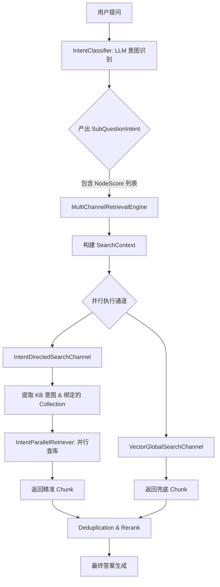

## 流水线有什么用,比直接上传的优点是什么
在这个项目中，**流水线（Ingestion Pipeline）** 是一个高度可配置、数据驱动的文档处理引擎。它的核心作用是**将“原始文件”转化为“高质量向量索引”的过程标准化、模块化**。

简单来说，它不是写死的代码，而是一个可以像搭积木一样自由组合的**数据处理工厂**。

---

### 一、流水线是干什么的？

流水线的任务是把一个原始文档（如 PDF、Word、网页）经过一系列步骤处理后存入向量数据库。在 [IngestionEngine](file://D:/IDEA-java/ragent/bootstrap/src/main/java/com/nageoffer/ai/ragent/ingestion/engine/IngestionEngine.java) 中，它通过链式调用不同的 **节点（Node）** 来完成：

| 节点类型 | 类名 | 职责 |
| :--- | :--- | :--- |
| **Fetcher** | `FetcherNode` | **获取**：从 URL、OSS 或本地读取原始字节流 |
| **Parser** | `ParserNode` | **解析**：把二进制文件转成纯文本（支持 PDF/Docx/HTML 等） |
| **Chunker** | `ChunkerNode` | **分块**：按固定长度、语义或段落切分成小片段 |
| **Enhancer** | `EnhancerNode` | **增强**：利用 LLM 对文本进行润色、摘要或关键词提取 |
| **Enricher** | `EnricherNode` | **富化**：生成与该片段相关的“模拟问题”，提升检索命中率 |
| **Indexer** | `IndexerNode` | **索引**：计算 Embedding 并存入 Milvus/PostgreSQL 向量库 |

---

### 二、为什么要用流水线？比直接上传有什么优势？

如果只是简单的“上传 -> 分块 -> 向量化”，确实不需要这么复杂的架构。但引入流水线后，解决了以下痛点：

#### 1. 应对不同格式的复杂性（解耦解析逻辑）
*   **直接上传**：通常只能处理纯文本。如果用户上传了包含表格的 PDF 或带图片的 Word，简单分块会丢失结构信息。
*   **流水线**：可以通过配置不同的 `ParserNode`（如集成 PyPDF2、Apache Tika 或专门的版面分析模型），精准提取内容。

#### 2. 提升检索质量（LLM 增强与富化）
这是流水线最大的优势。简单的分块往往导致检索不准，流水线可以在入库前做“预处理”：
*   **语义增强（Enhancer）**：如果一段话太短，可以用 LLM 补全上下文。
*   **问题生成（Enricher）**：比如文档里有一句“报销流程见附录 A”，用户搜“怎么报销”可能搜不到。流水线可以让 LLM 提前生成“如何申请报销？”、“报销政策是什么？”等问题并挂在 Chunk 上。**检索时匹配这些问题，召回率会大幅提升。**

#### 3. 灵活性与多租户适配（数据驱动设计）
*   **直接上传**：所有文档走同一套逻辑。
*   **流水线**：你可以创建多条流水线：
    *   **流水线 A（技术文档）**：启用 `Parser` + `CodeChunker`（代码专用分块）。
    *   **流水线 B（合同文件）**：启用 `Parser` + `TableExtractor` + `LegalEnhancer`。
    *   用户在上传文档时，可以根据业务场景选择不同的流水线。

#### 4. 容错与监控（Traceability）
*   在 [IngestionContext](file://D:/IDEA-java/ragent/bootstrap/src/main/java/com/nageoffer/ai/ragent/ingestion/domain/context/IngestionContext.java) 中，每一步都会记录日志。
*   如果某个 PDF 解析失败，你可以精确知道是卡在了解析阶段还是向量化阶段，而不是只看到一个“上传失败”。

---

### 三、核心实现原理

1.  **定义阶段**：前端页面配置好节点顺序和参数，保存到数据库表 `t_ingestion_pipeline` 和 `t_ingestion_pipeline_node`。
2.  **执行阶段**：
    *   [IngestionEngine](file://D:/IDEA-java/ragent/bootstrap/src/main/java/com/nageoffer/ai/ragent/ingestion/engine/IngestionEngine.java) 拿到 `PipelineDefinition`。
    *   找到起始节点（没有前驱的节点）。
    *   根据 `nextNodeId` 链式执行，每个节点操作同一个 `IngestionContext`（类似中间件管道模式）。
3.  **结果**：最终由 `IndexerNode` 将处理好的 `VectorChunk` 写入向量库。

### 总结

**直接上传分块**就像是“把书撕碎了塞进碎纸机”，虽然快但很难找回来；而**流水线**则像是“图书管理员的工作流”：**拆封 -> 扫描 -> 编目 -> 贴标签 -> 上架**。

在处理企业级复杂文档（如含图表的技术手册、法律合同）时，流水线通过**增强（Enhance）** 和 **富化（Enrich）**环节，能显著提升后续 RAG 问答的准确性。


## 双路并行召回是什么
在这个项目中，"双路并行召回"指的是通过 **两个相互补充的检索通道同时并行执行**，各自从不同的角度召回候选文档片段（Chunk），再将结果合并、去重、重排序后输送给 LLM。

---
### 一、"双路"是哪两路？

| 通道         | 类                                                                                                                                                                    | 优先级     | 策略                          |
| ---------- | -------------------------------------------------------------------------------------------------------------------------------------------------------------------- | ------- | --------------------------- |
| **意图定向检索** | [IntentDirectedSearchChannel](file://D:/IDEA-java/ragent/bootstrap/src/main/java/com/nageoffer/ai/ragent/rag/core/retrieve/channel/IntentDirectedSearchChannel.java) | `1`（高）  | 根据意图识别结果，在**意图绑定的特定知识库**中检索 |
| **向量全局检索** | [VectorGlobalSearchChannel](file://D:/IDEA-java/ragent/bootstrap/src/main/java/com/nageoffer/ai/ragent/rag/core/retrieve/channel/VectorGlobalSearchChannel.java)     | `10`（低） | 在所有知识库中遍历**全局向量检索**，作为兜底    |

两路各有分工：
- **意图定向**负责"精准打击"——意图置信度高时，只在相关知识库中检索
- **全局检索**负责"广撒网兜底"——意图不明确或置信度低时启用，防止漏召回

---

### 二、"并行"是怎么体现的？

核心引擎在 [MultiChannelRetrievalEngine](file://D:/IDEA-java/ragent/bootstrap/src/main/java/com/nageoffer/ai/ragent/rag/core/retrieve/MultiChannelRetrievalEngine.java) 中：

```java
// 第96-109行：所有启用的通道通过 CompletableFuture 并行执行
List<CompletableFuture<SearchChannelResult>> futures = enabledChannels.stream()
    .map(channel -> CompletableFuture.supplyAsync(
        () -> {
            log.info("执行检索通道：{}", channel.getName());
            return channel.search(context);
        },
        ragRetrievalExecutor  // 专用线程池
    ))
    .toList();
```


关键点：
1. 使用 `CompletableFuture.supplyAsync` 提交到专用的 [ragRetrievalExecutor](file://D:/IDEA-java/ragent/bootstrap/src/main/java/com/nageoffer/ai/ragent/rag/config/ThreadPoolExecutorConfig.java#L85-L98) 线程池
2. 两个通道的检索 **同时进行**，互不等待
3. 各自内部还有**二级并行**——比如全局检索通道内部通过 [AbstractParallelRetriever](file://D:/IDEA-java/ragent/bootstrap/src/main/java/com/nageoffer/ai/ragent/rag/core/retrieve/channel/AbstractParallelRetriever.java) 并行查询所有 collection

---

### 三、全局检索的智能启用条件

全局检索不是一直开的，有门槛策略（见 [VectorGlobalSearchChannel.isEnabled()](file://D:/IDEA-java/ragent/bootstrap/src/main/java/com/nageoffer/ai/ragent/rag/core/retrieve/channel/VectorGlobalSearchChannel.java#L69-L101)）：

| 场景 | 行为 |
|------|------|
| 未识别出任何意图 | 直接启用全局检索 |
| 最高意图分数 < `confidenceThreshold`(0.6) | 置信度太低，启用全局兜底 |
| 仅1个意图且分数 < `singleIntentSupplementThreshold`(0.8) | 单意图中等置信度，补充全局检索 |
| 多意图高分 | **不启用全局检索**，只走意图定向 |

---

### 四、完整处理流程

```
用户问题
    ↓
 意图识别 + 问题重写
    ↓
┌──────────────────────────────────────────────┐
│         【阶段1：双路并行检索】                 │
│                                              │
│  IntentDirectedSearchChannel ────┐           │
│     (意图绑定的知识库定向检索)       │ CompletableFuture 并行
│  VectorGlobalSearchChannel ──────┘           │
│     (全量知识库向量兜底检索)                    │
│                                              │
│  每个通道内部也有二级并行：                     │
│  AbstractParallelRetriever                   │
│    ├─ Collection A ──┐                       │
│    ├─ Collection B ──┤ CompletableFuture     │
│    └─ Collection C ──┘                       │
└──────────────────────────────────────────────┘
    ↓ 结果合并
┌──────────────────────────────────────────────┐
│         【阶段2：后置处理器链（串行）】          │
│                                              │
│  DeduplicationPostProcessor (order=1) 去重    │
│    → 基于Chunk ID去重，优先级高的通道结果保留    │
│  RerankPostProcessor (order=10) 重排序        │
│    → 调用 Rerank 模型精排，截断到 TopK         │
└──────────────────────────────────────────────┘
    ↓
  上下文格式化 → LLM 生成答案
```


---

### 五、配置入口

在 [SearchChannelProperties](file://D:/IDEA-java/ragent/bootstrap/src/main/java/com/nageoffer/ai/ragent/rag/config/SearchChannelProperties.java) 中通过 `application-search.yml` 控制：

```yaml
rag:
  search:
    channels:
      intent-directed:
        enabled: true
        min-intent-score: 0.4    # 低于此分的意图节点被过滤
        top-k-multiplier: 2      # 召回 topK * 2 的候选
      vector-global:
        enabled: true
        confidence-threshold: 0.6         # 意图置信度阈值
        single-intent-supplement-threshold: 0.8  # 单意图补充阈值
        top-k-multiplier: 3              # 全局召回 topK * 3 的候选
```


---

### 总结

**双路并行召回**的设计精髓在于：
- **双路互补**：意图定向保证精准度，全局检索保证覆盖率
- **并行执行**：两路同时跑，不增加延迟
- **智能调度**：全局检索根据意图置信度按需启停，避免浪费资源
- **后置精排**：去重 + Rerank 保证最终给 LLM 的是最相关的结果

## 双路并行召回的意图检索具体是检索什么意图,什么叫做与意图绑定的知识库,和一般知识库有什么区别
这是一个非常核心的业务逻辑问题。在 Ragent 项目中，“意图检索”和“绑定的知识库”是实现**精准召回**的关键设计。

我来为你拆解这三个概念：

### 1. 具体是检索什么“意图”？

这里的“意图”并不是指用户的情绪（如开心、生气），而是指**用户问题所属的业务领域或分类**。

在项目的树形意图识别模块中，一个复杂的提问会被拆解并匹配到具体的叶子节点。例如：
*   **用户问：** “我的公积金怎么提取？”
*   **识别出的意图：** `HR福利 -> 公积金管理 -> 提取流程`
*   **用户问：** “服务器 CPU 占用率过高怎么办？”
*   **识别出的意图：** `IT运维 -> 故障排查 -> 性能优化`

**意图检索**就是拿着这些识别出来的“标签”（如“公积金提取”、“性能优化”），去对应的地方找答案，而不是在所有文档里大海捞针。

---

### 2. 什么叫做“与意图绑定的知识库”？

这是项目后台管理的一个配置功能。管理员在创建意图节点时，可以指定该节点**只允许从哪些知识库（Collection）中检索数据**。

*   **绑定关系：** 意图节点 A <---> 知识库集合 {KB_1, KB_2}
*   **代码体现：** 在 [IntentNode](file://D:/IDEA-java/ragent/bootstrap/src/main/java/com/nageoffer/ai/ragent/rag/core/intent/IntentNode.java) 实体中，通常会有一个字段（如 `collectionName` 或关联表）来存储这种映射。

**为什么要绑定？**
因为不同的知识库可能存储了完全不同领域的资料。如果不绑定，当你问“公积金”时，系统可能会错误地从“Java开发规范”的知识库里搜出一些包含“公积金”字眼的无关代码注释。

---

### 3. 和一般知识库有什么区别？

我们可以把“一般知识库”理解为**物理存储**，而“意图绑定的知识库”是**逻辑路由**。

| 维度 | 一般知识库 (Physical KB) | 意图绑定的知识库 (Logical Routing) |
| :--- | :--- | :--- |
| **本质** | 向量数据库中的一个 Collection（表） | 一种检索策略的约束条件 |
| **内容** | 存放原始的 Chunk 和 Embedding | 不存数据，只存“哪个意图去哪找”的规则 |
| **检索方式** | 全局扫描：对所有 Collection 执行相似度搜索 | **定向狙击**：只扫描意图指定的那几个 Collection |
| **优势** | 简单粗暴，适合小规模单一领域 | **抗干扰能力强**，能过滤掉其他领域的噪音 |

---

### 4. 结合代码看它是如何工作的

在 [IntentDirectedSearchChannel](file://D:/IDEA-java/ragent/bootstrap/src/main/java/com/nageoffer/ai/ragent/rag/core/retrieve/channel/IntentDirectedSearchChannel.java) 中，逻辑是这样的：

1.  **提取意图：** 从用户的子问题中提取出所有置信度达标的 KB 意图节点。
2.  **获取绑定信息：** 遍历这些节点，拿到它们各自绑定的 `collectionName`。
3.  **并行检索：** 
    ```java
    // 伪代码逻辑
    for (NodeScore intent : kbIntents) {
        String targetCollection = intent.getNode().getCollectionName(); // 拿到绑定的库
        retrieverService.retrieve(targetCollection, question); // 只在这个库里搜
    }
    ```


### 总结

*   **意图检索**：是为了确定“用户到底想问哪个板块的事”。
*   **绑定知识库**：是为了给每个板块划定“势力范围”，防止跨域干扰。
*   **区别**：一般知识库是**仓库**，意图绑定是**地图**。双路并行中的“意图定向路”就是拿着地图去指定的仓库取货，而“全局检索路”则是把所有仓库翻一遍作为保底。

这种设计在处理企业级复杂场景（如同时包含人事、财务、技术文档的系统）时，能极大地提高回答的**专业度**和**相关性**。

## 那这个项目中的意图识别是怎么识别的,识别完又是怎么发送给意图检索通道让其执行的
在这个项目中，意图识别和检索通道的执行是通过**“树形匹配 + 上下文传递”**的方式串联起来的。

我们可以把这个过程分为三个阶段：**构建意图树**、**LLM 动态识别**、**通道提取与执行**。

---

### 第一阶段：意图是怎么识别的？（树形多级分类）

项目没有使用传统的单标签分类模型，而是采用了一种更灵活的**树形结构（Tree Structure）**配合 **LLM 语义匹配**。

#### 1. 意图树的存储
在数据库中，意图被组织成一棵树。每个节点（`IntentNode`）包含：
*   `id`: 唯一标识
*   `parent_id`: 父节点 ID
*   `name/description`: 意图名称和详细描述（这是 LLM 判断的依据）
*   `collection_name`: **绑定的知识库名称**（检索的关键）
*   `kind`: 类型（KB-知识库检索, MCP-工具调用）

#### 2. 识别过程（LLM 路由）
当用户提问时，系统不会遍历整棵树，而是通过 [IntentClassifier](file://D:/IDEA-java/ragent/bootstrap/src/main/java/com/nageoffer/ai/ragent/rag/core/intent/IntentClassifier.java) 进行动态路由：

1.  **获取候选节点**：从数据库加载当前层级的意图节点描述。
2.  **LLM 打分**：将用户问题和这些描述发给大模型，让 LLM 输出每个节点的**置信度分数（Score）**。
3.  **递归/多层匹配**：如果某个节点得分高且它有子节点，就继续进入下一层识别，直到找到最具体的叶子节点。

**结果产出**：最终你会得到一个 `List<SubQuestionIntent>`，里面包含了用户问题拆解后的各个子意图及其对应的节点列表（`NodeScore`）。

---

### 第二阶段：识别完怎么发送给检索通道？

这里并没有通过消息队列或远程调用发送，而是通过**内存中的对象传递**。核心枢纽是 [MultiChannelRetrievalEngine](file://D:/IDEA-java/ragent/bootstrap/src/main/java/com/nageoffer/ai/ragent/rag/core/retrieve/MultiChannelRetrievalEngine.java)。

#### 1. 构建检索上下文 (SearchContext)
引擎会将识别好的意图打包进一个上下文对象：
```java
SearchContext context = SearchContext.builder()
    .intents(subIntents) // 把识别好的意图塞进去
    .mainQuestion(question)
    .topK(topK)
    .build();
```


#### 2. 并行触发通道
引擎会遍历所有注册的 `SearchChannel`（包括意图定向通道和全局通道），并检查它们是否应该工作：
```java
// 伪代码逻辑
for (SearchChannel channel : channels) {
    if (channel.isEnabled(context)) { // 通道自己决定要不要干活
        CompletableFuture.supplyAsync(() -> channel.search(context), executor);
    }
}
```


---

### 第三阶段：意图检索通道是如何执行的？

当轮到 [IntentDirectedSearchChannel](file://D:/IDEA-java/ragent/bootstrap/src/main/java/com/nageoffer/ai/ragent/rag/core/retrieve/channel/IntentDirectedSearchChannel.java) 执行时，它会做以下几步“精准打击”：

1.  **过滤 KB 意图**：
    它从 `context.getIntents()` 中拿出所有节点，通过 `NodeScoreFilters.kb()` 过滤出那些类型为“知识库检索”且分数达标的意图。

2.  **提取绑定关系**：
    它会查看这些意图节点绑定的 `collectionName`。
    *   例如：意图 A 绑定了 `hr_policy_db`，意图 B 绑定了 `tech_docs_db`。

3.  **启动二级并行检索**：
    它利用 [IntentParallelRetriever](file://D:/IDEA-java/ragent/bootstrap/src/main/java/com/nageoffer/ai/ragent/rag/core/retrieve/channel/strategy/IntentParallelRetriever.java) 同时向这两个库发起向量搜索请求。

4.  **返回结果**：
    将搜到的 Chunk 包装成 `SearchChannelResult` 返回给引擎，等待后续的去重和 Rerank。

---

### 总结流程图




**核心点在于：** 意图识别的结果（`NodeScore`）里不仅带了分数，还直接带了**“去哪里找答案”**的配置信息（`collectionName`）。检索通道只需要读取这个配置，就能实现“指哪打哪”。

## LLM 是怎么给意图打分的
LLM 给意图打分的过程本质上是一个 **“语义匹配 + 约束排序”** 的任务。系统会将用户的问题和所有可能的意图节点描述一起发给大模型，让大模型根据预设的规则输出一个带分数的 JSON 列表。

具体流程如下：

### 1. 准备“候选菜单” (Prompt 构建)
在 [DefaultIntentClassifier](file://D:/IDEA-java/ragent/bootstrap/src/main/java/com/nageoffer/ai/ragent/rag/core/intent/DefaultIntentClassifier.java) 中，系统会先从数据库或缓存中加载所有的**叶子意图节点**。每个节点都包含以下关键信息：
*   **id**: 唯一标识（如 `hr-benefits-pf`）
*   **path**: 路径（如 `人事 > 福利 > 公积金`）
*   **description**: 详细描述（如“关于公积金提取、缴纳的政策说明”）
*   **examples**: 典型问题示例（如“怎么提公积金？”）

这些信息会被填入 [intent-classifier.st](file://D:/IDEA-java/ragent/bootstrap/src/main/resources/prompt/intent-classifier.st) 模板中，形成一个长长的“分类菜单”。

### 2. LLM 执行评分逻辑
LLM 接收到用户问题和这个“菜单”后，会根据 Prompt 中定义的**评分标准**进行思考：

| 分数区间 | 匹配程度 | 判定标准 |
| :--- | :--- | :--- |
| **> 0.8** | **强匹配** | 关键实体（如“OA系统”、“公积金”）在意图描述中明确出现，且业务场景高度吻合。 |
| **0.4 - 0.8** | **中等相关** | 主题词匹配，但可能跨了子系统，或者只是部分要素沾边。 |
| **< 0.4** | **弱相关** | 仅仅是在同一个大行业里，建议直接忽略。 |

**核心规则：**
*   **实体导向**：如果用户问的是“OA系统”，LLM 绝不会去选“保险系统”下的意图（除非用户明确要求对比）。
*   **宁缺毋滥**：如果所有意图都不沾边，LLM 会返回空数组 `[]`。

### 3. 结构化输出与解析
LLM 不会只给一个数字，而是返回一个标准的 JSON 数组：
```json
[
  {
    "id": "hr-benefits-pf", 
    "score": 0.95, 
    "reason": "用户明确询问公积金提取流程，与该节点描述的‘公积金政策’完全一致"
  },
  {
    "id": "hr-attendance", 
    "score": 0.3, 
    "reason": "虽然都是人事相关，但未涉及考勤内容"
  }
]
```

随后，Java 代码会解析这个 JSON，过滤掉低分项，并按 `score` 降序排列。

### 4. 为什么这种方式比传统分类好？
*   **动态性**：你在后台新增一个意图节点，不需要重新训练模型，LLM 下次识别时自动就能“看到”它。
*   **可解释性**：通过 `reason` 字段，你可以清楚地知道 LLM 为什么把这个问题归类到这里，方便调试。
*   **多路召回**：它可以同时给出多个可能的意图及概率，为后续的“双路并行检索”提供决策依据（比如分数不够高时触发全局兜底）。

**总结来说：** LLM 就像一个经验丰富的图书管理员，它拿着你的问题（Query），对照着书架目录（意图树），根据相关性给你的问题贴上标签并打上分数，最后告诉检索通道：“去第 3 排第 5 个书架找，匹配度 95%。”

## 意图节点是干什么的,怎么构建意图节点的,意图节点又是怎么工作的;创建意图节点相比直接搜索有什么好处么
意图节点（Intent Node）是这个 RAG 系统的**“大脑导航图”**。它不仅仅是一个分类标签，更是一个将**用户自然语言**与**底层业务逻辑/数据源**连接起来的智能路由单元。

---

### 1. 意图节点是干什么的？

你可以把意图节点想象成图书馆里的**索引卡片**。它的核心作用有三个：
1.  **语义路由**：告诉系统用户到底想问哪个领域的事（是问“人事政策”还是“IT故障”）。
2.  **绑定资源**：明确指定该问题应该去哪个**知识库（Collection）**检索，或者调用哪个**MCP工具**。
3.  **提供上下文**：通过节点的描述和示例问题，辅助 LLM 更精准地理解用户意图。

---

### 2. 怎么构建意图节点的？

在项目中，意图节点是通过**树形结构（Tree Structure）** 来组织的。构建过程通常分为两步：

#### A. 数据库建模 (物理存储)
在 `t_intent_node` 表中，每个节点包含以下关键字段：
*   `intent_code`: 唯一 ID。
*   `parent_code`: 父节点 ID（形成层级，如：集团 > 信息化 > OA系统）。
*   `name/description`: 节点名称和详细描述（LLM 识别的依据）。
*   `collection_name`: **绑定的向量库名称**（这是精准检索的关键）。
*   `kind`: 节点类型（KB-知识库, MCP-工具调用, SYSTEM-系统指令）。
*   `examples`: 典型问题列表（用于 Few-shot 提示）。

#### B. 内存组装 (逻辑构建)
在 [DefaultIntentClassifier](file://D:/IDEA-java/ragent/bootstrap/src/main/java/com/nageoffer/ai/ragent/rag/core/intent/DefaultIntentClassifier.java) 中，系统启动或刷新时会执行：
1.  **扁平查询**：从数据库查出所有启用且未删除的节点。
2.  **递归组装**：根据 `parent_code` 将扁平列表组装成嵌套的树形对象 `IntentNode`。
3.  **路径填充**：计算每个节点的完整路径（如 `人事 > 福利 > 公积金`），方便 LLM 理解上下文。

---

### 3. 意图节点是怎么工作的？

它的工作流程是一个典型的 **“识别 -> 匹配 -> 执行”** 闭环：

1.  **加载菜单**：当用户提问时，系统提取出所有的**叶子节点**（最细粒度的分类）。
2.  **LLM 打分**：将用户问题和这些节点的描述发给 LLM，LLM 输出一个带分数的 JSON（如 `[{"id": "node_1", "score": 0.9}]`）。
3.  **提取配置**：系统拿到高分节点的 ID，从内存中找到对应的 `IntentNode` 对象。
4.  **定向执行**：
    *   如果是 **KB 节点**：读取其 `collection_name`，只在该向量库中检索。
    *   如果是 **MCP 节点**：读取其 `mcp_tool_id`，触发相应的业务接口调用。

---

### 4. 创建意图节点相比直接搜索有什么优势？

如果只是简单的“上传文档 -> 搜索”，面对企业级复杂数据时会遇到很多坑。引入意图节点后，优势非常明显：

| 维度 | 直接全局搜索 (Global Search) | 基于意图节点的搜索 (Intent-Based) |
| :--- | :--- | :--- |
| **抗干扰能力** | **弱**。搜“OA登录”可能会搜出“保险系统操作手册”里提到的OA字样。 | **强**。强制限定在“OA系统”绑定的库里搜，彻底隔离噪音。 |
| **多模态处理** | **难**。只能处理文本相似度。 | **灵活**。可以指向 MCP 工具，实现“查实时天气”、“重置密码”等动态操作。 |
| **可解释性** | **黑盒**。不知道为什么搜出这个结果。 | **白盒**。明确知道是因为命中了“人事-福利”节点才去查那个库。 |
| **维护成本** | **低**。但检索质量随数据量增加而急剧下降。 | **中**。需要前期配置节点，但后期检索质量极其稳定。 |
| **引导式问答** | **无**。搜不到就返回空。 | **有**。如果分数都不高，系统可以根据节点树主动询问：“您是想问 OA 系统还是 HR 系统？” |

### 总结

**直接搜索**像是在一个大杂烩仓库里乱翻；而**意图节点**则是给仓库划分了明确的货架，并配了一个聪明的导购员。

在 Ragent 项目中，意图节点是实现**Agentic（代理化）** 的核心——它让系统不再是被动地检索文字，而是能够根据意图**主动选择**是去查库、去调接口，还是去追问用户。

## KB知识库是什么,KB又是什么,KB节点有什么,他们在项目中承担什么作用
在 Ragent 这个项目中，**KB** 是 **Knowledge Base（知识库）** 的缩写。它是整个 RAG（检索增强生成）系统的“记忆仓库”。

为了让你更清晰地理解，我们可以从概念、节点构成和作用三个维度来拆解：

### 1. KB 是什么？
简单来说，**KB 就是经过处理、可以被 AI 理解和检索的企业私有数据集合**。
*   **物理层面**：它通常对应向量数据库（如 Milvus 或 PostgreSQL）中的一个 `Collection`（集合/表）。
*   **逻辑层面**：它是一个业务领域的边界。比如“人事制度库”、“技术文档库”、“产品手册库”各自都是一个独立的 KB。

### 2. KB 节点（Intent Node of Kind KB）有什么？
在项目的意图树中，一个 **KB 类型的意图节点**不仅仅是一个分类标签，它更像是一个**配置了指向性的路由规则**。根据代码实现，它主要包含以下核心要素：

| 属性 | 作用 | 示例 |
| :--- | :--- | :--- |
| **ID & Name** | 唯一标识和名称，用于 LLM 识别 | `hr-pf-policy` (公积金政策) |
| **Description** | 详细描述，告诉 LLM 这个节点管什么事 | “关于员工公积金缴纳、提取、转移的所有规定” |
| **Collection Name** | **最核心的字段**：绑定的向量库名称 | `collection_hr_benefits_v1` |
| **Examples** | 典型问题示例，辅助 LLM 提高识别准确率 | “怎么提公积金？”、“公积金比例是多少？” |
| **TopK** | 建议检索返回的片段数量 | `5` (表示这个问题比较重要，多搜点资料) |

### 3. 它们在项目中承担什么作用？

KB 节点在整个链路中起到了**“承上启下”**的关键桥梁作用：

#### A. 承上：精准的路由器（解决“去哪找”的问题）
当用户提问时，LLM 会根据 KB 节点的描述进行打分。一旦命中某个 KB 节点，系统就知道了：**“别去其他地方瞎找了，就去这个节点绑定的 `collection_name` 里搜。”**
*   **优势**：避免了跨域干扰。比如问“服务器重启步骤”，绝不会从“财务报销库”里搜出无关内容。

#### B. 启下：检索的执行者（解决“怎么找”的问题）
在 [IntentDirectedSearchChannel](file://D:/IDEA-java/ragent/bootstrap/src/main/java/com/nageoffer/ai/ragent/rag/core/retrieve/channel/IntentDirectedSearchChannel.java) 中，KB 节点直接决定了检索引擎的行为：
1.  **定向召回**：引擎读取节点的 `collection_name`，发起针对性的向量搜索。
2.  **参数控制**：利用节点配置的 `topK` 或其他元数据，动态调整检索的深度和广度。

#### C. 兜底与引导（解决“找不到怎么办”的问题）
*   **置信度判断**：如果所有 KB 节点的打分都很低，系统会意识到“可能没找到对口的库”，从而触发**全局检索（Vector Global Search）**作为安全网。
*   **主动澄清**：如果多个 KB 节点分数相近（比如“OA系统”和“HR系统”都有“登录”相关的节点），系统可以利用这些节点的信息反问用户：“您是想问 OA 系统的登录，还是 HR 系统的登录？”

### 总结
**KB 是仓库，KB 节点是仓库的地图坐标。**

没有 KB 节点，AI 就像一个在黑暗图书馆里乱撞的人；有了 KB 节点，AI 就拥有了精准的导航仪，能够直接从正确的书架上取下最相关的那本书。这种设计是实现企业级**高准确率 RAG** 的核心秘密。

## "结合 LLM 进行多轮对话上下文补全与复杂问题拆解"这里的上下文补全和问题拆解是什么,怎么运行的,以及为什么要在召回文本时进行这两个操作
在 RAG（检索增强生成）系统中，**“上下文补全”** 和 **“复杂问题拆解”** 是提升检索准确率的两个核心预处理步骤。它们通常发生在用户提问之后、正式去向量库搜索之前。

我们可以把这两个操作理解为 **“翻译官”** 和 **“任务分解员”** 的工作。

---

### 1. 什么是上下文补全 (Context Completion)？

在多轮对话中，用户往往会使用代词或省略句。
*   **用户第一问**：“介绍一下 Ragent 项目。”
*   **用户第二问**：“它的**架构**是怎样的？”

如果直接把“它的架构是怎样的？”扔给搜索引擎，它根本不知道“它”指的是谁。**上下文补全**就是利用 LLM 结合之前的聊天记录，把这句模糊的话还原成独立、完整的句子：
*   **补全后**：“Ragent 项目的系统架构是怎样的？”

**怎么运行的？**
系统会维护一个 `ChatHistory`（聊天历史），将最近几轮的问答作为背景信息发给 LLM，让 LLM 输出一个**重写后的 Query**。

---

### 2. 什么是复杂问题拆解 (Complex Question Decomposition)？

有些问题包含多个意图，或者需要跨领域检索。
*   **用户问**：“对比一下 Java 和 Python 在微服务开发中的优缺点，并给出 Ragent 项目中使用的技术栈建议。”

这个问题如果直接搜，很难找到一篇文档同时完美覆盖这三个点。**问题拆解**会将它拆成几个独立的子问题：
1.  “Java 在微服务开发中的优缺点”
2.  “Python 在微服务开发中的优缺点”
3.  “Ragent 项目目前使用的技术栈是什么”

**怎么运行的？**
LLM 识别出问题的复杂性，将其拆解为 `List<SubQuestion>`。随后，系统会**并行**对这几个子问题进行检索，最后把搜到的所有资料汇总给 LLM 进行综合回答。

---

### 3. 为什么要在召回文本前进行这两个操作？

这是由向量检索（Vector Search）的特性决定的：**向量检索非常依赖关键词和语义的精确匹配。**

| 操作 | 如果不做会怎样？ | 做了之后的好处 |
| :--- | :--- | :--- |
| **上下文补全** | **检索失效**。搜“它的架构”会匹配到大量无关的“它的结构”、“它的组成”，甚至完全偏离主题。 | **精准定位**。确保检索引擎拿到的是包含完整实体信息的查询词。 |
| **问题拆解** | **结果杂乱**。试图用一个长句去匹配文档，往往只能匹配到片段，导致答案片面或遗漏。 | **全面覆盖**。通过“分而治之”，确保每个细分点都能从知识库中找到对应的支撑材料。 |

---

### 4. 在项目中的具体体现

在 Ragent 项目中，这一逻辑通常体现在 [StreamChatPipeline](file://D:/IDEA-java/ragent/bootstrap/src/main/java/com/nageoffer/ai/ragent/rag/service/pipeline/StreamChatPipeline.java) 或相关的意图处理链路中：

1.  **Query Rewrite (重写)**：调用 LLM 对原始问题进行补全。
2.  **Intent Resolution (意图解析)**：判断补全后的问题是简单问题还是复杂问题。
3.  **Parallel Retrieval (并行检索)**：如果是复杂问题，拆解后的子问题会进入我们之前讨论的**双路并行检索**通道。

### 总结

*   **上下文补全**是为了让 AI **“听得懂”** 你在接着上一句说什么。
*   **问题拆解**是为了让 AI **“想得清”** 该怎么分步骤去找答案。

这两个操作虽然增加了一点 LLM 的调用成本，但能极大地减少“搜非所问”的情况，是企业级 RAG 系统从“玩具”走向“实用”的关键门槛。

## 后置处理器链是什么,问题拆解并检索后,LLM是怎么把这些回答整理融合的
这是一个关于 RAG 系统“后处理”和“最终合成”的关键问题。我们可以把 RAG 流程想象成做菜：**检索是买菜，后置处理器是洗菜切菜，LLM 融合则是最后的烹饪装盘。**

---

### 一、 后置处理器链 (Post-Processor Chain) 是什么？

在多路并行检索（双路召回）结束后，我们会从不同的通道（如意图定向库、全局库）拿到一大堆原始的文本片段（Chunks）。这些原始材料往往比较“粗糙”，不能直接扔给 LLM，否则会产生噪音或超出长度限制。

**后置处理器链**就是一系列按顺序执行的“过滤器”和“加工器”。在项目中，它由 [MultiChannelRetrievalEngine](file://D:/IDEA-java/ragent/bootstrap/src/main/java/com/nageoffer/ai/ragent/rag/core/retrieve/MultiChannelRetrievalEngine.java) 统一调度：

#### 1. 去重处理器 (Deduplication)
*   **作用**：因为是多路并行，同一个知识点可能在“意图库”和“全局库”里都搜到了。
*   **逻辑**：根据 Chunk 的 ID 或内容哈希进行比对，如果重复，只保留**分数最高**的那一个。

#### 2. 重排序处理器 (Rerank) —— **核心环节**
*   **作用**：向量检索（Vector Search）只能保证“大致相关”，但不够精准。Rerank 模型会像老师批改作业一样，把用户问题和每一个 Chunk 放在一起重新打分。
*   **结果**：原本排在第 10 位但真正有用的片段，可能会被 Rerank 提拔到第 1 位；而一些只是关键词匹配但语义无关的片段会被踢出。

#### 3. 截断与格式化 (Truncation & Formatting)
*   **作用**：确保最终给到 LLM 的内容不超过它的上下文窗口（Context Window），并按照特定的模板（如 XML 标签或 Markdown）组织好。

---

### 二、 LLM 是怎么把拆解后的回答整理融合的？

当问题被拆解（比如拆成了 A、B 两个子问题）并分别检索后，系统会得到两组不同的参考资料。LLM 的融合过程并不是简单的“拼接”，而是一个**结构化推理**的过程：

#### 1. 构建“分块上下文” (Sub-Question Context)
在 [RetrievalEngine](file://D:/IDEA-java/ragent/bootstrap/src/main/java/com/nageoffer/ai/ragent/rag/core/retrieve/RetrievalEngine.java) 中，你会看到这样的逻辑：
*   系统会为每个子问题创建一个独立的“资料包”。
*   例如：`[子问题1: Java优缺点] -> [资料A, 资料B]`，`[子问题2: Python优缺点] -> [资料C, 资料D]`。

#### 2. 注入提示词模板 (Prompt Templating)
系统会使用一个精心设计的 Prompt 模板，将这些资料包喂给 LLM。模板通常长这样：

```text
你是一个智能助手。请根据以下提供的背景资料回答问题。

【背景资料 - 子问题1】
- 资料A: Java 的优点是...
- 资料B: Java 的缺点是...

【背景资料 - 子问题2】
- 资料C: Python 的优点是...
- 资料D: Python 的缺点是...

【用户原始问题】
对比一下 Java 和 Python 的优缺点。

【要求】
请综合上述资料，给出一个条理清晰的对比总结。
```


#### 3. LLM 的“思维链”融合 (Synthesis)
LLM 接收到这些信息后，会执行以下操作：
*   **交叉对比**：它会识别出资料 A 和资料 C 是对应的（都是讲优点），从而在回答中进行并列对比。
*   **冲突解决**：如果资料 A 说“Java 很快”，资料 B 说“Java 启动慢”，LLM 会根据语境进行调和（例如：“Java 运行时性能高，但启动速度相对较慢”）。
*   **逻辑重组**：它不会照搬资料的顺序，而是按照用户问题的逻辑（先说 Java，再说 Python，最后总结）重新组织语言。

---

### 三、 为什么要这么设计？

1.  **避免“迷失中间” (Lost in the Middle)**：如果把所有检索到的几十个 Chunk 不加处理地堆在一起，LLM 往往会忽略中间的信息。通过**后置处理器链**筛选出最核心的 Top-K，能显著提高回答质量。
2.  **保持逻辑连贯**：通过**问题拆解**，我们确保了每个细分点都有专门的资料支撑；通过**LLM 融合**，我们又把这些分散的点串成了一条完整的逻辑线。

### 总结

*   **后置处理器链**是“质检员”，负责把搜回来的杂乱信息去粗取精、去伪存真。
*   **LLM 融合**是“主编”，负责根据各个子领域的资料，写出一篇逻辑严密、前后呼应的最终报道。

这种“先拆解检索、后精细过滤、再综合生成”的模式，正是 Ragent 能够处理复杂企业级问答的核心竞争力。