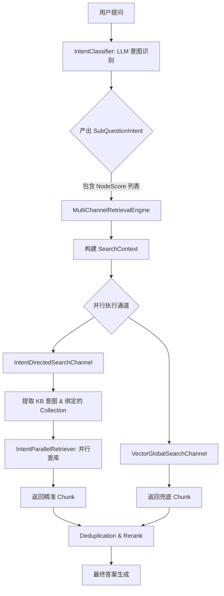

# 第一点
## 流水线有什么用,比直接上传的优点是什么
在这个项目中，**流水线（Ingestion Pipeline）** 是一个高度可配置、数据驱动的文档处理引擎。它的核心作用是**将“原始文件”转化为“高质量向量索引”的过程标准化、模块化**。

简单来说，它不是写死的代码，而是一个可以像搭积木一样自由组合的**数据处理工厂**。

---

### 一、流水线是干什么的？

流水线的任务是把一个原始文档（如 PDF、Word、网页）经过一系列步骤处理后存入向量数据库。在 [IngestionEngine](file://D:/IDEA-java/ragent/bootstrap/src/main/java/com/nageoffer/ai/ragent/ingestion/engine/IngestionEngine.java) 中，它通过链式调用不同的 **节点（Node）** 来完成：

| 节点类型         | 类名             | 职责                                            |
| :----------- | :------------- | :-------------------------------------------- |
| **Fetcher**  | `FetcherNode`  | **获取**：从 URL、OSS 或本地读取原始字节流                   |
| **Parser**   | `ParserNode`   | **解析**：把二进制文件转成纯文本（支持 PDF/Docx/HTML 等）        |
| **Chunker**  | `ChunkerNode`  | **分块**：按固定长度、语义或段落切分成小片段                      |
| **Enhancer** | `EnhancerNode` | **增强**：利用 LLM 对文本进行润色、摘要或关键词提取                |
| **Enricher** | `EnricherNode` | **富化**：生成与该片段相关的“模拟问题”，提升检索命中率                |
| **Indexer**  | `IndexerNode`  | **索引**：计算 Embedding 并存入 Milvus/PostgreSQL 向量库 |

---

### 二、为什么要用流水线？比直接上传有什么优势？

如果只是简单的“上传 -> 分块 -> 向量化”，确实不需要这么复杂的架构。但引入流水线后，解决了以下痛点：

#### 1. 应对不同格式的复杂性（解耦解析逻辑）
*   **直接上传**：通常只能处理纯文本。如果用户上传了包含表格的 PDF 或带图片的 Word，简单分块会丢失结构信息。
*   **流水线**：可以通过配置不同的 `ParserNode`（如集成 PyPDF2、Apache Tika 或专门的版面分析模型），精准提取内容。

#### 2. 提升检索质量（LLM 增强与富化）
这是流水线最大的优势。简单的分块往往导致检索不准，流水线可以在入库前做“预处理”：
*   **语义增强（Enhancer）**：如果一段话太短，可以用 LLM 补全上下文。
*   **问题生成（Enricher）**：比如文档里有一句“报销流程见附录 A”，用户搜“怎么报销”可能搜不到。流水线可以让 LLM 提前生成“如何申请报销？”、“报销政策是什么？”等问题并挂在 Chunk 上。**检索时匹配这些问题，召回率会大幅提升。**

#### 3. 灵活性与多租户适配（数据驱动设计）
*   **直接上传**：所有文档走同一套逻辑。
*   **流水线**：你可以创建多条流水线：
    *   **流水线 A（技术文档）**：启用 `Parser` + `CodeChunker`（代码专用分块）。
    *   **流水线 B（合同文件）**：启用 `Parser` + `TableExtractor` + `LegalEnhancer`。
    *   用户在上传文档时，可以根据业务场景选择不同的流水线。

#### 4. 容错与监控（Traceability）
*   在 [IngestionContext](file://D:/IDEA-java/ragent/bootstrap/src/main/java/com/nageoffer/ai/ragent/ingestion/domain/context/IngestionContext.java) 中，每一步都会记录日志。
*   如果某个 PDF 解析失败，你可以精确知道是卡在了解析阶段还是向量化阶段，而不是只看到一个“上传失败”。

---

### 三、核心实现原理

1.  **定义阶段**：前端页面配置好节点顺序和参数，保存到数据库表 `t_ingestion_pipeline` 和 `t_ingestion_pipeline_node`。
2.  **执行阶段**：
    *   [IngestionEngine](file://D:/IDEA-java/ragent/bootstrap/src/main/java/com/nageoffer/ai/ragent/ingestion/engine/IngestionEngine.java) 拿到 `PipelineDefinition`。
    *   找到起始节点（没有前驱的节点）。
    *   根据 `nextNodeId` 链式执行，每个节点操作同一个 `IngestionContext`（类似中间件管道模式）。
3.  **结果**：最终由 `IndexerNode` 将处理好的 `VectorChunk` 写入向量库。

### 总结

**直接上传分块**就像是“把书撕碎了塞进碎纸机”，虽然快但很难找回来；而**流水线**则像是“图书管理员的工作流”：**拆封 -> 扫描 -> 编目 -> 贴标签 -> 上架**。

在处理企业级复杂文档（如含图表的技术手册、法律合同）时，流水线通过**增强（Enhance）** 和 **富化（Enrich）**环节，能显著提升后续 RAG 问答的准确性。


## 双路并行召回是什么
在这个项目中，"双路并行召回"指的是通过 **两个相互补充的检索通道同时并行执行**，各自从不同的角度召回候选文档片段（Chunk），再将结果合并、去重、重排序后输送给 LLM。

---
### 一、"双路"是哪两路？

| 通道         | 类                                                                                                                                                                    | 优先级     | 策略                          |
| ---------- | -------------------------------------------------------------------------------------------------------------------------------------------------------------------- | ------- | --------------------------- |
| **意图定向检索** | [IntentDirectedSearchChannel](file://D:/IDEA-java/ragent/bootstrap/src/main/java/com/nageoffer/ai/ragent/rag/core/retrieve/channel/IntentDirectedSearchChannel.java) | `1`（高）  | 根据意图识别结果，在**意图绑定的特定知识库**中检索 |
| **向量全局检索** | [VectorGlobalSearchChannel](file://D:/IDEA-java/ragent/bootstrap/src/main/java/com/nageoffer/ai/ragent/rag/core/retrieve/channel/VectorGlobalSearchChannel.java)     | `10`（低） | 在所有知识库中遍历**全局向量检索**，作为兜底    |

两路各有分工：
- **意图定向**负责"精准打击"——意图置信度高时，只在相关知识库中检索
- **全局检索**负责"广撒网兜底"——意图不明确或置信度低时启用，防止漏召回

---

### 二、"并行"是怎么体现的？

核心引擎在 [MultiChannelRetrievalEngine](file://D:/IDEA-java/ragent/bootstrap/src/main/java/com/nageoffer/ai/ragent/rag/core/retrieve/MultiChannelRetrievalEngine.java) 中：

```java
// 第96-109行：所有启用的通道通过 CompletableFuture 并行执行
List<CompletableFuture<SearchChannelResult>> futures = enabledChannels.stream()
    .map(channel -> CompletableFuture.supplyAsync(
        () -> {
            log.info("执行检索通道：{}", channel.getName());
            return channel.search(context);
        },
        ragRetrievalExecutor  // 专用线程池
    ))
    .toList();
```


关键点：
1. 使用 `CompletableFuture.supplyAsync` 提交到专用的 [ragRetrievalExecutor](file://D:/IDEA-java/ragent/bootstrap/src/main/java/com/nageoffer/ai/ragent/rag/config/ThreadPoolExecutorConfig.java#L85-L98) 线程池
2. 两个通道的检索 **同时进行**，互不等待
3. 各自内部还有**二级并行**——比如全局检索通道内部通过 [AbstractParallelRetriever](file://D:/IDEA-java/ragent/bootstrap/src/main/java/com/nageoffer/ai/ragent/rag/core/retrieve/channel/AbstractParallelRetriever.java) 并行查询所有 collection

---

### 三、全局检索的智能启用条件

全局检索不是一直开的，有门槛策略（见 [VectorGlobalSearchChannel.isEnabled()](file://D:/IDEA-java/ragent/bootstrap/src/main/java/com/nageoffer/ai/ragent/rag/core/retrieve/channel/VectorGlobalSearchChannel.java#L69-L101)）：

| 场景 | 行为 |
|------|------|
| 未识别出任何意图 | 直接启用全局检索 |
| 最高意图分数 < `confidenceThreshold`(0.6) | 置信度太低，启用全局兜底 |
| 仅1个意图且分数 < `singleIntentSupplementThreshold`(0.8) | 单意图中等置信度，补充全局检索 |
| 多意图高分 | **不启用全局检索**，只走意图定向 |

---

### 四、完整处理流程

```
用户问题
    ↓
 意图识别 + 问题重写
    ↓
┌──────────────────────────────────────────────┐
│         【阶段1：双路并行检索】                 │
│                                              │
│  IntentDirectedSearchChannel ────┐           │
│     (意图绑定的知识库定向检索)       │ CompletableFuture 并行
│  VectorGlobalSearchChannel ──────┘           │
│     (全量知识库向量兜底检索)                    │
│                                              │
│  每个通道内部也有二级并行：                     │
│  AbstractParallelRetriever                   │
│    ├─ Collection A ──┐                       │
│    ├─ Collection B ──┤ CompletableFuture     │
│    └─ Collection C ──┘                       │
└──────────────────────────────────────────────┘
    ↓ 结果合并
┌──────────────────────────────────────────────┐
│         【阶段2：后置处理器链（串行）】          │
│                                              │
│  DeduplicationPostProcessor (order=1) 去重    │
│    → 基于Chunk ID去重，优先级高的通道结果保留    │
│  RerankPostProcessor (order=10) 重排序        │
│    → 调用 Rerank 模型精排，截断到 TopK         │
└──────────────────────────────────────────────┘
    ↓
  上下文格式化 → LLM 生成答案
```


---

### 五、配置入口

在 [SearchChannelProperties](file://D:/IDEA-java/ragent/bootstrap/src/main/java/com/nageoffer/ai/ragent/rag/config/SearchChannelProperties.java) 中通过 `application-search.yml` 控制：

```yaml
rag:
  search:
    channels:
      intent-directed:
        enabled: true
        min-intent-score: 0.4    # 低于此分的意图节点被过滤
        top-k-multiplier: 2      # 召回 topK * 2 的候选
      vector-global:
        enabled: true
        confidence-threshold: 0.6         # 意图置信度阈值
        single-intent-supplement-threshold: 0.8  # 单意图补充阈值
        top-k-multiplier: 3              # 全局召回 topK * 3 的候选
```


---

### 总结

**双路并行召回**的设计精髓在于：
- **双路互补**：意图定向保证精准度，全局检索保证覆盖率
- **并行执行**：两路同时跑，不增加延迟
- **智能调度**：全局检索根据意图置信度按需启停，避免浪费资源
- **后置精排**：去重 + Rerank 保证最终给 LLM 的是最相关的结果

## 双路并行召回的意图检索具体是检索什么意图,什么叫做与意图绑定的知识库,和一般知识库有什么区别
这是一个非常核心的业务逻辑问题。在 Ragent 项目中，“意图检索”和“绑定的知识库”是实现**精准召回**的关键设计。

我来为你拆解这三个概念：

### 1. 具体是检索什么“意图”？

这里的“意图”并不是指用户的情绪（如开心、生气），而是指**用户问题所属的业务领域或分类**。

在项目的树形意图识别模块中，一个复杂的提问会被拆解并匹配到具体的叶子节点。例如：
*   **用户问：** “我的公积金怎么提取？”
*   **识别出的意图：** `HR福利 -> 公积金管理 -> 提取流程`
*   **用户问：** “服务器 CPU 占用率过高怎么办？”
*   **识别出的意图：** `IT运维 -> 故障排查 -> 性能优化`

**意图检索**就是拿着这些识别出来的“标签”（如“公积金提取”、“性能优化”），去对应的地方找答案，而不是在所有文档里大海捞针。

---

### 2. 什么叫做“与意图绑定的知识库”？

这是项目后台管理的一个配置功能。管理员在创建意图节点时，可以指定该节点**只允许从哪些知识库（Collection）中检索数据**。

*   **绑定关系：** 意图节点 A <---> 知识库集合 {KB_1, KB_2}
*   **代码体现：** 在 [IntentNode](file://D:/IDEA-java/ragent/bootstrap/src/main/java/com/nageoffer/ai/ragent/rag/core/intent/IntentNode.java) 实体中，通常会有一个字段（如 `collectionName` 或关联表）来存储这种映射。

**为什么要绑定？**
因为不同的知识库可能存储了完全不同领域的资料。如果不绑定，当你问“公积金”时，系统可能会错误地从“Java开发规范”的知识库里搜出一些包含“公积金”字眼的无关代码注释。

---

### 3. 和一般知识库有什么区别？

我们可以把“一般知识库”理解为**物理存储**，而“意图绑定的知识库”是**逻辑路由**。

| 维度 | 一般知识库 (Physical KB) | 意图绑定的知识库 (Logical Routing) |
| :--- | :--- | :--- |
| **本质** | 向量数据库中的一个 Collection（表） | 一种检索策略的约束条件 |
| **内容** | 存放原始的 Chunk 和 Embedding | 不存数据，只存“哪个意图去哪找”的规则 |
| **检索方式** | 全局扫描：对所有 Collection 执行相似度搜索 | **定向狙击**：只扫描意图指定的那几个 Collection |
| **优势** | 简单粗暴，适合小规模单一领域 | **抗干扰能力强**，能过滤掉其他领域的噪音 |

---

### 4. 结合代码看它是如何工作的

在 [IntentDirectedSearchChannel](file://D:/IDEA-java/ragent/bootstrap/src/main/java/com/nageoffer/ai/ragent/rag/core/retrieve/channel/IntentDirectedSearchChannel.java) 中，逻辑是这样的：

1.  **提取意图：** 从用户的子问题中提取出所有置信度达标的 KB 意图节点。
2.  **获取绑定信息：** 遍历这些节点，拿到它们各自绑定的 `collectionName`。
3.  **并行检索：** 
    ```java
    // 伪代码逻辑
    for (NodeScore intent : kbIntents) {
        String targetCollection = intent.getNode().getCollectionName(); // 拿到绑定的库
        retrieverService.retrieve(targetCollection, question); // 只在这个库里搜
    }
    ```


### 总结

*   **意图检索**：是为了确定“用户到底想问哪个板块的事”。
*   **绑定知识库**：是为了给每个板块划定“势力范围”，防止跨域干扰。
*   **区别**：一般知识库是**仓库**，意图绑定是**地图**。双路并行中的“意图定向路”就是拿着地图去指定的仓库取货，而“全局检索路”则是把所有仓库翻一遍作为保底。

这种设计在处理企业级复杂场景（如同时包含人事、财务、技术文档的系统）时，能极大地提高回答的**专业度**和**相关性**。

## 那这个项目中的意图识别是怎么识别的,识别完又是怎么发送给意图检索通道让其执行的
在这个项目中，意图识别和检索通道的执行是通过 **“树形匹配 + 上下文传递”** 的方式串联起来的。

我们可以把这个过程分为三个阶段：**构建意图树**、**LLM 动态识别**、**通道提取与执行**。

---

### 第一阶段：意图是怎么识别的？（树形多级分类）

项目没有使用传统的单标签分类模型，而是采用了一种更灵活的**树形结构（Tree Structure）** 配合  **LLM 语义匹配** 。

#### 1. 意图树的存储
在数据库中，意图被组织成一棵树。每个节点（`IntentNode`）包含：
*   `id`: 唯一标识
*   `parent_id`: 父节点 ID
*   `name/description`: 意图名称和详细描述（这是 LLM 判断的依据）
*   `collection_name`: **绑定的知识库名称**（检索的关键）
*   `kind`: 类型（KB-知识库检索, MCP-工具调用）

#### 2. 识别过程（LLM 路由）
当用户提问时，系统不会遍历整棵树，而是通过 [IntentClassifier](file://D:/IDEA-java/ragent/bootstrap/src/main/java/com/nageoffer/ai/ragent/rag/core/intent/IntentClassifier.java) 进行动态路由：

1.  **获取候选节点**：从数据库加载当前层级的意图节点描述。
2.  **LLM 打分**：将用户问题和这些描述发给大模型，让 LLM 输出每个节点的**置信度分数（Score）**。
3.  **递归/多层匹配**：如果某个节点得分高且它有子节点，就继续进入下一层识别，直到找到最具体的叶子节点。

**结果产出**：最终你会得到一个 `List<SubQuestionIntent>`，里面包含了用户问题拆解后的各个子意图及其对应的节点列表（`NodeScore`）。

---

### 第二阶段：识别完怎么发送给检索通道？

这里并没有通过消息队列或远程调用发送，而是通过**内存中的对象传递**。核心枢纽是 [MultiChannelRetrievalEngine](file://D:/IDEA-java/ragent/bootstrap/src/main/java/com/nageoffer/ai/ragent/rag/core/retrieve/MultiChannelRetrievalEngine.java)。

#### 1. 构建检索上下文 (SearchContext)
引擎会将识别好的意图打包进一个上下文对象：
```java
SearchContext context = SearchContext.builder()
    .intents(subIntents) // 把识别好的意图塞进去
    .mainQuestion(question)
    .topK(topK)
    .build();
```


#### 2. 并行触发通道
引擎会遍历所有注册的 `SearchChannel`（包括意图定向通道和全局通道），并检查它们是否应该工作：
```java
// 伪代码逻辑
for (SearchChannel channel : channels) {
    if (channel.isEnabled(context)) { // 通道自己决定要不要干活
        CompletableFuture.supplyAsync(() -> channel.search(context), executor);
    }
}
```


---

### 第三阶段：意图检索通道是如何执行的？

当轮到 [IntentDirectedSearchChannel](file://D:/IDEA-java/ragent/bootstrap/src/main/java/com/nageoffer/ai/ragent/rag/core/retrieve/channel/IntentDirectedSearchChannel.java) 执行时，它会做以下几步“精准打击”：

1.  **过滤 KB 意图**：
    它从 `context.getIntents()` 中拿出所有节点，通过 `NodeScoreFilters.kb()` 过滤出那些类型为“知识库检索”且分数达标的意图。

2.  **提取绑定关系**：
    它会查看这些意图节点绑定的 `collectionName`。
    *   例如：意图 A 绑定了 `hr_policy_db`，意图 B 绑定了 `tech_docs_db`。

3.  **启动二级并行检索**：
    它利用 [IntentParallelRetriever](file://D:/IDEA-java/ragent/bootstrap/src/main/java/com/nageoffer/ai/ragent/rag/core/retrieve/channel/strategy/IntentParallelRetriever.java) 同时向这两个库发起向量搜索请求。

4.  **返回结果**：
    将搜到的 Chunk 包装成 `SearchChannelResult` 返回给引擎，等待后续的去重和 Rerank。

---

### 总结流程图




**核心点在于：** 意图识别的结果（`NodeScore`）里不仅带了分数，还直接带了**“去哪里找答案”**的配置信息（`collectionName`）。检索通道只需要读取这个配置，就能实现“指哪打哪”。

## 双路并行召回如果其中一路失效会怎样,影响大么,有没有兜底或者自纠正机制

---

### 一、如果其中一路失效，会发生什么

项目中有**三层故障隔离**，确保单路失效不影响整体。

#### 第 1 层：通道级 try-catch —— 异常不传播

在 [`MultiChannelRetrievalEngine.executeSearchChannels()`](file://D:\IDEA-java\ragent\bootstrap\src\main\java\com\nageoffer\ai\ragent\rag\core\retrieve\MultiChannelRetrievalEngine.java#L96-L109) 中，每个通道被包裹在 `try-catch` 里提交给线程池：

```java
.map(channel -> CompletableFuture.supplyAsync(
    () -> {
        try {
            return channel.search(context);  // 正常执行
        } catch (Exception e) {
            log.error("检索通道 {} 执行失败", channel.getName(), e);
            return emptyResult(channel);   // 失败返回空结果，继续
        }
    },
    ragRetrievalExecutor
))
```


**结论：一个通道抛异常，返回 `chunks=[]` 的空结果，另一个通道完全不受影响。**

#### 第 2 层：子任务级 try-catch —— 单个 collection 失败不影响其他

深入到通道内部，以 `IntentParallelRetriever.createRetrievalTask()` 为例：

```java
// IntentParallelRetriever.java
protected List<RetrievedChunk> createRetrievalTask(String question, IntentTask task, int ignoredTopK) {
    try {
        return retrieverService.retrieve(...);
    } catch (Exception e) {
        log.error("意图检索失败 - 意图ID: {}, ...", node.getId(), e.getMessage(), e);
        return List.of();   // 返回空列表，不抛异常
    }
}
```


假设用户问"北京天气 + 公司财报"，触发了两个意图节点（天气意图 → collection_A，财报意图 → collection_B），collection_A 超时了：

```
意图天气 → collection_A: ❌ 超时  →  return List.of()
意图财报 → collection_B: ✅ 正常  →  return [chunk1, chunk2, chunk3]

最终 allChunks = [chunk1, chunk2, chunk3]   ← 财报的还在
```


#### 第 3 层：后置处理器级 try-catch —— 某个处理器崩溃不中断整条链

```java
// MultiChannelRetrievalEngine.executePostProcessors()
for (SearchResultPostProcessor processor : enabledProcessors) {
    try {
        chunks = processor.process(chunks, results, context);
    } catch (Exception e) {
        log.error("后置处理器 {} 执行失败，跳过该处理器", processor.getName(), e);
        // 继续下一个，不中断
    }
}
```


---

### 二、有没有兜底机制 —— 有，而且是"自带兜底"的架构设计

#### 兜底 1：全局向量检索是意图检索的补充通道

关键在 [`VectorGlobalSearchChannel.isEnabled()`](file://D:\IDEA-java\ragent\bootstrap\src\main\java\com\nageoffer\ai\ragent\rag\core\retrieve\channel\VectorGlobalSearchChannel.java#L69-L101)：

```java
public boolean isEnabled(SearchContext context) {
    // 情况1：压根没识别出任何意图 → 启用全局检索
    if (CollUtil.isEmpty(allScores)) {
        log.info("未识别出任何意图，启用全局检索");
        return true;
    }

    // 情况2：意图置信度过低（< 阈值） → 启用全局检索兜底
    double threshold = properties.getChannels().getVectorGlobal().getConfidenceThreshold();
    if (maxScore < threshold) {
        log.info("意图置信度过低（{}），启用全局检索", maxScore);
        return true;
    }

    // 情况3：只有一个中等置信度的意图 → 启用补充全局检索
    double supplementThreshold = properties.getChannels().getVectorGlobal().getSingleIntentSupplementThreshold();
    if (allScores.size() == 1 && maxScore < supplementThreshold) {
        log.info("单一中等置信度意图（{}），启用补充全局检索", maxScore);
        return true;
    }

    return false;  // 意图置信度高且明确 → 只用意图检索即可
}
```


**三种触发全局检索兜底的场景：**

| 场景 | 意图识别结果 | 行为 |
|------|-------------|------|
| 无意图 | 没匹配上任何意图节点 | 只走全局检索 |
| 低置信度 | 匹配了但得分很低（如 0.3） | 意图 + 全局并行跑 |
| 单意图中等分 | 只命中一个且分数中等 | 意图 + 全局并行跑 |

#### 兜底 2：去重后置处理器——两路结果智能合并

[`DeduplicationPostProcessor`](file://D:\IDEA-java\ragent\bootstrap\src\main\java\com\nageoffer\ai\ragent\rag\core\retrieve\postprocessor\DeduplicationPostProcessor.java#L58-L87)：

```java
// 按通道优先级排序（优先级高的通道结果优先保留）
results.stream()
    .sorted((r1, r2) -> Integer.compare(
        getChannelPriority(r1.getChannelType()),    // 意图 1 > 全局 3
        getChannelPriority(r2.getChannelType())
    ))
    .forEach(result -> {
        for (RetrievedChunk chunk : result.getChunks()) {
            if (!chunkMap.containsKey(key)) {
                chunkMap.put(key, chunk);// 先到先得（高优先级先到）
            } else {
                if (chunk.getScore() > existing.getScore()) {
                    chunkMap.put(key, chunk); // 相同 chunk 取最高分
                }
            }
        }
    });
```


**效果**：意图检索和全局检索可能捞到同一个 chunk，去重后只保留一条（优先保留高优先级通道的版本），避免 LLM 看到重复内容。

#### 兜底 3：Rerank 精排——最后一层质量把关

```java
// RerankPostProcessor（最后执行，order=10）
return rerankService.rerank(
    context.getMainQuestion(),
    chunks,
    context.getTopK()    // 只取 topK 个最相关的
);
```


就算前面两路捞回了 30 个 chunk，质量参差不齐，Rerank 会用专门的排序模型重新打分，只把最相关的 topK 条送入 LLM。

#### 兜底 4：Model 级的 failover

Rerank 本身也做了模型级故障转移。在 [`RoutingRerankService`](file://D:\IDEA-java\ragent\infra-ai\src\main\java\com\nageoffer\ai\rerank\RoutingRerankService.java#L54-L61) 中：

```java
return executor.executeWithFallback(
    ModelCapability.RERANK,
    selector.selectRerankCandidates(),    // [主模型, 备用模型]
    target -> clientsByProvider.get(target.candidate().getProvider()),
    (client, target) -> client.rerank(query, candidates, topN, target)
);
```


`executeWithFallback` 的逻辑在 [`ModelRoutingExecutor`](file://D:\IDEA-java\ragent\infra-ai\src\main\java\com\nageoffer\ai\ragent\infra\model\ModelRoutingExecutor.java#L51-L71) 中：主 Rerank 模型挂了 → 自动切换到备用模型 → 都挂了才抛异常。

---

### 三、影响有多大

| 失效情况 | 对用户的影响 | 严重程度 |
|----------|-------------|----------|
| 意图通道全挂 | 全局通道顶上，仍能返回结果 | **低** — 用户无感知 |
| 全局通道挂了（意图正常） | 意图通道独立返回结果 | **低** — 结果可能少几条，质量不受影响 |
| 两路都挂 | `handleEmptyRetrieval` 返回"未检索到相关文档" | **中** — 用户看到兜底话术，不会报错 |
| 某个后置处理器挂 | 跳过该处理器，其他继续 | **低** — 可能少了一步去重或精排，但不会崩溃 |

**结论：除非向量数据库、Rerank 模型、所有知识库全部同时故障，否则用户总能得到有效回复。这个三层故障隔离 + 多级兜底的设计，让单点失效的影响被压缩到了极致。**

## 意图检索后,是怎么给检索结果的置信度进行打分的,也就是置信度低时或者意图检索失败怎么触发全局向量检索的

意图检索的打分与全局检索触发机制

关键要理解：**这里的"打分"不是给检索出来的 chunk 打分，而是给意图节点打分。** 分数来自 LLM，不是向量相似度。

---

### 一、LLM 怎么给意图节点打分

在 [`DefaultIntentClassifier.classifyTargets()`](file://D:\IDEA-java\ragent\bootstrap\src\main\java\com\nageoffer\ai\ragent\rag\core\intent\DefaultIntentClassifier.java#L136-L207) 中，把所有叶子节点拼成 prompt，让 LLM 一次性对每个节点打分：

```java
public List<NodeScore> classifyTargets(String question) {
    IntentTreeData data = loadIntentTreeData();   // 加载树

    String systemPrompt = buildPrompt(data.leafNodes);  // 构造 prompt
    ChatRequest request = ChatRequest.builder()
        .messages(List.of(
            ChatMessage.system(systemPrompt),  // ← 包含所有叶子节点的名称、路径、描述
            ChatMessage.user(question)          // ← 用户问题
        ))
        .temperature(0.1D)  // 低温，保证结果稳定
        .build();

    String raw = llmService.chat(request);

    // LLM 返回 JSON: [{"id": "group-hr", "score": 0.85, "reason": "..."}]
    for (JsonElement el : arr) {
        String id = obj.get("id").getAsString();
        double score = obj.get("score").getAsDouble();    // ← LLM 打的分数
        IntentNode node = data.id2Node.get(id);
        scores.add(new NodeScore(node, score));
    }
    
    scores.sort(Comparator.comparingDouble(NodeScore::getScore).reversed()); // 降序
    return scores;
}
```


LLM 收到的 prompt 大概是这样的（[`buildPrompt()`](file://D:\IDEA-java\ragent\bootstrap\src\main\java\com\nageoffer\ai\ragent\rag\core\intent\DefaultIntentClassifier.java#L229-L261)）：

![[image-11.png|572x187]]


LLM 返回：

```json
[
  {"id": "group-hr",  "score": 0.92, "reason": "用户明确询问请假流程，直接命中人事类"},
  {"id": "group-it",  "score": 0.15, "reason": "与IT支持无关"},
  {"id": "group-finance-invoice", "score": 0.05, "reason": "与发票无关"}
]
```


---

### 二、三层阈值决定"怎么检索"

从 LLM 拿到分数后，**不同阈值控制不同的行为**：

```
LLM 打分结果
      │
      ▼
┌─────────────────────────────────────────────────────┐
│  阈值层              │  作用                         │
├─────────────────────────────────────────────────────┤
│  INTENT_MIN_SCORE    │ 全局最低分，低于此的直接丢弃  │
│  = 0.35              │ 不参与任何检索                 │
├─────────────────────────────────────────────────────┤
│  minIntentScore      │ 意图定向检索的门槛             │
│  = 0.4               │ ≥ 此分 → 走意图精确检索        │
│                      │ < 此分 → 这个意图被过滤掉      │
├─────────────────────────────────────────────────────┤
│  confidenceThreshold │ 全局检索的触发线               │
│  = 0.6               │ 最高分 < 0.6 → 必须补充全局     │
├─────────────────────────────────────────────────────┤
│  supplementThreshold │ 单意图补充检索线               │
│  = 0.8               │ 只有1个意图且分<0.8 → 补充全局 │
└─────────────────────────────────────────────────────┘
```


阈值定义在 [`SearchChannelProperties`](file://D:\IDEA-java\ragent\bootstrap\src\main\java\com\nageoffer\ai\ragent\rag\config\SearchChannelProperties.java#L56-L101)：

```java
// 意图定向检索
IntentDirected:
    minIntentScore = 0.4      // 低于这个分，不参与意图检索

// 向量全局检索
VectorGlobal:
    confidenceThreshold = 0.6              // 最高分低于此 → 开全局
    singleIntentSupplementThreshold = 0.8  // 单意图 + 分低于此 → 开全局
```


---

### 三、触发全局检索的四种场景

核心代码在 [`VectorGlobalSearchChannel.isEnabled()`](file://D:\IDEA-java\ragent\bootstrap\src\main\java\com\nageoffer\ai\ragent\rag\core\retrieve\channel\VectorGlobalSearchChannel.java#L69-L101)：

```java
public boolean isEnabled(SearchContext context) {
    List<NodeScore> allScores = /* 从 context 中提取所有意图分数 */;

    // ─── 场景1：无意图 → 直接开全局 ───
    if (CollUtil.isEmpty(allScores)) {
        log.info("未识别出任何意图，启用全局检索");
        return true;
    }

    double maxScore = allScores.stream().mapToDouble(NodeScore::getScore).max().orElse(0.0);

    // ─── 场景2：最高分太低 → 必须补全局 ───
    if (maxScore < 0.6 /* confidenceThreshold */) {
        log.info("意图置信度过低（{}），启用全局检索", maxScore);
        return true;
    }

    // ─── 场景3：只有一个意图且不是特别高 → 补充全局 ───
    if (allScores.size() == 1 && maxScore < 0.8 /* supplementThreshold */) {
        log.info("单一中等置信度意图（{}），启用补充全局检索", maxScore);
        return true;
    }

    // ─── 场景4：分数高且明确 → 只走意图检索 ───
    return false;
}
```


**四种场景的决策表：**

| 场景 | 意图分数 | 意图定向检索 | 全局检索 | 解释 |
|------|---------|:----------:|:------:|------|
| 无意图 | 没有任何 KB 节点命中 | ✗ 空跑 | ✅ 开启 | LLM 没匹配到任何知识库类别，全库扫 |
| "我想了解行业趋势" | maxScore=0.25 | ✗ 全被 `0.4` 过滤 | ✅ 开启 | 分数太低，意图检索本身也是空的 |
| "差旅报销要不要贴发票？" | 只命中"财务" 0.65 | ✅ | ✅ 补充 | 单意图中等分，开全局补一刀防漏 |
| "请假要什么流程？" | "人事" 0.92 | ✅ | ✗ 关闭 | 高分单意图，精准就够了 |

---

### 四、完整数据流：从 LLM 打分到两路并行

```
用户问题: "北京天气 + 请假流程"
     │
     ▼
QueryRewriteService  →  拆分子问题: ["北京天气", "请假流程"]
     │
     ▼
IntentResolver.resolve()
  ├─ 对"北京天气" → LLM打分 → [{weather_query, 0.88}]  (MCP类型)
  └─ 对"请假流程" → LLM打分 → [{group-hr, 0.92}]      (KB类型)
     │
     ▼
RetrievalEngine.retrieve()
  └─ buildSubQuestionContext()
       └─ retrieveAndRerank()
            │
            ▼
       MultiChannelRetrievalEngine
            │
            ├─ IntentDirectedSearchChannel.isEnabled()
            │    → extractKbIntents() 过滤: score >= 0.4
            │    → group-hr(0.92) ≥ 0.4 → ✅ 启用
            │    → 在 collection_hr 中检索 "请假流程"
            │
            └─ VectorGlobalSearchChannel.isEnabled()
                 → maxScore = 0.92（只看KB类型的意图）
                 → 0.92 ≥ 0.6 且不是单意图补充场景
                 → ❌ 不启用全局检索
```


**换个低分场景再看：**

```
用户问题: "我想了解公司数字化转型的最新进展"
     │
     ▼
IntentResolver  →  LLM打分 → [{group-it, 0.45}, {biz-oa, 0.38}]
     │                              ↑ IT相关         ↑ OA相关
     ▼                           但都不高
MultiChannelRetrievalEngine
     │
     ├─ IntentDirectedSearchChannel.isEnabled()
     │    → group-it(0.45) ≥ 0.4 → ✅ 在 collection_it 检索
     │    → biz-oa(0.38) < 0.4  → ✗ 被过滤掉
     │
     └─ VectorGlobalSearchChannel.isEnabled()
          → maxScore = 0.45
          → 0.45 < 0.6 → ✅ 触发全局检索，全库扫
```


此时两路**并行跑**，结果在 `DeduplicationPostProcessor` 中去重合并。

---

### 五、不是检索结果的置信度，是意图的置信度

总结一个容易混淆的点：

| 概念 | 谁来打分 | 打什么分 | 用在哪 |
|------|---------|---------|--------|
| **意图置信度** | LLM | 用户问题与意图节点的语义匹配度 | 决定用哪条检索通道 |
| **向量相似度** | Embedding 模型 | chunk 向量与问题向量的余弦距离 | chunk 初排 |
| **Rerank 精排分** | Rerank 模型 | chunk 与问题的深度语义相关性 | 最终排序取 topK |

这三层分数是**完全不同的模型、不同的阶段、不同的用途**。全局检索的触发只关心第一层——意图置信度。

## 意图节点是干什么的,怎么构建意图节点的,意图节点又是怎么工作的;创建意图节点相比直接搜索有什么好处么
意图节点（Intent Node）是这个 RAG 系统的**“大脑导航图”**。它不仅仅是一个分类标签，更是一个将**用户自然语言**与**底层业务逻辑/数据源**连接起来的智能路由单元。

---

### 1. 意图节点是干什么的？

你可以把意图节点想象成图书馆里的**索引卡片**。它的核心作用有三个：
1.  **语义路由**：告诉系统用户到底想问哪个领域的事（是问“人事政策”还是“IT故障”）。
2.  **绑定资源**：明确指定该问题应该去哪个**知识库（Collection）**检索，或者调用哪个**MCP工具**。
3.  **提供上下文**：通过节点的描述和示例问题，辅助 LLM 更精准地理解用户意图。

---

### 2. 怎么构建意图节点的？

在项目中，意图节点是通过**树形结构（Tree Structure）** 来组织的。构建过程通常分为两步：

#### A. 数据库建模 (物理存储)
在 `t_intent_node` 表中，每个节点包含以下关键字段：
*   `intent_code`: 唯一 ID。
*   `parent_code`: 父节点 ID（形成层级，如：集团 > 信息化 > OA系统）。
*   `name/description`: 节点名称和详细描述（LLM 识别的依据）。
*   `collection_name`: **绑定的向量库名称**（这是精准检索的关键）。
*   `kind`: 节点类型（KB-知识库, MCP-工具调用, SYSTEM-系统指令）。
*   `examples`: 典型问题列表（用于 Few-shot 提示）。

#### B. 内存组装 (逻辑构建)
在 [DefaultIntentClassifier](file://D:/IDEA-java/ragent/bootstrap/src/main/java/com/nageoffer/ai/ragent/rag/core/intent/DefaultIntentClassifier.java) 中，系统启动或刷新时会执行：
1.  **扁平查询**：从数据库查出所有启用且未删除的节点。
2.  **递归组装**：根据 `parent_code` 将扁平列表组装成嵌套的树形对象 `IntentNode`。
3.  **路径填充**：计算每个节点的完整路径（如 `人事 > 福利 > 公积金`），方便 LLM 理解上下文。

---

### 3. 意图节点是怎么工作的？

它的工作流程是一个典型的 **“识别 -> 匹配 -> 执行”** 闭环：

1.  **加载菜单**：当用户提问时，系统提取出所有的**叶子节点**（最细粒度的分类）。
2.  **LLM 打分**：将用户问题和这些节点的描述发给 LLM，LLM 输出一个带分数的 JSON（如 `[{"id": "node_1", "score": 0.9}]`）。
3.  **提取配置**：系统拿到高分节点的 ID，从内存中找到对应的 `IntentNode` 对象。
4.  **定向执行**：
    *   如果是 **KB 节点**：读取其 `collection_name`，只在该向量库中检索。
    *   如果是 **MCP 节点**：读取其 `mcp_tool_id`，触发相应的业务接口调用。

---

### 4. 创建意图节点相比直接搜索有什么优势？

如果只是简单的“上传文档 -> 搜索”，面对企业级复杂数据时会遇到很多坑。引入意图节点后，优势非常明显：

| 维度 | 直接全局搜索 (Global Search) | 基于意图节点的搜索 (Intent-Based) |
| :--- | :--- | :--- |
| **抗干扰能力** | **弱**。搜“OA登录”可能会搜出“保险系统操作手册”里提到的OA字样。 | **强**。强制限定在“OA系统”绑定的库里搜，彻底隔离噪音。 |
| **多模态处理** | **难**。只能处理文本相似度。 | **灵活**。可以指向 MCP 工具，实现“查实时天气”、“重置密码”等动态操作。 |
| **可解释性** | **黑盒**。不知道为什么搜出这个结果。 | **白盒**。明确知道是因为命中了“人事-福利”节点才去查那个库。 |
| **维护成本** | **低**。但检索质量随数据量增加而急剧下降。 | **中**。需要前期配置节点，但后期检索质量极其稳定。 |
| **引导式问答** | **无**。搜不到就返回空。 | **有**。如果分数都不高，系统可以根据节点树主动询问：“您是想问 OA 系统还是 HR 系统？” |

### 总结

**直接搜索**像是在一个大杂烩仓库里乱翻；而**意图节点**则是给仓库划分了明确的货架，并配了一个聪明的导购员。

在 Ragent 项目中，意图节点是实现**Agentic（代理化）** 的核心——它让系统不再是被动地检索文字，而是能够根据意图**主动选择**是去查库、去调接口，还是去追问用户。
## KB知识库是什么,KB又是什么,KB节点有什么,他们在项目中承担什么作用
在 Ragent 这个项目中，**KB** 是 **Knowledge Base（知识库）** 的缩写。它是整个 RAG（检索增强生成）系统的“记忆仓库”。

为了让你更清晰地理解，我们可以从概念、节点构成和作用三个维度来拆解：

### 1. KB 是什么？
简单来说，**KB 就是经过处理、可以被 AI 理解和检索的企业私有数据集合**。
*   **物理层面**：它通常对应向量数据库（如 Milvus 或 PostgreSQL）中的一个 `Collection`（集合/表）。
*   **逻辑层面**：它是一个业务领域的边界。比如“人事制度库”、“技术文档库”、“产品手册库”各自都是一个独立的 KB。

### 2. KB 节点（Intent Node of Kind KB）有什么？
在项目的意图树中，一个 **KB 类型的意图节点**不仅仅是一个分类标签，它更像是一个**配置了指向性的路由规则**。根据代码实现，它主要包含以下核心要素：

| 属性 | 作用 | 示例 |
| :--- | :--- | :--- |
| **ID & Name** | 唯一标识和名称，用于 LLM 识别 | `hr-pf-policy` (公积金政策) |
| **Description** | 详细描述，告诉 LLM 这个节点管什么事 | “关于员工公积金缴纳、提取、转移的所有规定” |
| **Collection Name** | **最核心的字段**：绑定的向量库名称 | `collection_hr_benefits_v1` |
| **Examples** | 典型问题示例，辅助 LLM 提高识别准确率 | “怎么提公积金？”、“公积金比例是多少？” |
| **TopK** | 建议检索返回的片段数量 | `5` (表示这个问题比较重要，多搜点资料) |

### 3. 它们在项目中承担什么作用？

KB 节点在整个链路中起到了**“承上启下”**的关键桥梁作用：

#### A. 承上：精准的路由器（解决“去哪找”的问题）
当用户提问时，LLM 会根据 KB 节点的描述进行打分。一旦命中某个 KB 节点，系统就知道了：**“别去其他地方瞎找了，就去这个节点绑定的 `collection_name` 里搜。”**
*   **优势**：避免了跨域干扰。比如问“服务器重启步骤”，绝不会从“财务报销库”里搜出无关内容。

#### B. 启下：检索的执行者（解决“怎么找”的问题）
在 [IntentDirectedSearchChannel](file://D:/IDEA-java/ragent/bootstrap/src/main/java/com/nageoffer/ai/ragent/rag/core/retrieve/channel/IntentDirectedSearchChannel.java) 中，KB 节点直接决定了检索引擎的行为：
1.  **定向召回**：引擎读取节点的 `collection_name`，发起针对性的向量搜索。
2.  **参数控制**：利用节点配置的 `topK` 或其他元数据，动态调整检索的深度和广度。

#### C. 兜底与引导（解决“找不到怎么办”的问题）
*   **置信度判断**：如果所有 KB 节点的打分都很低，系统会意识到“可能没找到对口的库”，从而触发**全局检索（Vector Global Search）**作为安全网。
*   **主动澄清**：如果多个 KB 节点分数相近（比如“OA系统”和“HR系统”都有“登录”相关的节点），系统可以利用这些节点的信息反问用户：“您是想问 OA 系统的登录，还是 HR 系统的登录？”

### 总结
**KB 是仓库，KB 节点是仓库的地图坐标。**

没有 KB 节点，AI 就像一个在黑暗图书馆里乱撞的人；有了 KB 节点，AI 就拥有了精准的导航仪，能够直接从正确的书架上取下最相关的那本书。这种设计是实现企业级**高准确率 RAG** 的核心秘密。

## "结合 LLM 进行多轮对话上下文补全与复杂问题拆解"这里的上下文补全和问题拆解是什么,怎么运行的,以及为什么要在召回文本时进行这两个操作
在 RAG（检索增强生成）系统中，**“上下文补全”** 和 **“复杂问题拆解”** 是提升检索准确率的两个核心预处理步骤。它们通常发生在用户提问之后、正式去向量库搜索之前。

我们可以把这两个操作理解为 **“翻译官”** 和 **“任务分解员”** 的工作。

---

### 1. 什么是上下文补全 (Context Completion)？

在多轮对话中，用户往往会使用代词或省略句。
*   **用户第一问**：“介绍一下 Ragent 项目。”
*   **用户第二问**：“它的**架构**是怎样的？”

如果直接把“它的架构是怎样的？”扔给搜索引擎，它根本不知道“它”指的是谁。**上下文补全**就是利用 LLM 结合之前的聊天记录，把这句模糊的话还原成独立、完整的句子：
*   **补全后**：“Ragent 项目的系统架构是怎样的？”

**怎么运行的？**
系统会维护一个 `ChatHistory`（聊天历史），将最近几轮的问答作为背景信息发给 LLM，让 LLM 输出一个**重写后的 Query**。

---

### 2. 什么是复杂问题拆解 (Complex Question Decomposition)？

有些问题包含多个意图，或者需要跨领域检索。
*   **用户问**：“对比一下 Java 和 Python 在微服务开发中的优缺点，并给出 Ragent 项目中使用的技术栈建议。”

这个问题如果直接搜，很难找到一篇文档同时完美覆盖这三个点。**问题拆解**会将它拆成几个独立的子问题：
1.  “Java 在微服务开发中的优缺点”
2.  “Python 在微服务开发中的优缺点”
3.  “Ragent 项目目前使用的技术栈是什么”

**怎么运行的？**
LLM 识别出问题的复杂性，将其拆解为 `List<SubQuestion>`。随后，系统会**并行**对这几个子问题进行检索，最后把搜到的所有资料汇总给 LLM 进行综合回答。

---

### 3. 为什么要在召回文本前进行这两个操作？

这是由向量检索（Vector Search）的特性决定的：**向量检索非常依赖关键词和语义的精确匹配。**

| 操作 | 如果不做会怎样？ | 做了之后的好处 |
| :--- | :--- | :--- |
| **上下文补全** | **检索失效**。搜“它的架构”会匹配到大量无关的“它的结构”、“它的组成”，甚至完全偏离主题。 | **精准定位**。确保检索引擎拿到的是包含完整实体信息的查询词。 |
| **问题拆解** | **结果杂乱**。试图用一个长句去匹配文档，往往只能匹配到片段，导致答案片面或遗漏。 | **全面覆盖**。通过“分而治之”，确保每个细分点都能从知识库中找到对应的支撑材料。 |

---

### 4. 在项目中的具体体现

在 Ragent 项目中，这一逻辑通常体现在 [StreamChatPipeline](file://D:/IDEA-java/ragent/bootstrap/src/main/java/com/nageoffer/ai/ragent/rag/service/pipeline/StreamChatPipeline.java) 或相关的意图处理链路中：

1.  **Query Rewrite (重写)**：调用 LLM 对原始问题进行补全。
2.  **Intent Resolution (意图解析)**：判断补全后的问题是简单问题还是复杂问题。
3.  **Parallel Retrieval (并行检索)**：如果是复杂问题，拆解后的子问题会进入我们之前讨论的**双路并行检索**通道。

### 总结

*   **上下文补全**是为了让 AI **“听得懂”** 你在接着上一句说什么。
*   **问题拆解**是为了让 AI **“想得清”** 该怎么分步骤去找答案。

这两个操作虽然增加了一点 LLM 的调用成本，但能极大地减少“搜非所问”的情况，是企业级 RAG 系统从“玩具”走向“实用”的关键门槛。

## 后置处理器链是什么,问题拆解并检索后,LLM是怎么把这些回答整理融合的
这是一个关于 RAG 系统“后处理”和“最终合成”的关键问题。我们可以把 RAG 流程想象成做菜：**检索是买菜，后置处理器是洗菜切菜，LLM 融合则是最后的烹饪装盘。**

---

### 一、 后置处理器链 (Post-Processor Chain) 是什么？

在多路并行检索（双路召回）结束后，我们会从不同的通道（如意图定向库、全局库）拿到一大堆原始的文本片段（Chunks）。这些原始材料往往比较“粗糙”，不能直接扔给 LLM，否则会产生噪音或超出长度限制。

**后置处理器链**就是一系列按顺序执行的“过滤器”和“加工器”。在项目中，它由 [MultiChannelRetrievalEngine](file://D:/IDEA-java/ragent/bootstrap/src/main/java/com/nageoffer/ai/ragent/rag/core/retrieve/MultiChannelRetrievalEngine.java) 统一调度：

#### 1. 去重处理器 (Deduplication)
*   **作用**：因为是多路并行，同一个知识点可能在“意图库”和“全局库”里都搜到了。
*   **逻辑**：根据 Chunk 的 ID 或内容哈希进行比对，如果重复，只保留**分数最高**的那一个。

#### 2. 重排序处理器 (Rerank) —— **核心环节**
*   **作用**：向量检索（Vector Search）只能保证“大致相关”，但不够精准。Rerank 模型会像老师批改作业一样，把用户问题和每一个 Chunk 放在一起重新打分。
*   **结果**：原本排在第 10 位但真正有用的片段，可能会被 Rerank 提拔到第 1 位；而一些只是关键词匹配但语义无关的片段会被踢出。

#### 3. 截断与格式化 (Truncation & Formatting)
*   **作用**：确保最终给到 LLM 的内容不超过它的上下文窗口（Context Window），并按照特定的模板（如 XML 标签或 Markdown）组织好。

---

### 二、 LLM 是怎么把拆解后的回答整理融合的？

当问题被拆解（比如拆成了 A、B 两个子问题）并分别检索后，系统会得到两组不同的参考资料。LLM 的融合过程并不是简单的“拼接”，而是一个**结构化推理**的过程：

#### 1. 构建“分块上下文” (Sub-Question Context)
在 [RetrievalEngine](file://D:/IDEA-java/ragent/bootstrap/src/main/java/com/nageoffer/ai/ragent/rag/core/retrieve/RetrievalEngine.java) 中，你会看到这样的逻辑：
*   系统会为每个子问题创建一个独立的“资料包”。
*   例如：`[子问题1: Java优缺点] -> [资料A, 资料B]`，`[子问题2: Python优缺点] -> [资料C, 资料D]`。

#### 2. 注入提示词模板 (Prompt Templating)
系统会使用一个精心设计的 Prompt 模板，将这些资料包喂给 LLM。模板通常长这样：

```text
你是一个智能助手。请根据以下提供的背景资料回答问题。

【背景资料 - 子问题1】
- 资料A: Java 的优点是...
- 资料B: Java 的缺点是...

【背景资料 - 子问题2】
- 资料C: Python 的优点是...
- 资料D: Python 的缺点是...

【用户原始问题】
对比一下 Java 和 Python 的优缺点。

【要求】
请综合上述资料，给出一个条理清晰的对比总结。
```


#### 3. LLM 的“思维链”融合 (Synthesis)
LLM 接收到这些信息后，会执行以下操作：
*   **交叉对比**：它会识别出资料 A 和资料 C 是对应的（都是讲优点），从而在回答中进行并列对比。
*   **冲突解决**：如果资料 A 说“Java 很快”，资料 B 说“Java 启动慢”，LLM 会根据语境进行调和（例如：“Java 运行时性能高，但启动速度相对较慢”）。
*   **逻辑重组**：它不会照搬资料的顺序，而是按照用户问题的逻辑（先说 Java，再说 Python，最后总结）重新组织语言。

---

### 三、 为什么要这么设计？

1.  **避免“迷失中间” (Lost in the Middle)**：如果把所有检索到的几十个 Chunk 不加处理地堆在一起，LLM 往往会忽略中间的信息。通过**后置处理器链**筛选出最核心的 Top-K，能显著提高回答质量。
2.  **保持逻辑连贯**：通过**问题拆解**，我们确保了每个细分点都有专门的资料支撑；通过**LLM 融合**，我们又把这些分散的点串成了一条完整的逻辑线。

### 总结

*   **后置处理器链**是“质检员”，负责把搜回来的杂乱信息去粗取精、去伪存真。
*   **LLM 融合**是“主编”，负责根据各个子领域的资料，写出一篇逻辑严密、前后呼应的最终报道。

这种“先拆解检索、后精细过滤、再综合生成”的模式，正是 Ragent 能够处理复杂企业级问答的核心竞争力。

## 术语归一化是什么,以及问什么说是在口语化场景
这是一个非常专业且切中 RAG 系统痛点的问题。**“术语归一化”**和**“口语化场景”**是决定一个 AI 助手是“人工智障”还是“智能专家”的分水岭。

### 1. 什么是术语归一化 (Term Normalization)？

在企业环境中，同一个概念往往有多种叫法。**术语归一化**就是把这些五花八门的说法统一成知识库中能识别的“标准术语”。

#### 举个例子：
假设公司的知识库文档里写的是 **“人力资源管理系统”**。
*   **员工 A 说**：“HR 系统怎么登？”
*   **员工 B 说**：“人事后台进不去了。”
*   **员工 C 说**：“那个招人的软件坏了。”

如果没有术语归一化，向量检索可能会因为“招人软件”和“人力资源管理系统”字面差异太大而漏掉关键文档。

**归一化的过程：**
系统会通过 LLM 或映射表，将 `HR系统`、`人事后台`、`招人软件` 全部翻译成标准词 **`人力资源管理系统`**，然后再拿去检索。

#### 在项目中如何实现？
虽然代码中没有单独的 `NormalizationService`，但这个逻辑通常融合在以下两个环节：
1.  **Query Rewrite（问题重写）**：在 [StreamChatPipeline](file://D:/IDEA-java/ragent/bootstrap/src/main/java/com/nageoffer/ai/ragent/rag/service/pipeline/StreamChatPipeline.java) 中，LLM 在补全上下文时，会顺带把口语词汇转换成正式表达。
2.  **意图节点描述**：我们在配置意图节点时，会在 `examples` 或 `description` 里写上各种别名，让 LLM 在打分时就能完成“语义对齐”。

---

### 2. 为什么要特别强调“口语化表达场景”？

因为在真实的企业应用中，**用户绝不会像写论文一样跟 AI 说话**。

#### 口语化表达的三大特征（也是检索的三大杀手）：
1.  **指代不明**：“**它**报错了怎么办？”（“它”是谁？）
2.  **用词随意**：“我想查下**那个谁**的报销单。”（“那个谁”是指同事还是领导？）
3.  **句式破碎**：“OA，登录，忘了密码。”（没有主谓宾，全是关键词。）

#### 为什么说这套组合拳能提升召回率？

| 传统检索的困境                                    | Ragent 的解决方案                                            |
| :----------------------------------------- | :------------------------------------------------------ |
| **匹配失败**：用户搜“打卡机”，库里只有“考勤终端”。              | **术语归一化**：LLM 知道“打卡机”=“考勤终端”，自动转换搜索词。                   |
| **噪音过多**：用户说“苹果”，搜出一堆水果资料，其实他想问“苹果公司股价”。   | **意图识别 + 重排序**：通过多轮对话判断用户在聊“金融”，Rerank 模型会把金融相关的片段排到前面。 |
| **逻辑断裂**：用户问“那如果是华为呢？”，直接搜“华为”会丢失上一句的对比语境。 | **上下文补全**：自动还原为“华为公司在微服务架构中的表现如何？”，确保检索方向不偏。            |

---

### 3. 总结：这套流程是如何协同工作的？

当一个用户用大白话提问时，系统内部发生了这样的“变身”：

1.  **用户输入**：“咱公司那个报销的玩意儿咋用啊？”（极度口语化）
2.  **上下文补全 & 术语归一化**：LLM 将其转化为：“请提供公司**财务报销系统**的操作指南。”（标准化）
3.  **复杂问题拆解**：如果用户接着问“那出差的票怎么贴？”，系统会拆解为“出差报销凭证粘贴规范”。
4.  **重排序流水线**：从库里捞出 50 个相关片段，通过 Rerank 模型剔除掉那些只提到“报销”但讲的是“退款政策”的无关片段。
5.  **规则兜底**：如果以上步骤都没搜到，系统会触发全局检索或引导用户去“财务部”咨询。

**结论：**
强调“口语化场景”，是因为这是企业级 AI 落地最难啃的骨头。通过**术语归一化**，我们消除了“人说人话、库存机器语”之间的鸿沟，让员工哪怕用最随意的语言提问，也能得到最专业的答案。

## 问题重写是根据什么重写的,llm怎么知道当前问的具体是哪一块知识的专业术语

## 问题重写机制：规则归一化 + LLM 改写，两步协同

LLM 其实**不需要知道**你知识库里的专业术语——因为术语替换在 LLM 见到问题之前就做好了。整个重写流程分两步：

---

### 第一步：规则归一化（术语映射表）—— LLM 之前就做完

核心是 [`QueryTermMappingService.normalize()`](file://D:\IDEA-java\ragent\bootstrap\src\main\java\com\nageoffer\ai\ragent\rag\core\rewrite\QueryTermMappingService.java#L43-L73)：

```java
public String normalize(String text) {
    List<QueryTermMappingDO> mappings = loadMappings();  // 从 Redis/DB 加载映射表
    String result = text;
    for (QueryTermMappingDO mapping : mappings) {
        result = QueryTermMappingUtil.applyMapping(result,
            mapping.getSourceTerm(),    // 用户说的词
            mapping.getTargetTerm()     // 知识库里的标准词
        );
    }
    return result;
}
```


**映射表是一个由管理员维护的数据库表 `t_query_term_mapping`**（[`QueryTermMappingDO`](file://D:\IDEA-java\ragent\bootstrap\src\main\java\com\nageoffer\ai\ragent\rag\dao\entity\QueryTermMappingDO.java#L27-L76)）：

```sql
-- 表结构
source_term   | target_term    | priority | match_type | enabled
--------------|----------------|----------|------------|--------
直快赔         | 直快赔数据安全   | 100      | 1(精确)    | 1
钉钉           | DingTalk       | 90       | 1(精确)    | 1
保司           | 保险公司        | 80       | 1(精确)    | 1
OA            | OA系统          | 70       | 1(精确)    | 1
```


替换逻辑很简单——就是字符串的 `indexOf` + 替换（[`QueryTermMappingUtil.applyMapping()`](file://D:\IDEA-java\ragent\bootstrap\src\main\java\com\nageoffer\ai\ragent\rag\core\rewrite\QueryTermMappingUtil.java#L27-L67)）：

```java
public static String applyMapping(String text, String sourceTerm, String targetTerm) {
    // 在文本中找 sourceTerm
    int hit = text.indexOf(sourceTerm, idx);
    
    // 如果命中位置已经是 targetTerm 开头 → 不重复替换
    if (text.startsWith(targetTerm, hit)) {
        // 跳过，已经是标准词了
    } else {
        // 替换：直快赔 → 直快赔数据安全
        sb.append(targetTerm);
    }
}
```


**效果示例**：

```
原始问题:   "请帮我查下直快赔的数据泄露防护方案"
归一化后:   "请帮我查下直快赔数据安全的数据泄露防护方案"
```


---

### 第二步：LLM 改写（指代消解 + 去噪 + 拆分）—— 拿到干净的问题再开工

归一化后的文本才传给 LLM。完整流程在 [`MultiQuestionRewriteService.rewriteAndSplit()`](file://D:\IDEA-java\ragent\bootstrap\src\main\java\com\nageoffer\ai\ragent\rag\core\rewrite\MultiQuestionRewriteService.java#L85-L98)：

```java
private RewriteResult rewriteAndSplit(String userQuestion) {
    String normalizedQuestion = queryTermMappingService.normalize(userQuestion);
    //                            ↑ 第一步：术语已替换为知识库标准词
    
    return callLLMRewriteAndSplit(normalizedQuestion, userQuestion, List.of());
    //     ↑ 第二步：LLM 拿到已经是干净术语的问题，只需做指代消解和去噪
}
```


**传给 LLM 的 system prompt** 要求它做的事（从测试文件 [`QueryRewriteTests`](file://D:\IDEA-java\ragent\bootstrap\src\test\java\com\nageoffer\ai\ragent\rag\rewrite\QueryRewriteTests.java#L43-L82) 中的提示词可以看到）：

```
你是一个"查询改写器"，只用于 RAG 系统的检索阶段。

改写规则：
1. 保留/强化：关键实体（公司名、系统名、模块名）、关键限制（时间、角色、环境）
2. 删除/忽略：礼貌用语（"请帮我"）、回答指令（"分点回答"）、闲聊
3. 指代消解：如果存在"这个""它""上面的"等指代，用上下文中的具体词语替换
4. 不添加原文没有的新信息

输出格式：
{
  "rewrite": "改写后的完整问题",
  "sub_questions": ["子问题1", "子问题2"]  // 多问拆分
}
```


**LLM 改写示例**（结合历史上下文的情况下）：

```
历史对话：
  用户: "OA系统有哪些功能模块？"
  助手: "OA系统包含流程审批、待办管理、公告发布等..."

当前原始问题:  "那它的数据安全怎么做的？"
归一化后:      "那它的数据安全怎么做的？"          ← 没有需要替换的术语

LLM 改写:
  "rewrite": "OA系统的数据安全是怎么做的？"        ← "它" → "OA系统"
  "sub_questions": ["OA系统的数据安全是怎么做的？"]
```


如果是一次多问题：

```
原始问题: "请假流程是怎样的？报销需要哪些资料？"
LLM 改写:
  "rewrite": "请假和报销相关流程与资料"
  "sub_questions": [
    "请假流程是怎样规定的？",
    "报销需要准备哪些资料？"
  ]
```


---

### 三、LLM 凭什么知道用哪个术语——答案：它不知道，也不需要知道

关键设计在于**职责分离**：

```
┌─────────────────────────────────────────────────┐
│  术语知识（怎么叫）                               │
│  → 规则映射表，管理员手动配置                       │
│  → 发生在 LLM 之前                                │
├─────────────────────────────────────────────────┤
│  语言理解（说的是啥）                               │
│  → LLM 做，通过 system prompt 指导                │
│  → 包括：指代消解、去礼貌用语、多问拆分               │
└─────────────────────────────────────────────────┘
```


**为什么这样设计**：

| 如果让 LLM 做术语替换 | 如果让规则表做术语替换 |
|---------------------|---------------------|
| LLM 不知道你库里的词叫"直快赔数据安全"，可能替换成"直赔数据" | 管理员精确配置，一对一映射，100% 准确 |
| 每次调用都要在 prompt 里塞映射表，消耗 token | 规则匹配 O(n)，毫秒级完成 |
| LLM 不稳定，可能漏换或多换 | 确定性替换，结果可预期 |
| LLM 不知道库里有还是没有这个词 | 管理员知道哪些词映射后能匹配到知识库 |

---

### 四、哪些环节用术语映射，哪些用 LLM——完整流水线

以"那它怎么连打印机？"为例，完整流程：

```
Step 1: 术语映射（规则）
  "那它怎么连打印机？"  →  无特殊映射  →  "那它怎么连打印机？"

Step 2: LLM 改写（带上最近 2 轮历史）
  历史: {用户:"OA系统有哪些功能", 助手:"OA系统包含流程审批..."}
  LLM 看到: "那它怎么连打印机？" + 历史
  LLM 输出: { "rewrite": "OA系统如何连接打印机", "sub_questions": [...] }

Step 3: 意图识别
  "OA系统如何连接打印机" → LLM 打分 → IT支持(0.78)

Step 4: 检索
  在 IT支持 对应的 collection 中检索 "OA系统如何连接打印机"
```


**总结：LLM 不需要知道专业术语，它只需要理解"它"指的是前文提到的"OA系统"。真正的术语映射——"直快赔"→"直快赔数据安全"——是由数据库里那条管理员配置的映射规则完成的，发生在 LLM 看到问题之前。**

---
---
---

# 第二点
## 这个滑动窗口是什么,为什么要用它而不是其他什么技术

### 一、什么是"滑动窗口"

在这个项目中，"滑动窗口"是一个 **"最新 N 轮原文 + 更早历史 LLM 摘要"** 的双层记忆管理策略。具体机制如下：

---

#### 1. 两层结构

```
┌──────────────────────────────────────────────────┐
│  更早的对话轮次                                   │
│       ↓ (被 LLM 压缩)                            │
│  <conversation-summary>                           │
│  用户咨询了年假计算规则（已解答）、                 │
│  病假政策（当时无记录）。                          │
│  关键词：人事政策, 假期                           │
│  </conversation-summary>                          │
├──────────────────────────────────────────────────┤ ← 摘要边界
│  保留原文的最近 N 轮（滑动窗口）                    │
│  轮1: user→"那婚假呢？"                           │
│       assistant→"婚假规定..."                     │
│  轮2: user→"需要什么材料？"                        │
│       assistant→"需要..."                         │
│  ...                                             │
│  轮4: user→"好的谢谢"  ← 当前                      │
│       assistant→"不客气"                          │
└──────────────────────────────────────────────────┘
```

#### 2. 配置参数

在 `application.yaml` 中：

| 参数                       | 默认值  | 含义                                          |
| ------------------------ | ---- | ------------------------------------------- |
| `history-keep-turns: 4`  | 4    | 滑动窗口大小——保留最近 4 轮原文（每轮=1 user + 1 assistant） |
| `summary-start-turns: 5` | 5    | 触发阈值——对话超过 5 轮时开始生成摘要                       |
| `summary-max-chars: 200` | 200  | 摘要最大字符数                                     |
| `summary-enabled: true`  | true | 是否启用摘要压缩                                    |

#### 3. 核心实现链路

**存储层** (`JdbcConversationMemoryStore`)：
- `loadHistory()` 从数据库取最近 `historyKeepTurns * 2 = 8` 条消息作为原文窗口——这就是"滑动窗口"的"窗口"部分

**摘要层** (`JdbcConversationMemorySummaryService`)：
- 每次 assistant 回复后，异步检查：用户消息总数是否 ≥ `summaryStartTurns`（默认5轮）
- 若触发：取**窗口之外**的那部分消息 → 调用 LLM 生成摘要 → 存入 `t_conversation_summary` 表
- 使用了 **Redisson 分布式锁**防止并发重复摘要

**加载层** (`DefaultConversationMemoryService`)：
- `load()` 并行加载：①最新摘要 ②窗口内的原文
- 用 `attachSummary()` 合并为：`[摘要消息, ...窗口消息]`
- 摘要被包裹在 `<conversation-summary>{content}</conversation-summary>` XML 标签中，以 system 角色注入 LLM

---

### 二、为什么要用滑动窗口

核心矛盾：**LLM 的上下文窗口有限（且按 token 计费），但多轮对话会无限增长。**

滑动窗口解决了三个关键问题：

1. **Token 成本可控**：不为已"过期"的对话浪费 token，窗口大小固定，每次请求的上下文量可预测
2. **近期信息不失真**：最近的 N 轮保留完整原文，因为最近的对话对当前问题的回答最关键（"你刚才说的那个..."）
3. **远期信息不丢失**：超出窗口的部分用 LLM 摘要保留"话题骨架"——用户聊过什么、状态如何、有什么约束条件——而不是粗暴丢弃

---

### 三、为什么不使用其他技术

| 替代方案 | 为什么不选 |
|----------|-----------|
| **全量历史** | Token 成本线性增长，长对话会撑爆上下文窗口（qwen3-max 只有 32K/128K），且大量旧消息对当前问题无帮助 |
| **纯截断（只保留最近 N 条）** | 粗暴丢弃旧信息。如果用户说"刚才提到的那个方案再细化一下"，窗口之外的信息就丢了 |
| **向量检索记忆（如 MemGPT）** | 需要额外的 embedding 和向量库，架构复杂度高；对话记忆的"时序关联性"强，向量相似度检索不如滑动窗口直观可靠 |
| **层级摘要树** | 实现复杂度高，需要维护多级摘要，对于对话场景过度设计 |
| **纯摘要（无窗口）** | 最近几轮的细节被压缩后可能丢失关键信息（如具体数字、代码片段），影响回答准确性 |

这个项目的方案是一种**工程上务实、性价比高的折中**：用固定窗口保证近期对话的精度，用 LLM 摘要保证远期对话的回忆能力，两者结合既控制了 token 成本，又保持了对话连续性。摘要设计也很有心思——刻意**禁止记录具体答案**，只保留话题索引，避免摘要内容与最新检索结果冲突。

> **补充说明**：`history-keep-turns` 和 `summary-start-turns` 都是可通过后台管理界面动态调整的（参见 [`RAGSettingsController`](file://D:\IDEA-java\ragent\bootstrap\src\main\java\com\nageoffer\ai\ragent\rag\controller\RAGSettingsController.java)），管理员可以根据实际场景灵活配置窗口大小和触发条件。

## LLM摘到介绍一下,LLM是怎么进行总结的,总结摘要完成后又是怎么让最新的对话读取到的

### 一、LLM 如何进行总结

整个过程分为 **触发 → 选段 → 组 Prompt → 调 LLM → 存储** 五个步骤。

---

#### 第一步：触发时机

每次 assistant 回复消息后，[`JdbcConversationMemorySummaryService.compressIfNeeded()`](file://D:\IDEA-java\ragent\bootstrap\src\main\java\com\nageoffer\ai\ragent\rag\core\memory\JdbcConversationMemorySummaryService.java#L66) 被调用，但它**不阻塞主流程**——通过 `CompletableFuture.runAsync()` 异步执行：

```java
// 只处理 assistant 回复，忽略 user 消息
if (message.getRole() != ChatMessage.Role.ASSISTANT) {
    return;
}
CompletableFuture.runAsync(() -> doCompressIfNeeded(conversationId, userId), 
    memorySummaryExecutor);
```


`doCompressIfNeeded()` 内部先做两道检查：
- 用户消息总数是否 ≥ `summaryStartTurns`（默认 5 轮）？不满足则跳过
- 拿 **Redisson 分布式锁**，防止并发重复摘要

---

#### 第二步：确定要摘要的消息范围

这里用了一个巧妙的三段式区间划分：
![[image-12.png|572x166]]

关键代码：

```java
// 1. 找到滑动窗口的起始消息（窗口之外最老的那条）
List<ConversationMessageDO> latestUserTurns = 
    conversationGroupService.listLatestUserOnlyMessages(
        conversationId, userId, maxTurns);  // maxTurns = historyKeepTurns
String cutoffId = resolveCutoffId(latestUserTurns);  // 窗口最早消息的ID

// 2. 找到上次摘要覆盖到的最后一条消息ID（增量摘要的起点）
String afterId = resolveSummaryStartId(conversationId, userId, latestSummary);

// 3. 如果上次摘要已经覆盖到窗口起始位置，无需再摘要
if (afterId != null && Long.parseLong(afterId) >= Long.parseLong(cutoffId)) {
    return;
}

// 4. 取出 afterId ~ cutoffId 之间的消息作为待摘要内容
List<ConversationMessageDO> toSummarize = 
    conversationGroupService.listMessagesBetweenIds(
        conversationId, userId, afterId, cutoffId);
```


这就实现了**增量摘要**：每次只摘要上次摘要之后、窗口之前新"溢出"的消息。

---

#### 第三步：组装 LLM Prompt

在 `summarizeMessages()` 方法中，拼装了发给 LLM 的消息列表：

```java
List<ChatMessage> summaryMessages = new ArrayList<>();

// ① System Prompt：角色定义 + 摘要规范
String summaryPrompt = promptTemplateLoader.render(
    "prompt/conversation-summary.st",
    Map.of("summary_max_chars", String.valueOf(summaryMaxChars))
);
summaryMessages.add(ChatMessage.system(summaryPrompt));

// ② 已有摘要（如果有）：用于合并去重
if (StrUtil.isNotBlank(existingSummary)) {
    summaryMessages.add(ChatMessage.assistant(
        "历史摘要（仅用于合并去重，不得作为事实新增来源；若与本轮对话冲突，以本轮对话为准）：\n"
        + existingSummary.trim()
    ));
}

// ③ 待摘要的原始对话消息
summaryMessages.addAll(toHistoryMessages(messages));

// ④ 最终指令
summaryMessages.add(ChatMessage.user(
    "合并以上对话与历史摘要，去重后输出更新摘要。要求：严格≤" + summaryMaxChars + "字符；仅一行。"
));
```


发给 LLM 的消息结构：

```
┌─────────────────────────────────────────┐
│ [system]  你是会话记忆摘要器...          │  ← conversation-summary.st 模板
│           核心约束：长度≤200字符...      │
├─────────────────────────────────────────┤
│ [assistant] 历史摘要：用户咨询了...      │  ← 上次摘要（可选，用于合并）
├─────────────────────────────────────────┤
│ [user]     请问年假怎么算？              │
│ [assistant] 根据公司规定...             │  ← 窗口外溢出的原始对话
│ [user]     那病假呢？                   │
│ [assistant] 抱歉，病假相关规定...       │
├─────────────────────────────────────────┤
│ [user]     合并以上对话与历史摘要...     │  ← 最终指令
└─────────────────────────────────────────┘
```


---

#### 第四步：调用 LLM 生成摘要

```java
ChatRequest request = ChatRequest.builder()
    .messages(summaryMessages)
    .temperature(0.3D)    // 低温度，追求稳定输出
    .topP(0.9D)
    .thinking(false)      // 不需要深度思考，节约成本
    .build();
String result = llmService.chat(request);
```


关键参数：
- **temperature=0.3**：低随机性，确保摘要稳定、格式规范
- **thinking=false**：不启用深度推理，摘要任务是机械性工作，不需要"思考"
- 失败时有容错：异常时返回旧的 `existingSummary`，不会破坏已有摘要

#### 第五步：持久化存储

```java
ConversationSummaryBO summaryRecord = ConversationSummaryBO.builder()
    .conversationId(conversationId)
    .userId(userId)
    .content(result)           // LLM 生成的摘要文本
    .lastMessageId(lastMessageId)  // 本次摘要覆盖的最后一条消息ID
    .build();
conversationMessageService.addMessageSummary(summaryRecord);
```


`lastMessageId` 是关键边界标记——下次增量摘要时，从这个 ID 之后开始取消息。

---

### 二、摘要完成后如何让最新对话读取到

读取链路：[`DefaultConversationMemoryService.load()`](file://D:\IDEA-java\ragent\bootstrap\src\main\java\com\nageoffer\ai\ragent\rag\core\memory\DefaultConversationMemoryService.java#L48)

#### 并行加载，合并输出

```java
public List<ChatMessage> load(String conversationId, String userId) {
    // 并行加载：摘要 + 窗口原文
    CompletableFuture<ChatMessage> summaryFuture = CompletableFuture.supplyAsync(
        () -> loadSummaryWithFallback(conversationId, userId), memoryLoadExecutor);
    
    CompletableFuture<List<ChatMessage>> historyFuture = CompletableFuture.supplyAsync(
        () -> loadHistoryWithFallback(conversationId, userId), memoryLoadExecutor);

    // 等待两者完成，然后合并
    return CompletableFuture.allOf(summaryFuture, historyFuture)
        .thenApply(v -> {
            ChatMessage summary = summaryFuture.join();
            List<ChatMessage> history = historyFuture.join();
            return attachSummary(summary, history);  // ← 关键合并逻辑
        }).join();
}
```


#### 合并逻辑

```java
private List<ChatMessage> attachSummary(ChatMessage summary, List<ChatMessage> messages) {
    if (summary == null) return messages;  // 无摘要则只用原文
    
    List<ChatMessage> result = new ArrayList<>();
    result.add(summaryService.decorateIfNeeded(summary));  // ① 摘要包装后放最前面
    result.addAll(messages);                                // ② 窗口原文紧跟其后
    return result;
}
```


#### 摘要包装（decorate）

`decorateIfNeeded()` 用模板将摘要文本包裹成 XML 标签：

```java
// 渲染 context-format.st 中的 summary-wrapper 片段
String wrapped = promptTemplateLoader.renderSection(
    "prompt/context-format.st", "summary-wrapper",
    Map.of("content", summary.getContent().trim())
);
// 输出: <conversation-summary>\n{摘要内容}\n</conversation-summary>
return ChatMessage.system(wrapped);  // 以 system 角色注入
```


---

### 三、完整数据流图

```
用户发消息 "那婚假呢？"
        │
        ▼
┌─ StreamChatPipeline.execute() ─────────────────────────────────┐
│                                                                 │
│  loadMemory(ctx)                                                │
│    │                                                            │
│    ├─ load(conversationId, userId)  ←── 并行加载                │
│    │   ├─ summaryService.loadLatestSummary()                    │
│    │   │     └─ SELECT * FROM t_conversation_summary            │
│    │   │        WHERE conversation_id=? AND user_id=?           │
│    │   │        ORDER BY create_time DESC LIMIT 1               │
│    │   │                                                        │
│    │   └─ memoryStore.loadHistory()                             │
│    │         └─ SELECT * FROM t_conversation_message            │
│    │            WHERE ... ORDER BY create_time DESC             │
│    │            LIMIT historyKeepTurns * 2                       │
│    │                                                            │
│    └─ attachSummary(summary, history)                           │
│         └─ 合并为:                                              │
│            [0] system: <conversation-summary>                   │
│                        用户咨询了年假计算规则（已解答）...       │
│                        </conversation-summary>                  │
│            [1] user: "病假怎么请？"                              │
│            [2] assistant: "病假需要..."                         │
│            [3] user: "那婚假呢？"  ← 当前                       │
│            [4] assistant: (待生成)                              │
│                                                                 │
│  ── 后续流水线（query rewrite / 意图识别 / 检索 / 生成答案）──   │
│     全部使用这个合并后的 history 列表作为上下文                  │
│                                                                 │
└─────────────────────────────────────────────────────────────────┘
        │
        │ assistant 回复完成后
        ▼
┌─ compressIfNeeded() 【异步】────────────────────────────────────┐
│  1. 检查轮数是否 ≥ summaryStartTurns                              │
│  2. 获取分布式锁                                                  │
│  3. 确认 afterId < cutoffId（有新消息溢出窗口）                     │
│  4. listMessagesBetweenIds(afterId, cutoffId) 取待摘要消息        │
│  5. summarizeMessages() → 调 LLM 生成摘要                        │
│  6. addMessageSummary() → 写入 t_conversation_summary            │
└─────────────────────────────────────────────────────────────────┘
```


---

### 四、关键设计要点

1. **摘要以 `system` 角色注入**：LLM 对 system 消息的遵从度最高，摘要作为"背景知识"告诉模型"之前聊过这些"，而不是作为 assistant 的历史回复（避免混淆）

2. **增量合并而非全量重摘要**：每次只摘要新溢出的消息，与已有摘要合并——`summarizeMessages()` 中会把旧摘要作为上下文传入，让 LLM 做去重合并

3. **摘要禁止记录具体答案**：Prompt 模板中明确要求只保留"话题+状态+约束"，不记录具体数据——因为当前 QA 系统会实时检索最新文档，摘要中的旧答案可能与新检索结果冲突

4. **异步 + 分布式锁**：摘要不阻塞用户对话，Redisson 锁防止并发重复摘要，失败不影响主流程
## 这个Ragent项目,在对话时,有没有上下文被截断的可能性,如果上下文被截断导致llm理解出现错误,怎么处理

---

### 一、会截断吗？——是的，有截断风险，但有多层控制

一次对话发给 LLM 的完整上下文由 **四层内容拼装而成**，每一层都有对应的控制机制：

![[image-10.png|572x224]]


代码入口在 [`RAGPromptService.buildStructuredMessages()`](file://D:\IDEA-java\ragent\bootstrap\src\main\java\com\nageoffer\ai\ragent\rag\core\prompt\RAGPromptService.java#L67-L93)：

```java
public List<ChatMessage> buildStructuredMessages(PromptContext context,
                                                 List<ChatMessage> history,
                                                 String question,
                                                 List<String> subQuestions) {
    List<ChatMessage> messages = new ArrayList<>();

    // 1. 系统提示词
    messages.add(ChatMessage.system(systemPrompt));

    // 2. 对话历史（含摘要）
    messages.addAll(history);

    // 3. 证据 + 问题合并为一条 user message
    String userContent = mergeEvidenceAndQuestion(evidenceBody, userQuestion);
    messages.add(ChatMessage.user(userContent));

    return messages;
}
```


**关键问题：四层拼起来后，没有任何一步去数 token 总数是否超过了模型的上下文窗口。**

---

### 二、每一层的截断风险分析

#### 第 1 层：System Prompt —— 低风险

模板是固定的，长度可控（通常几百到两千字符）。不会随对话增长。

#### 第 2+3 层：对话历史 = 摘要 + 滑动窗口 —— 中风险

这是最重要的两个控制参数，定义在 [`MemoryProperties`](file://D:\IDEA-java\ragent\bootstrap\src\main\java\com\nageoffer\ai\ragent\rag\config\MemoryProperties.java#L38-L62)：

```java
historyKeepTurns = 8;       // 保留最近 8 轮 = 最多 16 条消息
summaryEnabled = false;     // 摘要默认关闭！
summaryStartTurns = 9;      // 超过 9 轮才触发摘要
summaryMaxChars = 200;      // 摘要最多 200 字
```


加载历史时，直接按 `historyKeepTurns * 2 = 16` 条 `LIMIT`（[`JdbcConversationMemoryStore`](file://D:\IDEA-java\ragent\bootstrap\src\main\java\com\nageoffer\ai\ragent\rag\core\memory\JdbcConversationMemoryStore.java#L133-L136)）：

```java
private int resolveMaxHistoryMessages() {
    return memoryProperties.getHistoryKeepTurns() * 2;  // 8轮 × 2 = 16条
}
```


**这里有截断风险但已被控制**：

- **摘要关闭时**：第 9 轮对话起，最老的第 1 轮被**直接丢弃**——这就是"硬截断"，LLM 看不到被删除的早期内容
- **摘要开启时**：老内容被 LLM 压缩成最多 200 字的摘要保留，软性保留语义

#### 第 4 层：检索证据 —— 中风险

[`DefaultContextFormatter`](file://D:\IDEA-java\ragent\bootstrap\src\main\java\com\nageoffer\ai\ragent\rag\core\prompt\DefaultContextFormatter.java#L109-L134) 通过 `topK` 限制了 chunk 数量，但没有限制每个 chunk 的文本长度：

```java
// 多意图场景：去重后 limit(topK)
List<RetrievedChunk> allChunks = rerankedByIntent.values().stream()
    .flatMap(List::stream)
    .distinct()
    .limit(topK)          // ← 只限制了数量
    .toList();

// 拼接时：每个 chunk 的 text 可能很长
String body = allChunks.stream()
    .map(RetrievedChunk::getText)
    .collect(Collectors.joining("\n"));
```


如果一个 chunk 有 5000 字，topK=5 就是 25000 字——**没有字符级截断**。

---

### 三、如果截断导致 LLM 理解错误，怎么处理

#### 机制 1：LLM 摘要 —— 把硬截断变成软压缩

当 `summaryEnabled=true` 时，超过 `summaryStartTurns` 轮的内容不会被直接丢弃，而是交给 LLM 增量摘要。摘要保留了核心语义：

```
对话进行到第 10 轮：
  第 1-2 轮 → LLM 压缩成 200 字摘要："用户询问了系统部署流程，助手提供了 Docker 和 K8s 两种方案..."
  第 3-8 轮 → 原文保留（8 轮滑动窗口）
  第 9-10 轮 → 当前对话

发送给 LLM = 摘要 + 第 3-10 轮原文
```


**效果**：摘要模式下，即使对话到了 100 轮，LLM 仍然能通过摘要了解"一开始在聊什么"，不会完全丢失早期上下文。

#### 机制 2：问题重写 —— 不依赖历史也能理解

在 [`StreamChatPipeline`](file://D:\IDEA-java\ragent\bootstrap\src\main\java\com\nageoffer\ai\ragent\rag\service\pipeline\StreamChatPipeline.java) 中，检索和生成用的不是原始问题，而是 **问题重写后的结果**。重写会把指代消解掉：

```
原始问题: "那它的性能怎么样？"
重写后:   "Ragent 框架的检索吞吐量性能怎么样？"
```


即使历史中早先的上下文被截断了，"它"也能被消解为具体实体。

#### 机制 3：管理员可调参数 —— 按需扩大窗口

[`MemoryProperties`](file://D:\IDEA-java\ragent\bootstrap\src\main\java\com\nageoffer\ai\ragent\rag\config\MemoryProperties.java) 全部通过 `@ConfigurationProperties` 暴露，管理员可以从配置中心动态调整：

```yaml
rag:
  memory:
    history-keep-turns: 8     # 调大 → 更多原文保留
    summary-enabled: true     # 开启 → 软压缩替代硬截断
    summary-start-turns: 9    # 调小 → 更早触发摘要
    summary-max-chars: 200    # 调大 → 摘要更详细
```


管理后台也能直接改这些值（[`RAGSettingsController.toMemorySettings()`](file://D:\IDEA-java\ragent\bootstrap\src\main\java\com\nageoffer\ai\ragent\rag\controller\RAGSettingsController.java#L100-L108)）。

#### 机制 4：配置合法性校验 —— 防止错误的配置

[`MemoryConfigValidator`](file://D:\IDEA-java\ragent\bootstrap\src\main\java\com\nageoffer\ai\ragent\rag\config\validation\MemoryConfigValidator.java#L31-L55) 在启动时校验：

```java
// 摘要触发轮数必须大于保留轮数，否则永远不会触发摘要
if (summaryStartTurns <= historyKeepTurns) {
    throw new ValidationException("summaryStartTurns 必须大于 historyKeepTurns...");
}
```


---

### 四、坦白说：还有一个项目没覆盖的风险点

**没有全局 token 计数和主动截断。** 四层内容拼好后直接发给 LLM，如果总 token 数超过模型限制（如 GPT-4 的 128K），会发生什么取决于 LLM 提供商的 API：

- **大多数 API**：返回 400 错误 "context length exceeded"
- **部分 API**：自动从最老的消息开始丢弃（静默截断）

但 LLM 提供商丢弃消息时**可能会丢掉摘要**，导致 LLM 完全丢失早期上下文。

**实际风险评估**：在这个项目中风险较低，因为：
- 摘要最大 200 字 + 16 条历史消息 ≈ 不到 8000 token
- 检索证据 topK 条 chunk ≈ 2000-5000 token
- System prompt ≈ 500 token
- **总计约 10000-15000 token**，远低于主流模型的 128K 窗口

除非用户单次提问几千字且检索回非常大段的 chunk，否则不太可能爆上下文。

---

### 五、总结

| 截断层      | 控制方式                   | 如果截断了                                        |
| -------- | ---------------------- | -------------------------------------------- |
| 对话历史     | 滑动窗口（硬截断）+ LLM 摘要（软压缩） | 摘要模式下，早期内容以压缩形式保留关键信息；纯窗口模式下直接丢失             |
| 检索证据     | topK 数量限制              | 超过 topK 的 chunk 被丢弃（已经过 Rerank 排序，丢弃的是最不相关的） |
| 用户问题     | 问题重写消解指代               | 即使历史丢了，"它"也能被还原成具体实体                         |
| 全局 token | **无**                  | 依赖管理后台调参 + 模型 API 自身处理                       |

## 为什么要存在postgresql,存在一般的mysql中不行么,相比mysql有什么好处
**简单回答**：PostgreSQL 在这个项目里不只是存会话记忆——它同时承担了 **向量数据库** 的角色。这是 MySQL 做不到的。

---

### 一、项目对 PostgreSQL 的实际用法

看一下 `schema_pg.sql` 里最关键的建表语句：

```sql
-- 启用 pgvector 扩展（MySQL 没有等价物）
CREATE EXTENSION IF NOT EXISTS vector;

-- 🔑 核心：向量存储表
CREATE TABLE t_knowledge_vector (
    id          VARCHAR(20) NOT NULL PRIMARY KEY,
    content     TEXT,
    metadata    JSONB,                          -- ← JSONB
    embedding   vector(1536)                    -- ← 向量类型（MySQL 无）
);

-- HNSW 向量索引（用于近似最近邻搜索）
CREATE INDEX idx_kv_embedding ON t_knowledge_vector 
    USING hnsw (embedding vector_cosine_ops);

-- GIN 索引加速 JSONB 字段查询
CREATE INDEX idx_kv_metadata ON t_knowledge_vector 
    USING gin(metadata);
```


代码里的向量检索：

```java
// PgRetrieverService.java — 直接用 pgvector 的 <=> (余弦距离运算符)
jdbcTemplate.execute("SET hnsw.ef_search = 200");  // HNSW 搜索精度参数
jdbcTemplate.query(
    "SELECT id, content, 1 - (embedding <=> ?::vector) AS score " +
    "FROM t_knowledge_vector " +
    "WHERE metadata->>'collection_name' = ? " +   // JSONB 字段内查询
    "ORDER BY embedding <=> ?::vector LIMIT ?", ...);
```


---

### 二、MySQL 为什么不行——逐一对比

| 能力 | PostgreSQL | MySQL |
|------|-----------|-------|
| **向量存储与检索** | ✅ `pgvector` 扩展，原生 `vector` 类型，内置余弦距离 `<=>` 运算符 | ❌ MySQL 9.0 才引入 `VECTOR`（2024年底），生态不成熟，无 HNSW 索引 |
| **近似最近邻索引** | ✅ HNSW 索引，生产级性能 | ❌ MySQL 没有等价物 |
| **JSON 二进制存储** | ✅ `JSONB`，二进制格式，可建 GIN 索引，查询走索引 | ❌ MySQL JSON 本质是文本存储，无原生 GIN 索引，查询全表扫描 |
| **元数据过滤** | ✅ `metadata->>'collection_name' = ?` 走 GIN 索引 | ❌ `JSON_EXTRACT()` 无法高效索引 |
| **关系+向量合一** | ✅ 一张表同时存文本、元数据、向量 | ❌ 必须额外部署 Milvus/Qdrant 等向量库 |

---

### 三、一句话总结各特性的实际价值

| PostgreSQL 特性          | 在项目中的作用                                                                                                            |
| ---------------------- | ------------------------------------------------------------------------------------------------------------------ |
| **pgvector + HNSW**    | 知识库文档的 embedding 向量存进 PG，检索时用余弦相似度 + HNSW 索引做毫秒级 Top-K 召回，**无需额外部署向量数据库**（但也支持切到 Milvus：`rag.vector.type: milvus`） |
| **JSONB + GIN 索引**     | 流水线配置（`settings_json`）、任务日志（`logs_json`）、chunk 切分策略（`chunk_config`）等半结构化数据直接存 JSONB，按字段内值高效查询                      |
| **`metadata->>'key'`** | 向量检索时按 `collection_name` 过滤，走 GIN 索引而非全表扫描                                                                         |

---

### 四、架构层面的考量

如果换成 MySQL，这个项目的部署拓扑会变成：

```
MySQL (会话/用户/配置)
    +
Milvus (向量存储与检索)   ← 必须额外引入
    +
Redis (分布式锁/缓存)
```


现在用 PostgreSQL 的拓扑是：

```
PostgreSQL (会话/用户/配置 + 向量存储与检索)
    +
Redis (分布式锁/缓存)
```


**少一个基础设施就少一份运维成本。** 而且 pgvector 的 **HNSW** 实现经过大量生产验证，对于中小规模（百万级向量）的场景完全够用。只有当向量规模达到数千万级以上时，才需要考虑切到专用向量库（项目也预留了 `rag.vector.type: milvus` 的切换能力）。

---

> **补充**：项目最初是有 MySQL schema 的（`resources/database/backups/` 目录下有备份），后来才迁移到 PostgreSQL。迁移的核心驱动力就是上述的 pgvector + JSONB 能力——这是 MySQL 无法替代的。纯从"存会话记忆"的角度看 MySQL 确实够用，但项目需要**同一个数据库同时承载关系数据和向量检索**，这才是选 PG 的根本原因。

## 为什么说会减少token消耗

概括:滑动窗口 + 摘要能减少 Token 消耗

核心逻辑一句话：**不用这套机制的话，每轮对话都要把全部历史消息原封不动塞进 LLM，消息量是线性增长的；用了之后，上下文量被压到一个固定上限。**

---

### 一、没有压缩时：Token 线性膨胀

假设每轮对话平均消耗 200 tokens（用户问题 + 助手回复），聊天进行 30 轮：

```
轮次    发送给 LLM 的消息量
────────────────────────────────
第1轮    2条（当前一轮）
第2轮    4条
第3轮    6条
...
第10轮   20条  =  ~2000 tokens
第20轮   40条  =  ~4000 tokens
第30轮   60条  =  ~6000 tokens
```


到第 30 轮，每次请求都要携带 **60 条、约 6000 tokens** 的上下文。更糟糕的是，**累计消耗**是等差数列求和：


$$
\text{总 Token} \approx \sum_{k=1}^{30} (2k \times 200) \approx 186,000 \text{ tokens}

$$

而且只要对话继续，这个数字还会不断变大，直到撑爆模型的上下文窗口。

---

### 二、有压缩时：Token 被压到固定天花板

这个项目默认配置是 `history-keep-turns: 4`，来看看第 30 轮时实际发给 LLM 的是什么：

```
┌──────────────────────────────────────────┐
│ [system] <conversation-summary>          │
│   用户咨询了年假计算规则（已解答）、        │  ← 摘要：约 200 字符 ≈ 50 tokens
│   病假政策（当时无记录）、                 │     固定大小！
│   婚假申请流程（已解答）。                  │
│   关键词：人事政策, 假期                   │
│ </conversation-summary>                  │
├──────────────────────────────────────────┤
│ [user]     第27轮问题...    ← 滑动窗口    │
│ [assistant] 第27轮回复...               │
│ [user]     第28轮问题...                │  ← 固定 4 轮 = 8 条消息
│ [assistant] 第28轮回复...               │     ≈ 800 tokens
│ [user]     第29轮问题...                │
│ [assistant] 第29轮回复...               │
│ [user]     第30轮问题...  ← 当前         │
├──────────────────────────────────────────┤
│ 合计：摘要 ~50t + 窗口 ~800t ≈ 850 tokens │  ← 固定上限！
└──────────────────────────────────────────┘
```


**无论对话进行到第 30 轮还是第 300 轮，每次请求携带的上下文始终约为 850 tokens。**

---

### 三、量化对比

| | 无压缩（全量历史） | 滑动窗口 + 摘要 |
|---|---|---|
| 第5轮单次请求 | ~1000 tokens | ~850 tokens |
| 第10轮单次请求 | ~2000 tokens | ~850 tokens |
| 第20轮单次请求 | ~4000 tokens | ~850 tokens |
| 第30轮单次请求 | ~6000 tokens | ~850 tokens |
| **30轮累计消耗** | **~186,000 tokens** | **~25,500 tokens** |
| **节约比例** | — | **约 86%** |

---

### 四、为什么摘要生成的 Token 成本可以忽略

你可能会问：生成摘要本身也要调 LLM，不也要消耗 token 吗？

是的，但这笔开销很小且**边际递减**：

1. **摘要不是每轮都触发**——只有超过 `summaryStartTurns`（默认 5 轮）后才触发，且是**增量摘要**：每次只摘要窗口之外新"溢出"的那部分消息，不是全量重摘要
2. **摘要用的是轻量参数**：`temperature=0.3`、`thinking=false`，不需要深度推理，成本远低于主对话
3. **摘要输入量很小**——一次只摘要几轮溢出消息（几十到几百 tokens），输出限制 200 字符
4. **性价比极高**：花 ~200 tokens 生成摘要，后续每轮都能省下数千 tokens，一轮就回本

---

### 五、一句话总结

$$
\text{无压缩}：O(n^2) \text{ 累计消耗} \quad \longrightarrow \quad \text{有压缩}：O(n) \text{ 累计消耗}
$$

滑动窗口把**每次请求的上下文量从"随对话增长"变为"恒定上限"**，这就是它减少 token 消耗的根本原因。对于按量计费的商业 LLM（如百炼 qwen3-max），这个差异直接转化为真金白银的成本节约。

# 第三点
## 介绍一下什么是MCP,以及这个项目中的MCP是干什么的(可能追问和function.calling的区别)

### 一、什么是 MCP

**MCP（Model Context Protocol）** 是 Anthropic 于 2024 年底发布的一个开放协议，类比为 **AI 世界的"USB-C 接口"**。

传统模式下，每个 AI 应用要和外部工具对接，都得自己写一套集成代码：

```
传统方式：每个工具单独对接
┌───────┐   自定义代码   ┌──────────┐
│  AI   │ ────────────→ │ 天气 API  │
│ Agent │ ────────────→ │ 数据库    │
│       │ ────────────→ │ CRM 系统  │
└───────┘               └──────────┘
```


MCP 定义一个统一标准后：

```
MCP 方式：统一协议，即插即用
┌──────────┐              ┌────────────────┐
│  AI      │  ←─ MCP ─→  │  MCP Server    │
│  Host    │   协议       │  ├ 天气工具     │
│ (Ragent) │              │  ├ 销售工具     │
└──────────┘              │  └ 工单工具     │
                          └────────────────┘
```


**核心要素**：
- **Tools**（工具）：MCP Server 暴露的可调用能力，每个工具有名称、描述、参数 Schema（JSON Schema 格式）
- **Resources**（资源）：Server 可提供的结构化数据
- **传输层**：支持 HTTP SSE / Streamable HTTP 等，本项目的 MCP Server 跑在 9099 端口

---

### 二、这个项目中 MCP 干什么

在 Ragent 中，MCP 解决一个核心问题：**不是所有用户问题都能从知识库里找到答案。**

知识库能回答"公司年假怎么算"，但回答不了"北京今天天气怎么样"、"华东区这个月的销售额"、"我的工单处理到哪了"——这些需要**实时调用外部业务系统**。

MCP 就是给 Ragent 装上的"手"，让它能主动去调业务工具拿数据。

---

### 三、完整工作流程

以用户问「北京今天天气怎么样？」为例：

```
用户: "北京今天天气怎么样？"
        │
        ▼
① 意图识别 (IntentClassifier)
   LLM 在意图树中匹配到 → intent_code="weather-data"
   该节点的 kind=2 (MCP工具调用), mcpToolId="weather_query"
        │
        ▼
② 检索引擎分流 (RetrievalEngine)
   NodeScoreFilters.mcp() 筛选出 MCP 类型的意图
   → 不走知识库检索，走 MCP 工具调用路径
        │
        ▼
③ LLM 参数提取 (LLMMcpParameterExtractor)
   根据工具的 inputSchema，让 LLM 从用户自然语言中提取参数:
   
   输入:  "北京今天天气怎么样？"
   工具Schema: {city: string, queryType: "current"|"forecast", days: int}
   
   LLM 提取并输出 JSON:
   → {"city": "北京", "queryType": "current"}
        │
        ▼
④ 远程调用 (McpClientToolExecutor)
   通过 McpSyncClient (官方 SDK) 发 HTTP 请求到 MCP Server:
   
   POST http://localhost:9099/mcp
   { "method": "tools/call", "params": { "name": "weather_query", 
     "arguments": { "city": "北京", "queryType": "current" } } }
        │
        ▼
⑤ MCP Server 执行 (WeatherMcpExecutor)
   拿到参数，生成模拟天气数据，返回结构化结果:
   
   【北京 今日天气】
   日期: 2026年06月01日
   天气: 晴转多云
   当前温度: 28°C
   最高温度: 32°C / 最低温度: 20°C
   相对湿度: 55%
   风力: 2-3级
        │
        ▼
⑥ 结果注入 LLM (ContextFormatter)
   MCP 返回的数据被格式化为:
   <tool-data>
   【北京 今日天气】...
   </tool-data>
   和知识库检索结果合并后，一起发给 LLM 生成最终回复
```


---

### 四、项目中的三个 MCP 工具

在 `mcp-server` 模块中，注册了三个工具，作为独立的 Spring Boot 应用跑在 `9099` 端口：

| 工具 ID           | 类                                                                                                                                        | 能力                                      |
| --------------- | ---------------------------------------------------------------------------------------------------------------------------------------- | --------------------------------------- |
| `weather_query` | [`WeatherMcpExecutor`](file://D:\IDEA-java\ragent\mcp-server\src\main\java\com\nageoffer\ai\ragent\mcp\executor\WeatherMcpExecutor.java) | 查询城市当前天气/未来预报，支持 21 个城市                 |
| `sales_query`   | [`SalesMcpExecutor`](file://D:\IDEA-java\ragent\mcp-server\src\main\java\com\nageoffer\ai\ragent\mcp\executor\SalesMcpExecutor.java)     | 软件销售数据查询，支持按地区/时间/产品/人员筛选，汇总统计/排名/趋势/明细 |
| `ticket_query`  | [`TicketMcpExecutor`](file://D:\IDEA-java\ragent\mcp-server\src\main\java\com\nageoffer\ai\ragent\mcp\executor\TicketMcpExecutor.java)   | 客户工单查询，支持按地区/状态/优先级/产品筛选，含状态分布统计        |

---

### 五、客户端自动发现机制

Bootstrap 模块启动时，[`McpClientAutoConfiguration`](file://D:\IDEA-java\ragent\bootstrap\src\main\java\com\nageoffer\ai\ragent\rag\core\mcp\McpClientAutoConfiguration.java) 自动连接配置的 MCP Server：

```java
@PostConstruct
public void init() {
    for (ServerConfig server : properties.getServers()) {
        // 通过 HTTP 连接到 MCP Server
        McpSyncClient client = McpClient.sync(transport)
            .clientInfo(new Implementation("ragent-bootstrap", "1.0.0"))
            .build();
        
        // 自动发现 Server 上的所有工具
        List<Tool> tools = client.listTools();  // 调 tools/list
        
        // 注册到本地工具注册表
        for (Tool tool : tools) {
            toolRegistry.register(new McpClientToolExecutor(client, tool));
        }
    }
}
```


配置在 `application.yaml`：

```yaml
rag:
  mcp:
    servers:
      - name: default
        url: http://localhost:9099
```


这是典型的 **Client-Server 架构**：Server 只管暴露工具有什么能力、接受什么参数、返回什么结果；Client（Bootstrap）负责发现工具、根据意图路由到对应工具、用 LLM 从自然语言提取参数、发起调用。

---

### 六、为什么要单独一个 mcp-server 模块

```
┌──────────────────────────────────────────────────────┐
│  bootstrap (主服务)                                   │
│  ┌────────────┐  ┌──────────────┐  ┌──────────────┐ │
│  │ 意图识别    │  │ 知识库检索    │  │ MCP Client   │ │
│  │ LLM路由    │  │ pgvector     │  │ 工具发现/调用 │ │
│  └────────────┘  └──────────────┘  └──────┬───────┘ │
│                                           │ MCP协议  │
│  port: 9090                               │          │
└───────────────────────────────────────────┼──────────┘
                                            │
┌───────────────────────────────────────────┼──────────┐
│  mcp-server (业务工具服务)                  │          │
│  ┌──────────┐ ┌──────────┐ ┌──────────┐  │          │
│  │ 天气查询  │ │ 销售查询  │ │ 工单查询  │  │          │
│  └──────────┘ └──────────┘ └──────────┘  │          │
│  port: 9099                               ▼          │
└──────────────────────────────────────────────────────┘
```


好处：
1. **解耦**：业务工具的热更新/重启不影响主 RAG 问答服务
2. **安全隔离**：工具执行环境与核心 AI 引擎分离
3. **可扩展**：轻松接入更多 MCP Server（可配置多个 `servers`），每个 Server 可由不同团队用不同语言开发
4. **标准化**：任何实现了 MCP 协议的外部服务都能插进来，比如对接真实的 CRM、ERP、天气 API

---

### 七、一句话总结

> MCP 让 Ragent 从"只能查文档的问答机器人"升级为"能调业务系统的智能体"——知识库负责"我知道的"，MCP 工具负责"我能去查的"，两者结果合并后由 LLM 统一组织回答。

## 意图识别什么和调用工具关联上的,LLM是根据什么提取什么参数的,以及是怎么并行执行的

---

### 一、意图识别怎样和工具调用关联上

关联的**桥梁**是意图树节点上的两个字段：`kind` 和 `mcpToolId`。

#### 节点配置层面

每个意图节点都带着一个 `kind` 标签，在数据库里是 `t_intent_node.kind` 字段，三种取值：

```java
// IntentKind 枚举
KB(0)     → 走知识库检索
SYSTEM(1) → 走系统交互（如欢迎语）
MCP(2)    → 走外部工具调用  ← 关键！
```


MCP 类型的节点还必须配置 `mcpToolId`，比如：

```
意图树
├── 知识问答 (kind=KB)
│   ├── 人事制度 → collection_name="hr_policy"
│   └── 技术文档 → collection_name="tech_doc"
│
├── 业务查询 (kind=MCP)           ← 非知识类意图
│   ├── 天气查询 → mcpToolId="weather_query"
│   ├── 销售数据 → mcpToolId="sales_query"
│   └── 工单查询 → mcpToolId="ticket_query"
│
└── 系统交互 (kind=SYSTEM)
    └── 问候闲聊
```


#### 运行时路由

意图识别完成后，每个意图节点被打上分数（`NodeScore`），进入 `RetrievalEngine` 时用 `NodeScoreFilters` 一分为二：

```java
// RetrievalEngine.buildSubQuestionContext()
List<NodeScore> kbIntents  = NodeScoreFilters.kb(intent.nodeScores());   // kind=0/null
List<NodeScore> mcpIntents = NodeScoreFilters.mcp(intent.nodeScores());  // kind=2 + mcpToolId非空

// KB 走检索
KbResult kbResult = retrieveAndRerank(intent, kbIntents, topK);

// MCP 走工具调用
String mcpContext = executeMcpAndMerge(intent.subQuestion(), mcpIntents);
```


`NodeScoreFilters.mcp()` 的过滤逻辑非常明确：

```java
public static List<NodeScore> mcp(List<NodeScore> scores) {
    return scores.stream()
        .filter(ns -> ns.getNode() != null && ns.getNode().isMCP())  // kind == MCP
        .filter(ns -> StrUtil.isNotBlank(ns.getNode().getMcpToolId())) // toolId 非空
        .toList();
}
```


然后 `executeSingleMcpTool()` 用 `mcpToolId` 找到对应的执行器：

```java
String toolId = intentNode.getMcpToolId();           // "weather_query"
McpToolExecutor executor = mcpToolRegistry.getExecutor(toolId).get(); // 从注册表查找
```


> **一句话：意图树节点上 `kind=MCP` + `mcpToolId="xxx"` 两字段完成关联，运行时按 kind 分流，按 toolId 查找执行器。**

---

### 二、LLM 根据什么提取什么参数

**根据：工具的 JSON Schema（即 `inputSchema`）。**
**提取：从用户自然语言问题中抽取的结构化参数值。**

#### 第一步：工具定义转为 LLM 可读文本

`buildToolDefinition()` 把工具的 JSON Schema 转成自然语言描述。以 `weather_query` 为例：

```
工具ID: weather_query
功能描述: 查询城市天气信息，支持查看当前实时天气和未来多天天气预报...
参数列表:
  - city (类型: string, 必填): 城市名称，如北京、上海、广州等
  - queryType (类型: string, 可选): 查询类型：current(当前天气)、forecast(未来预报) [默认值: current] [可选值: current, forecast]
  - days (类型: integer, 可选): 预报天数，仅forecast模式有效 [默认值: 3]
```


#### 第二步：组装 Prompt 发给 LLM

```java
// System Prompt: 参数提取规则（mcp-parameter-extract.st）
messages.add(ChatMessage.system(systemPrompt));

// User Prompt: 工具定义 + 用户问题（mcp-parameter-extract-user.st）
messages.add(ChatMessage.user("""
    工具定义如下：
    {tool_definition}              ← 上一步生成的文本描述
    
    请根据以上工具定义，从下面的问题中提取参数：
    {user_question}                ← "北京今天天气怎么样？"
    """));
```


#### 第三步：LLM 输出 JSON

LLM 收到后，按 System Prompt 的规范（`mcp-parameter-extract.st`，共 60 行，涵盖参数来源、数据类型处理、枚举映射、日期转换等规则），输出：

```json
{"city": "北京", "queryType": "current"}
```


#### 第四步：安全解析 + 默认值填充

```java
// 只提取工具 Schema 中声明过的参数（防幻觉注入）
Map<String, Object> extracted = parseJsonResponse(raw, tool);

// 未提取到的可选参数，自动填充工具定义的默认值
fillDefaults(extracted, tool);
// → {"city": "北京", "queryType": "current", "days": 3}
```


#### 额外：支持节点级自定义提示词

意图节点还可以配置 `paramPromptTemplate`，覆盖默认的参数提取提示词。比如工单查询节点可以写一个专门的提示词告诉 LLM 怎样映射"华东区"到地区枚举值：

```java
String customParamPrompt = intentNode.getParamPromptTemplate();
Map<String, Object> params = extractor.extractParameters(question, tool, customParamPrompt);
```


> **一句话：LLM 根据工具的 inputSchema 定义（参数名、类型、描述、默认值、枚举值），从用户自然语言中抽取结构化 JSON，再经过安全过滤和默认值补全后传给工具执行器。**

---

### 三、如何并行执行

在 `RetrievalEngine.executeMcpTools()` 中，使用 Java `CompletableFuture` + 共享线程池实现并行：

```java
private Map<String, List<CallToolResult>> executeMcpTools(String question,
                                                          List<NodeScore> mcpIntentScores) {
    // 每个 MCP 意图创建一个异步任务
    List<CompletableFuture<ToolOutput>> futures = mcpIntentScores.stream()
        .map(ns -> CompletableFuture.supplyAsync(
            () -> {
                String toolId = ns.getNode().getMcpToolId();
                CallToolResult result = executeSingleMcpTool(question, ns.getNode());
                return new ToolOutput(toolId, result);
            },
            mcpBatchExecutor  // ← 共享线程池，控制并发度
        ))
        .toList();

    // 等待所有任务完成后，按 toolId 分组
    return futures.stream()
        .map(CompletableFuture::join)        // 阻塞等待全部完成
        .filter(Objects::nonNull)
        .collect(Collectors.groupingBy(      // 按 toolId 分组结果
            ToolOutput::toolId,
            Collectors.mapping(ToolOutput::result, Collectors.toList())
        ));
}
```


#### 执行时序示意

用户同时问「查一下北京天气和华东区的销售额」→ 意图识别匹配到两个 MCP 节点：

```
时间轴
────────────────────────────────────────────────→
                        mcpBatchExecutor 线程池
  天气节点 ──→ [Thread-1] extractParams() → executor.execute() ──┐
                                                                  ├→ join() 等待
  销售节点 ──→ [Thread-2] extractParams() → executor.execute() ──┘
                                                    ↓
                              两个结果都回来后，按 toolId 分组：
                              {
                                "weather_query": [天气结果],
                                "sales_query":   [销售结果]
                              }
                                                    ↓
                              格式化后一起注入 LLM 生成最终回复
```


#### 关键设计

- **线程池隔离**：`mcpBatchExecutor` 是专用线程池，不和主业务线程、知识库检索线程争抢资源
- **单个失败不影响整体**：每个 `CompletableFuture` 内部 catch 异常，返回一个 `isError=true` 的结果，不会导致其他工具调用被取消
- **结果按 toolId 分组**：同一 toolId 可能被多次调用（不同子问题），最终按 ID 合并后交给 `ContextFormatter` 统一格式化
- **KB 和 MCP 也是并行的**：在 `buildSubQuestionContext()` 中，KB 检索和 MCP 调用是同级的两个分支，但它们被包裹在每个子问题的 `CompletableFuture` 中——不同的子问题是并行的：

```java
// 多个子问题并行处理
List<CompletableFuture<SubQuestionContext>> tasks = subIntents.stream()
    .map(si -> CompletableFuture.supplyAsync(() -> 
        buildSubQuestionContext(si, topK),  // 内部包含 KB + MCP
        ragContextExecutor))
    .toList();
```


## 你的意思是LLM根据用户的问题进行意图识别,然后根据意图识别的结果判断是走MCP调用工具还是检索知识库,对么,意图识别后的结果是储存到哪了,这个结果是怎么被使用到的,也就是说意图识别后的结果和调用MCP中间得那一步是什么

## 意图识别结果如何从识别环节流转到 MCP 调用

你的理解完全正确。关键问题是：**意图识别的结果是个数据结构，它以 `StreamChatContext` 为载体在流水线各阶段之间传递。**

---

### 一、结果存在哪里

意图识别的结果**存放在 `StreamChatContext` 对象中**——这是一个贯穿整个流水线的上下文容器。

```java
// StreamChatPipeline 中流水线的执行顺序
public void execute(StreamChatContext ctx) {
    loadMemory(ctx);       // ① 加载对话历史 → ctx.setHistory(...)
    rewriteQuery(ctx);     // ② 查询改写 → ctx.setRewriteResult(...)
    resolveIntents(ctx);   // ③ 意图识别 → ctx.setSubIntents(...)  ← 结果存这里！
    //                    ...
    retrieve(ctx);         // ⑤ 检索/MCP调用 → ctx.getSubIntents()   ← 从这里取！
}
```


具体存入的代码：

```java
private void resolveIntents(StreamChatContext ctx) {
    List<SubQuestionIntent> subIntents = intentResolver.resolve(ctx.getRewriteResult());
    ctx.setSubIntents(subIntents);  // 直接塞进 context 对象
}
```


---

### 二、结果长什么样

`ctx.getSubIntents()` 返回的是一个 `List<SubQuestionIntent>`，每个元素包含：

```
SubQuestionIntent {
    subQuestion: "北京今天天气怎么样？",     // 子问题文本
    nodeScores: [               // 匹配到的意图节点及分数
        NodeScore {
            node: IntentNode {       // 完整的意图节点对象
                id: "1998603043868512260",
                name: "天气查询",
                kind: MCP,           // ← 决定走 KB 还是 MCP
                mcpToolId: "weather_query",  // ← 走 MCP 时用的工具 ID
                paramPromptTemplate: "...",  // ← 可选的自定义参数提取提示词
            },
            score: 0.95,                     // LLM 打分
            reason: "问题明确包含实体'北京'且与天气查询节点高度匹配"
        }
    ]
}
```


**关键点**：`NodeScore` 里不仅带了分数，还带了完整的 `IntentNode` 对象——包括 `kind`、`mcpToolId`、`paramPromptTemplate` 等。所以后续环节不需要再查数据库，直接读对象字段即可。

---

### 三、结果怎么被用到——从 ctx 到 MCP 调用的完整链路

```
resolveIntents(ctx)  .................... 第三步：存结果
    │
    │  ctx.setSubIntents(subIntents)
    │
    ▼
retrieve(ctx)  .......................... 第五步：取结果并分流
    │
    │  ctx.getSubIntents()  ← 从同一个 ctx 对象取出来
    │
    ▼
RetrievalEngine.retrieve(subIntents, topK)  ← 传进去
    │
    │  subIntents 是 List<SubQuestionIntent>
    │  遍历每个 SubQuestionIntent：
    │
    ├──→ buildSubQuestionContext(intent, topK)
    │       │
    │       │  // 按 kind 一分为二
    │       ├── kbIntents  = NodeScoreFilters.kb(intent.nodeScores())
    │       └── mcpIntents = NodeScoreFilters.mcp(intent.nodeScores())
    │              │
    │              │  // MCP 分支
    │              ▼
    │       executeMcpAndMerge(question, mcpIntents)
    │              │
    │              ▼
    │       executeMcpTools(question, mcpIntents)
    │              │
    │              │  遍历每个 NodeScore：
    │              │    ns.getNode().getMcpToolId()  → "weather_query"
    │              │    ns.getNode().getParamPromptTemplate()  → 自定义提示词
    │              │
    │              ▼
    │       executeSingleMcpTool(question, intentNode)
    │              │
    │              ├── mcpToolRegistry.getExecutor(toolId)  // 找到执行器
    │              ├── extractor.extractParameters(question, tool, customPrompt)
    │              └── executor.execute(params)              // 发起调用
    │
    └──→ 结果合并成 RetrievalContext
         ├── kbContext:  "<content>知识库检索结果...</content>"
         └── mcpContext: "<tool-data>天气查询结果...</tool-data>"
```


---

### 四、用具体例子串一遍

假设用户问：「北京今天天气怎么样？另外查一下年假政策。」

```
① ctx 创建（来自 HTTP 请求）
   StreamChatContext ctx = new StreamChatContext();
   ctx.setQuestion("北京今天天气怎么样？另外查一下年假政策。");

② queryRewrite 拆分子问题
   → ctx.setRewriteResult({
        rewrittenQuestion: "北京今天天气怎么样？另外查一下年假政策。",
        subQuestions: ["北京今天天气怎么样？", "年假政策是什么？"]
     })

③ resolveIntents — LLM 意图识别
   → 子问题1 "北京今天天气怎么样？"
       匹配到: 天气查询节点 (kind=MCP, mcpToolId="weather_query", score=0.95)
   → 子问题2 "年假政策是什么？"
       匹配到: 人事制度节点 (kind=KB, collectionName="hr_policy", score=0.88)
   
   → ctx.setSubIntents([
        SubQuestionIntent("北京今天天气怎么样？", [NodeScore(天气查询, 0.95, ...)]),
        SubQuestionIntent("年假政策是什么？",      [NodeScore(人事制度, 0.88, ...)])
     ])

④ retrieve(ctx) — 取结果，构建检索上下文
   ctx.getSubIntents() 取出上面两个 SubQuestionIntent
   
   子问题1 → kbIntents=[] (空), mcpIntents=[天气查询]
          → 走 MCP: extractParams("北京今天天气怎么样？", weather_query工具)
          → 得参数 {"city": "北京", "queryType": "current"}
          → executor.execute(params) → 返回天气数据
   
   子问题2 → kbIntents=[人事制度], mcpIntents=[]
          → 走 KB: pgvector 做向量检索 → 返回年假政策文档

⑤ 最终 context 合并后发给 LLM 生成回复:
   <tool-data>【北京 今日天气】天气: 晴, 温度: 28°C...</tool-data>
   <content>年假计算规则: 入职满1年可享受5天年假...</content>
```


---

### 五、一句话总结

> **意图识别结果存在 `StreamChatContext.subIntents` 里，`StreamChatContext` 就是流水线各阶段之间共享的"数据总线"。每个 `SubQuestionIntent` 携带的 `NodeScore` 里不仅有分数，还包含了完整的 `IntentNode` 对象（含 `kind` 和 `mcpToolId`），检索阶段直接读这些字段就能判断走 KB 还是走 MCP，不需要额外查库。**

## 意图是每次对话都会根据用户问题各自生成的么,我看没有存到数据库之类的步骤,意思也就是短暂的么,那你这个意图和之前意图树中的意图有什么区别

你的观察非常准确。**意图树和意图识别结果是两个完全不同的东西，一个是静态配置，一个是动态匹配结果。**

---

### 一、两个概念的区别

![[image-4.png]]


---

### 二、用餐厅类比

| | 意图树 | 意图识别结果 |
|---|---|---|
| **类比** | 餐厅的菜单 | 顾客这次点的那道菜 |
| **存储** | 持久化在 `t_intent_node` 表 | 仅存在 `StreamChatContext`，请求结束即销毁 |
| **生命周期** | 长期，管理员维护 | 短暂，一次请求一次生成 |
| **变化频率** | 低，业务变更时才改 | 高，每次用户问不同问题就不同 |
| **作用** | 定义"我能处理什么" | 记录"这次该处理什么" |

---

### 三、为什么不持久化意图识别结果

因为**每次对话的意图完全独立**，没必要存。存了也没有复用场景：

1. **下次问的问题完全不同**——"北京天气"和"年假政策"的意图结果毫无关系
2. **即使同一个会话**，下一轮对话走的是 `loadMemory()` 加载对话历史摘要，不是加载上次的意图识别结果。LLM 根据历史摘要 + 当前问题重新判断意图
3. **意图识别结果只在当前请求的流水线内有用**——它的唯一使命就是告诉后续的检索/MCP环节"该走哪条路、带什么参数"

它在 `StreamChatContext` 中的流转路径就是它全部的生命周期：

```
resolveIntents(ctx)  →  ctx.setSubIntents(result)   // 出生
    ↓
retrieve(ctx)  →  ctx.getSubIntents()               // 被消费
    ↓
streamRagResponse(ctx, retrievalCtx)                 // （可间接用到）
    ↓
请求结束，ctx 被 GC 回收                               // 消亡
```


---

### 四、二者之间的关系

![[image-5.png]]

IntentClassifier 做的事情就是：**把用户问题在这棵树上做语义搜索，找出最匹配的叶子节点，给它们打分**。返回的 `NodeScore` 里 `node` 字段是直接引用意图树中的 `IntentNode` 对象，而不是拷贝一份新的。

---

### 五、一个特殊情况：意图引导会存一点东西

虽然意图识别结果本身不持久化，但项目中有一个相关的持久化场景——**意图澄清引导**。

当 LLM 无法确定用户意图（所有节点分数都低于阈值），会触发 `IntentGuidanceService`，生成一个引导提示让用户明确意图。这个**引导提示文本**是存入对话消息的：

```
用户: "帮我查一下"           ← 意图模糊，无法匹配
系统: "请问您想查什么？       ← 引导提示，作为 assistant 消息存入 t_message
      1. 天气信息
      2. 销售数据
      3. 人事政策"
```


但这是**对话消息的持久化**（属于会话记忆管理），不是意图识别结果的持久化。

---

### 六、一句话总结

> **意图树是"词典"（静态，存 DB），意图识别结果是"查词记录"（动态，存 ctx，用完即弃）。每次请求都是：取意图树 → LLM 匹配 → 得到 NodeScore → 消费后丢弃。不存数据库因为它是对当前这一个问题的即时判断，下次对话的意图与本次无关，没有持久化的价值。**

## 所以是不是有这么一种场景,用户提出问题后,llm分析出问题的意图,然后刚好意图树配置了这么一种意图,因此本次交流就可以通过意图树快速路由到是调用MCP还是检索RAG
深度思考
```The user is summarizing their understanding and asking for confirmation. They've correctly described the core flow - LLM analyzes user intent, matches it against the intent tree, and routes to either MCP or RAG. This is a confirmation question.
```
是的，你总结得非常准确。这就是整个意图路由机制的核心逻辑。

---

### 用一句话说就是

> **用户提问 → LLM 在意图树上做语义匹配打分 → 命中某个叶子节点 → 看该节点的 `kind` 字段 → MCP 就调工具，KB 就走检索。**

---

### 具体流程

```
用户: "北京今天天气怎么样？"
        │
        ▼
   LLM 拿着问题，在意图树上逐层匹配
        │
        ├── 根层: "业务查询" vs "知识问答" vs "系统交互" → 命中"业务查询"
        │
        └── 叶层: "天气查询"(MCP) vs "销售数据"(MCP) vs "工单查询"(MCP)
                  → "天气查询" 得分 0.95（因为问题里有"天气"这个强信号）
        │
        ▼
   命中节点: kind=MCP, mcpToolId="weather_query"
        │
        ▼
   走 MCP 通道 → 调 weather_query 工具 → 拿到天气数据 → 注入 LLM 生成回复
```


如果用户问的是"年假怎么算"：

```
用户: "年假怎么算？"
        │
        ▼
   LLM 匹配 → 命中"人事制度"(KB) → kind=KB, collectionName="hr_policy"
        │
        ▼
   走知识库通道 → pgvector 检索 hr_policy 集合 → 拿到相关文档 → 注入 LLM
```


---

### 这个设计的巧妙之处

意图树的本质就是**把"该走哪条路"这个决策从硬编码变成了可配置的语义匹配**。管理员在后台加一个新节点（比如加一个"机票查询"的 MCP 工具），不需要改任何代码，LLM 自动就能根据用户问题的语义把它匹配到正确的节点上。

## 这个"责任链,策略"是什么,设计模式是什么,在项目中有什么用

这两个设计模式是项目 **"灵活流转的文档入库流水线"** 的核心支撑。

---

### 一、什么是责任链模式（Chain of Responsibility）

**定义**：将请求沿着一条处理链传递，直到有对象处理它为止。每个处理者都有机会处理请求，也可以决定把请求传给下一个处理者。

**在这个项目中**：文档入库流水线的节点执行就是典型的责任链。

```
用户上传 PDF → [Fetcher] → [Parser] → [Enhancer] → [Chunker] → [Indexer] → 向量库
   (获取文件)    (解析文本)   (LLM增强)    (分块切分)   (向量索引)
      │            │           │            │            │
      └────────────┴───────────┴────────────┴────────────┘
              IngestionEngine.executeChain() 按 nextNodeId 串联
```


#### 代码实现

[`IngestionEngine.executeChain()`](file://D:\IDEA-java\ragent\bootstrap\src\main\java\com\nageoffer\ai\ragent\ingestion\engine\IngestionEngine.java#L158-L200) 就是责任链的执行引擎：

```java
private void executeChain(String nodeId, Map<String, NodeConfig> nodeConfigMap, IngestionContext context) {
    String currentNodeId = nodeId;
    
    while (currentNodeId != null) {
        // ① 找到当前节点配置
        NodeConfig config = nodeConfigMap.get(currentNodeId);
        
        // ② 执行当前节点（每个节点是一个 IngestionNode 实现类）
        NodeResult result = executeNode(context, config);
        
        // ③ 如果失败或不需要继续，中断链条
        if (!result.isSuccess() || !result.isShouldContinue()) {
            break;
        }
        
        // ④ 移动到下一个节点（通过 nextNodeId 链接）
        currentNodeId = config.getNextNodeId();
    }
}
```


每个节点都实现 [`IngestionNode`](file://D:\IDEA-java\ragent\bootstrap\src\main\java\com\nageoffer\ai\ragent\ingestion\node\IngestionNode.java) 接口：

```java
public interface IngestionNode {
    String getNodeType();  // 如 "parser", "chunker"
    NodeResult execute(IngestionContext context, NodeConfig config);
}
```


已有节点实现：
- [`FetcherNode`](file://D:\IDEA-java\ragent\bootstrap\src\main\java\com\nageoffer\ai\ragent\ingestion\node\FetcherNode.java) — 从本地/URL/S3 获取文件
- [`ParserNode`](file://D:\IDEA-java\ragent\bootstrap\src\main\java\com\nageoffer\ai\ragent\ingestion\node\ParserNode.java) — Apache Tika 解析多格式文档
- [`EnhancerNode`](file://D:\IDEA-java\ragent\bootstrap\src\main\java\com\nageoffer\ai\ragent\ingestion\node\EnhancerNode.java) — LLM 生成摘要/关键词/问题
- [`ChunkerNode`](file://D:\IDEA-java\ragent\bootstrap\src\main\java\com\nageoffer\ai\ragent\ingestion\node\ChunkerNode.java) — 按策略切分文本
- [`EnricherNode`](file://D:\IDEA-java\ragent\bootstrap\src\main\java\com\nageoffer\ai\ragent\ingestion\node\EnricherNode.java) — 对每个 chunk 做元数据增强
- [`IndexerNode`](file://D:\IDEA-java\ragent\bootstrap\src\main\java\com\nageoffer\ai\ragent\ingestion\node\IndexerNode.java) — 写入向量数据库

#### 为什么用责任链

1. **解耦**：每个节点只关心自己的逻辑，不知道前后是谁
2. **可插拔**：管理员在后台拖拽节点连线，增删改节点顺序，无需改代码
3. **条件跳过**：节点可以配置 `condition`，不满足条件时自动跳过（[`ConditionEvaluator`](file://D:\IDEA-java\ragent\bootstrap\src\main\java\com\nageoffer\ai\ragent\ingestion\engine\ConditionEvaluator.java)）
4. **错误隔离**：某个节点失败，链条中断，但前面的节点已经完成的日志被持久化到 `t_ingestion_task_node`

---

### 二、什么是策略模式（Strategy Pattern）

**定义**：定义一系列算法，把它们封装成独立的策略类，使它们可以互相替换。客户端根据上下文选择具体策略。

**在这个项目中**：最典型的策略模式应用是**分块策略（Chunking Strategy）**。

#### 代码实现

[`ChunkingStrategy`](file://D:\IDEA-java\ragent\bootstrap\src\main\java\com\nageoffer\ai\ragent\core\chunk\ChunkingStrategy.java) 接口：

```java
public interface ChunkingStrategy {
    ChunkingMode getType();  // 返回策略类型标识
    List<VectorChunk> chunk(String text, ChunkingOptions config);
}
```


不同的分块策略实现这个接口：
- `FixedLengthChunkingStrategy` — 固定长度切分
- `ParagraphChunkingStrategy` — 按段落切分
- `SemanticChunkingStrategy` — 语义边界切分（需要 LLM）

[`ChunkingStrategyFactory`](file://D:\IDEA-java\ragent\bootstrap\src\main\java\com\nageoffer\ai\ragent\core\chunk\ChunkingStrategyFactory.java) 负责管理所有策略：

```java
@Component
public class ChunkingStrategyFactory {
    private final List<ChunkingStrategy> chunkingStrategies;  // Spring 自动注入所有实现
    private volatile Map<ChunkingMode, ChunkingStrategy> strategies;
    
    @PostConstruct
    public void init() {
        // 启动时把所有策略注册到 map 里
        Map<ChunkingMode, ChunkingStrategy> map = new EnumMap<>(ChunkingMode.class);
        chunkingStrategies.forEach(s -> map.put(s.getType(), s));
        this.strategies = Map.copyOf(map);
    }
    
    public ChunkingStrategy requireStrategy(ChunkingMode type) {
        return strategies.get(type);  // 按需取出
    }
}
```


在 [`ChunkerNode`](file://D:\IDEA-java\ragent\bootstrap\src\main\java\com\nageoffer\ai\ragent\ingestion\node\ChunkerNode.java#L60-L80) 中使用：

```java
@Override
public NodeResult execute(IngestionContext context, NodeConfig config) {
    ChunkerSettings settings = parseSettings(config.getSettings());
    
    // 根据配置的 strategy 字段，动态选择对应的分块策略
    ChunkingStrategy chunker = chunkingStrategyFactory.requireStrategy(settings.getStrategy());
    
    // 执行选中的策略
    List<VectorChunk> results = chunker.chunk(text, chunkConfig);
    
    context.setChunks(results);
    return NodeResult.ok("已分块 " + results.size() + " 段");
}
```


#### 其他策略模式的应用

1. **DocumentFetcher 策略**：不同来源（本地文件 / HTTP URL / S3）用不同的 Fetcher 实现
2. **DocumentParser 策略**：Tika 解析器 / 自定义 Markdown 解析器等
3. **IntentKind 路由策略**：KB/MCP/SYSTEM 三种意图走不同的检索通道

---

### 三、两个模式如何协同工作

```
用户配置流水线: Fetcher → Parser → Chunker(strategy=fixed) → Indexer
                    │         │          │                      │
                    │         │          ├─ FixedLengthStrategy  ← 策略模式
                    │         │          └─ ParagraphStrategy
                    │         │
                    │         └─ TikaParser  ← 策略模式
                    │
                    └─ LocalFileFetcher  ← 策略模式
                    
IngestionEngine.executeChain() 按节点顺序依次调用  ← 责任链模式
```


**责任链管"流程"**：决定先做什么、后做什么、要不要跳过  
**策略模式管"细节"**：同一个步骤（比如分块），具体用什么算法来做

---

### 四、一句话总结

> **责任链让流水线像搭积木一样灵活编排（节点可增删改连），策略模式让每个积木内部的行为可替换（同一种节点有多种实现）。两者结合，实现了"配置即代码"的数据驱动架构——管理员在后台拖拽节点、选择策略，就能定制出完全不同的文档处理流程，无需重启服务或修改代码。**

## spring是怎么让项目实现热插拔的,双维度接口幂等又是什么,在项目哪用到了,有什么用

### 一、Spring 如何实现"组件零配置热插拔"

这里的"热插拔"不是指运行时动态加载 JAR（那是 OSGi 做的事），而是指 **Spring 的依赖注入 + 接口抽象 + 条件装配** 让新组件可以"即插即用"，无需修改已有代码。

#### 核心机制：接口 + 自动发现

以文档入库流水线的节点为例：

```java
// ① 定义统一接口
public interface IngestionNode {
    String getNodeType();
    NodeResult execute(IngestionContext context, NodeConfig config);
}

// ② 各个节点实现这个接口，加上 @Component
@Component
public class ParserNode implements IngestionNode { ... }

@Component
public class ChunkerNode implements IngestionNode { ... }

@Component
public class IndexerNode implements IngestionNode { ... }

// ③ 引擎通过构造函数自动收集所有实现
@Component
public class IngestionEngine {
    private final Map<String, IngestionNode> nodeMap;
    
    public IngestionEngine(List<IngestionNode> nodes, ...) {
        // Spring 自动注入所有 IngestionNode 的实现类
        this.nodeMap = nodes.stream()
            .collect(Collectors.toMap(IngestionNode::getNodeType, n -> n));
    }
}
```


**新增一个节点只需要**：
1. 写一个新类实现 `IngestionNode`
2. 加上 `@Component` 注解
3. 重启服务（或配合 DevTools 热重载）

**不需要**：
- 改 `IngestionEngine` 的代码
- 改任何配置文件
- 手动注册到某个地方

这就是"零配置热插拔"——Spring 容器启动时自动扫描 `@Component`，把所有实现类注入到 `List<IngestionNode>` 里，引擎自动就能用到新节点。

#### 其他例子

1. **分块策略**：[`ChunkingStrategyFactory`](file://D:\IDEA-java\ragent\bootstrap\src\main\java\com\nageoffer\ai\ragent\core\chunk\ChunkingStrategyFactory.java#L66-L81) 自动收集所有 `ChunkingStrategy` 实现
2. **MCP 工具执行器**：[`DefaultMcpToolRegistry`](file://D:\IDEA-java\ragent\bootstrap\src\main\java\com\nageoffer\ai\ragent\rag\core\mcp\DefaultMcpToolRegistry.java#L56-L66) 自动注册所有 `McpToolExecutor` Bean
3. **向量存储**：通过 `@ConditionalOnProperty(name = "rag.vector.type", havingValue = "pg")` 条件装配，切换 `pg` 或 `milvus` 只需改配置，不用改代码

---

### 二、什么是"双维度接口幂等控制"

**幂等性**：同一个请求发多次，结果和执行一次一样。

**双维度**指的是生成幂等 Key 时的两个维度：

| 维度 | 说明 | 示例 |
|------|------|------|
| **维度1：业务语义 Key** | 通过 SpEL 表达式从方法参数中提取业务唯一标识 | `key = "#userId + ':' + #orderId"` |
| **维度2：默认组合 Key** | 当没有配置 SpEL 时，用"请求路径 + 用户ID + 参数MD5"组合 | `path:/chat:userId:123:md5:abc123` |

#### 代码实现

[`IdempotentSubmitAspect.buildLockKey()`](file://D:\IDEA-java\ragent\bootstrap\src\main\java\com\nageoffer\ai\ragent\framework\idempotent\IdempotentSubmitAspect.java#L112-L124)：

```java
private String buildLockKey(ProceedingJoinPoint joinPoint, IdempotentSubmit idempotentSubmit) {
    // 维度1：如果配置了 SpEL key，用它
    if (StrUtil.isNotBlank(idempotentSubmit.key())) {
        MethodSignature signature = (MethodSignature) joinPoint.getSignature();
        Object keyValue = SpELUtil.parseKey(idempotentSubmit.key(), signature.getMethod(), joinPoint.getArgs());
        return String.format("idempotent-submit:key:%s", keyValue);
    }
    
    // 维度2：否则用默认组合
    return String.format(
        "idempotent-submit:path:%s:currentUserId:%s:md5:%s",
        getServletPath(),           // 请求路径
        getCurrentUserId(),         // 当前用户ID
        calcArgsMD5(joinPoint)      // 参数的 MD5 哈希
    );
}
```


#### 使用场景

在 [`RAGChatController`](file://D:\IDEA-java\ragent\bootstrap\src\main\java\com\nageoffer\ai\ragent\rag\controller\RAGChatController.java#L46-L62) 中：

```java
// 场景1：聊天接口 —— 用维度1（SpEL）
@IdempotentSubmit(
    key = "T(com.nageoffer.ai.ragent.framework.context.UserContext).getUserId()",
    message = "当前会话处理中，请稍后再发起新的对话"
)
@GetMapping("/rag/v3/chat")
public SseEmitter chat(...) { ... }

// 含义：同一个用户同时只能有一个正在进行的 SSE 流式对话
// Redis Key: idempotent-submit:key:user_123


// 场景2：停止任务接口 —— 用维度2（默认组合）
@IdempotentSubmit
@PostMapping("/rag/v3/stop")
public Result<Void> stop(@RequestParam String taskId) { ... }

// 含义：同一个用户对同一个 taskId 的停止请求，重复点击只生效一次
// Redis Key: idempotent-submit:path:/api/ragent/rag/v3/stop:currentUserId:user_123:md5:xxx
```


#### 底层实现：Redisson 分布式锁

```java
@Around("@annotation(IdempotentSubmit)")
public Object idempotentSubmit(ProceedingJoinPoint joinPoint) throws Throwable {
    String lockKey = buildLockKey(joinPoint, idempotentSubmit);
    RLock lock = redissonClient.getLock(lockKey);
    
    // 尝试获取锁，失败 = 重复提交
    if (!lock.tryLock()) {
        throw new ClientException(idempotentSubmit.message());
    }
    
    try {
        return joinPoint.proceed();  // 执行原方法
    } finally {
        lock.unlock();  // 释放锁
    }
}
```


---

### 三、有什么用

#### 1. 防止重复提交导致的数据污染

- **聊天场景**：用户快速连点"发送"按钮，如果没有幂等控制，会创建多个 SSE 连接，后端同时跑多个 LLM 推理，浪费资源且前端展示混乱
- **停止任务**：用户连点"停止"，第一次已经停了，第二次再停应该返回成功而不是报错

#### 2. 分布式环境下的并发安全

项目可能部署多实例，用本地锁（`synchronized`）无法跨机器生效。Redisson 分布式锁保证：**同一时刻，全局只有一个请求能拿到锁并执行**。

#### 3. 提升用户体验

重复点击时给用户明确提示："当前会话处理中，请稍后再发起新的对话"，而不是让后端静默失败或产生脏数据。

---

### 四、一句话总结

> **"零配置热插拔"靠的是 Spring 的依赖注入 + 接口抽象——新组件只需实现接口加注解，容器自动发现；"双维度幂等控制"靠的是 AOP + Redisson 分布式锁——通过 SpEL 业务 Key 或默认组合 Key 生成唯一锁标识，防止重复提交。两者结合，让系统既灵活可扩展，又安全可靠。**

## SpEL表达式是怎么配置的?用到的注解是自定义的么?双维度指的是两种方法,而不是同时并行的两个线程操作,对么?那只有一种维度不行么?

---

### 一、SpEL 怎么配置的？注解是自定义的么？

**是的，注解 `@IdempotentSubmit` 是项目自定义的。**

定义在 [`IdempotentSubmit.java`](file://D:\IDEA-java\ragent\framework\src\main\java\com\nageoffer\ai\ragent\framework\idempotent\IdempotentSubmit.java)：

```java
@Target(ElementType.METHOD)        // 只能用在方法上
@Retention(RetentionPolicy.RUNTIME) // 运行时保留，AOP才能读到
public @interface IdempotentSubmit {

    /** 通过 SpEL 表达式生成的唯一 Key */
    String key() default "";

    /** 幂等失败时的提示信息 */
    String message() default "您操作太快，请稍后再试";
}
```


SpEL 表达式的配置方式就是在注解上写表达式字符串：

```java
// 聊天接口 — 表达式直接写在 key 参数里
@IdempotentSubmit(
    key = "T(com.nageoffer.ai.ragent.framework.context.UserContext).getUserId()",
    message = "当前会话处理中，请稍后再发起新的对话"
)
@GetMapping("/rag/v3/chat")
public SseEmitter chat(...) { ... }
```


解析由 [`SpELUtil.parseKey()`](file://D:\IDEA-java\ragent\framework\src\main\java\com\nageoffer\ai\ragent\framework\idempotent\SpELUtil.java) 完成——用 Spring 的 `SpelExpressionParser` 解析表达式字符串，从方法参数和方法对象中获取上下文变量，计算出最终值：

```java
// IdempotentSubmitAspect.buildLockKey() 中
String lockKey = String.format("idempotent-submit:key:%s", 
    SpELUtil.parseKey(idempotentSubmit.key(), method, args));
```


把表达式 `T(UserContext).getUserId()` 解析后得到 `"user_123"`，拼上前缀最终 Redis Key 就是 `idempotent-submit:key:user_123`。

---

### 二、"双维度"是指两种方法，不是两个并行线程，对么？

**完全正确。** "双维度"指的是**生成幂等锁 Key 的两种策略（算法）**，跟线程并发数无关。

这是代码中的 `buildLockKey()` 方法，一目了然：

```java
private String buildLockKey(ProceedingJoinPoint joinPoint, IdempotentSubmit idempotentSubmit) {
    // ───── 维度1：如果配置了 SpEL 表达式，走这里 ─────
    if (StrUtil.isNotBlank(idempotentSubmit.key())) {
        Object keyValue = SpELUtil.parseKey(
            idempotentSubmit.key(), 
            signature.getMethod(), 
            joinPoint.getArgs()
        );
        return String.format("idempotent-submit:key:%s", keyValue);
    }
    
    // ───── 维度2：没配 SpEL，走默认组合 ─────
    return String.format(
        "idempotent-submit:path:%s:currentUserId:%s:md5:%s",
        getServletPath(),
        getCurrentUserId(),
        calcArgsMD5(joinPoint)
    );
}
```


**一个方法调用进来，要么走维度1，要么走维度2，不是同时走两条路。**

---

### 三、那只有一种维度不行么？

可以，只保留一种也能工作。但两种策略对应**两种不同的防重复粒度**：

| | 维度1（SpEL） | 维度2（默认组合） |
|---|---|---|
| **怎么用** | 需要手动写表达式 | 加个空 `@IdempotentSubmit` 就行 |
| **防重复粒度** | **粗粒度——用户级**。`key=T(UserContext).getUserId()` 的效果是：同一用户点击多少次，都视为重复 | **细粒度——请求级**。同一用户换个 taskId 就不是重复请求了 |
| **典型场景** | SSE 聊天：用户正在等回复，点多少次发送都应该拦截 | 停止任务：`?taskId=001` 和 `?taskId=002` 是两个不同请求，不应互相阻挡 |

**举个对比**：
![[image-6.png|572x220]]

所以两种维度不是"多余的设计"，而是**给开发者提供灵活度**：

- **场景需要用户级互斥（同一用户同时只能有一个操作）→ 用维度1**
- **场景只防止完全相同的请求被重复提交（用户改个参数应该允许）→ 用维度2**

如果只有维度2，聊天场景就会出问题——用户连点发送但每次问题略有不同（多一个空格），MD5 不同，就拦截不住。如果只有维度1，停止任务场景就太粗暴——停了 taskId=001 后，想停 taskId=002 也被挡住。

## 双维度幂等防的是什么，为什么要防


### 一句话版本

**防止同一个操作在短时间内被重复执行两次，导致数据错乱或资源浪费。**

---

### 举个最直观的例子

用户在聊天框输入"北京天气怎么样"，点击发送按钮：
![[image-8.png]]

有了幂等控制后：
![[image-9.png|572x202]]

---

### 触发重复提交的常见原因

| 原因 | 说明 |
|------|------|
| **用户手快连点** | 点击后没反应，又点一下——人类本能 |
| **前端未做按钮防抖** | 即使前端做了 `disabled`，网络延迟下仍可能穿透 |
| **浏览器重试** | 超时后自动重发请求 |
| **VPN/代理重放** | 网络中间件自动重试 |
| **爬虫/脚本** | 自动化脚本频繁调用接口 |

---

### 这个项目具体防哪两件事

| 场景 | 不防的后果 |
|------|-----------|
| **SSE 聊天**：同一用户同时发起两个对话 | 双倍 LLM token 消耗、两条 SSE 流互串、`t_message` 写入两条相同的 user 消息 |
| **停止任务**：同一用户对同一个 taskId 连点两次停止 | 第一次成功停了，第二次可能报"任务不存在"的异常，前端误以为操作失败 |

---

### 为什么 Redis 分布式锁而不是本地锁

项目是 Spring Boot 微服务，**生产环境通常部署多实例**（K8s 至少 2 个 Pod）。如果用 `synchronized` 或 `ReentrantLock`：

```
  实例A: 用户点一次 → synchronized("user_123") 拿到锁 ✓
  实例B: 用户又点一次 → synchronized("user_123") 也拿到锁 ✓  ← 不同JVM，锁不住！
```


两个实例上各自有一把本地锁，互相不可见，根本防不住。Redis 锁是全局的：

```
  实例A: 用户点一次 → Redis SET "lock:user_123" → 成功 ✓
  实例B: 用户又点一次 → Redis SET "lock:user_123" → 失败（key已存在） ✓
```


---

### 总结

> **双维度幂等控制本质上是在 Redis 里对"谁 + 做了什么"加了一把全局互斥锁。维度1（SpEL）锁用户——"你这个人，先把手头的事做完再提新需求"；维度2（默认组合）锁请求——"同一个事，别连着说两遍"。两把锁跨了所有服务实例都生效，因为 Redis 是单点的。**

## 附录:SpELUtil 工具类解析

这个类的核心作用只有一句话：**把 `key` 注解参数里的 SpEL 表达式字符串，转换成一个真实可用的 Java 对象，作为 Redis 锁 Key 的值。**

---

### 整体流程

```
@IdempotentSubmit(key = "T(UserContext).getUserId()")
                              │
                              ▼
                      parseKey(spEl, method, args)
                              │
                    检查字符串是否含 "#" 或 "T("
                              │
                     ┌── 有 ──→ 走 parse() — SpEL 解析
                     │
                     └── 没有 ─→ 直接返回原字符串，不做解析
```


---

### 方法一：入口判断——`parseKey`

```java
public static Object parseKey(String spEl, Method method, Object[] contextObj) {
    // 判断是不是 SpEL 表达式：只要包含 "#" 或 "T(" 就算
    List<String> spELFlag = ListUtil.of("#", "T(");
    Optional<String> optional = spELFlag.stream()
        .filter(spEl::contains)   // "T(UserContext).getUserId()" 包含 "T(" ✓
        .findFirst();

    if (optional.isPresent()) {
        return parse(spEl, method, contextObj);  // 是表达式，解析它
    }
    return spEl;  // 不是表达式，原样返回（比如 key = "固定值"）
}
```


这里有三种情况：

| `key` 值 | 判定 | 处理 |
|----------|------|------|
| `"T(UserContext).getUserId()"` | 含 `T(` → SpEL | 走 `parse()` |
| `"#userId"` | 含 `#` → SpEL | 走 `parse()` |
| `"fixed_value"` | 都不含 → 纯字符串 | 直接返回 `"fixed_value"` |

---

### 方法二：实际解析——`parse`

```java
public static Object parse(String spEl, Method method, Object[] contextObj) {
    // ① 编译表达式字符串
    Expression exp = EXPRESSION_PARSER.parseExpression(spEl);
    
    // ② 获取方法参数名列表
    //    DefaultParameterNameDiscoverer 通过反射拿到编译后的参数名
    //    比如方法: chat(String question, String conversationId)
    //    得到: ["question", "conversationId"]
    String[] params = PARAMETER_NAME_DISCOVERER.getParameterNames(method);
    
    // ③ 构建 SpEL 上下文，把参数值注册为变量
    StandardEvaluationContext context = new StandardEvaluationContext();
    if (ArrayUtil.isNotEmpty(params)) {
        for (int len = 0; len < params.length; len++) {
            context.setVariable(params[len], contextObj[len]);
            // 等价于: context.setVariable("question", "北京天气");
            //         context.setVariable("conversationId", "abc123");
        }
    }
    
    // ④ 在上下文中求值表达式
    return exp.getValue(context);
}
```


---

### 一个完整的执行示例

假设方法签名是：

```java
@IdempotentSubmit(key = "#userId + ':' + #conversationId")
public void chat(String userId, String conversationId) { ... }
```


实际调用时传入的实参：`userId = "user_123"`，`conversationId = "conv_456"`

**SpELUtil 内部发生了什么：**
![[image-7.png|572x260]]

有了这个结果，`buildLockKey` 就能生成完整的 Redis 锁 Key：

```
"idempotent-submit:key:user_123:conv_456"
```


---

### 为什么要区分 `#` 和 `T(` 两种前缀

这是 SpEL 的两种变量引用方式：

| 前缀 | 含义 | 示例 |
|------|------|------|
| `#` | 引用**方法参数**（上面 `context.setVariable` 注入的） | `#userId` — 方法参数 `userId` 的值 |
| `T()` | 引用**静态方法**（不用注入，SpEL 直接反射调用） | `T(UserContext).getUserId()` — 静态方法调用 |

项目中聊天接口用的是 `T()`，因为 `getUserId()` 不在方法参数里，而是从 ThreadLocal 中取的：

```java
T(com.nageoffer.ai.ragent.framework.context.UserContext).getUserId()
```


如果用 `#` 写法，代码就变成：

```java
// 方法得加上 userId 参数，然后：
@IdempotentSubmit(key = "#userId")
public SseEmitter chat(String question, String userId, ...) { ... }
```


这样 Controller 方法的签名就被幂等控制的需求污染了。用 `T()` 可以保持方法签名干净。

---

### 一句话总结

> **`DefaultParameterNameDiscoverer` 拿到方法的参数名，`StandardEvaluationContext` 把参数名和实参值绑定为 SpEL 变量，`SpelExpressionParser` 解析并求值表达式字符串，最终产出作为锁 Key 一部分的实际值。区分 `#`（方法参数）和 `T()`（静态方法）两种前缀，让开发者可以灵活地从方法参数或任意静态工具类中提取幂等标识。**